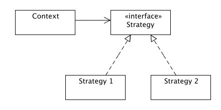
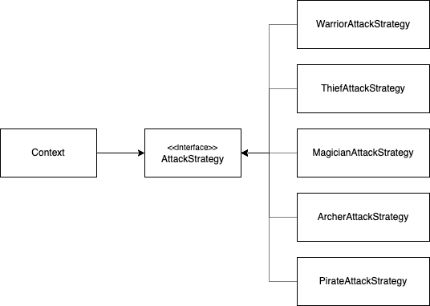

## 서론

우아한테크코스 레벨1 첫번째 미션인 자동차 경주를 구현하며, '랜덤값을 사용하는 메서드에 대한 테스트는 어떻게 하면 좋을까?' 에 대한 고민을 했다.

결론적으로 `RandomGeneratable` 인터페이스를 작성하고, 그 인터페이스를 구현하는 실제 랜덤을 생성하는 `RandomGenerator` 클래스와 고정된 값을 반환하는 `RandomGeneratorStub` 클래스를 따로 작성했다.

**RandomGeneratable.java**

```java
package racingcar.util;

public interface RandomGeneratable {
    int generateNumber(int min, int max);
}

```

**RandomGenerator.java**

```java
package racingcar.util;

import java.util.Random;

public class RandomGenerator implements RandomGeneratable {
    private static final Random random = new Random();

    public int generateNumber(int min, int max) {
        return RandomGenerator.random.nextInt(max - min) + min;
    }
}

```

**RandomGeneratorStub.java**

```java
package racingcar.util;

public class RandomGeneratorStub implements RandomGeneratable {
    private static final int[] randomNumbers = {2, 3, 4, 5};
    private int sequenceCursor = 0;

    public int generateNumber(int min, int max) {
        int currentNumber = randomNumbers[sequenceCursor % randomNumbers.length];
        sequenceCursor++;

        return currentNumber;
    }
}
```

랜덤을 사용하는 메소드는 외부로부터 `RandomGeneratable` 의 구현체를 전달받아 랜덤 숫자를 생성한다. 이때 랜덤을 사용하는 메소드가 프로덕션 코드에서는 `RandomGenerator` 를 전달받고, 테스트 코드에서는 `RandoGeneratorStub` 을 전달받는다.

```java
public void moveAll(RandomGeneratable randomGeneratable) {
    cars.forEach((car) -> car.move(
            randomGeneratable.generateNumber(RANDOM_MIN_BOUND, RANDOM_MAX_BOUND))
    );
}
```

## 전략 패턴

알고보니 위와 같은 아이디어가 **전략 패턴 (Strategy Pattern)** 과 비슷하다는 것을 알게 되었다.

전략 패턴이란, **비슷한 동작을 하지만 다르게 구현되어 있는 행위(전략)들**을 공통의 인터페이스를 구현하는 각각의 클래스로 구현하고, 동적으로 바꿀 수 있도록 하는 패턴이다. 전략 패턴으로 구현된 코드는 **직접 행위에 대한 코드를 수정할 필요 없이 전략만 변경하여 유연하게 확장**할 수 있게 된다.

### 전략 패턴을 사용하지 않았을 때

간단한 RPG 게임을 하나 만들어본다고 가정해보자. 우리가 만들 게임의 직업군은 전사, 도적, 마법사 총 3가지가 있다. 우리는 게임에서 캐릭터가 공격할 때 직업군에 따라 다른 공격 메시지가 출력되도록 해볼 것 이다. 공격시 전사는 대검을 휘두르고, 도적은 단도로 빠르게 두번 찌르고, 마법사는 파이어볼을 발사한다.

이를 `if-else` 를 사용하여 클래스로 구현하면 아래와 같을 것 이다.

```java
class Character {
    private final String job;

    Character(String job) {
        this.job = job;
    }

    void attack() {
        if (job.equals("warrior")) {
            System.out.println("커다란 대검을 휘두른다!");
        } else if (job.equals("thief")) {
            System.out.println("작은 단도로 빠르게 두번 찌른다!");
        } else if (job.equals("magician")) {
            System.out.println("파이어볼을 발사한다!");
        }
    }
}
```

위 클래스는 아래와 같이 사용할 수 있을 것 이다.

```java
Character warrior = new Character("warrior");
Character thief = new Character("thief");
Character magician = new Character("magician");

warrior.attack();
thief.attack();
magician.attack();
```

그런데 만약 게임이 업데이트 되어 궁수 직업군이 추가되었다고 해보자. 그렇다면 `attack` 메소드의 코드는 아래와 같이 수정되어야 한다.

```java
void attack() {
    if (job.equals("warrior")) {
        System.out.println("커다란 대검을 휘두른다!");
    } else if (job.equals("thief")) {
        System.out.println("작은 단도로 빠르게 두번 찌른다!");
    } else if (job.equals("magician")) {
        System.out.println("파이어볼을 발사한다!");
    } else if (job.equals("archer")) {
        System.out.println("활을 발사한다!");
    }
}
```

이와 같은 구조는 기능을 확장하기 위해서는 수정이 필요한 구조이다. 이는 객체지향 설계 5원칙인 SOLID 중 **개방-폐쇄 원칙(OCP: Open-Closed Principle)** 의 위배이다. 이를 전략 패턴을 사용하여 개발-폐쇄 원칙을 따르는 구조로 개선해보자.

### 전략 패턴을 사용하는 구조로 개선

앞서 전략 패턴을 사용하기 위해서는 전략에 대한 인터페이스를 먼저 구현해야 한다고 했다. 따라서 공격 메시지를 반환하는 `getAttackMessage` 메소드를 갖는 `AttackStrategy` 인터페이스를 먼저 아래와 같이 정의한다.

```java
interface AttackStrategy {
    String getAttackMessage();
}
```

그 다음 각 직업군 별 공격 전략을 클래스로 구현한다. 각각의 클래스는 모두 `AttackStrategy` 전략의 구현체이다.

```java
class WarriorAttackStrategy implements AttackStrategy {
    public String getAttackMessage() {
        return "커다란 대검을 휘두른다!";
    }
}

class ThiefAttackStrategy implements AttackStrategy {
    public String getAttackMessage() {
        return "작은 단도로 빠르게 두번 찌른다!";
    }
}

class MagicianAttackStrategy implements AttackStrategy {
    public String getAttackMessage() {
        return "파이어볼을 발사한다!";
    }
}

class ArcherAttackStrategy implements AttackStrategy {
    public String getAttackMessage() {
        return "활을 발사한다!";
    }
}
```

이렇게 전략에 대한 구현체를 작성했다면, `Character` 클래스는 아래와 같이 변경된다.

```java
class Character {
    private final AttackStrategy attackStrategy;

    Character(AttackStrategy attackStrategy) {
        this.attackStrategy = attackStrategy;
    }

    void attack() {
        System.out.println(attackStrategy.getAttackMessage());
    }
}
```

`Character` 의 인스턴스가 생성될 때, 인자를 통해 외부로부터 전략을 주입받고, `attack` 메소드에서는 `AttackStrategy` 인터페이스가 제공하는 `getAttackMessage` 를 호출하여 공격 메시지를 받아올 수 있다. 이를 **의존성 주입 (Dependency Injection)** 이라고 한다.

개선된 코드의 사용은 아래와 같이 할 수 있을 것이다.

```java
Character warrior = new Character(new WarriorAttackStrategy());
warrior.attack();
```

이렇게 개선된 설계에서는 새로운 직업군이 추가된다고 해도 `Character` 클래스의 코드는 수정할 필요가 없게된다. 총을 쏘는 해적이라는 새로운 직업군이 추가된다고 해보자. 그렇다면 아래의 전략 클래스만 새로 추가하면 된다.

```java
class PirateAttackStrategy implements AttackStrategy {
    public String getAttackMessage() {
        return "총을 발사한다!";
    }
}
```

개선된 코드의 구조를 다이어그램으로 표현하면 아래와 같을 것 이다.



코드 문맥이 특정한 구현체가 아닌 인터페이스에만 의존하는 것을 알 수 있다. 이렇게 전략 패턴을 사용하면 문맥이 특정 컴포넌트에 직접 의존하지 않고, 역으로 컴포넌트가 인터페이스에 의존하는 형태가 된다. 이를 통해 전략 패턴은 SOLID 원칙 중 **의존성 역전의 원칙 (DIP: Dependency Inversion Principle)** 또한 따르게 됨을 알 수 있다.

## 전략패턴은 언제 사용될 수 있을까?

일반적으로 우리의 예시와 같이 `if-else` 코드 블럭으로 구성되어 있는데, 모든 코드가 비슷한 기능을 수행하는 경우 사용해볼 수 있다. 혹은 완벽히 동일한 기능을 수행하지만, 요구 성능에 따라 다른 알고리즘을 선택해야할 경우에도 사용해볼 수 있다.
