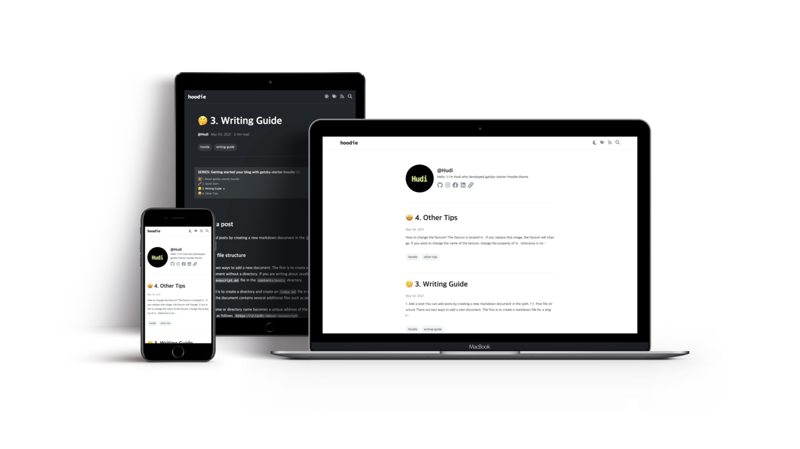
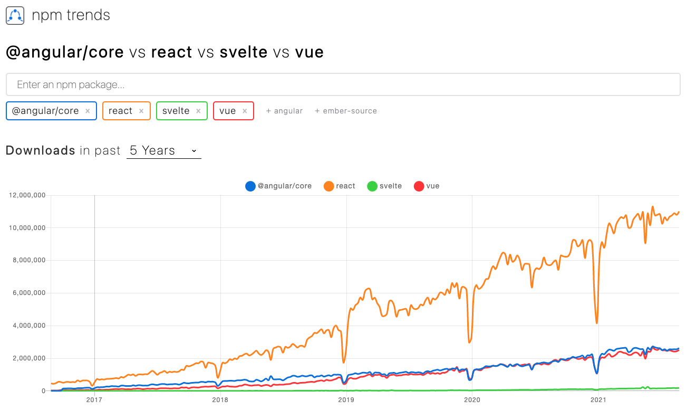
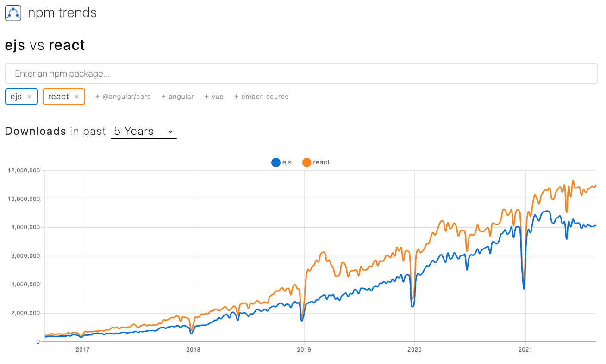
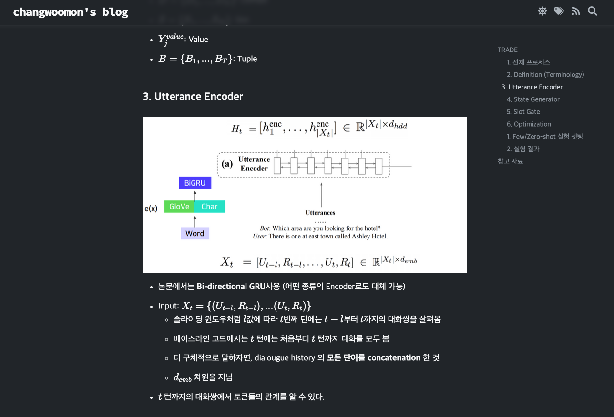
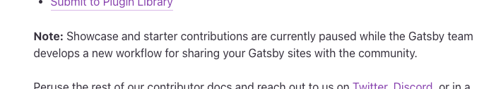

> 본 블로그는 후술할 [gatsby-starter-hoodie](https://github.com/devHudi/gatsby-starter-hoodie) 로 빌드되었습니다.

## 1. 개발 배경

언젠가, 고등학생 그 즈음부터 _'내가 직접 개발한 블로그에서 블로깅을 하고 싶다'_ 라는 생각을 줄곳 해왔다. 나는 블로깅을 참 좋아하는 개발자이다. 내 생각과 배움을 그저 휘발되도록 두지 않고, 정리하고 글로 남겨 다른 사람에게 공유하는 과정을 즐겨왔다.

블로깅 습관은 초등학교 때부터 이어져 왔던 것으로 기억한다. 초등학교 4학년 쯤 인가, Visual Basic 6.0 이란 녀석으로 프로그래밍이란 세계에 제대로 입문했던 나는 독학으로 힘들게 배운 지식들을 사라지게 두기에는 아까웠다.

내 블로깅 플랫폼은 항상 변해왔다. 처음에는 네이버 블로그, 그 다음에는 티스토리, 그 다음은 워드프레스 ··· 계속 플랫폼을 이동한 이유는 명쾌하게 한 가지다. **'커스텀이 쉽지 않아서'**

위 세가지 플랫폼 중 워드프레스는 꽤나 생태계가 괜찮았던 것으로 기억한다. 자체 마켓플레이스가 존재하고, 플러그인을 추가해서 활성화 하거나 남들이 만들어 놓은 스킨을 다운받아 적용할 수 있었다. 워드프레스의 오래된 역사 만큼 쓸만한 플러그인은 굉장히 많았고, 대부분은 유지보수도 잘 되었다. 유료 플러그인, 스킨 시장도 활성화 되었던것으로 기억한다. 필요하다면 HTML/CSS 를 수정하거나 더 나아가서 php 를 수정하여 커스텀할 수 있을 정도로 자유성은 보장되어 있었다.

하지만, 결국 워드프레스도 나에게 100%의 만족을 주지 못하였다.

### 1-1. 워드프레스가 주는 불만점

#### 첫번째 불만점, php 기반.

물론 한참 전에 node.js 기반으로 새롭게 개발되었다는 소식은 들었다. 하지만 블로그를 구축할 고등학생 때 당시에는 php 기반의 워드프레스밖에 없었다. php 가 나쁜 언어라고 이야기 하는 것은 아니지만, 사람마다 선호하는 언어가 있고, 반대로 불호하는 언어가 있을 것이다. 첫 웹 프로그래밍을 시작할 때 php 로 시작한 나였지만, 더 이상 php 는 나에게 선호되는 언어는 아니었다.

#### 두번째 불만점, 필요한 기능에 비해 굉장히 무거운 CMS.

워드프레스는 여러 목적에 맞게 웹을 빌드할 수 있도록 설계된 CMS 이다. 나처럼 블로그를 구축할 수도 있고, 원한다면 회사의 랜딩페이지 심지어 쇼핑몰도 구축할 수 있다. 워드프레스가 강력한 이유이다. 하지만, 오히려 나에게 그러한 특징은 단점으로 다가오게 되었다. 일단 속도가 빠르지 않았고, 대시보드에는 사용하지 않는 수 많은 설정들이 난잡하게 늘어져 있었다.

#### 세번째 불만점, 마음에 썩 들지 않는 위지윅(WYSIWYG) 기반의 에디터.

에디터 자체의 기능은 강력했다. 서식 설정도 쉬웠고, HTML 도 인식이 잘 되었다. 하지만, 다른 곳으로 마이그레이션을 할 때 호환성이 좋지 않았고, 개인적으로 무슨 글을 쓰던 마크다운으로 글을 쓰는 것을 선호하는 나로서는 그닥 맘에 들지 않았다. 물론 워드프레스에서도 마크다운을 사용할 수 있게 해주는 플러그인은 존재했다. 하지만, 커스텀이 어려웠고 Latex 등의 새로운 기능을 추가하려면, 지금 사용하고 있는 플러그인과 호환성 여부를 체크해야하고, 호환이 된다고 하더라도 여러가지 잔 에러가 발생했다.

#### 네번째 불만점, 결국에는 만족스럽지 않은 확장성.

여러 플러그인과 스킨을 지원한다고 하더라도 100% 내 맘에 쏙 드는 것을 찾기란 쉽지 않다. 그렇다고 플러그인과 스킨마저 커스텀하기에는 첫번째 불만점과 같이 php 로 작성된 코드를 수정하는 것이 맘에 들지 않았다. 직접 코드를 수정하지 않는 이상, 충돌나지 않는 플러그인을 찾아 조심스럽게 활성화 하고, 충돌이 발생하면 사용을 포기하는 이 과정이 몇년 쌓이다보니 피로감이 크게 느껴졌다.

또한 여러 완성도 높은 스킨은 많이 존재하나, 기술 블로그에 딱 맞는 깔끔하고 군더더기 없는 스킨을 찾기는 힘들었다. 블로그를 목적으로 개발된 스킨을 사용하더라도 결국 기술 블로그에 한정되지 않은 범용적인 기능을 여럿 제공하다보니 블로그가 비대하고 난잡한 느낌이 드는 것이 좋지 않았다.

#### 네번째 불만점, 호스팅 비용.

php 기반이다 보니, Apache 나 Nginix 같은 웹 서버를 붙여야했고, 필연적으로 서버 비용이 발생했다. Github Pages 나 Netlify 등 에서 돌아가는 Jekyll, Hexo, Gatsby 라는 **정적 웹 사이트 생성기** 를 사용하면 무료로 블로그를 호스팅 할 수 있는 세상이 왔다.

이런 상황에서 굳이 호스팅 비용을 감수하면서까지 워드프레스로 블로깅을 이어가야 하는 의문점이 계속 들었다.

### 1-2. 그냥 내가 만들자 😡

이런 피로감이 누적되어 결국 하나의 결론으로 도달했다.

> '그냥 내가 만들자'

Jekyll, Hexo, Gatsby 기반이더라도 남들이 만들어 놓은 코드를 베이스로 블로그를 구축하다보면 깊이만 다르지 결국 똑같은 문제에 피로를 느낄 것이 뻔했다. 내가 마지막으로 사용할 블로그 플랫폼을 직접 개발할 때가 왔다. 그리고 이왕 개발하는김에 다른 개발자분들도 사용할 수 있는 프로젝트로 발전시키면 좋겠다는 생각이 들었다.

여러 프레임워크를 놓고 비교해 본 결과 **Gatsby** 가 나에게 가장 맞다는 생각이 들었다.

## 2. Gatsby 란?

Gatsby 는 React 기반의 **정적 웹 사이트 생성기 (Static Website Generator)** 이다. 프론트엔드 개발을 React 를 주로 사용해온 내게 가장 맞는 프레임워크라 생각된다.

여기서 정적 웹 사이트 생성기란, 말 그대로 정적 웹 사이트 (Static Website) 를 생성하여 웹사이트 구축을 도와주는 소프트웨어를 의미한다. 그렇다면, 정적 웹 페이지란 무엇일까?

### 2-1. 정적 웹 사이트와 동적 웹 사이트

프론트엔드 개발을 하다보면 자주 듣는 단어가 있다. **CSR (Client-Side Rendering)** 과 **SSR (Server-Side Rendering)** 이다.

CSR은 React, Vue 등을 사용하여 클라이언트 단에서 HTML/CSS 를 생성하여 사용자에게 보여주는 방식을 의미한다. 대다수의 SPA (Single Page Application) 은 CSR 방식으로 개발된다. SSR 는 전통적인 PHP, JSP, ASP 혹은 최근에는 Next.js 등을 사용하여 서버 단에서 HTML/CSS 를 생성하여 사용자에게 그 결과물만을 전달하는 방식이다.

CSR과 SSR로 서비스되는 웹사이트는 큰 틀로는 **동적 웹 사이트 (Dynamic Website)** 로 분류된다. 하지만, Gatsby 로 개발된 결과물은 이와 다른 정적 웹 사이트로 이미 빌드가 완료된 HTML 과 CSS, JS 만이 존재하며, 동적으로 서버와 통신해 컨텐츠를 업데이트 하거나 UI 가 변하지 않는다.

즉, 포스트 등의 데이터를 저장하는 DB도, 그 DB 에서 쿼리하고 결과물을 보내주는 API 서버도 없다. 모든 데이터는 이미 배포 시점에 HTML 로 존재한다. 새로운 컨텐츠가 발생하면, 해당 컨텐츠에 대한 HTML 페이지 자체를 새롭게 빌드한다.

이런 특징으로 인해 CSR 대비 SEO 측면에서 매우 유리하며, 호스팅 비용에 대한 부담이 굉장히 덜어진다. 실시간으로 변하는 데이터를 보여줄 필요 없고, 컨텐츠의 변화가 잦지 않은 블로그, 랜딩페이지 등에 적용하기 좋은 기술이다.

### 2-2. GraphQL

Gatsby 는 특이하게도, 빌드 타임에 GraphQL 로 데이터를 쿼리하여 HTML 을 빌드한다. _'GraphQL, 그거 RestAPI 대신 사용하는 거 아니야?'_ 정도로 생각하면 오산이다. `gatsby-transformer-remark` 등의 플러그인과 조합하여 사용하면, 그 강력함을 몸소 체험할 수 있을 것이다. GraphQL Playground 도 내장되어 있어 GraphQL 사용을 위한 별도 환경 구축이 필요 없다.

Gatsby 가 왜 GraphQL 을 사용하는지, 어떻게 사용하면 되는지에 대한 내용은 Gatsby 공식문서 [GraphQL Concepts](https://www.gatsbyjs.com/docs/conceptual/graphql-concepts/) 를 참고하자.

## 3. Gatsby 의 이점

타 정적 웹 사이트 생성기 대비 Gatsby 가 갖는 대표적인 이점은 무엇일까?

### 3-1. React 기반

위에서 언급했듯, gatsby 는 React 기반의 정적 웹 사이트 생성기이다. 아래 사진을 한번 확인해보자. **npm trends** 에서 분석된 대표 웹 프론트엔드 프레임워크 (라이브러리) 다운로드 수 비교 그래프이다.



위 그래프로 보았을 때 React 는 타 프로젝트에 비해 '압도적으로' 많은 다운로드 수를 보인다. 다운로드 수가 많다는 것은 사용자가 많다는 의미이고, 사용자가 많다는 것은 그만큼 생태계가 잘 조성되어 있고, 커뮤니티가 활성화되어 있다는 의미이다.

또 다른 비교를 해보자.



**ejs** 는 node.js Express 진영의 대표적인 Server-Side Template Engine 이다. ejs 는 또 다른 정적 웹 사이트 생성기인 'Hexo' 에서 채택한 템플릿 엔진이다. 아래 그래프를 확인해보면, 큰 차이는 아니지만, 점유율에서 React 가 우위를 점하고 있다는 사실을 알 수 있다.

기술을 선택함에 있어 기술 사용자의 수도 큰 선택 요인 중 하나이다.

### 3-2. 간편한 개발 환경

```
yarn start
```

명령 한줄로 로컬에 개발 서버가 올라간다. CRA 등에서 지원하는 **핫 리로드 (Hot Reload)** 를 지원하여 한쪽 스크린엔 웹브라우저를 한쪽 스크린엔 VS Code 를 띄워놓으며 편하게 개발을 할 수 있다. 핫 리로드는 개발할때 뿐 만 아니라 마크다운으로 블로그에 포스트를 작성할 때에도 프리뷰로 사용하기 편하다.

### 3-3. 개발자 친화적인 플러그인 생태계

워드프레스를 사용하며 느꼈던 점은, 플러그인 등의 생태계가 당연하게도 굉장히 비 개발자에 초점이 맞춰져 개발되었다는 점이다. 플러그인 하나가 맡게되는 역할이 매우 컸고, 그로 인해 다른 플러그인과 충돌이 잦았고, 커스텀이 불편했다.

하지만 Gatsby 의 플러그인 생태계는 그렇지 않았다. 대부분의 개별 플러그인은 최소한의 기능만을 담당하며, 여타 NPM 모듈과 같이 적재 적소에 원하는대로 사용하기 굉장히 좋았다. 당연히 다운로드도 NPM 을 통해 가능하다.

## 4. Gatsby Starter Hoodie 특징

### 4-1. 개발 철학

gatsby-starter-hoodie 는 **'개발자가 가장 개발자스럽게 사용할 수 있는 기술 블로그'** 를 지향한다. 기존 블로그 플랫폼에서 제공하지만, 개발자에게는 필요없는 기능을 과감히 지우고, 컬러도 최대한 절제하여 블랙과 화이트만을 사용하여 차분함을 유지한다.

gatsby-starter-hoodie 는 여러 훌륭한 다른 블로그 플랫폼과 프로젝트에서 많은 영감을 받았음을 미리 밝힌다. 특히 **Velopert 님의 [Velog](https://velog.io)** 와 **Junho Baik 님의 [Borderless](https://github.com/junhobaik/junhobaik.github.io)** 에서 가장 큰 영감을 받았다. 훌륭한 프로젝트 개발해주신 두 개발자분께는 존경을 표한다.

### 4-2. 글에만 집중할 수 있는 디자인

범용 블로그를 위해 개발된 스킨 (특히 워드프레스 계열) 을 살펴보면 하나 같이, 위젯, 추천글, 소셜 미디어 공유, 과한 애니메이션 등 보는이로 하여금 피로감을 유발하는 요소가 잔뜩 존재한다. 화려함을 최대한 절제하고, 중요한 정보만 눈에 들어오도록 디자인에 신경을 썼다. 특히 본문의 타이포그래피에 시간을 많이 쏟았다.

### 4-3. 마크다운 및 수식 입력 지원

개인적으로는 사용하지 않는 여러 서식이 존재하고, 더러운 HTML 코드 로 생성되는 WYSIWIG 으로 글을 작성하는 것에 큰 피로감을 느낀다. 내가 보유하고 있지 않은 타 플랫폼에 글을 작성할 때라면 상관없지만, 내가 보유중인 블로그에만은 적어도 제한된 서식으로 통일되고 타 플랫폼으로 마이그레이션이 편한 마크다운으로 글을 작성하는 것이 훨씬 마음이 편하다.

또한 **Katex** 를 사용하여 간편하게 수식 입력을 지원한다. 이로 인해 머신러닝 혹은 수학, 과학 토픽의 글을 작성할 때에도 유용하게 사용할 수 있다.

실제로 gatsby-starter-hoodie 가 많이 부족할 때 부터 직접 사용해보며 여러 문제를 공유해주고, 직접 코드를 기여까지 해준 고마운 [changwoomon](https://changwoomon.github.io/) 이라는 친구가 머신러닝 관련 논문 리뷰를 하며 수식을 유용하게 사용하고 있다.



### 4-4. 코드 하이라이팅 지원

당연한 이야기지만, 다양한 언어의 코드 하이라이팅을 지원하기 위해 PrismJS 를 사용하였다. 이 기능이 없다면 기술 블로그라고 할 수 없지.

### 4-5. 태그, 시리즈 기능 지원

gatsby-starter-hoodie 는 카테고리 대신 글에 토픽을 여러개 설정할 수 있는 **'태그 시스템'** 을 채택하였다. 하지만, 기술 블로그를 운영하면서 항상 '연재'의 형태로 글을 나눠 작성해야 할 때가 존재한다. 이를 '태그 시스템' 만으로 커버하기는 경험상 쉽지 않다.

연속성이 있는 일련의 글을 동일한 주제로 엮는 **'시리즈'** 기능은 내가 블로그를 개발할 때 가장 중요하다고 생각하는 기능 중 하나였다. 이 시리즈 기능은 Velog 에서 가장 크게 영감을 받은 부분이다.

### 4-6. 다크모드 지원

한창 핫 했던 디자인 트렌드이기도 하고, 개인적으로 어두운 화면으로 글을 읽는것이 눈에 피로를 덜 주기 때문에 다크모드를 선호한다. 다크모드도 구현 우선순위가 높은 기능 중 하나였다. 컬러 팔레트는 **[Open Color](https://yeun.github.io/open-color/)** 를 가장 많이 참고하였다. 밤에는 다크모드로 글을 읽으면 꽤나 눈이 편한것을 보니, 잘 뽑힌 것 같아 기쁘다.

### 4-7. RSS Feed 지원

RSS Feed 는 블로그의 글을 RSS 리더로 구독할 수 있게 해준다. 특히 **sarojaba 님의 [awesome-devblog](https://github.com/sarojaba/awesome-devblog)** 프로젝트는 RSS 피드를 통해 여러 개인/기업 기술 블로그의 글을 수집한다. 이에 대응하기 위해 RSS Feed 기능도 필수.

## 5. Gatsby Starter Hoodie 로 블로그 시작하기

진입장벽을 낮추고자 공식 문서를 공을 들여 작성했다. 이 글을 읽고 gatsby-starter-hoodie 로 블로그를 시작해보고 싶다는 생각이 든 분은 공식 문서 중 **[2. 빠르게 시작하기](https://devhudi.github.io/gatsby-starter-hoodie/quick-start-kr/)** 와 **[3. 작성가이드](https://devhudi.github.io/gatsby-starter-hoodie/writing-guide-kr/)** 를 읽고 빠르게 여러분만의 블로그를 시작할 수 있다.

### 5-1. 쇼케이스 기여 일시 중단



아쉽게도 Gatsby 공식 팀에서 쇼케이스 기여를 잠시 중단한다고 한다. 작년 8월에 생성된 [PR#26442](https://github.com/gatsbyjs/gatsby/pull/26442) 를 확인해보면 자세한 내용을 읽어볼 수 있다. 이전에는 `starters.yml` 파일로 쇼케이스 목록을 관리했고, 이 파일에 기여를 받아 여러 스타터 개발자들이 자신의 스타터를 개츠비 공식 쇼케이스에 올릴 수 있었던 것 같지만, 현재는 해당 파일 자체가 사라져있는 상황이다.

꽤 오랜 시간이 지났는데도 불구하고, 개츠비팀은 아직 쇼케이스 목록 기여를 받지 않고 있는 상황이다. 언젠가 쇼케이스 기여가 재개된다면, PR을 열어 기여할 예정이다.

## 6. 향후 개발 계획

아직 gatsby-starter-hoodie 는 부족한 점도 많고, 고쳐야할 버그도 곳곳에 존재한다. 학업과 여러 대외활동을 병행하면서 사이드 프로젝트에 많은 시간을 할애하는 것은 쉽지 않다. 하지만 몇달간 애착을 갖고 개발한 프로젝트인 만큼 꾸준히 발전하는 모습을 보이고 싶다.

만약 사용 중 사소한 문제라도 이슈가 발생했다면, 언제든 저장소에서 [이슈](https://github.com/devHudi/gatsby-starter-hoodie/issues)를 열어주시기를 바란다. 혹은 [PR](https://github.com/devHudi/gatsby-starter-hoodie/pulls) 을 열어 기여해주신다면 더더욱 좋다!
