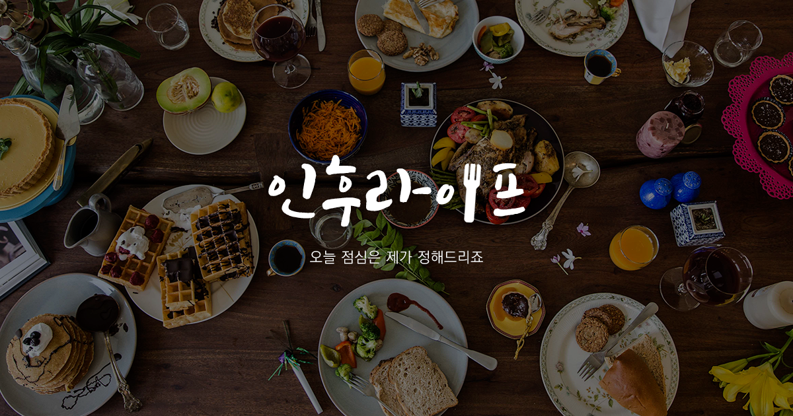
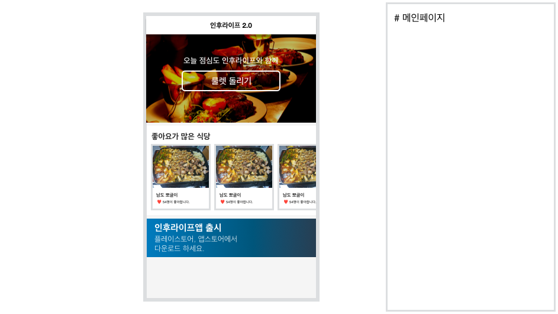
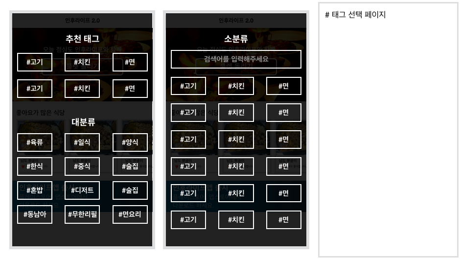
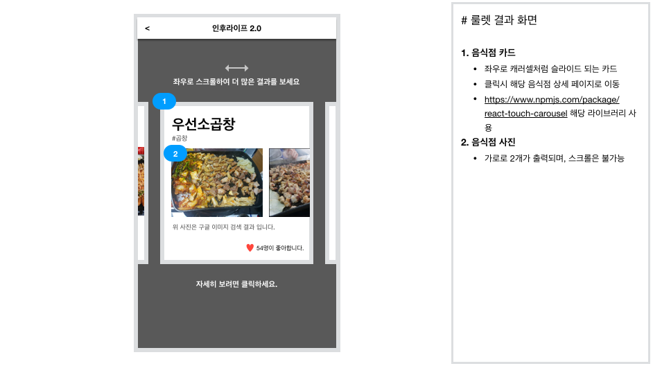
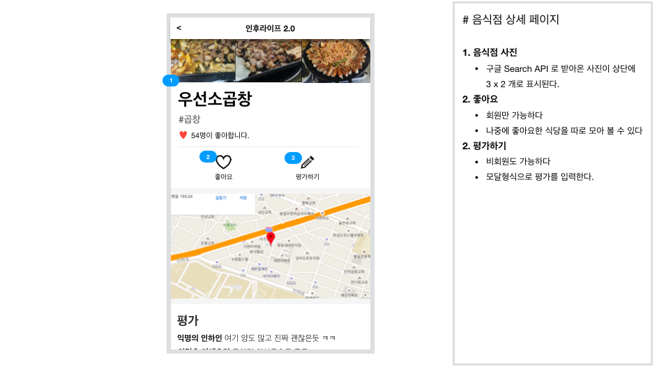
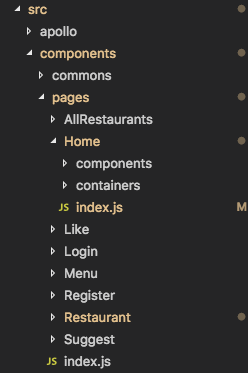
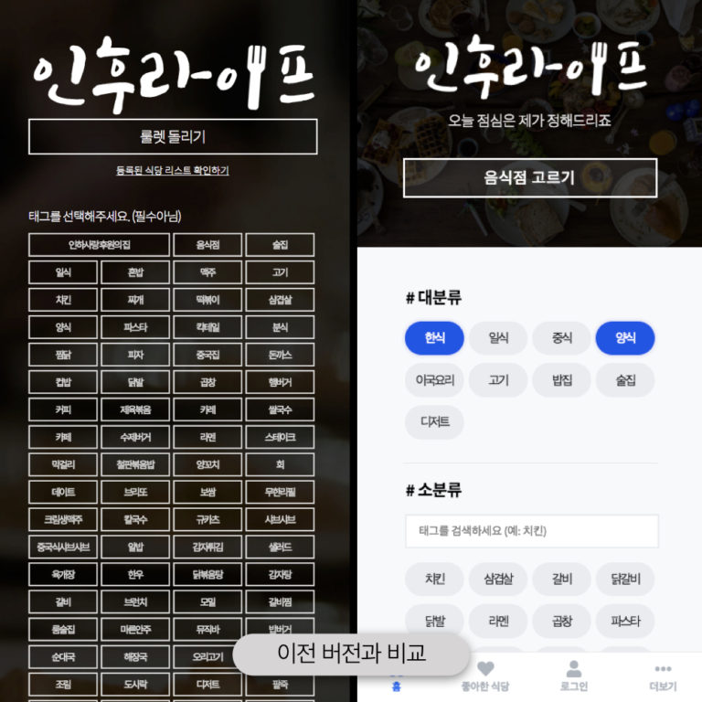
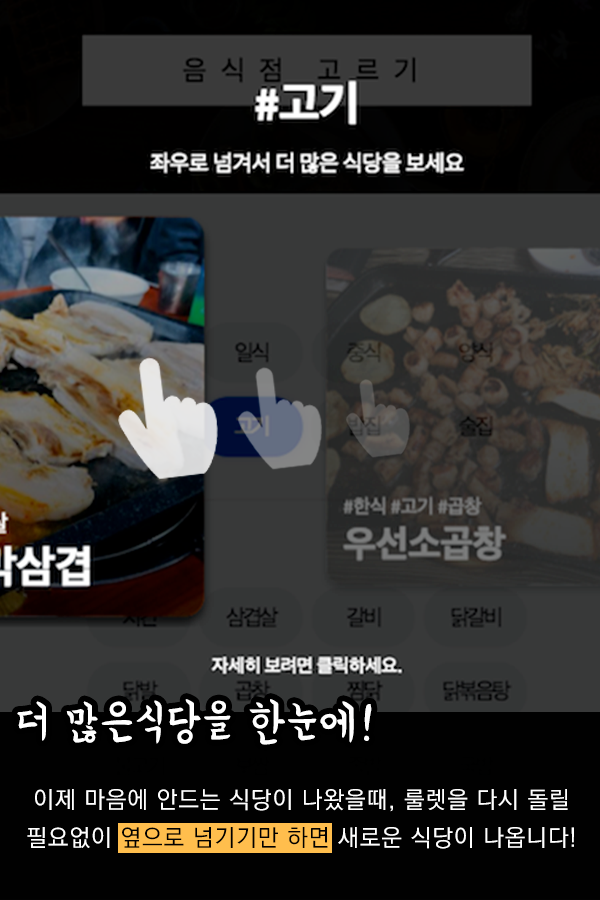

> 이전 블로그 (https://hudi.kr) 에서 이전해온 글 입니다.

9월 1일 약 3주가량 제작한 인후라이프 2.0을 개강 시즌에 맞추어 드디어 릴리즈 했다. 이번엔 저번과 다르게 간단한 Markdown 문서를 생성하고, 개발하는 도중 생각나는 것들을 여과없이 적어 내려갔다. 그 진짜 일지를 통해서, 좀더 읽기 쉬운 가공된 일지를 작성해 보려 한다.

프로젝트 기간은 2018년 7월 24일부터 시작하여, 8월 27일에 완성 되었다. 물론 27일과 릴리즈 일자 사이에서 몇가지 기능이 추가되거나, 수정되는 부분은 있었지만 일단 완성 선언은 27일에 했다. 그 기간 사이에 수술을 하게되어 1주일가량은 공백 기간이었으니 약 3주 가량 걸린것이 맞다.

## 기획

나는 평소에 프로젝트를 시작할때 즉흥적으로 시작했다. 일단 추상적인 아이디어가 떠오르면, 프로젝트 디렉토리를 만들고 코드로 직접 웹사이트를 빌드하며 내 생각을 정리하고, 수정하고 즉석으로 기획하고 디자인한다. 아주 좋게 포장해서 말하면… Lean 하다고 말할 수 있겠지만, 현실적으로 지적하자면 그냥 무계획적인 것이다.

이번에는 조금 달랐다. Keynote 에 내가 생각하는 UI 를 스케치하듯 그려나아갔다.

Keynote 로 작성한 인후라이프 2.0 초기기획
막상 직접 프로덕트를 개발하면서, 스스로 사용자 입장에서 많이 생각해보며 개선해나아가 초기 기획하고는 꽤 많이 달라졌지만, 아무튼 괜찮은 가이드라인을 만든 것 같아서 나름 잘 했다고 생각하는 작업중 하나이다. 앞으로 무언가 프로젝트를 시작하기 전에 대충의 스케치라도 해놓고 시작하려고 한다.

## GraphQL

나는 사이드 프로젝트를 진행함과 동시에 배워보지 않았던 새로운 기술을 배우면서 적용해보는 것을 좋아한다. 이론공부보다는 실제로 프로덕트를 만들어가며 배워가는것이 훨씬 더 좋기 때문이다. 이론 공부만 해서는 이 기술이 왜 사용되는지 느낄 수 없다고 생각한다. 아무튼 이번 프로젝트에서는 GraphQL 을 도입하게 되었다.

GraphQL 은 REST API 를 어느정도 대체할 수 있는 기술이다. 쉽게 말하자면, 클라이언트 사이드에서 데이터를 받기위해 서버 사이드로 날리는 Query Language 이다. Over fetching, Under fetching 을 해결 어쩌구 저쩌구 많은 장점들이 있지만, 이 글에서 소개하기엔 무리가 있으니 이정도만 설명해두겠다.

GraphQL 을 사용하기 위해서는 Query Schema 를 작성해야했고, Query 에 따라 데이터를 넘겨주는 resolver 그리고 클라이언트 사이드에서 실제로 쿼리를 전송하는 부분 이렇게 3가지가 존재한다. 쿼리의 이름과 같은 구조가 바뀌게 되면 이 3가지를 전부 손봐야 했던게 처음 써본 입장에선 복잡했던 것 같다. 하지만, 지금 생각해보면 REST 라고 다를까… 하는 생각이 든다. 어차피 MVC 기준으로 Router, Controller 손보려면 비슷한 것 같다.

아무튼 직접 사용해보니 Router 를 직접 설계하지 않고, Query 만 설계한 뒤, 클라이언트 사이드에서 원하는 정보만 Query 를 전송하여 받아갈 수 있는 부분이 참신한 아이디어인 것 같았고 맘에 들었다. 앞으로 조금 더 사용해봐야겠지만 계속 사용하고 싶은 기술인것 같다. 하지만, 아직 익숙하지 않아서 오히려 Over Fetching 을 발생시키고 있는 것 같다. Query 설계를 조금 더 계획적으로 할 필요성을 느낀다. 한번에 불러올 수 있는 정보들을 2회에 거쳐 받아오는 것은 분명 잘못 설계한 것이다.

## Component와 Container

저번 인후라이프 개발 일지에서 Component 와 Container 의 구분을 하지 못해 전부 Container 로 만들어 버렸다는 이야기를 한적이있다. 이번 프로젝트에서는 그 동안 React 공부도 꽤 한 상태라 그 둘은 당연히 구분할줄 알았다. 데이터를 조작하는 부분과 그저 화면에 보여주는 부분을 나름 확실히 구분해서 관심사의 분리를 한 것 같아 기분이 좋았다.

## 디렉토리 구조

남들이 대부분 사용하는 pages, components, containers 구조가 아니라 common 컴포넌트를 최상위에 두고, page 별로 components 와 containers 를 가지는 구조로 제작하였다. common 폴더에는 모든 페이지에서 공통으로 사용될 수 있는 버튼, 텍스트박스, 리스트 등의 UI Component 가 들어있다. 이 구조 꽤 편해서 마음에 들었다. Depth 가 너무 깊어지는 것 빼면…

실제 디렉토리 구조는 이렇다

## Dotenv 사용

이번 프로젝트에서는 Dotenv 를 사용하였다. .env 라는 파일로 환경변수를 설정할 수 있는 모듈이다. Create React App 으로 만든 프로젝트는 내부적으로 dotenv 모듈을 사용하는데, .env.production, .env.development 파일에 각각 REACTAPP 으로 시작되는 커스텀 환경변수를 설정할 수 있다. 개발할때의 서버주소와 프로덕트의 서버주소 등을 파일로 분리시켜 놓으니 편했다.

## UI/UX

사용자에게 직접 닿는 부분을 개발하는 프론트엔드 개발자는 디자이너 못지 않게 UI 와 사용자경험(UX) 에 신경을 써야한다. 저번에는 디자인도 그렇고, UX 도 그렇고 정말 배려심 없게 설계 했던 것 같다. 이번에는 기획 단계부터 이전 버전에서 스스로 계속 지적했던 불편한 UI 의 개선 문제도 핵심 과제로 생각하였다. 이전 인후라이프에서는 태그의 구분없이 몇십개의 태그를 한번에 보여주고 그 안에서 원하는 태그를 찾았어야 했다. 하지만 이번 인후라이프 2.0에서는 대분류와 소분류로 태그를 크게 분류하였고, 그 중에서도 태그의 개수가 많은 소분류에서는 태그를 검색할 수 있게끔 구현하였다. 나름 많은 고민을 한 부분이었다.

태그 선택 UI 의 변화
또한 하나의 식당만을 보여주는 것이 아니라, 캐러셀 형태로 관련된 여러개의 식당을 옆으로 넘기기만 하면 볼 수 있게끔 개선하였다. 굉장히 괜찮은 아이디어라 생각했고, 뿌듯하다 ㅎㅎㅎ

캐러셀 형태로 바뀐 식당 결과
이외에도 웹사이트지만 굉장히 어플리케이션같은 느낌을 주기위해 하단에 네비게이션 바를 넣었고, React Slick 을 사용하여 식당 슬라이드에서 모바일 Swipe 도 매끄럽게 작동하도록 구현했다.

## 버전관리

저번과 같이 Github 저장소에 꾸준히 Commit 했다… 만 Commit 타이밍과 그 파일범위를 정확히 어떻게 잡아야할지 감이 안잡혀서 제대로 꾸준히 안했던것 같다.

이슈트래킹은 `//TODO: 기능추가` 와 같이 소스코드에 주석으로 작성해 놓고, VSCode 플러그인을 이용해 관리했는데, 앞으로 Github 이슈트래커나 트렐로와 같이 더 전문적인 툴을 사용하면 깔끔하지 않을까 생각한다.

## 배포

GraphQL 서버와 식당 이미지용 서버는 node.js 로 원래 사용하고 있었던 Vultr VPS 에 올려놓았다.

조금 달라진점은 프론트엔드를 배포하는 방식인데, 처음으로 Surge.sh 라는 정적 파일을 호스팅 해주는 서비스를 이용해보았다. SSL 적용이나 기타 고급 옵션들을 사용하지 않는 이상 기본적으로 무료이고, 속도도 양호해서 써보기로 결정했다. 정말정말 놀라웠던 점은 배포 과정에서 관리자 패널에 접속할 필요가 하나도 없이 로그인 부터 모든 배포 과정을 터미널 안에서 명령어로 끝낼 수 있었다. 빌드를 하고 빌드 폴더에서 명령어 하나만 입력하면 원하는 주소로 파일이 배포되었다. 정말 충격적이었다. 복잡한 세팅 필요없이 VSCode 터미널로 모든것을 해결했다. 심지어 무료라니 정말 정말 정말 최고다.

## 운영

일단, 식당을 등록하는 과정이 당연히 제일 힘들었다. 아직도 등록되어 있지 않은 식당은 잔뜩 있다 ㅠㅠㅠ 그리고 등록되어 있는 100개가 훌쩍 넘는 식당들을 가장 어울리는 태그에 배치시키는 것도 정말 어려웠다. 필요없는 태그를 가지치기하고, 더 큰 범위의 분류를 추가하는 등 이런 분류 과정에서 많은 고민을 했던 것 같다. 그래도 인하대 후문에서 식당을 운영하시는 분들이 본인의 식당을 추가해달라고 하시면서 언제한번 식당 들르면, 공짜로 주시겠다는 분도 있어서 기분이 좋았다.

홍보면에서는 기존에 존재했던 인후라이프 페이스북 페이지와, 인하광장, 에브리타임 등에 홍보했다. 이번에는 이벤트를 진행했는데, 페이스북 게시물을 공유한 사람중 추첨해서 5명에게 스타벅스 아메리카노 기프티콘을 주는 이벤트이다. 21분이 이벤트에 참여해주셔서 추첨을 마치고 현재 기프티콘을 나눠드리고 있는 중이다.

## 기타

ESLint 와 Prettier 를 적극적으로 사용하여, 소스코드를 정리했다. 아무리 길고 복잡한 코드도 읽기 편한 소스코드로 자동으로 변환해주는 Prettier 기능은 놀라웠다. 물론 가끔은 내 의도와 다르게 소스코드가 정리되는 일도 있었으나 크게 거슬리진 않아서 그냥 그런 사소한 점은 순응하면서 개발했다.

이전에는 사소한 오류나 추가가 필요한 기능들이 있었다면 귀찮아서 무시했었는데, 이번에는 최대한 그런 일이 없도록 사소한 버그, 오류, 기능 추가들도 적극적으로 개선하였다. 물론 아직도 남아있는 것들도 있지만, 이전보다는 비약적으로 그 정도가 줄어들었다는 것에 큰의의를 둔다.

인하대에서 교내에서 길찾는 서비스를 누군가 개발했는데, 인후라이프에서 영감을 얻었다고 한다. 내가 창조해낸 결과물에서 무언가 영감을 얻어가는 사람이 있다는게 기분이 참 좋았다.
