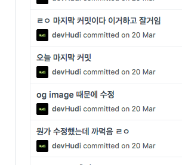
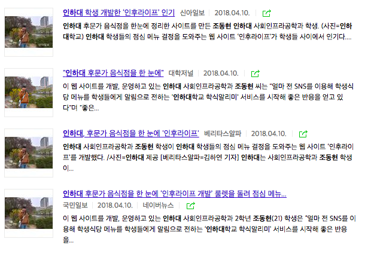
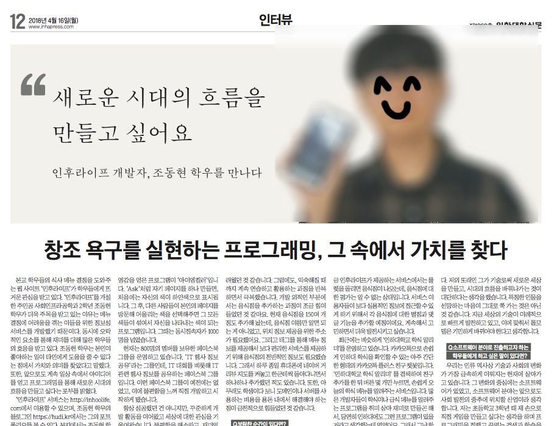

> 이전 블로그 (https://hudi.kr) 에서 이전해온 글 입니다.

## 개발 동기

조금 뜬금없지만, 나는 동물을 좋아하기도 하고 친목도 좋아하는 편이라 대학교에서 유기동물 봉사 동아리를 하고 있다. 동아리 단톡방에서는 잡담이 오가는데, 전후에 어떤 이야기가 오갔는지 정확히 기억은 안나지만 인하대 후문의 많은 식당중에서 룰렛을 돌려 랜덤으로 한 식당을 보여주는 사이트, 일명 인후룰렛 같은것을 만들면 재밌겠다는 이야기가 나왔다. 마침 개발할만한 새 프로젝트를 은연중에 물색하고 있던 나에게 실생활에 밀접하면서도, 간단하고, 재밌는 프로젝트라는 생각이 들었다. 허나 이름을 그대로 인후룰렛 (Inhoo Roulette) 으로 하게되면, 도메인이 너무 길어지기 때문에 그냥 삘받아서 인후라이프 (Inhoo Life) 라고 명명했다.

## 개발 준비
바로 그날부터 웹사이트 UI를 구상하고, 포토샵으로 로고를 만들고, HTML과 CSS 로 웹사이트 뼈대를 제작했다. 개발 초기에는 React 를 적용하면 좋겠다는 생각을 했지만, (내 고질적인 문제인) 단순한 귀찮음으로 Jquery 를 사용해 개발을 시도하였으나.. 체크박스 같은것을 직접 구현하는 것은 Jquery 로 DOM을 일일히 건드는 것보다, React로 직접 컴포넌트를 만드는 것이 더 편하고 깔끔할 것 이라는 생각이 들었다. 무엇보다 Jquery 는 이제 죽은 기술 이며, 트렌디한 개발자가 되기 위해서는 이 기회에 React를 제대로 공부하면서 실제 프로젝트에 적용해봐야겠다는 생각이 들었다. 그리고 백엔드 스택은 평소에 자주 써오던 node.js + Express + Mongodb 스택을 사용하기로 결정하였다.

사실 React 할줄 안다고 말만 잘하지, 컴포넌트 생애주기도 제대로 알고 있지 않은 수준이었다. 인후라이프를 개발하면서, 가장 어려웠던 것은 Jquery를 사용하면서 DOM을 직접 건드리던 방식에서, React의 구조를 익히고 컴포넌트를 직접 설계하는 등의 React로의 Migration 과정 이었다. 다들 알다시피 React 는 프레임워크가 아닌 라이브러리기에 프로젝트 구조등에 구애받지 않는다. 즉, 개발자가 직접 프로젝트의 구조를 설계하고, 컨벤션을 정하는 과정이 필요한데, 나는 솔직히 지금까지 정말 대충, 되는대로, 맘편한대로 코딩해왔었다. 그 덕에 코드는 구조적이지 않고, 누더기 같았다. 돌아가면 장땡이라는 태도로 개발해왔다. 정말 좋지 않는 버릇을 이번 기회에 바꿔보기로 했다. 추가로 누구에게 보여줘도 부끄럽지 않은 코드를 만들자는 의미로, Github Public Repository 에 주기적으로 Commit 하기로 결정했다. [인후라이프 Repository](https://github.com/devHudi/inhoolife)

## 프론트엔드
일단은, CRA (Create-React-App) 을 이용해서, React 프로젝트를 뼈대를 자동으로 생성했다. 그 다음, React 튜토리얼과 Github 등에서 다른사람의 React 프로젝트를 보며, .js 파일과 폴더의 구조가 어떠한지, 어떻게 관리하는지를 알아보았다. 결과적으로 나는 폴더를 크게 다음과 같이 구성했다.

- **build** : 자바스크립트 파일들이 Transfile 되어 Build 된 결과물이 저장됨
- **node_modules** : 자동 설치된 node.js 관련 모듈
- **public** : index.html 과 css, img 등의 리소스 파일들
- **src** : React Component Js 파일들
  
여기까지는 CRA 명령으로 initialized 된 프로젝트의 폴더 구조 그대로이다. 그 상태에서는 src 폴더에 .js 파일이 위치하게 된다. 필자는 멍청한 컴포넌트와 똑똑한 컴포넌트 (Dumb component & Smart component) 패턴으로 컴포넌트 .js 파일들을 관리하기로 생각했다. 그리고 다음과 같이 폴더를 구성했다.

- src/**components** : 멍청한 컴포넌트
- src/**containers** : 똑똑한 컴포넌트

멍청한 컴포넌트와 똑똑한 컴포넌트 패턴은 간단하게 말하자면, 마크업과 스타일을 갖아 보여지는 역할을 하는 컴포넌트 (멍청한 컴포넌트) 와 실제 기능이 동작하고 State 를 갖는 컴포넌트 (똑똑한 컴포넌트) 를 구분해서 관리하는 패턴이다. 자세한 내용은 따로 관련 글을 작성해서 소개하도록 하겠다.

그런데, 내가 패턴을 완벽히 이해 못한것인지 아니면 멍청한 컴포넌트와 똑똑한 컴포넌트를 제대로 구분해서 구조하지 못한건지, 멍청한 컴포넌트는 만들어지지 않았다. 만든 컴포넌트마다 항상 State 가 필요했다. 사실 똑똑한 컴포넌트에서 State 만 관리하고 하위에 멍청한 컴포넌트 여러개를 두는 방법이 있었는데, 그렇게 엄격하게 나눠야하는지 의문이 들었던 점도 있었다.

> 한참이 지나서야 알게된 사실인데, 멍청한/똑똑한 컴포넌트라는 말 대신 Component 와 Container 라고 부르는 것 같다. 그리고 Redux 까지 공부하면서 확실히 둘의 역할 구분에 대해 알게되었다. 거의 정석같이 사용되는 패턴이니 지금이라도 확실히 알아둬서 다행이다.

## 백엔드
백엔드는 node.js 와 Express, MongoDB 를 사용하였다. 폴더 구조는 다음과 같다.

- **controllers** : MVC 의 Controller 이다. model 을 사용하여, 데이터를 가져오고 Router 쪽으로 export 한다.
- **models** : MVC 의 Model 이다. 쿼리를 사용하여, MongoDB에 직접 접속하여 Mongoose 모델을 export 한다.
- **routes** : 각 route path 마다 controller 의 function 을 연결해준다. 파라미터로 res, req 를 넘겨준다.

단순한 API 서버를 간단하게 구축한거라 별로 어렵지 않았다. 다만, 항상 만들면서도 MVC 패턴은 헷갈린다. M V C 각각의 관심사를 어느정도까지 분리하는게 맞는지 잘 모르겠다.

그리고 나중에서야 알게 된건데, statics 나 methods 를 사용해서 몽구스 모델이나 데이터 인스턴스 자체에 메소드를 넣을 수 있더라. 인후라이프에서는 models 은 단순히 mongoose model 을 controller 에 보내고 query 를 controller 에서 처리했는데, 모델 자체에 메소드를 만들어, 모델에서 query 하고 나온 데이터만을 controller 에 보내는 방법이 훨씬 나을 것 같다. 아니 맞는 방법인것 같다.

- http://mongoosejs.com/docs/guide.html#statics

- http://mongoosejs.com/docs/guide.html#methods

자세한것은 여기서 읽어 볼 수 있다.

## 버전관리
개인 프로젝트를 하며 처음으로 버전관리를 사용했다. 이 이후에 교내 프로그래밍 동아리인 IGRUS 에서 Github 스터디에 참여하면서, Commit 메세지 작성법에 대해 제대로 배우게 되었다. 한국어로 장난스럽게 휘갈겨버린 내 Commit 메세지가 부끄러웠다. 심지어 스터디 진행도중에 리딩하시는 분이 ‘재밌는 분이 있다’고 하시면서 나의 레포지토리에 접속하셔서 인후라이프 레포지토리 커밋 메세지를 스크린에 띄워주셨는데 진짜 창피했다… 그래도 인후라이프 알아보시고 놀라시는 분도 계시고, 잘하시는 분이라고 칭찬도 받으니 기분은 좋았다.

하.. 세상에

그 창피함 이후로 커밋 메세지 규칙을 잘 지켜 이쁘게 커밋하고 있다…

## 반응
인하대학교 에브리타임 실시간 인기 게시물에 올라가고, 인하광장 월간 최다 추천게시물 2위까지 올라갔다. 인하광장은 학교 측에서도 많이 확인하는 것 같다. 인하대학교 발전 협력팀에서 먼저 연락이 왔다. 인하 사랑 후원의 집 이란 것을 운영하고 있는데, 우리 학교에 매월 정기 후원을 해주시는 음식점을 따로 태그로 만들어서 홍보해줄 수 있냐는 부탁을 받았다. 그대신 나는 학교에서 해줄 수 있는 방법으로 홍보를 도와달라는 요청을 했고, 학교 홍보팀에서 간단한 인터뷰를 마치고, 인후라이프는 여러 언론사들에서 보도됐다.

네이버 뉴스에서 ‘인하대 조동현’, ‘인후라이프’ 등의 키워드로 검색하면, 인경호에서 손가락하트를 하고있는 나의 모습을 볼 수 있다… ([보도자료 검색 결과](https://search.naver.com/search.naver?where=news&query=%EC%9D%B8%ED%95%98%EB%8C%80%20%EC%A1%B0%EB%8F%99%ED%98%84&sm=tab_srt&sort=1&photo=0&field=0&reporter_article=&pd=0&ds=&de=&docid=&nso=so%3Add%2Cp%3Aall%2Ca%3Aall&mynews=0&mson=0&refresh_start=0&related=0))

학교 홍보팀에서 인터뷰하고, 여러 언론사에 내가 보도된 이후 교내 신문사에서도 인터뷰 요청이 들어왔다. 학생 기자들이 학교의 여러 소식들을 학교 신문에 보도하나본데, 퀄리티가 꽤 높아서 놀랐다. 학교 홍보팀에서 인터뷰를 했을때는 약 15분정도로 되게 짧은 시간에 핵심만을 인터뷰했는데, 이곳에서는 꽤 길게 인터뷰했고, 장문으로 보도되었다. 재밌던점은 인터뷰하는 곳 화이트보드에 앞으로 인터뷰 하고 싶은 사람 목록이 적혀 있었는데, 내 이름과 함께 김구라, MC그리, 전효성 등의 연예인 이름이 같이 써있었다. 물어보니 할 예정보다는 하고싶다는 의미로 적어둔것이라고 한다.

교내 신문사에서 인터뷰한 내용은 교내 신문 한면의 전면으로 보도되었고, 인하프레스라는 사이트에도 업로드 되었다. [교내 신문 보도자료 전문 읽어보기](http://www.inhapress.com/news/articleView.html?idxno=7721)

## 후기
무언가 서비스를 만들어서 교내 학생들에게 뜨거운 관심을 받으며, 인터뷰까지 해본 적은 처음이었다. 이전에는 익명의 L0GIC 혹은 Hudi 라는 이름의 인터넷에서만 볼 수 있는 개발자로 활동해서 서비스를 개발했다면, 이번에는 인하대 학생인 조동현 학우로서 서비스를 만들게 되었다. 기분이 조금 달랐다. 왜냐하면 내가 알고있는 주변 비개발자 사람들이 내 서비스를 사용했고, 내가 개발자인 것을 알고 있으니 말이다. 역시 서비스 개발하는게 제일 재밌다. 앞으로도 이런건 꾸준히 만들 것 같다. 아이디어만 있으면 말이지.