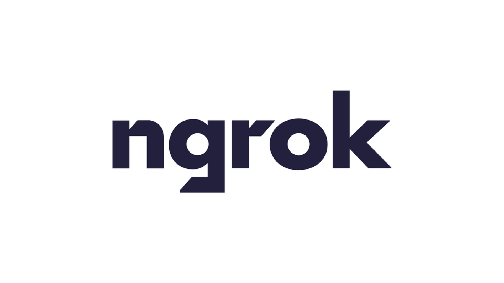
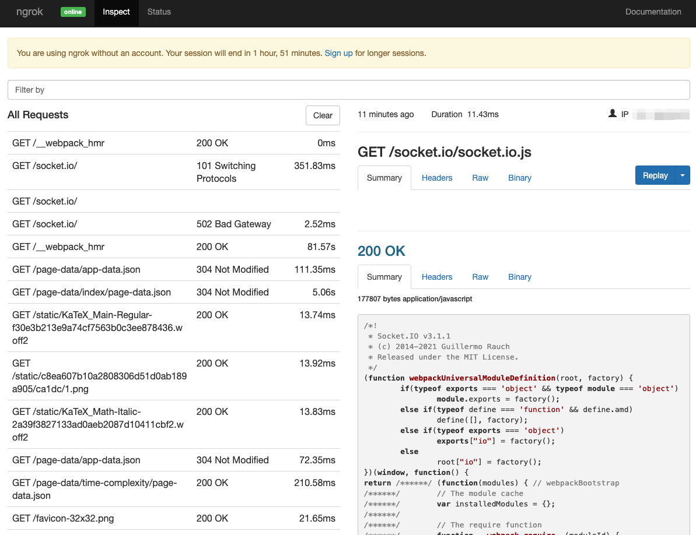

개발을 하다 보면, 로컬에서 개발 중인 버전을 **배포하지 않고** 외부에 공개해야할 일이 존재한다. 이를테면 현재 개발중인 기능에 대해 논의해야하는 상황이거나, 모바일에서 테스트하기 위한 상황 등이 있을 것 이다. 또한 Webhook 을 테스트하기 위해 수정사항이 발생할 때 마다 배포하는 것은 고역일 것이다.

물론 현재 개발 중인 장소가 자택이라면, 공유기 설정에서 포트포워딩을 통해 특정 포트를 열어 외부에 공개할 수 있다. 이런 방법은 매우 귀찮기도 하거니와, 무분별한 포트포워딩은 홈 네트워크를 외부에 무분별하게 노출되게끔 하여 보안에 치명적일 수 있다.

보안 이슈를 차치하더라도 작업중인 장소가 회사나, 카페 등 공유기 설정을 마음대로 할 수 없는 상황에서는 포트포워딩도 사용할 수 없다.

> 물론 DDNS 같은 솔루션도 존재하긴 하지만, 번거로운 것은 매한가지이다.

## 1. ngrok 소개

ngrok 은 온디맨드 보안 터널을 생성하여 로컬 호스트를 퍼블릭 인터넷에 공개하는 터널링 도구이다. 그 과정이 상당히 상당히 개발자 친화적이다. 명령어 한 줄 이면 그 즉시 외부에서 로컬에 접속 가능한 URL이 생성되고, 로컬에서 작업중인 REST API 서버 혹은 프론트엔드 작업물도 바로 외부에 공개할 수 있다.

ngrok 은 무료 플랜과 유료 플랜으로 나뉜다만, 개인적으로 사용하는 목적으로는 무료 플랜으로 충분하다. 무료 플랜은 아래와 같은 기능을 제공한다.

1. HTTP/TCP 접속을 위한 랜덤 URL, 포트를 생성
2. 최대 1개의 ngrok 프로세스
3. ngrok 프로세스 당 최대 4개의 터널
4. 분당 최대 40개의 커넥션

유료 플랜을 확인하고 싶다면, **[여기](https://ngrok.com/pricing)** 를 클릭하여 자세히 읽어보자.

## 2. ngrok 설치하기

ngrok 은 **[공식 웹사이트](https://ngrok.com/download)**에서 바이너리 형태로 제공된다. 하지만, npm 을 사용하여 설치하면 훨씬 쉽게 사용할 수 있다. 본 포스팅에서는 npm 을 통해 ngrok을 설치한다.

```shell
$ npm install ngrok -g
```

혹은 yarn 을 사용 중 이라면, 아래 명령을 실행하자.

```shell
$ yarn global add ngrok
```

## 3. ngrok 사용하기

본격적으로 ngrok 을 사용해보자.

> 본 포스팅은 npm 을 통해 ngrok 을 설치함을 전제하고 있기 때문에, npm 을 통해 설치하지 않은 사람은 후술될 명령어에서 'npx' 를 제외하고 입력해야한다.

### 3-1. URL 생성

ngrok 이 설치가 완료 되었다면, 테스트를 위한 로컬 서버를 실행하고 아래 명령으로 외부에서 접속 가능한 URL을 생성해보자. 이 때, 로컬 포트는 `8000` 이라 가정한다.

```shell
$ npx ngrok http 8000

ngrok by @inconshreveable                                                                                                                                                                           (Ctrl+C to quit)

Session Status                online
Session Expires               1 hour, 48 minutes
Version                       2.3.40
Region                        United States (us)
Web Interface                 http://127.0.0.1:4040
Forwarding                    http://9ba9-121-143-202-27.ngrok.io -> http://localhost:8000
Forwarding                    https://9ba9-121-143-202-27.ngrok.io -> http://localhost:8000

Connections                   ttl     opn     rt1     rt5     p50     p90
                              20      3       0.12    0.04    0.12    5.60

HTTP Requests
-------------
```

명령을 입력하면 보안 터널이 생성되며, http 와 https URL을 둘다 생성해주는 모습을 볼 수 있다. 제공된 URL에 접속하면 정상적으로 로컬 서버에 접속되는 모습을 확인할 수 있다. 또한 터미널 상에서는 아래와 같이 모든 트래픽을 모니터링 할 수 있다.

```shell
GET /static/c8ea607b10a2808306d51d0ab189a905/ca1dc/1.png              200 OK
GET /static/KaTeX_Main-Regular-f30e3b213e9a74cf7563b0c3ee878436.woff2 200 OK
GET /page-data/app-data.json                                          304 Not Modified
GET /page-data/time-complexity/page-data.json                         200 OK
GET /static/KaTeX_Math-Italic-2a39f3827133ad0aeb2087d10411cbf2.woff2  200 OK
GET /favicon-32x32.png                                                200 OK
GET /page-data/app-data.json                                          304 Not Modified
GET /static/profile-00094cdd94690e21e1f412dbfd4d6656.png              200 OK
GET /socket.io/                                                       101 Switching Protocols
GET /page-data/tags/page-data.json                                    200 OK
```

### 3-2. 웹에서 트래픽 모니터링

ngrok은 또한 웹 기반의 GUI 트래픽 모니터링 도구를 기본으로 제공해준다. 이는 세션을 시작하면 자동으로 로컬에서 실행된다. **http://127.0.0.1:4040** 에 접속해보자. 아래와 같은 웹사이트에 접속될 것 이다.



편리한 점은 우측 상단의 **Replay** 버튼을 클릭하여 특정 트래픽을 다시 발생시킬 수 있는 점 이다.

### 3-3. 세션 제한없이 사용하기

기본적으로 ngrok 은 기본 세션 유효기간이 존재하며, 이 세션은 2시간이면 만료되어 다시 ngrok을 실행해 줘야한다. 다시 ngrok을 실행하게 되면 접속 URL이 바뀌어 2시간 이상 사용할 경우 불편을 겪을 수 있다.

만약 2시간 이상 로컬 서버를 외부에 공개해야할 일이 있다면, ngrok에 **[회원가입](https://dashboard.ngrok.com/signup)**하고 발급된 인증 토큰을 등록하는 것이 좋다. **[대시보드의 Your Authtoken](https://dashboard.ngrok.com/get-started/your-authtoken)** 메뉴에서 자신의 토큰을 복사하자.


```shell
$ npx ngrok http 8000 YOUR_TOKEN
```

위 명령을 입력하면, Authtoken 등록이 완료되며 이후 ngrok 을 실행하면 세션 시간 제한 없이 사용할 수 있다.
