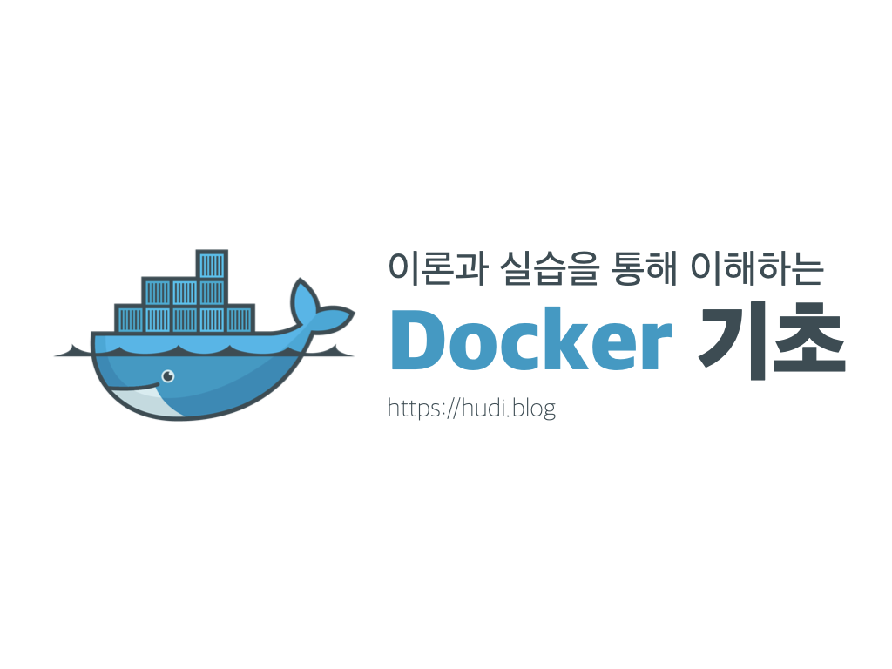
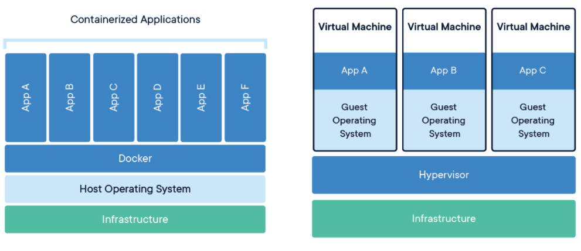
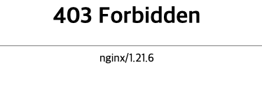
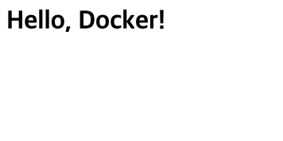
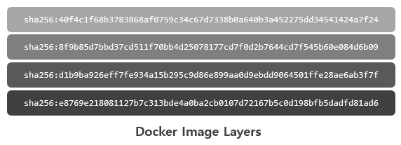

> 본 포스팅은 도커에 대한 **자세한 개념**, 도커 **기본 명령어**, **컨테이너 실행** 실습, **도커 컴포즈**, 도커 **이미지 빌드**, **도커 허브**에 이미지 배포 등 전반적인 도커 기초에 대한 내용을 다룬다.



## 1. 도커 (Docker)

도커는 **컨테이너 기반**의 오픈소스 가상화 플랫폼이다. 도커를 솔로몬 하익스라는 개발자에 의해 개발되었으며, 2013년에 처음 발표되었다. **고 (Go) 언어**로 개발되고 있다.

### 해상 운송업의 컨테이너


조금 뜬금없을 수 있지만, 선박을 이용하여 수출입하는 해상 운송업의 모습을 상상해보자. 모든 선적물은 거대한 상자모양의 **컨테이너를 통해 패키징** 된 후 화물선에 선적된다. 컨테이너는 **국제적으로 표준화, 규격화**된 크기를 갖고있다. 컨테이너와 관련된 보관, 운송과 관련한 장비, 제도, 프로세스 등은 모두 국제 표준에 맞게 설계된다.

이런 표준화의 특징으로 인해 **해상 운송업자는 컨테이너 안에 어떤 물건이 담겨져 있는지 전혀 알 필요가 없다.** 그저 컨테이너 단위로 선적하여 운송하고 하역하고 보관하면 그만이다. 따라서 한국에서 수출한 물건을 저 멀리 미국에서도 **‘장소에 구애 받지 않고’** 손쉽게 하역하고, 운송할 수 있는 것 이다.

만약 해상 운송업에서 컨테이너를 사용하지 않는다면 어떻게 될까? 제각기 다른 물건의 크기, 모양, 심지어 액체/고체 여부에 대응하기 위해 서로 다른 운송 장비, 보관 방법, 프로세스가 필요할 것이다.

### 도커의 컨테이너


도커의 컨테이너도 마찬가지이다. 도커는 서비스를 운용하는데 필요한 실행환경, 라이브러리, 소프트웨어, 시스템 도구, 코드 등을 **컨테이너라는 표준화된 단위로 추상화**한다. 이렇게 만들어진 컨테이너는 컴퓨팅 환경에 구애받지 않고 서비스가 실행될 수 있도록 한다.

실제 컨테이너의 특성처럼, 서비스 관리자는 **도커라이징(Dockerizing)** 된 컨테이너가 어떤 런타임을 필요로 하는지, 어떤 라이브러리와 코드를 필요로 하는지 전혀 알 필요가 없다. 그저 컨테이너를 어딘가에서 가져와서 서비스를 운영할 컴퓨팅 환경에서 실행하기만 하면 된다. 실행된 서비스는 컴퓨팅 환경과 **독립된 가상의 환경**에서 실행되며, **일관된 결과**를 보장한다.

### 전통적인 서버관리

우리가 새로운 서비스를 개발하고 있는 개발자라고 생각해보자. 우리가 런칭하려는 서비스는 규모가 상당하여, 시스템 환경 설정부터, 방화벽, 네트워크 등의 **많은 설정을 변경**하였다. 또한 Java, Python, Node.js 등 **많은 프로그래밍 언어**를 사용하고, 각각의 언어는 또 **많은 라이브러리 의존성**을 갖는다. 여기서 끝이 아니다. PostgreSQL, MariaDB, Redis 등 **여러개의 DBMS** 도 사용한다. 하지만, 우리는 유능한 개발자다. 이 많은 것들을 우리의 로컬 개발환경에 완벽하게 셋업했다.

우리는 서비스를 완성했고, 이제 서비스를 배포해야할 상황이 찾아왔다. 어라, 급하게 개발하다보니 개발서버 환경을 어떻게 설정했는지, 어떤 언어와 라이브러리를 설치했는지, DBMS 는 무엇을 사용하는지, 각각의 버전은 무엇인지 전혀 기록해두지 않았다. 하지만, 우리는 불굴의 개발자이다. 서버의 모든 환경설정과 Git 로그를 뒤져내어 서버를 세팅하는 매뉴얼을 작성하는데 성공했다.

자, 이제 **토씨하나 틀리지 않고 메뉴얼대로** 프로덕션 서버에도 개발환경과 동일한 환경을 구축하면 된다. 결국 서버를 모두 세팅하였고, 서비스를 실행해보았다. 어라, 오류가 발생한다. 수 시간의 삽질 끝에 오류의 원인을 알아내었다. 어떤 **라이브러리의 버전이 개발환경과 달라 발생한 오류**였다. 아까 서버를 세팅할 때 실수를 한 모양이다. 어찌됐든 성공적으로 서비스를 배포하는데 성공하였다.

서비스는 성공적이었고, DAU는 치솟았다. 슬슬 서버를 확장해야할 것 같다. 경제적 이유로 확장의 형태는 수평 확장으로 결정되었다. **또 다른 서버에 이전과 똑같은 프로세스대로 환경을 셋업해야한다.** 정신이 아득해진다.

위와 같이 컨테이너를 사용하지 않은 전통적인 서버 관리방식에서는 밑 바닥부터 **수작업으로 모든것을 세팅**해야한다. 이런 환경에서 만약 개발언어를 Python 에서 Go 로 교체하는 등 **서버 환경과 개발 환경이 바뀐다면?** 운용중인 모든 서버에도 변경 사항을 적용해야한다. 생각만해도 끔찍하다.

### 도커를 사용한 서버관리

도커를 사용하면, 위와 같이 귀찮고 고통스러운 작업을 반복할 필요 없다. 도커를 사용하면 OS 환경설정, 언어, 라이브러리, 시스템 도구 등이 설치된 환경을 그대로 **이미지**로 빌드할 수 있다. 이미지는 후술할 Dockerfile 이란 것을 이용하여 만들 수 있다. 개발 환경에서 만들어진 이미지를 그대로 프로덕션 서버에 전달하고, 이미지를 기반으로 컨테이너를 생성하고 실행하면 끝이다.

이런 컨테이너의 특징은 곧, 도커의 중요한 특징인 **표준성**과 상통한다. Java, node.js, Python 등 다양한 언어와 프레임워크를 사용한 서비스들은 제각기 다른 배포 방법을 가지고 있다. 하지만 이를 도커를 통해 패키징하여 컨테이너를 만든다면, 어떤 언어, 프레임워크, 런타임을 사용하던 관계없이 모두 동일한 배포 프로세스를 갖게 된다.

이런 표준성 덕분에 도커는 높은 **확장성**과 **이식성**을 갖는다. 도커가 설치된 환경이라면 어디서든 컨테이너를 실행할 수 있으며, 이를 통해 프로덕션 서버는 물론, 개발 및 테스트 서버 구축과 운영도 아주 쉬워진다. 컨테이너의 설정은 보통 환경변수로 제어하므로, 환경(개발, 테스트, 프로덕션 등)에 따라 환경 변수를 다르게 설정하여 관리할 수 있다.

단, 도커의 **컨테이너는 삭제되면 모든 데이터가 초기화**된다. 이를 막기 위해 외부 저장장치에 링크를 하거나, AWS S3 등 별도의 클라우드 스토리지를 사용해야할 필요가 있다.

이 모든 설정은 코드와 설정파일 기반으로 관리되어 Git 등을 사용하면 히스토리가 남게 되며, **재현과 추적**이 가능하다.

### 컨테이너 vs VM (Virtual Machine)

그렇다면, 도커 같은 컨테이너 기반의 가상화 플랫폼과 VM의 차이점은 무엇일까?



위 그림의 왼쪽은 도커의 구조를, 오른쪽은 VM 의 구조를 나타낸다. 가장 먼저 눈에 들어오는 차이점은 **하이퍼바이저 (Hypervisor) 의 유무**이다. 하이퍼바이저란 Virtual Box 나 VM Ware 와 같은 가상 머신을 생성하고 실행하는 프로세스이다. 하이퍼바이저는 **하드웨어를 에뮬레이션하여** 하나의 컴퓨터에서 다수의 운영체제를 운영할 수 있게 해주는 소프트웨어이다.

하이퍼바이저 자체를 실행하는 측을 **호스트 운영체제 (Host OS)** 라고 하며, 하이퍼바이저가 구동하는 가상화된 OS 를 **게스트 운영체제 (Guest OS)** 라고 한다. 게스트는 호스트로부터 일정량의 리소스를 할당을 받아 구동된다. 운영체제 자체를 가상화하여 실행하는 특징으로 도커에 비해 상대적으로 무겁다. 호스트 운영체제와 게스트 운영체제의 **기능 중복**으로 인해 약 10 ~ 20% 의 오버헤드 (Overhead) 를 갖는다고 한다.

하지만, 도커와 같은 컨테이너 기반 가상화 플랫폼은 **게스트 운영체제 없이**, **프로세스를 격리**하는 방식으로 호스트 운영체제의 모든 기능과 리소스를 컨테이너간 공유한다. 운영체제 위에 **또 다른 운영체제를 구동하지 않아**도 되며, **리소스도 공유**해서 사용하므로 오버헤드는 3 ~ 5% 이내라고 한다. 또한 운영체제를 별도로 가상화 하지 않으므로 이미지 파일의 용량도 하이퍼바이저에 비해 낮다.

## 2. 도커 시작하기

> (참고) 본 포스트는 Mac 환경을 기준으로 작성되었다.

### 설치

도커를 사용하기 위해서는 도커를 먼저 설치해야한다. Mac 이나 Windows 를 사용하는 유저는 **[Docker 웹사이트](https://www.docker.com/get-started)** 에 접속하여 **Docker Desktop** 을 OS 에 맞게 다운로드하여 설치하면 된다.

리눅스 환경에서는 `sudo` 권한으로 아래의 명령을 입력하면 도커를 설치할 수 있다.

```bash
curl -fsSL https://get.docker.com/ | sudo sh
```

설치되었는지 확인하기 위해서 `docker version` 명령을 입력해본다. 아래와 같이 버전정보가 표시된다면 성공적으로 설치된 것이다.

```bash
$ docker version
Client:
 Cloud integration: v1.0.22
 Version:           20.10.11
 (생략)

Server: Docker Engine - Community
 Engine:
  Version:          20.10.11
 (생략)
```

### 컨테이너를 실행하기 전에…

본격적으로 도커를 맛보기 위해 여러가지 도커 이미지를 다운받고, 컨테이너를 실행해보며 대략적인 사용방법을 익혀본다. 일단 첫번째로는 순수하게 아무것도 설치되지 않는 Ubuntu 와 CentOS 이미지를 받아와 컨테이너를 실행해볼 것이다.

잠깐 다음으로 넘어가기 전에 짚고 넘어가야할 것이 있다. 위에서 도커는 분명 Guest OS 를 구동하지 않는다고 했는데, 어떻게 Ubuntu, CentOS 를 구분지어 구동할 수 있는 것일까? **도커 컨테이너는 Kernel 데이터를 갖고 있지 않다.** 다만 컨테이너가 필요로 하는 **Kernel 은 Host OS 의 것을 그대로 사용**하고, **Kernel 외의 데이터만을 패키징하여 컨테이너가 가지고** 있는다. 이를테면, Ubuntu 와 CentOS 의 차이점만을 컨테이너에 패키징되어 담고 있는 것 이다. Ubuntu와 CentOS 는 서로 다른 리눅스 배포판이지만, 같은 Linux Kernel 을 사용하기에 이것이 가능하다.

이렇게 말한다면 또 Mac 과 Windows 사용자는 궁금해 할 것이다. ‘내가 사용하는 OS 는 Linux Kernel 기반이 아닌데, 어떻게 도커가 동작하나요?’ 사실 정확히 이야기하자면, **Docker 는 Linux 환경에서만 네이티브로 동작**한다. Linux 이외의 환경에서 도커를 사용할때에는 **도커 자체가 OS 에서 지원하는 가상화 환경에서 구동**된다.

이때 가상화 기술로 **Mac 은 xhyve, Windows 는 Hyper-V** 를 사용하여 별도의 Linux 환경을 만들 수 있다. Docker 의 핵심인 **Docker Engine 은 이 가상화 환경의 Linux 위**에서 돌아가게 된다.

자, 어려운 이야기는 여기서 끝내고 직접 도커를 다뤄보자.

### Ubuntu 컨테이너 올리기

제일 처음으로 할 것은 우분투 이미지를 사용하여 컨테이너를 올려보는 것 이다. 자세한 명령은 더 아래에서 정리해볼테니 명령어를 외우기보단 따라하며 **도커가 무엇인지 직관적으로 이해하는 것에 집중**하자.

Docker Desktop 을 실행한 다음 터미널에서 아래 명령을 입력한다.

```bash
$ docker run ubuntu:latest
```

위 명령을 입력하여, 우분투의 최신 버전 이미지를 다운받고, 컨테이너를 실행할 수 있다. 처음 명령을 입력하는 경우 이미지를 다운로드 해야하므로 조금 기다려야한다. 아래와 같이 출력되면, 이미지 다운로드가 끝나고 컨테이너가 올라간 상태일 것이다.

```bash
Unable to find image 'ubuntu:latest' locally
latest: Pulling from library/ubuntu
bbf2fb66fa6e: Pull complete
Digest: sha256:669e010b58baf5beb2836b253c1fd5768333f0d1dbcb834f7c07a4dc93f474be
Status: Downloaded newer image for ubuntu:latest
```

컨테이너가 올라갔는지 확인하기 위해 Docker Desktop 창을 열어 확인해보자.


리스트에 무언가 생긴것을 볼 수 있다. 컨테이너 이름은 별도로 지정해주지 않는 이상 임의의 이름으로 설정되므로 사진과 다른 이름일 것 이다. 우측에 `ubuntu:latest` 라고 써있는 것을 보니 우리가 생성한 컨테이너가 맞는 것 같다.

하지만 이렇게 실행되는 **컨테이너도 프로세스의 일종**이기 때문에, 우분투에 실행되고 있는 프로세스가 없다면 컨테이너도 종료되어 아무것도 할 수 없다. Docker Desktop 에서 우리가 생성한 컨테이너에 마우스를 올리고 휴지통 버튼을 클릭하여 컨테이너를 일단 삭제해보자. 혹은 아래 명령을 입력하여 컨테이너를 삭제할수 있다.

```bash
$ docker rm {컨테이너_이름}
```

그리고, 아래 명령을 입력하여 도커 컨테이너가 올라가자마자 **쉘을 실행**하도록 하자. 쉘은 프로세스이므로 우분투 컨테이너가 바로 종료되지 않을 것 이다.

```bash
$ docker run -it ubuntu:latest /bin/sh
```

`-it` 옵션은 컨테이너를 종료하지 않은 상태로 **터미널의 입력을 컨테이너 내부로 전달**하기 위해 사용된다. 또한 `docker run` 명령에서 이미지 이름 다음으로 적는것은 **컨테이너가 실행된 직후 이어서 실행되는 명령**이다. `/bin/sh` 을 입력하였으므로 쉘이 실행된다.

```bash
# echo "hello, docker"
hello, docker
```

터미널에 위와 같이 입력하여 컨테이너 내부로 명령을 전달해보자. **우분투 쉘**에서 `hello, docker` 라는 문자열이 그대로 출력되면 성공이다.

### CentOS 컨테이너 올리기

이번에는 다른 Linux 배포판인 CentOS 이미지를 사용해보자. 아래 명령으로 CentOS 이미지를 다운받고 컨테이너를 실행하자.

```bash
$ docker pull centos:centos8.4.2105
```

이미지 명을 작성할때 `:` 뒤에 오는 `centos8.4.2105` 는 **태그**라고 한다. 이번에는 `centos8.4.2105` 태그를 사용하여 **명시적으로 사용할 이미지의 버전**을 입력해주었다.

```bash
$ docker run -it --rm centos:centos8.4.2105 /bin/sh
```

위에서 한 것 처럼 `run` 명령을 이용해 컨테이너를 실행할 수 있다. `--rm` 옵션이 추가되었는데, 이는 **컨테이너가 종료되면 컨테이너를 삭제**하라는 의미이다.

### Nginx 웹서버 구축하기

이번에는 Nginx 라는 웹 서버를 이용하여, 웹 서버를 올려보고 직접 html 파일을 서빙해보자. 이번엔 컨테이너 내부의 저장공간과 Host OS 저장공간을 이어주어 서빙할 html 파일을 손쉽게 전달해 볼 것이다. 이를 **볼륨 마운트 (Volume Mount)** 라고 한다. 볼륨 마운트는 `-v` 옵션을 통해 할 수 있다.

또한, Nginx 의 기본 HTTP 포트는 80을 외부에서 3000으로 접근할 수 있도록 **외부포트와 내부포트를 바인딩** 해줄 것 이다. 이는 `-p` 옵션을 통해 가능하다. 적당한 디렉토리를 만들고, 그 디렉토리에서 아래의 명령을 입력하자.

```bash
$ docker run --rm -p 3000:80 \
  -v $(pwd)/:/usr/share/nginx/html/ \
  nginx
```

한번 `localhost:3000` 에 접속해보자. 아래와 같이 403 Forbidden 화면이 출력되면 성공이다.



현재 이 컨테이너의 `/usr/share/nginx/html/` 디렉토리는 Nginx 가 서빙할 정적 파일이 위치하는 디렉토리이다. 그 디렉토리는 **명령을 실행한 현재 Host OS의 디렉토리와 연결**되어 있는 상황이다. 현재 디렉토리에 아래와 같이 `index.html` 파일을 생성해보자.

```html
<html>
  <head>
    <title>Docker</title>
  </head>
  <body>
    <h1>Hello, Docker!</h1>
  </body>
</html>
```

그리고 다시 접속해보면, 아래와 같이 우리가 만든 HTML 파일이 서빙될 것이다.



### PostgreSQL DB서버 구축하기

이번엔 RDBMS 중 하나인 PostgreSQL 컨테이너를 올려보자. 이야기 했지만 컨테이너는 삭제되면, 데이터도 함께 삭제된다. **PostgreSQL 은 DBMS 이므로 꼭 볼륨 마운트**를 해줘야한다. 적당한 디렉토리를 만들고, 아래 명령을 실행하자.

```bash
$ docker run --name postgres -d \
  -p 5432:5432 \
  -e POSTGRES_PASSWORD=password \
  -v $(pwd)/data/:/var/lib/postgresql/data/ postgres:14.1
```

이번엔 `--name` 옵션을 통해 컨테이너의 이름을 우리가 직접 `postgres` 로 설정해주었다.

`-d` 옵션은 **Detached Mode** 로 컨테이너를 실행하는 옵션으로, **컨테이너가 백그라운드 모드**로 돌아가도록 설정해준다.

`-e` 옵션을 통해 컨테이너가 사용하는 **환경변수**를 설정할 수 있다. 우리는 `POSTGRES_PASSWORD` 를 `password` 로 설정하여, PostgreSQL 접속에 사용하는 비밀번호를 설정하였다.

우리는 `-d` 옵션을 사용하여 컨테이너를 백그라운드에서 실행했다. 외부에서 컨테이너에 명령을 내리는 방법은 `exec` 을 사용하는 방법이 있다. 일단 아래 명령을 통해 현재 실행중인 컨테이너 리스트를 확인해보자.

```bash
$ docker ps

CONTAINER ID   IMAGE           COMMAND                  CREATED         STATUS         PORTS                    NAMES
9ccd0f78bcf3   postgres:14.1   "docker-entrypoint.s…"   3 minutes ago   Up 3 minutes   0.0.0.0:5432->5432/tcp   postgres
```

가장 오른쪽 NAMES 에 우리가 올린 `postgres` 를 확인할 수 있다. 이 컨테이너에 접속하여 명령을 실행해보자.

```bash
$ docker exec -it postgres /bin/sh
```

`docker run` 과 비슷하지만, 이미지 이름 대신 `postgres` 라는 컨테이너 이름을 넣어줬다. 그리고 마찬가지로 쉘을 실행해준다.

```shell
# psql -U postgres
psql (14.1 (Debian 14.1-1.pgdg110+1))
Type "help" for help.

postgres=# CREATE DATABASE hello_docker;
CREATE DATABASE
postgres=# \l
                                  List of databases
     Name     |  Owner   | Encoding |  Collate   |   Ctype    |   Access privileges
--------------+----------+----------+------------+------------+-----------------------
 hello_docker | postgres | UTF8     | en_US.utf8 | en_US.utf8 |
 postgres     | postgres | UTF8     | en_US.utf8 | en_US.utf8 |
 template0    | postgres | UTF8     | en_US.utf8 | en_US.utf8 | =c/postgres          +
              |          |          |            |            | postgres=CTc/postgres
 template1    | postgres | UTF8     | en_US.utf8 | en_US.utf8 | =c/postgres          +
              |          |          |            |            | postgres=CTc/postgres
```

PostgreSQL 이 정상적으로 설치되고 실행되는 모습을 확인할 수 있다.

### Ghost 블로그 구축하기

이번엔 Ghost 라는 오픈소스 블로깅 플랫폼을 사용하여 블로그를 구축해보자.

```bash
$ docker run -d --name ghost-blog \
  -e url=http://localhost:3001 \
  -p 3001:2368 \
  -v $(pwd)/content/:/var/lib/ghost/content/ \
  ghost:4.34.3
```

위 명령을 입력한 후 아래와 같이 Ghost 블로그가 `localhost:3001` 에서 접속이 되면 성공적으로 설치가 완료된 상황이다.


Ghost 이미지에는 Ghost 뿐 아니라 **DB 도 포함되어 빌드**되었기 때문에, 어드민 페이지인 `http://localhost:3001/ghost/` 에 접속하여 계정을 생성하고, 글을 작성할수도 있다.

본 포스팅은 Ghost 에 대한 포스팅이 아니므로 이 과정은 생략하도록 하겠다. 궁금하다면 어드민 페이지에 접속해보고 여러가지 시도해보면 좋겠다.

### 심지어… 마인크래프트 서버 올려보기

이 부분은 재미로 넣어보았다. 마인크래프트를 구매하지 않은 사람은 굳이 따라하지 않아도 된다. 다른 사람이 마인크래프트 서버를 도커 이미지로 빌드해두어, 우리는 도커로 마인크래프트 서버도 열어볼 수 있다.

```bash
$ docker run -d -p 25565:25565 --name minecraft -e EULA=TRUE \
  itzg/minecraft-server
```


리눅스 배포판, 웹서버, DB 서버, 블로깅 플랫폼 등 여러가지를 도커 명령 한줄로 세팅해보며 도커가 무엇인지, 도커가 왜 인기가 있는 것인지 **직관적으로 이해**할 수 있는 시간이 되었으면 좋겠다.

## 3. 자주 쓰는 명령어

자주 사용되는 도커의 명령어를 알아보자.

#### docker run

위에서 알아보았듯 `run` 명령은 도커 이미지를 다운받고, 컨테이너를 실행하는 명령이다. 아래의 포맷을 갖는다.

```bash
$ docker run <옵션> <이미지 이름:태그> <명령어> <인자>
```

자주 사용되는 옵션은 아래와 같다.

| 옵션     | 설명                                                                 |
| -------- | -------------------------------------------------------------------- |
| `-d`     | 컨테이너를 백그라운드에서 실행 (Detached Mode)                       |
| `-p`     | 호스트 포트와 컨테이너 내부의 포트를 바인드한다.                     |
| `-v`     | 컨테이너 내부의 디렉토리를 호스트로 마운트 (연결) 한다.              |
| `-e`     | 컨테이너에서 사용되는 환경변수를 설정한다.                           |
| `--name` | 컨테이너의 이름을 설정한다.                                          |
| `--rm`   | 컨테이너가 종료될 경우 컨테이너 자체를 삭제한다.                     |
| `-it`    | 터미널 입력을 위한 옵션. `-i` 옵션과 `-t` 옵션은 주로 함께 사용된다. |
| `-w`     | WORKDIR 를 설정한다.                                                 |

#### docker ps

현재 실행되고 있는 컨테이너를 확인한다.

```bash
$ docker ps <옵션>
```

`-a` 옵션을 붙이면 Stop 상태의 컨테이너도 볼 수 있다.

#### docker stop

실행중인 컨테이너를 중지한다.

```bash
$ docker stop <옵션> <컨테이너 이름> <컨테이너 이름...>
```

#### docker rm

컨테이너를 제거한다.

```bash
$ docker rm <옵션> <컨테이너 이름> <컨테이너 이름...>
```

#### docker logs

컨테이너에 기록된 로그를 확인할 수 있다.

```bash
$ docker logs <옵션> <컨테이너 이름>
```

`-f` 옵션을 사용하면, 로그를 일회성으로 보여주고 끝내지 않고 기다리며 새롭게 발생한 로그도 출력해준다.

#### docker images

현재 설치된 이미지 리스트를 출력한다.

```bash
$ docker images <옵션> <레포지토리 이름>
```

레포지토리를 넘겨주면 특정 레포지토리의 이미지만 필터링하여 볼 수 있다.

#### docker rmi

현재 설치된 이미지를 제거한다.

```bash
$ docker rmi <옵션> <이미지 이름> <이미지 이름...>
```

#### docker pull

이미지를 도커 레지스트리로부터 다운로드한다. `run` 명령을 사용할 때, 대상 이미지가 설치되지 않은 이미지일 경우 자동으로 `pull` 해준다.

```bash
$ docker pull <옵션> <이미지 이름:태그>
```

## 4. 도커 컴포즈 (Docker Compose)


지금까지 우리는 도커를 모두 **CLI 으로 조작**했다. 물론 간단한 작업은 명령어만 사용해서 조작해도 상관없다. 하지만 컨테이너를 실행할때마다 **모든 옵션**을 넣어주고, **환경변수를 입력**해주는 것은 귀찮다. 이를 해결하기 위해 도커에서는 **도커 컴포즈 (Docker Compose)** 라는 것을 제공한다. 도커 컴포즈는 **여러 컨테이너를 모아 하나의 어플리케이션을 구성**할 때 사용된다.

도커 컴포즈는 도커 데스크톱을 설치하면 기본으로 제공된다. 리눅스 환경인 경우 **[도커 공식 웹사이트](https://docs.docker.com/compose/install/)** 를 참고하여 설치하자.

### 버전확인

아래의 명령을 입력하여 도커 컴포즈 버전이 출력되면 제대로 설치가 되었다는 의미이다.

```bash
$ docker-compose version

docker-compose version 1.29.2, build 5becea4c
docker-py version: 5.0.0
CPython version: 3.9.0
OpenSSL version: OpenSSL 1.1.1h  22 Sep 2020
```

### MySQL 컨테이너 실행하기

이번엔 도커 컴포즈를 이용하여 Wordpress 서버를 실행해볼 것이다. 일단, MySQL 컨테이너를 실행해보자. 도커 컴포즈 설정 파일은 **YAML 포맷**을 사용하여 작성한다. 적당한 디렉토리에서 `docker-compose.yml` 파일을 생성하고 아래의 내용을 입력해보자.

```yml
version: "3" # docker-compose 파일 규격 버전
services:
  mysql-db: # 컨테이너 이름
    image: mysql:5.7 # 이미지
    volumes: # -v 옵션
      - ./mysql:/var/lib/mysql
    environment: # -e 옵션
      MYSQL_ROOT_PASSWORD: wordpress
      MYSQL_DATABASE: wordpress
      MYSQL_USER: wordpress
      MYSQL_PASSWORD: wordpress
```

첫번째로 `version` 는 **도커 컴포즈 파일의 규격버전**을 명시한다. “3” 을 입력하였으므로, 3.X 버전대의 가장 최신 버전을 사용하게 된다. 관련된 자세한 내용은 **[도커 공식 웹사이트의 가이드](https://docs.docker.com/compose/compose-file/compose-versioning/)** 문서를 참고하자.

그 아래로는 `services` 를 명시하게 된다. **서비스란 도커 컴포즈에서 컨테이너**를 의미한다. 우리는 MySQL 의 서비스 이름을 `mysql-db` 로 정했다. 컨테이너 이름 다음으로 올 것은 우리가 `docker run` 을 실행하며 넣어준 여러 옵션을 YAML 포맷으로 넣어주면 된다.

이제 `docker-compose.yml` 이 있는 디렉토리에서 터미널로 아래 명령을 입력하여 컨테이너를 실행하자.

```
$ docker-compose up
```

이미지를 Pull 하고 컨테이너가 실행되면 성공이다.

> M1 맥북 사용자는 위 명령이 제대로 작동하지 않을 것 이다. 맥북 사용자는 도커 컴포즈 파일의 `environment` 옵션 아래에 `platform: linux/x86_64` 를 추가하자.

### Wordpress 컨테이너 실행하기

Wordpress 를 실행할 새로운 서비스를 추가하자. `docker-compose.yml` 에 아래 내용을 이어서 작성하자.

```yml
services:
  # ...
  wordpress:
    image: wordpress:latest
    volumes:
      - ./wordpress-html:/var/www/html
    ports:
      - 3000:80
    restart: always
    environment:
      WORDPRESS_DB_HOST: mysql-db:3306
      WORDPRESS_DB_USER: wordpress
      WORDPRESS_DB_PASSWORD: wordpress
```

다시 `docker-compose up` 명령으로 실행해보자. 그리고 `localhost:3000` 에 접속하여 워드프레스가 제대로 동작하는지 확인해보자. 워드프레스 설치와 사용방법은 **[워드프레스 공식 문서](https://wordpress.org/support/article/how-to-install-wordpress/)** 를 확인하자.

그런데, 환경변수를 살펴보면 `WORDPRESS_DB_HOST` 에 IP 주소나 도메인 대신 `mysql-db` 를 넣은 것을 알 수 있다. **IP 주소를 넣어주지 않았는데, 어떻게 Wordpress 와 MySQL 은 정상적으로 통신**할 수 있는 것 일까? 이를 이해하기 위해서는 **도커 네트워크**에 대해 이해해야한다.

### 도커 네트워크

도커는 컨테이너에 내부 IP 를 순차적으로 할당한다. 이 IP 는 컨테이너가 실행될 때 마다 달라진다. 하지만 우리가 워드프레스와 MySQL 컨테이너를 함께 실행한 것을 생각해보자. 워드프레스의 환경변수를 MySQL 컨테이너를 실행할때마다 바꿔주는 것은 매우 번거로운 일이다.

도커 네트워크는 **실행 중인 각각의 컨테이너를 연결하는 논리적인 네트워크**이다. 같은 네트워크로 연결된 컨테이너는 별도의 IP 를 지정해줄 필요 없이 컨테이너의 이름만으로 손쉽게 통신할 수 있다.

그런데, 우리는 별도의 네트워크를 생성하고 설정한 적이 없다. 그렇다면 어떻게 MySQL 과 Wordpress 컨테이너끼리 통신을 하는것일까?

기본적으로 도커 컴포즈를 사용해 여러 컨테이너를 올리면, 사용자가 별도의 네트워크를 생성하고 설정하지 않아도 `<디렉토리 이름>_default` 라는 네트워크를 생성하고 컨테이너를 연결한다. 따라서 최초로 `docker-compose up` 하였을 때, 아래 메세지가 출력되는 것을 확인해볼 수 있다.

```bash
Creating network "<디렉토리 이름>_default" with the default driver
```

도커 네트워크에 대한 깊은 내용은 별도의 포스팅으로 다뤄보겠다. 지금은 도커 컴포즈를 사용하며, 컴포넌트 간 통신이 네트워크를 통해 이뤄지고 있다는 것만 이해하고 넘어가자.

## 5. 도커 이미지 빌드하기 (Dockerfile)

지금까지는 다른사람이 빌드해 놓은 이미지를 다운로드 받아서 사용하기만 했다. 이제는 우리가 직접 간단한 node.js 앱을 작성하고, 도커 이미지로 빌드해보자. node.js 를 배운적이 없다면, node.js 부분은 이해하지 않고 그냥 따라서 작성만해도 괜찮다.

### node.js 프로젝트 생성

일단 도커라이징할 node.js 서버를 아주 간단하게 작성해보자. 적절한 디렉토리를 생성하고 아래 과정을 따라오자.

```bash
$ npm init && npm install express
```

먼저 node.js 앱을 초기화해주고, 웹서버 작성을 위한 `express` 프레임워크를 설치한다. 그 다음 `server.js` 파일을 생성한 다음 아래 코드를 그대로 작성한다.

```js
const express = require("express")

const PORT = 8080
const HOST = "0.0.0.0"

const app = express()
app.get("/", (req, res) => {
  res.send("Hello Docker")
})

app.listen(PORT, HOST)
console.log(`Running on http://${HOST}:${PORT}`)
```

우리가 빌드할 간단한 서버가 완성되었다.

### Dockerfile 작성

이미지를 빌드하기 위해서는 `Dockerfile` 이라는 파일을 작성해야한다. `Dockerfile` 은 도커 이미지를 빌드하기 위한 스크립트 파일이다. 도커는 `Dockerfile` 을 읽고 순차적으로 명령을 실행하여 이미지를 빌드한다.

```dockerfile
# 사용할 이미지 입력
FROM node:16.13.2

# 작업디렉토리 설정
WORKDIR /usr/src/app

# 앱 의존성 설치
COPY package*.json ./
RUN npm install

# 앱 소스 추가
COPY ./server.js ./server.js

EXPOSE 8080
CMD [ "node", "server.js" ]
```

`FROM` 에 명시된 **이미지를 베이스**로 작성된 스크립트가 순차적으로 실행되며, 새로운 이미지가 빌드된다. `WORKDIR` 을 통해 컨테이너의 **작업 디렉토리**를 설정했다. 모든 명령이 `WORKDIR` 경로를 기준으로 실행된다.

`COPY` 를 통해 npm 패키지 관련 파일을 복사하였고, `RUN` 명령을 통해 `npm install` 명령을 직접 실행해 node.js 의 의존성 모듈을 설치하였다. 또한 `COPY` 명령을 다시한번 사용해 현재 디렉토리의 `server.js` 를 이미지로 복사한다.

`EXPOSE` 를 통해 외부로 8080 포트를 노출한다. 마지막으로 `CMD` 를 통해 컨테이너가 실행된 직후 실행될 명령도 정의해주면 끝이다. `RUN` 은 이미지 빌드 단계에서 실행되는 명령이고, `CMD` 는 컨테이너가 실행된 이후 실행될 명령을 정의한다.

Dockerfile 은 파일이므로 Git 을 통해 관리 가능하여 이미지 변화 히스토리를 추적할 수 있다.

자세한 Dockerfile 사용 방법을 알고싶다면, **[도커 공식 웹사이트 문서](https://docs.docker.com/engine/reference/builder/)** 를 참조하자.

### 이미지 빌드하기

```bash
$ docker build -t node-app ./
```

위 명령을 입력하여 `Dockerfile` 을 기반으로 이미지를 빌드할 수 있다.

`-t node-app` 은 이미지의 이름을 설정하는 옵션이며, `./` 은 `Dockerfile` 의 경로를 나타낸다. 빌드 과정은 다소 오랜 시간이 소요되니 조금 기다리자.

```bash
$ docker images

REPOSITORY              TAG              IMAGE ID       CREATED          SIZE
node-app                latest           401a74e859b2   39 seconds ago   855MB
...
```

위 명령으로 성공적으로 이미지가 빌드되어 `node-app` 이미지가 조회되는지 확인해보자.

```bash
$ docker run -p 3000:8080 node-app
```

이미지가 조회된다면, 위 명령으로 도커 컨테이너를 실행할 수 있을 것이다.

### 도커 이미지의 레이어 구조

마지막으로 도커 이미지의 구조에 대해서 가볍게 이해하고 넘어가자.



도커 이미지는 위 그림과 같이 여러개의 **Layer 가 겹겹히 쌓여있는 구조**로 되어있다. 과연 정말인지 직전에 설치해둔 Wordpress 이미지로 확인해보자.

```bash
$ docker inspect wordpress
```

`inspect` 명령은 Low Level 에서 컨테이너 혹은 이미지의 정보를 가져오는 명령이다. 굉장히 긴 무언가가 출력될 텐데, `Layers` 라는 부분만 살펴보자.

```
"Layers": [
	"sha256:f9b44a5812beb5294f1cf3b76cf9c29f1e53bf8eec7cece1b002fc5b5fbae8f2",
	"sha256:243aed6552599c7fb8a7939cef784eb2f84ce49708cefe11cf1057f2a27ba42f",
	"sha256:4d66bbee2601b1b779aedfe699c91920d637a5f51f91e87c1c04c3bbe9be34a4",
	"sha256:45dad0035575a38c893da7e0e9f394f2b4a2407b9694e21b53cbdf462c7a8a5b",
	"sha256:a8ccc2628dd85db2b3648ebddef84047a402104dbeeb14958514fd136aa19813",
	"sha256:8857c07576848e6d0b2416c84c561b0591536ccd6900cc7b653bdc2186025145",
	"sha256:6a7f6ea65ec22a59eb3361c2944edfee08d042ec49fbcbbadd8ac1516ac53b04",
...
```

위와 같이 이미지가 굉장히 많은 레이어로 구성되어 있는 모습을 살펴볼 수 있다. 도커를 통해 내려받은 이미지를 구성하는 레이어는 모두 **읽기 전용**이다.


위 이미지처럼 도커 이미지는 Dockerfile의 `FROM` 에 명시한 베이스 이미지 위에 또 다른 레이어가 얹혀져 빌드된다.

## 6. 도커 허브에 배포하기

그런데, 우리가 다운로드한 이미지는 어디서 오는 것 일까? 우리가 다운로드한 이미지는 모두 **도커 레지스트리 (Docker Registry)** 로부터 온다. 도커 레지스트리란 **도커 이미지를 관리하는 저장소**를 의미한다.

도커 레지스트리 중 가장 유명한 것은 도커에서 공식으로 운영하는 **[도커 허브 (Docker Hub)](https://hub.docker.com/)** 이다. 이제, 우리가 빌드한 이미지를 도커 허브에 배포하여 누구나 이미지를 Pull 받을 수 있도록 해보자. 일단 가장 먼저 도커 허브에 가입해야한다. 도커 허브 가입 과정은 생략한다.

도커 허브에 가입했다면, 이제 본격적으로 도커 허브에 우리의 이미지를 배포해보자. 그 전에 이미지의 이름을 조금 수정할 필요가 있다. 도커 허브에 이미지를 배포할 때에는 만들어둔 이미지의 이름을 `사용자명(소문자)/이미지명:태그` 형태로 바꿔야한다.

```bash
$ docker tag node-app <사용자명>/node-app
```

위 명령으로 이미지 이름을 변경하자. 반드시 사용자명은 모두 소문자로 입력하자.

```bash
$ docker login
```

위와 같이 입력하여 도커 허브에 먼저 로그인하자.

```bash
$ docker push <사용자명>/node-app
```

위 명령으로 도커 허브의 자신의 레포지토리에 이미지를 업로드할 수 있다.

```bash
$ docker rmi <사용자명>/node-app
$ docker run <사용자명>/node-app
```

이제 제대로 우리의 이미지가 업로드 됐는지 확인하기 위해 로컬에 설치된 이미지를 제거하고, 도커 허브에 등록된 이미지를 `run` 해보자. 제대로 node.js 앱이 실행된다면 성공이다.

## 7. 참고하면 좋은 자료

- https://aws.amazon.com/ko/docker/
- https://azure.microsoft.com/ko-kr/overview/what-is-a-container/#overview
