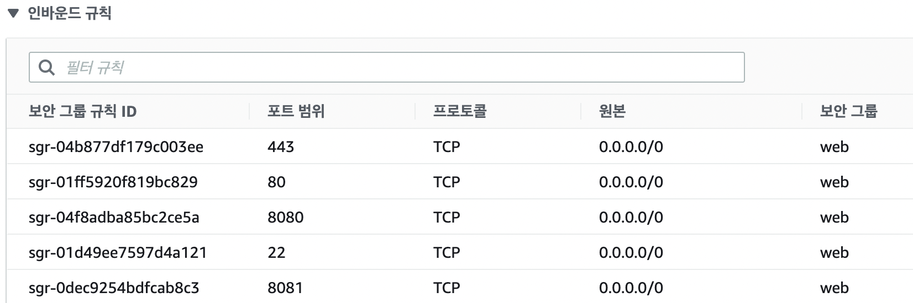
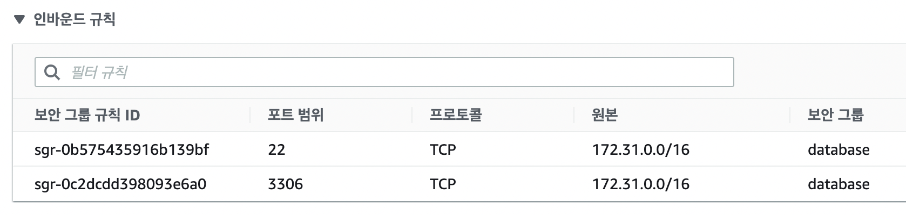
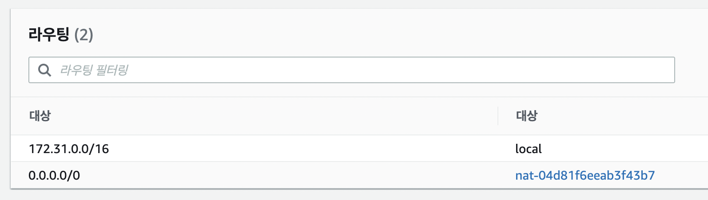
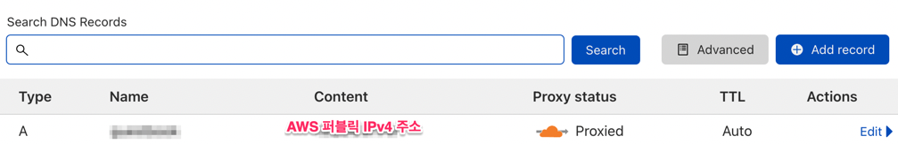
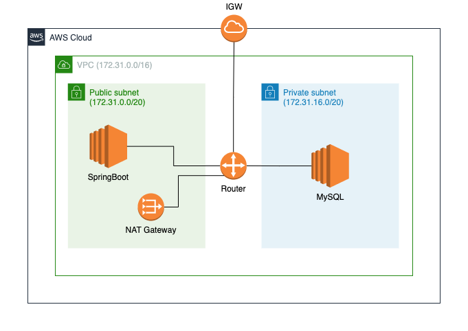

최근 우테코에서 간단히 AWS 배포 경험을 해보았을때는 보안그룹이라던지, VPC, Subnet, 라우팅테이블 등 많은 설정들이 미리 준비되어있었기 때문에 AWS 인프라 전반적으로 이해도가 낮아도 배포에 큰 어려움이 없었다. 같은 우테코 백엔드 4기 크루 수달과 함께 한번 더 배포해보며 복기해보는 과정도 어려움을 낮추는데 큰 역할을 하였다.

나는 여기서 더 나아가 좀 더 배포 인프라에 대해 깊게 경험해보고 싶은 마음이 들었다. 그래서 간단한 CRUD 기능을 가지고 있는 스프링부트 어플리케이션을 개발하고, 아무 설정도 없는 내 개인 AWS 계정을 이용하여 배포해보았다.

지금의 구조가 최적의 구조인지는 확신이 서지 않지만, 예전 같았으면 아무것도 모르고 EC2만 달랑 띄워서 배포했던 시절보다는 성장한 것 같다. 어찌되었든 이를 되돌아보고, 기록하고자 글을 쓴다.

## SpringBoot 전용 EC2 인스턴스 생성

SpringBoot 를 올릴 웹 서버 전용 EC2 인스턴스를 우선 생성하였다. 학습용이니 인스턴스 유형은 t2.micro 로 설정하였다. 프리티어 기간은 한참전에 끝났지만, 몇달전 지인에게 선물받은 AWS 100\$ 크레딧을 학습에 요긴하게 사용하고 있다.

외부에서 직접 접속하기 위한 인스턴스이므로 퍼블릭 IP를 할당하도록 설정하였다. 지금 작업중인 VPC의 IPv4 CIDR는 `172.31.0.0/16` 인데, SpringBoot 가 올라갈 EC2의 서브넷은 IPv4 CIDR가 `172.31.0.0/20` 인 기본 서브넷으로 할당하였다. 이를 이야기하는 것은 추후 MySQL 인스턴스가 할당될 프라이빗 서브넷과 구분하기 위함이다.

그리고 웹 서버 전용 보안 그룹을 web 이라는 이름으로 생성하였고, 인바운드 규칙으로는 브라우저 접속을 위해 HTTP(80), HTTPS(443) 포트를 뚫어주었다. 또한 SSH로 접속해야하므로 22번 SSH 포트도 뚫어주었고, 예비용으로 스프링 부트 기본 포트인 8080과 추가로 8081을 뚫어주었다.



> 보안 그룹이란 EC2 인스턴스의 가상 방화벽 정도로 생각하면 된다. 인바운드 규칙은 외부에서 인스턴스로 들어오는 패킷에 대해, 아웃바운드 규칙은 인스턴스 내부에서 외부로 나가는 규칙이다. Source 혹은 Target 주소와 포트에 대해 들어오고 나가는 것에 대한 필터링 정책이 바로 보안 그룹이다. 이를 이용하여 사무실 아이피 등 특정 장소에서만 인스턴스에 SSH로 접속할 수 있게 하거나, 데이터베이스 인스턴스 같은 경우 아예 외부에서는 직접 접근하지 못하도록 제한할 수 있다.

## MySQL 전용 EC2 인스턴스 생성

데이터베이스 서버를 별도로 분리하기 위해 EC2 인스턴스를 하나 더 생성하였다. 웹 서버 인스턴스와 마찬가지로 유형은 t2.micro 로 선택했다. 데이터베이스는 보안상 외부에서 직접 접근을 못하게 하기 위해 퍼블릭 IP할당을 받지 않는 설정으로 생성했다. (사실 처음에는 실수로 퍼블릭 IP 할당을 받는 옵션으로 인스턴스를 생성했다가 수정하는 방법을 몰라 그냥 인스턴스를 날리고 다시 올렸다.)

또한 이야기했듯 외부에서 직접 접근하지 못하도록 보안그룹의 인바운드 규칙을 웹 서버 인스턴스와는 다르게 설정했다. 일단 SSH 포트인 22번 포트와, MySQL 기본 포트인 3306 포트만을 허용하였다. 또한 원본(Source)도 웹서버처럼 `0.0.0.0/0` (모든 대역에 대해서 허용) 이 아니라, `172.31.0.0/16` 으로 설정하여, VPC 내부에서만 접근할 수 있도록 제한을 걸었다. 따라서 이 데이터베이스 인스턴스에 SSH로 접근하기 위해서는 미리 만들어둔 SpringBoot 인스턴스를 한번 거쳐서 접근해야한다. 무슨 인셉션 같다.



이 EC2 인스턴스는 웹 서버 인스턴스와는 다른 서브넷(`172.31.16.0/20`)에 위치시켰다. 이 서브넷은 원래는 기본 서브넷이어서 라우팅 테이블이 기본으로 생성된 IGW (Internet Gateway) 을 가리키고 있었다. 이를 Private Subnet 으로 만들기 위해 IGW를 가리키지 않는 별도의 라우팅 테이블을 만들고, `172.31.16.0/20` 서브넷에 할당했다.

> 예전에 잠깐 공부했을 때에는 대체 Public subnet 과 Private subnet 을 구분하는 기준이 무엇인지 헷갈렸는데, 어느 [인프런 질답](https://www.inflearn.com/questions/95036)을 확인해보니 서브넷의 라우팅 테이블이 IGW를 가리키고 있는지의 여부에 따라 갈린다고 한다.

> VPC에 IGW를 Attach 하면, 해당 VPC는 외부(인터넷)으로 연결될 수 있는 통로가 만들어지는 것 이라고 한다. 자세한 내용은 아직 깊게 공부하지 않았으므로, 나중에 다뤄보도록 하겠다.

그리고 웹 서버 인스턴스를 거쳐 MySQL 인스턴스로 접근하고 `apt-get` 으로 MySQL을 설치… 하려고 했는데, 이게 뭐람. 아무리 기다려도 설치가 되지 않았다. 아뿔싸. MySQL 인스턴스의 라우팅 테이블이 IGW를 가리키고 있지 않아 `apt-get` 으로 패키지를 다운로드할 수가 없던 것 이었다.

이를 해결하기 위해 NAT 게이트웨이를 생성할 필요가 있었다. NAT 게이트웨이는 프라이빗 서브넷의 인스턴스가 외부 인터넷과 연결되지 않는 점을 해결하기 위한 방법이다. NAT 게이트웨이를 사용하여 프라이빗 서브넷의 인스턴스가 아웃바운드 트래픽만을 허용한 채로 인터넷에 연결되도록 할 수 있다. 쉽게 말하면 외부에서는 접근 못하게 하면서, 내부에서는 외부로 트래픽을 보낼 수 있게 한다는 것 이다.

NAT 게이트웨이를 생성할 때 주의해야할 점은 NAT 게이트웨이를 생성할 때 서브넷을 퍼블릭 서브넷으로 설정해야한다는 점 이다. NAT이 IGW를 통해 인터넷에 연결되어야 하기 때문이다. 따라서 나는 웹 서버 인스턴스가 위치한 `172.31.0.0/20` 서브넷에 NAT 게이트웨이를 생성하였다.

그리고 프라이빗 서브넷의 라우팅 테이블을 아래와 같이 NAT을 가리키도록 설정하면 끝 이다. (퍼블릭 서브넷은 저 NAT대신 IGW가 들어가있다.)



이렇게 설정하니 정상적으로 데이터베이스 인스턴스에서 `apt-get` 으로 MySQL 설치를 완료할 수 있었다. MySQL을 외부에서 접속할 수 있도록 설정파일의 `bind-address` 를 127.0.0.1 에서 0.0.0.0 으로 바꿔주고, 방화벽 설정에서 3306 포트를 열어주는 등 자잘한 작업만 마치면 끝이다. 아, 기본적으로 root 계정은 localhost 에서만 접근가능하도록 제한되어 있으므로 별도의 MySQL 유저를 새로 생성하는 작업도 필요하다.

## 배포 스크립트 작성 및 스프링 부트 설정

```bash
sudo kill `ps -ef | grep guestbook | cut -d " " -f6 | head -1`;
git pull https://github.com/Likelion-Inha-10/fe-guest-book-api.git &&
./gradlew bootJar &&
cd ./build/libs &&
sudo nohup java -jar -Dspring.profiles.active=prod guestbook-0.0.1-SNAPSHOT.jar &
```

아직 젠킨스와 같은 CI/CD 도구를 배우지 않았으니 배포 스크립트는 위와 같이 쉘 스크립트로 간단히 작성하였다. 사실 리눅스 커맨드나 쉘 스크립트도 잘 사용하지 못했었는데, 토미의 리눅스 커맨드 강의를 듣고, 많은 것을 배웠다. 위 커맨드는 단순히 이미 떠있는 스프링 프로세스를 죽이고, git pull 로 최신 코드를 가져와 빌드 후 nohup 으로 스프링 프로세스를 백그라운드로 띄우는 커맨드이다.

> 참고로 nohup 으로 프로세스를 띄우면, 현재 SSH 세션이 끊어져도 프로세스가 죽지 않고 그대로 떠있게 된다.

그리고 `application.yml` 에서 스프링 datasource 설정도 원래는 h2로만 사용해보았는데, 아래와 같이 mysql 을 사용하기 위해 변경했다.

```bash
spring:
  datasource:
    driver-class-name: com.mysql.cj.jdbc.Driver
    url: jdbc:mysql://XXX.XXX.XXX.XXX:3306/database_name?serverTimezone=UTC&characterEncoding=UTF-8
    username: xxxx
    password: xxxx
```

물론 아래와 같이 `build.gradle` 에 의존성 추가를 해주어야 한다.

```bash
runtimeOnly 'mysql:mysql-connector-java'
```

## HTTPS 적용

찾아보니 AWS ACM 에서 SSL 인증서를 발급받고, Route 53에서 DNS를 설정해야하는 등 복잡한 방법밖에 나와있지 않았는데, 알고보니 클라우드 플레어에서 DNS 설정을 하면 간단히 HTTPS 를 적용할 수 있었다. 이 방법은 같은 우테코 4기 크루 리차드에게 배우게 되었다! 리차드 땡큐 😊

스프링 부트가 80 포트로 떠있다는 가정하에 아래와 같이 DNS 설정을 해주면 된다. 퍼블릭 IPv4 주소를 사용하려면 A 레코드를, 퍼블릭 IPv4 DNS를 사용하려면 CNAME 레코드를 설정해주면 되겠다. 이때, Proxy 설정은 켜두어야 한다.



사실 EC2 는 별도로 EIP(Elastic IP) 를 할당받지 않으면, 인스턴스를 껐다 켜게되면 새로운 아이피를 할당 받게 되어, 매번 DNS 설정을 새로 해주어야한다. 하지만 이번 학습의 주된 관심사가 아니었기 때문에 그것까지는 설정하지 않았다.

## 최종 아키텍처



최종적으로는 위와 같은 그림의 아키텍처가 완성되었다. 예전에는 이런 그림을 봐도 통 이해하지 못했는데, 이제 직접 그리기까지 할 수 있다니! 돌아보면 참 많이 성장한 것 같다. 참고로 위 다이어그램은 [draw.io](http://draw.io) 에서 AWS 관련 리소스 팩을 사용하여 쉽게 만들 수 있다. ([https://app.diagrams.net/?splash=0&libs=aws4](https://app.diagrams.net/?splash=0&libs=aws4))
