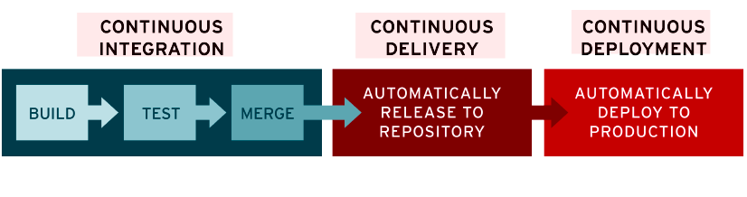

## 학습배경

드디어 우테코에서도 레벨3 프로젝트를 하며, CI/CD를 다뤄볼 기회가 생겼다. 지금까지 CI/CD 경험은 예전에 다닌 회사에서 Github Actions로 프론트엔드 코드의 빌드, 린트, 프리티어 검사와 Firebase Hosting에 자동 배포해보는 경험뿐이었다.

현재 우테코 달록팀도 간단하게 Github Actions를 통해서, 백엔드는 자바 프로젝트의 간단한 빌드 체크를, 프론트엔드는 빌드, 린트, 프리티어 체크 정도를 자동화해놓은 상태이다. 프로젝트가 진행되면서 CI/CD도 점점 고도화될텐데, 이를 위해 복습과 더 깊은 지식 학습을 위해 글을 쓴다.

## CI/CD 개요

CI/CD 는 DevOps에 속하며, 소프트웨어 개발부터 배포까지의 워크플로우를 자동화하고, 더 나은 품질의 코드를 더 자주 배포하기 위해 사용된다.

## CI (Continuous Integration)

> 한국어로는 '지속적 통합'이라고 부른다.

예전의 개발 프로세스에서는 매주 잠시 개발을 멈추고 각자 작업한 코드를 Merge하는 병합일을 정했다고 한다. 병합일에는 하루종일 각자가 개발한 코드를 합치는 일만 한다. 오죽하면 인프런 CTO 이동욱님이 SI에서 근무하던 시절에는 빌드 전문가라는 직종이 있었다고 한다.

더 옛날로 거슬러 올라가 마틴 파울러(Martin Fowler)가 영국의 큰 전자회사에서 여름 인턴십을 할 때로 가보자. 이 회사의 프로젝트는 몇년 째 개발중이고, 또한 몇 달 동안 통합되고 있었다고 한다. 이 프로젝트의 통합이 언제 끝날지는 그 누구도 몰랐다고 한다.

이런 반복적이고 골치아픈 작업을 매번 수동으로 한다면 팀의 생산성이 좋을수가 없다. 이러한 문제를 배경으로 CI가 등장한다. CI의 기본적인 컨셉은 1991년 Grady Booch를 통해 처음으로 소개되었다.

CI는 Git과 같은 형상관리 시스템 레포지토리 메인 브랜치에 버그수정, 새로운 기능에 대한 코드를 최대한 작은단위로 나누어 빠르고 자주 커밋, 머지하고 이에 대한 변경사항에 대해서 자동으로 빌드하고, 테스트하는 방법이다.

변경사항을 자주 병합하고 동시에 자동으로 테스트와 빌드과정을 거치면, 여러 개발자가 동시에 서로 다른 기능을 개발하더라도 코드 충돌을 최소화할 수 있다.

### CI에 대한 4가지 규칙

주의할 점은 CI 도구를 도입했다고 해서 CI를 하고 있다는 것은 아니다. 마틴 파울러의 블로그에서는 CI에 대해 아래와 같은 4가지 규칙을 이야기한다.

1. 모든 소스코드가 현재 실행되고, 모든 사용자가 현재 소스코드에 접근할 수 있는 단일 지점을 유지할 것
2. 누구나 단일 명령을 사용하여 빌드할 수 있도록 빌드 프로세스를 자동화할 것
3. 단일 명령으로 언제든지 테스트를 실행할 수 있도록 할 것
4. 누구나 현재 실행 파일을 얻으면 지금까지 가장 완전한 실행 파일을 얻었다는 확신을 하게 할 것

## CD (Continuous Delivery/Deployment)

> 한국어로는 '지속적 제공' 혹은 '지속적 배포' 라고 부른다.

CD는 CI와 함께 사용하며, CI과정에서 빌드와 테스팅이 완료된 코드를 사용자에게 지속적으로 배포하는 과정을 의미한다. 배포 준비, 실제 배포를 수동으로 한다면 Continuous Delivery, 이 과정을 자동화하면 Continuous Deployment라고 부른다.

## 왜 CI/CD를 사용해야하는가?

앞서 말했듯 CI/CD의 핵심은 가능한 작은 단위로 빠르고, 자주 코드를 병합하고, 사용자에게 서비스를 제공하는 것, 그리고 이 과정을 자동화하는 것에 있다. 이런 특징으로 우리는 어떤 이점을 얻을 수 있을까?

### 더 적은 버그와 오류

코드를 가능한 작은 단위로 자주 커밋하므로 버그를 조기에 발견하고, 롤백할 수 있다. 따라서 좀 더 매끄러운 개발 과정 속에서 팀 스트레스를 줄일 수 있다. 또한 이를 통해 프로덕션 코드는 기존에 비해 더 적은 오류를 가지고 있으며 고객 만족도도 증가한다.

### 가치 실현 기간 단축

CI/CD를 사용하면 자주 새로운 기능을 고객에게 더 빨리 출시하여 경쟁 우위를 확보할 수 있다. 즉 가치 실현 기간(time-to-value)를 단축할 수 있다.

### 개발자의 행복

개발자는 35% ~ 50% 가량의 시간을 테스트, 코드 디버깅등에 사용한다고 한다. 빌드, 테스트, 배포와 같이 반복되는 지루한 과정을 개발자가 직접 하지 않고, 자동화함으로써 개발자는 조금 더 핵심적이고 중요한일에 소중한 시간을 할애할 수 있다.

또한 **[The Role of Continuous Delivery in IT and Organizational Performance](https://papers.ssrn.com/sol3/papers.cfm?abstract_id=2681909)** 에 따르면, CD도입은 개발자의 번아웃을 줄여준다고 한다. CD는 반복적인 배포 과정에 대한 개발자의 피로를 줄여준다.

## CI/CD 툴

CI/CD를 적용하기 위한 많은 툴이 이미 존재한다. 가장 많이 쓰이는 도구는 Jenkins 이다. 최근에는 Github Actions도 CI/CD를 위해 많이 도입되고 있다. 그 외로는 Buildkite, GitLab CI/CD, Bitbucket Pipelines, circleci 등의 도구가 있다고 한다. 현재 개발팀의 상황에 맞는 가장 적절한 도구를 활용하면 좋을 것 같다.

## 참고

- 스프링 부트와 AWS로 혼자 구현하는 웹 서비스 - 이동욱
- [https://about.gitlab.com/topics/ci-cd/](https://about.gitlab.com/topics/ci-cd/)
- [https://www.martinfowler.com/articles/continuousIntegration.html](https://www.martinfowler.com/articles/continuousIntegration.html)
- [https://www.youtube.com/watch?v=0Emq5FypiMM&t=5s](https://www.youtube.com/watch?v=0Emq5FypiMM&t=5s)
