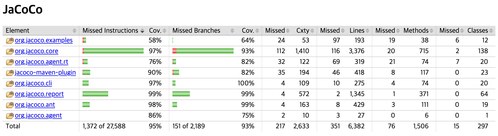

## 코드 커버리지(Code Coverage)



코드 커버리지란, 테스트 코드가 프로덕션 코드를 얼마나 실행했는지를 백분율로 나타내는 지표이다. 즉, 테스트 코드가 실제로 프로덕션 코드를 얼마나 몇 퍼센트 검증하고 있는지를 나타낸다. 코드 커버리지를 통해 현재 작성된 테스트 코드의 수가 충분한것인지 논의할 수 있다.

예를 들어 코드 커버리지 측정 기준이 실행된 함수 개수라고 하자. 프로덕션 코드에 총 100개의 함수가 있고, 테스트 코드가 그 중 50개를 실행했다면 코드 커버리지는 $50\%$가 된다.

## 코드 커버리지 측정 기준

코드의 커버리지 측정 기준은 여러가지가 있다.

### 함수(Function) 커버리지

어떤 함수가 최소 1번 이상 호출되었는지를 기준으로 커버리지를 계산한다. 함수 내부의 모든 코드가 실행되었는지는 판단 기준에서 제외된다.

```java
public void a() {
  // ...
}

public void b() {
  // ...
}

public void c() {
  // ...
}

public void d() {
  // ...
}
```

위와 같이 4개의 함수가 있고, 테스트 코드가 `a()`와 `b()`만을 실행한다면 4개중 2개의 함수를 실행하였으므로 테스트 커버리지는 $50\%$가 된다.

> $$
> 함수 커버리지 = (실행된 함수의 수 / 전체 함수의 수) * 100
> $$

### 구문(Statement) 커버리지

라인(Line) 커버리지라고도 불린다. 프로덕션 코드의 **전체 구문 중 몇 줄의 구문**이 실행되었는지를 기준으로 판단한다.

```java
public void function(int a) {
  System.out.println("1"); // A
  if (a > 10) { // B
    System.out.println("2"); // C
  }
  System.out.println("3"); // D
}
```

위 코드를 테스트할 때 `a`를 10보다 작은 값으로만 테스트한다면, A ~ D 중 C는 실행되지 않을 것이다. 구문 커버리지의 경우 **4개의 구문 중, 3개의 구문만 실행**되었으므로 커버리지는 $75\%$로 계산된다.

> $$
> 구문 커버리지 = (실행된 구문의 수 / 전체 구문의 수) * 100
> $$

### 결정(Decision) 커버리지

브랜치(Branch) 커버리지라고도 불린다. 프로덕션 코드에 조건문이 있는 경우, 조건문의 **전체 조건식**이 **True인 케이스, False인 케이스 2가지가 최소한 한번 실행**되면 충족된다. 개별 조건식의 개수와는 상관없이 최소 2개의 테스트 케이스로 충족이 가능하다.

```java
if (x >= -2 && y < 4) {
  // ...
}
```

위와 같은 코드가 있다고 가정하자. 그리고 아래와 같은 테스트 케이스 2개를 실행한다.

|                    | `x = 3` `y = 3` | `x = -3` `y = 5` |
| ------------------ | --------------- | ---------------- |
| `x >= -2 && y < 4` | True            | False            |

위와 같은 2개의 테스트케이스가 있다고 하였을 때, 전체 조건식이 True/False가 한번씩 선택 되었으므로 결정 커버리지 기준을 만족한다.

### 조건(Condition) 커버리지

조건 커버리지는 결정 커버리지와 다르게, 전체 조건식이 아니라 개별 조건식을 기준으로 판단한다. 개별 조건식이 모두 참, 거짓을 한번씩 갖도록하면 조건 커버리지 기준을 만족한다.

```java
if (x >= -2 && y < 4) {
  // ...
}
```

다시 한번 위 코드를 보자.

|           | `x = 3` `y = 5` | `x = -5` `y = 2` |
| --------- | --------------- | ---------------- |
| `x >= -2` | True            | False            |
| `y < 4`   | False           | True             |

그리고 위와 같은 테스트 케이스가 있으면, 첫번째 조건식도 모두 True/False가 선택되었고, 두번째 조건식도 모두 True/False가 한번씩 선택되었다. 따라서 조건 커버리지를 충족한다.

### 조건/결정(Condition/Decision) 커버리지

조건/결정 커버리지는 조건 커버리지와 결정 커버리지 모두를 만족할 때 충족되는 조건이다. 즉, 개별 조건과 전체 조건 모두 최소 한번식 True/False가 선택되어야 한다.

```java
if (x >= -2 && y < 4) {
  // ...
}
```

이전과 같은 코드이다. 아래의 테스트 케이스 3가지를 실행하면, 조건/결정 커버리지를 만족한다.

|                    | `x = 3` `y = 5` | `x = -5` `y = 2` | `x = 3` `y = 3` |
| ------------------ | --------------- | ---------------- | --------------- |
| `x >= -2`          | True            | False            | True            |
| `y < 4`            | False           | True             | True            |
| `x >= -2 && y < 4` | False           | False            | True            |

## 코드 커버리지, 몇 퍼센트를 목표로 해야할까?

일반적으로 80% 커버리지가 좋은 목표라고 알려져있다. 반면, 책 클린 코더에서 로버트 마틴은 테스트 커버리지 100%는 권장이 아니라 강력히 요구되는 사항이라고 한다. 즉, 코드 커버리지에는 정답은 없다.

> 얼마만큼의 코드를 자동화한 단위 테스트로 계산해야 할까? 대답할 필요조차 없다. 모조리 다 해야 한다. 모.조.리! 100% 테스트 커버리지를 권장하냐고? 권장이 아니라 강력히 요구한다. 작성한 코드는 한 줄도 빠짐없이 전부 테스트해야 한다. 군말은 필요 없다. _― 클린 코더 (로버트 마틴 저)_

### 높은 코드 커버리지의 장점

토스뱅크 서버 개발자 이응준님의 '[테스트 커버리지 100%](https://www.youtube.com/watch?v=jdlBu2vFv58)'라는 발표 영상을 봤는데, 이응준님도 위 로버트 마틴의 이야기를 듣고 코드 커버리지 100%에 도전하셨다고 한다. 그리고 실제로 100%를 달성하였고, 그 이후 코드 커버리지가 100% 아래로 떨어지면 배포가 불가능하도록 설정했다고 한다. 이응준님의 발표에 따르면 높은 코드 커버리지는 아래와 같은 이점이 존재한다.

코드 커버리지가 높으면, 이전보다 더 과감하게 코드를 리팩토링할 수 있다. 리팩토링에 문제가 있다면 테스트 코드가 알려줄 것이다. 비슷한 이유로 배포도 더 자신있게 할 수 있게된다.

또한 불필요한 프로덕션 코드가 사라진다. 높은 코드 커버리지를 유지하기 위해서는 불필요한 코드에 대한 테스트 코드도 작성해야하는데, 이럴 바에는 불필요한 코드를 즉시 지워버리는 편이 좋기 때문이다.

뿐만 아니라 높은 코드 커버리지는 프로덕션 코드의 이해도를 높여준다. 이해가 충분하지 못하면 테스트 코드를 작성할 수 없기 때문이다.

### 100% 커버리지 != Bug-free Software

하지만, 커버리지가 아무리 높다고한들 어플리케이션의 중요한 부분이 테스트되지 않고 있거나, 테스트 코드가 문제를 사전에 제대로 발견할만큼 견고하지 않다면 커버리지는 큰 의미 없는 수치이다.

개발자가 요구사항을 잘못 이해하고 테스트 코드를 작성할수도, 테스트 코드 자체를 잘못 작성했을수도, 테스트 케이스를 빠트릴수도있다.

아래와 같은 덧셈을 수행하는 `Calculator` 클래스가 있다고 하자.

```java
public class Calculator {
    public int sum(int a, int b) {
        return a + b;
    }
}
```

위 클래스를 아래와 같은 테스트 코드로 테스트한다면 테스트 커버리지는 100%를 달성할 것이다.

```java
@DisplayName("0과 0을 전달하면 0을 반환한다")
@Test
void sumTest1() {
    // given
    Calculator calculator = new Calculator();
    int a = 0;
    int b = 0;

    // when
    int actual = calculator.sum(a, b);

    // then
    assertThat(actual).isEqualTo(0);
}

@DisplayName("1과 0을 전달하면 1을 반환한다")
@Test
void sumTest2() {
    // given
    Calculator calculator = new Calculator();
    int a = 1;
    int b = 0;

    // when
    int actual = calculator.sum(a, b);

    // then
    assertThat(actual).isEqualTo(1);
}
```

하지만 위 테스트 코드는 완벽하지 않다. 누군가 `sum` 메소드의 `+` 연산자를 `-`로 변경했다고 하더라도 테스트는 여전히 통과할 것이다.

즉, 높은 커버리지가 테스트가 좋음을 보장해주지 않는다. 커버리지 100%를 달성한다고 한들, 위의 예시처럼 여전히 버그의 위험은 존재한다. 높은 커버리지는 좋지만, 맹신해서는 안된다.

## 참고

- https://www.atlassian.com/continuous-delivery/software-testing/code-coverage
- https://www.slideshare.net/daunjae/istqb-420153
- https://err0rcode7.github.io/backend/2021/05/11/%ED%85%8C%EC%8A%A4%ED%8A%B8%EC%BB%A4%EB%B2%84%EB%A6%AC%EC%A7%80.html
- https://tecoble.techcourse.co.kr/post/2020-10-24-code-coverage/
