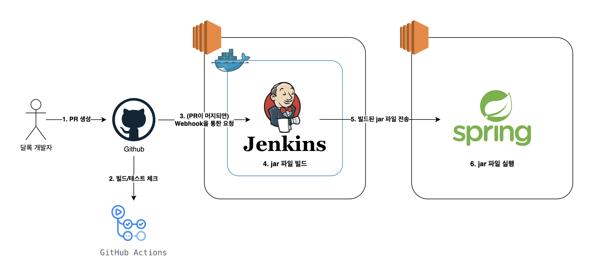
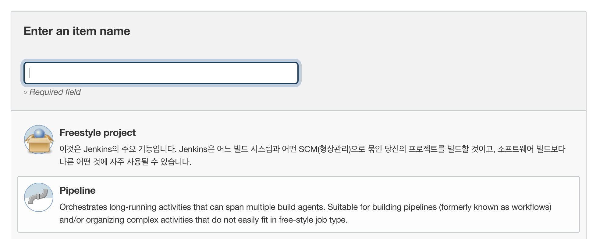

> 이 글은 우아한테크코스 4기 [달록팀의 기술 블로그](https://dallog.github.io/continuous-deploy-with-jenkins-1-backend)에 게시된 글 입니다.

안녕하세요, 달록팀 후디입니다. 지난번 포스팅에서 달록팀이 도커를 활용하여 EC2 인스턴스에 도커를 설치한 과정을 이야기 드렸었죠. 이번 포스팅에서는 젠킨스를 활용해서 백엔드와 프론트엔드에 지속적 배포 환경을 구성한 과정에 대해 이야기 드리려고 합니다.

## 달록팀 지속적 배포 환경

일단 현재 구성된 달록팀의 지속적 배포 환경을 간단한 다이어그램으로 살펴보겠습니다.



우선, 달록의 백엔드 개발자가 열심히 기능을 개발하여 Github에 PR을 생성합니다. 이때 PR 코드가 정상적으로 빌드되고, 모든 테스트를 통과하는지 **Github Actions**를 사용하여 우선적으로 검사합니다. 이때, PR 브랜치의 코드가 문제가 있다면 develop 브랜치로 병합이 불가능합니다.

> 달록팀의 브랜치 전략에 대해서는 달록팀 매트가 작성한 '[달록팀의 git 브랜치 전략을 소개합니다.](https://dallog.github.io/git-branch-strategy/)' 포스팅을 참고해주세요!

정상적으로 빌드가 되는 코드는 이후 달록 개발자들끼리 코드리뷰가 진행되고, develop 브랜치에 병합이 됩니다. 이때, Github는 달록팀이 구축한 젠킨스 서버에 **Webhook**을 통해 병합 사실을 알립니다.

Webhook이란, 특정한 애플리케이션이 다른 애플리케이션으로 **이벤트 발생 정보를 실시간으로 제공하기 위한 방법**입니다. 젠킨스는 외부에 Webhook URL을 열어두고, Github으로부터 이 Webhook URL로 요청을 받아 이벤트가 발생한 즉시 그 사실을 알 수 있습니다.

Webhook을 통해 신호를 받은 젠킨스는 미리 지정된 젠킨스 파이프라인 스크립트를 실행하여 스프링부트 어플리케이션을 빌드하여 `jar` 파일을 생성합니다.

생성한 `jar` 파일은 스프링부트 어플리케이션이 실행되고 있는 EC2 인스턴스로 전송됩니다. 그리고 스프링부트 인스턴스에서 `jar` 파일이 실행되어 배포가 완료됩니다.

## 프리스타일과 파이프라인

젠킨스에서 잡(Job)을 생성하는 방식은 크게 **프리스타일과 파이프라인** 두가지로 나뉩니다.

### 프리스타일

프리스타일은 **GUI기반**으로 젠킨스 잡을 구성할 수 있습니다. 따라서 간단한 작업에 적합하고, **복잡한 작업에는 다소 적절치 않습니다.** 또한 GUI 기반이므로 설정 과정이 다소 난잡하게 느껴질 수 있습니다.

### 파이프라인

반면 젠킨스 파이프라인은 일련의 배포 과정을 **코드로 작성**할 수 있습니다. 이 코드는 **Jenkinsfile** 라고 불리는 파일로 관리할 수 있어, Git 등을 통한 **버전관리**도 가능합니다. 또한 파이프라인을 사용하면 스테이지(Stage)라는 단위로 각 작업에 소요되는 시간, 실패여부를 **시각화**하여 확인할 수 있습니다.

달록은 프리스타일 대신 젠킨스 파이프라인을 이용하여 잡(Job)을 생성했습니다. 개발자 입장에서는 아무래도 GUI보다는 코드 기반으로 작업 과정을 작성하는 것이 편하게 느껴집니다. 또한 추후 배포 프로세스 자체를 Github 저장소에서 관리할 수 있다는 것이 큰 장점으로 다가왔습니다.

#### Scripted vs Declarative

파이프라인도 문법에 따라 크게 **Scripted Pipeline**과 **Declarative Pipeline** 두가지로 나뉩니다.

Scripted는 Groovy라는 언어로 작성되며, 변수 선언등이 지원되어 프로그래밍을 할 수 있다는 특징이 있다. 반면, Declarative는 Scripted에 비해 간단하며, Groovy를 알지 않아도 사용할 수 있다는 장점이 존재합니다. **Scripted 문법은 Declarative에 비해 유연성이나 확장성이 높지만, 복잡도와 유지보수 난이도가 더 높습니다**.

최근 CI/CD 기조는 Declarative 스타일로 많이 이동되고 있다고 합니다 ([참고](https://www.theserverside.com/answer/Declarative-vs-scripted-pipelines-Whats-the-difference)). 당장 비교적 최근에 출시된 Github Actions 도 YAML 기반의 Declarative 스타일만 사용할 수 있습니다. 따라서 달록팀은 Declarative 문법을 사용하기로 결정했습니다.

## 잡(Job) 생성 및 세팅

### 파이프라인으로 생성



젠킨스 메뉴에서 '새로운 Item'을 클릭하고, 'Pipeline'을 선택하여 새로운 잡을 생성합니다.

### Github URL 설정

**General > GitHub project > Project url** 에 저희 깃허브 저장소 주소인 **https://github.com/woowacourse-teams/2022-dallog** 를 입력합니다.

### 오래된 빌드 삭제

빌드 이력을 오래 가지고 있어봤자 큰 의미가 없을 것 같기도 하고, 아무래도 **t4g.micro** 에서 돌리다보니 용량이 넉넉치 않기도 합니다. 따라서 **General > 오래된 빌드 삭제** 옵션을 클릭하여 활성화하고, 보관할 최대 갯수를 3으로 지정했습니다.

> 나중에 빌드 이력 보관 개수가 너무 적다고 판단되면 조금 더 늘릴 생각입니다 🙂

### 빌드 트리거 설정

**Build Triggers > GitHub hook trigger for GITScm polling** 을 체크해줍니다. Github의 Webhook을 통해 빌드가 트리거되는 옵션입니다.

> 이 기능은 **GitHub plugin**에서 제공하는 기능입니다. 최초 젠킨스를 설치했을 때 Install suggested plugins 를 선택하지 않으면 이 플러그인이 설치되어있지 않을수도 있습니다.

#### Github 저장소에 Webhook 등록하기

Webhook을 사용하려면 Github 저장소의 Settings > Webhooks 에서 Webhook URL을 등록해주어야 합니다.

```
http://{서비스 IP 혹은 도메인 주소}/github-webhook/
```

위와 같이 URL을 등록해줍니다. 이때 URL의 마지막에 `/`가 들어가지 않으면 오류가 발생하니 꼭 추가합니다.

## 파이프라인 작성

이제 빌드가 트리거 되었을 때 실행될 파이프라인 스크립트를 작성할 차례입니다.

```groovy
pipeline {
   agent any
   stages {
       stage('Github') {
           steps {
               git branch: 'develop', url: 'https://github.com/woowacourse-teams/2022-dallog.git'
           }
       }
       stage('Build') {
           steps {
               dir('backend') {
                   sh "./gradlew bootJar"
               }
           }
       }
       stage('Deploy') {
           steps {
               dir('backend/build/libs') {
                   sshagent(credentials: ['key-dallog']) {
                        sh 'scp backend-0.0.1-SNAPSHOT.jar ubuntu@192.168.XXX.XXX:/home/ubuntu'
                        sh 'ssh ubuntu@192.168.XXX.XXX "sh run.sh" &'
                   }
               }
           }
       }
   }
}
```

### Github stage

Github stage에서는 사용할 깃허브의 저장소 주소와 브랜치를 설정합니다. 젠킨스는 이 스테이지에 명시된 저장소와 브랜치를 기준으로 코드를 가져옵니다.

### Build stage

`gradlew` 파일을 사용하여 빌드합니다. 이때, `dir` 지시어(Directive)를 사용하여 명령을 수행할 디렉토리를 지정할 수 있습니다.

### Deploy stage

> 이 작업을 위해서 사전에 Jenkins 관리 > Manage Credentials 에서 'SSH Username with private key' 로 AWS에서 발급 받은 PEM 키를 먼저 등록해야합니다.

달록팀은 SSH Agent 플러그인을 사용하여 배포 서버에 원격으로 접속합니다. SSH Agent 플러그인을 사용하여 파이프라인에서 젠킨스에 등록해둔 SSH 자격증명을 쉽게 사용할 수 있습니다. 플러그인을 설치하면 `sshagent` 라는 Directive를 사용할 수 있는데, 인자로 사전에 젠킨스 Credential로 등록한 PEM키의 이름을 넣어줍니다. 이렇게 만들어진 `sshagent` Directive Block 내부에서 `sh` 를 통해 `ssh` 관련 명령을 수행할 수 있습니다.

#### jar 파일 전송

SCP(Secure Copy)는 SSH 통신 기반으로 원격지에 파일이나 디렉토리를 전송할 수 있는 프로토콜입니다. 리눅스에서는 `scp` 명령을 통해 SCP 프로토콜을 사용할 수 있습니다. 달록팀은 이 `scp` 명령을 통해 스프링부트 애플리케이션이 실행되고 있는 EC2 인스턴스로 빌드된 `jar` 파일을 전송합니다.

> 여기서 IP주소가 프라이빗 IP로 적혀있습니다. 우테코에서 제공되는 EC2 인스턴스의 보안그룹 설정상 잠실 및 선릉 캠퍼스의 IP로만 SSH(22번 포트) 인바운드가 허용되어 있습니다. 따라서 퍼블릭 IP 대신 프라이빗 IP로 지정해주었습니다. 프라이빗 IP를 사용해도 두 EC2 인스턴스가 같은 VPC에 존재하므로 정상적으로 접근이 가능합니다.

#### 원격지의 쉘 스크립트 실행

스프링부트 인스턴스에는 사전에 `run.sh` 라는 이름의 쉘 스크립트가 작성되어 있습니다. 이 쉘 스크립트는 현재 실행중인 스프링부트 애플리케이션의 프로세스를 제거하고, 환경변수를 설정하고, 같은 디렉토리에 있는 `jar` 파일을 실행합니다. 스크립트는 아래와 같습니다.

```shell
#! /bin/bash

PROJECT_NAME=backend
CURRENT_PID=$(pgrep -f ${PROJECT_NAME}-.*.jar | head -n 1)

if [ -z "$CURRENT_PID" ]; then
    echo "🌈 구동중인 애플리케이션이 없으므로 종료하지 않습니다."
else
    echo "🌈 구동중인 애플리케이션을 종료했습니다. (pid : $CURRENT_PID)"
    kill -15 $CURRENT_PID
fi

echo "\n🌈 SpringBoot 환경변수 설정"

export GOOGLE_CLIENT_ID="XXXXXXXXXXXXXX"
export GOOGLE_CLIENT_SECRET="XXXXXXXXXXXXXX"
export GOOGLE_REDIRECT_URI="XXXXXXXXXXXXXX"
export GOOGLE_TOKEN_URI="XXXXXXXXXXXXXX"
export JWT_EXPIRE_LENGTH=86400000
export JWT_SECRET_KEY="XXXXXXXXXXXXXX"

echo "\n🌈 SpringBoot 애플리케이션을 실행합니다.\n"

JAR_NAME=$(ls | grep .jar | head -n 1)
sudo -E nohup java -jar /home/ubuntu/$JAR_NAME &
```

지난 포스팅인 **[쉘 스크립트와 함께하는 달록의 스프링부트 어플리케이션 배포 자동화](/deploy-automation-with-shell-script)** 에서 소개드린 쉘 스크립트에서 소스코드를 Pull 해오고 빌드하는 과정만 사라진 스크립트입니다.

이 원격지에 있는 스크립트를 `ssh` 명령을 통해 실행하게되면 배포과정이 완료됩니다.

## 트러블슈팅

### Webhook 트리거 이슈

처음 젠킨스를 설정할 때 아무리 Webhook 설정을 건드려봐도 빌드가 트리거되지 않는 이슈가 발생했었습니다.

먼저 위 파이프라인 스크립트의 Github 스테이지에서 사용된 `git` Directive를 명시적으로 사용해줘야합니다.

```
git branch: 'develop', url: 'https://github.com/woowacourse-teams/2022-dallog.git'
```

또한 최초로 '지금 빌드' 버튼을 클릭해야지 그 이후 Webhook 요청을 수신할 수 있게됩니다.

### SSH 자격 증명 이슈

```
Host key verification failed.
lost connection
```

젠킨스 서버에서 다른 인스턴스에 최초로 SSH 연결을 시도할 경우 젠킨스에서 위와 같은 에러가 발생할 수 있습니다. 다들 SSH로 최초 원격접속 시 아래와 같은 메시지를 본 적이 있을 것 입니다.

```
root@XXXXXXXX:/home# ssh -i key.pem ubuntu@192.168.XXX.XXX
The authenticity of host '192.168.XXX.XXX (192.168.XXX.XXX)' can't be established.
ECDSA key fingerprint is SHA256:XXXXXXXXXXXXXXXX
Are you sure you want to continue connecting (yes/no/[fingerprint])? yes
```

터미널에서 직접 접속할 때에는 yes 를 입력하면, 곧바로 접속될텐데요. 젠킨스 파이프라인에서는 불가능합니다. 따라서 미리 젠킨스 측의 `known_hosts` 에 원격지의 공개키를 등록해야합니다.

`keyscan` 명령을 통해서 호스트의 공개키를 수집할 수 있습니다. 이 명령을 통해서 `~/.ssh/known_hosts` 에 접속할 호스트의 공개키를 추가해야합니다.

## 마치며

이번 포스팅으로 달록팀이 젠킨스를 활용하여 스프링부트 애플리케이션의 지속적 배포 환경을 구축한 방법을 소개드렸습니다. 이어지는 다음 포스팅에서는 달록팀의 프론트엔드 배포 환경과 지속적 배포 환경 구축 방법을 소개드리려고 합니다. 읽어주셔서 감사드립니다 😄
