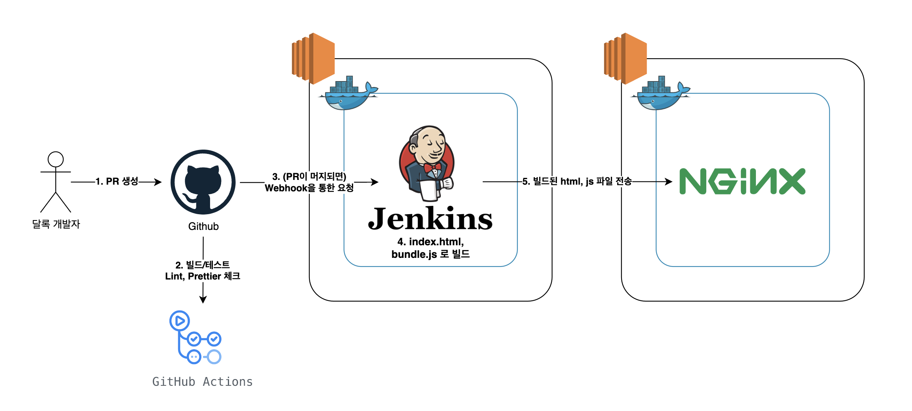

> 이 글은 우아한테크코스 4기 [달록팀의 기술 블로그](https://dallog.github.io/continuous-deploy-with-jenkins-2-frontend)에 게시된 글 입니다.

안녕하세요, 우테코 달록팀 후디입니다. 바로 [직전 포스팅](https://dallog.github.io/continuous-deploy-with-jenkins-1-backend/)으로 달록팀 백엔드의 배포 환경과 지속적 배포 환경을 구축한 방법을 소개해드렸었죠. 이번 포스팅에서는 프론트엔드의 배포 환경과 지속적 배포 환경 구성을 소개해드리려고 합니다. 바로 시작할까요?

## 프론트엔드 CD 다이어그램



프론트엔드의 지속적 배포 과정은 사실 백엔드과 크게 다른점이 없습니다. PR이 생성되고, 병합되고, 이 이벤트가 Webhook을 통해 젠킨스 서버에 전달됩니다.

젠킨스 서버는 Webpack을 이용하여 리액트 프로젝트를 빌드하고, `index.html`과 `bundle.js`를 생성합니다. 달록의 프론트엔드 EC2 인스턴스에는 **NGINX가 도커 컨테이너**로 띄워져 있는데요, 생성된 정적파일은 이 NGINX 디렉토리로 전송됩니다.

## 파이프라인 셋업

### 사전 작업

달록팀 프론트엔드 팀은 리액트를 사용합니다. 또한 달록팀은 모듈 번들러로 **웹팩(Webpack)**을 채택하여 사용하고 있습니다. 또한 웹팩을 사용하여 프로젝트를 빌드하기 위해서는 빌드 서버에 **node.js**가 설치되어있어야 합니다.

이를 위해서 달록팀은 젠킨스에 `NodeJS` 플러그인을 설치했습니다. 플러그인을 설치한 이후 사용할 node.js의 버전을 선택해야합니다. **Jenkins 관리 > Global Tool Configuration > NodeJS > NodeJS Installation** 에 들어가 사용할 node.js 버전을 선택하고 이름을 지정해줍니다.

달록팀은 개발 환경에서 node.js 16.14.0을 사용하므로 16.14.0 버전을 선택하고 이름을 `NodeJS 16.14.0`로 지정하였습니다.

### 파이프라인 스크립트

```groovy
pipeline {
   agent any
   stages {
       stage('Github') {
           steps {
               git branch: 'develop', url: 'https://github.com/woowacourse-teams/2022-dallog.git'
           }
       }
       stage('Build') {
           steps {
               dir('frontend') {
                   nodejs(nodeJSInstallationName: 'NodeJS 16.14.0') {
                        sh 'npm install && npm run build'
                    }
               }
           }
       }
       stage('Deploy') {
           steps {
               dir('frontend/dist') {
                   sshagent(credentials: ['key-dallog']) {
                        sh 'ls'
                        sh 'scp ./index.html ubuntu@192.168.XXX.XXX:/home/ubuntu/'
                        sh 'scp ./bundle.js ubuntu@192.168.XXX.XXX:/home/ubuntu/'
                        sh 'ssh ubuntu@192.168.XXX.XXX "sudo mv ./index.html ./html && sudo mv ./bundle.js ./html"'
                   }
               }
           }
       }
   }
}
```

#### Build stage

`nodejs` Directive를 사용하여 사용할 NodeJS Installation의 이름을 입력하고, 실행할 명령을 입력합니다. `npm install` 로 필요한 모듈을 설치하고, `npm run build` 명령으로 빌드합니다.

#### Deploy stage

백엔드와 마찬가지로 `sshagent` 를 사용하여 프론트엔드 배포 서버에 SSH로 접속합니다. 빌드된 두개의 파일 `index.html`과 `bundle.js` 을 전송합니다.

이후 전송된 파일을 원격지의 sudo 권한으로 `html` 디렉토리로 이동합니다. 이 `html` 디렉토리는 이후 설명하겠지만, NGINX 컨테이너 내부의 디렉토리와 마운팅된 디렉토리입니다. 배포 서버의 Docker가 sudo 권한으로 실행되고 있으므로, 파일을 해당 디렉토리로 이동시킬 때에도 sudo 권한이 필요합니다.

## 도커 및 NGINX 설정

### docker-compose

맨 위의 다이어그램과 같이 프론트엔드 배포 서버는 NGINX가 도커로 띄워져있습니다. 이를 위한 **docker-compose.yml** 내용은 아래와 같습니다.

```yaml
version: "3"
services:
  dallog-front:
    image: nginx
    volumes:
      - ./html:/usr/share/nginx/html
    ports:
      - 80:80
```

`/usr/share/nginx/html` 디렉토리는 NGINX가 서빙할 정적 파일이 위치될 디렉토리입니다. 이를 컨테이너 외부의 `./html` 디렉토리와 볼륨 마운팅 설정을 해두었습니다.

### 클라이언트 사이드 라우팅 대응

달록은 리액트 라우터를 사용하여 클라이언트 사이드 라우팅을 구현하였습니다. 따라서 이를 위해서 NGINX에 별도 설정이 필요합니다. `index.html` 로 접속하면 html 파일을 잘 찾을 수 있지만, 그 외의 라우트로 접속한다면 html 파일 자체를 찾지 못해 404 에러를 반환하기 때문입니다.

도커 내부의 `/etc/nginx/conf.d/default.conf` 파일을 열어 아래와 같이 설정을 수정합니다.

```
...

location / {
	    root   /usr/share/nginx/html;
	    index  index.html index.htm;
	    try_files $uri $uri/ /index.html;
}

...
```

알 수 없는 라우트로 접속했을 때 자동으로 `index.html` 로 Fallback 되도록 `try_files` 설정을 추가하였습니다. 파일을 수정하고 도커 컨테이너를 재시작해주면 설정이 완료됩니다.

## 트러블 슈팅

### 빌드 시 메모리 부족 문제

리액트 프로젝트를 빌드할 때 아래와 같은 메모리 이슈를 마주하게 되었습니다.

```
<--- Last few GCs --->

[21854:0x147b3960]    21931 ms: Scavenge 456.7 (469.5) -> 456.4 (470.7) MB, 3.2 / 0.0 ms  (average mu = 0.381, current mu = 0.228) allocation failure
[21854:0x147b3960]    21939 ms: Scavenge 457.4 (470.7) -> 457.2 (475.2) MB, 4.5 / 0.0 ms  (average mu = 0.381, current mu = 0.228) allocation failure


<--- JS stacktrace --->

FATAL ERROR: Reached heap limit Allocation failed - JavaScript heap out of memory
 1: 0xaf9c78 node::Abort() [webpack]
 2: 0xa21a88 node::FatalError(char const*, char const*) [webpack]
 3: 0xccdec8 v8::Utils::ReportOOMFailure(v8::internal::Isolate*, char const*, bool) [webpack]
```

**Jenkins 관리 > 시스템 설정 > Global Properties** 에서 `NODE_OPTIONS` 환경변수를 `-max-old-space-size=3072` 로 설정하여 메모리 이슈를 해결하였습니다.

## 마치며

현재 생성된 PR에 대한 코드를 검사하고 정상적으로 빌드되지 않은 PR의 병합을 막기 위해 Github Actions를 사용하고 있습니다. 가능하다면 조금 더 학습하여 이후 이런 작업까지 젠킨스에서 처리하도록 할 계획이 있습니다.

또한 현재 백엔드와 프론트엔드 모두 `develop` 이라는 하나의 브랜치에서 작업을 하다보니 백엔드, 프론트엔드 어느 한쪽의 코드만 병합되어도 백엔드, 프론트엔드 두개의 빌드 프로세스가 실행되는 이슈가 존재합니다. 이후에는 빌드 트리거를 조금 더 세분화하여 Github의 라벨을 기반으로 트리거 되도록 개선할 계획을 가지고 있습니다.

여기까지 달록팀의 젠킨스를 사용한 달록팀의 지속적 배포 환경 구축기를 읽어주셔서 감사드립니다 🙂
