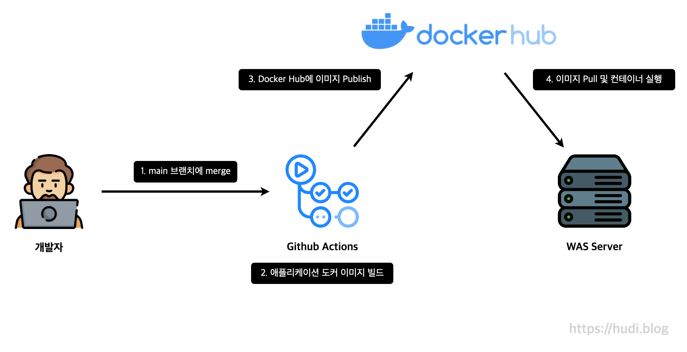

## 배경

이전 달록 프로젝트에서는 Jenkins를 사용하여 배포 자동화 파이프라인을 구축했었다. Jenkins에서 직접 jar 파일을 빌드하고, 빌드 결과물을 리눅스 `scp` 명령을 통해 배포 대상 서버로 보낸 다음 SSH로 서버에 접속하여 직접 jar파일을 실행하였다.

달록이야 WAS가 분산환경이 아니다 보니까 이와 같은 구조로 배포 자동화를 해도 큰 문제는 없었다. 다만, **일반적인 웹 서비스는 WAS를 다중화하고, 로드밸런싱을 통해 고가용성을 확보**할 것이다. 이렇게 다중화된 서버 환경에서 기존 방법대로 배포하는 것은 굉장히 비효율적일 것이다. CI/CD 서버가 현재 활성화되어 있는 모든 서버에 모두 `scp` 로 빌드 결과물을 전송해야하기 때문이다. WAS 서버가 1대라면 큰 문제 없겠지만, 서버가 100대만 되어도, **jar 파일을 전송하기 위한 통신 비용**이 크게 증가할 것이다.

또한 수평 확장된 모든 서버가 동일한 환경일 것이라는 보장이 없다. 어떤 서버는 Ubuntu이고, 다른 서버는 CentOS 일 수도, JVM 버전이 서로 상이할 수도 있다.

따라서 **컨테이너 기술**을 활용해보려한다. 컨테이너를 사용하면 **호스트 머신이 어떤 환경이던** 무관하게 **모든 서버에서 애플리케이션을 동일한 환경에서 구동**할 수 있다. 또한 애플리케이션이 구동되는 환경을 도커 이미지로 빌드한 뒤 **도커 레지스트리에 퍼블리시**할 수도 있다. WAS 서버가 해당 레지스트리에서 직접 이미지를 pull 해오면 CI/CD 서버의 부담이 굉장히 낮아질 것이다. 이렇게 도커 레지스트리에 애플리케이션 이미지를 올려놓으면, **서버를 새로 증설할 때 간단히 도커 레지스트리에서 이미지를 Pull** 해오면 되므로 유연한 Scale-Out을 할 수 있는 장점이 있다.

## 배포 과정 요약



이번 포스팅에서는 스프링부트 애플리케이션이 구동되는 환경을 이미지로 빌드한 다음 Docker Hub에 해당 이미지를 퍼블리시하는 방식으로 배포 자동화를 구현하는 내용에 대해 다룬다. CI/CD 플랫폼으로는 GitHub Actions를 사용한다.

## Dockerfile 기본 명령어

Dockerfile이란 도커 이미지를 만들기 위한 자동화된 스크립트이다. 특정 도커 이미지를 베이스로 그 이미지에 파일을 넣고, 이미지가 실행될 때 자동으로 실행될 명령 등을 설정하면 정의한 대로 이미지가 빌드된다. Dockerfile은 이 스크립트의 파일명이다.

```docker
# 주석
INSTRUCTION arg1 arg2 arg3 ...
```

위와 같이 명령어 다음에 인수 리스트가 뒤따라오는 형태로 작성한다. `#` 을 사용하여 주석을 표현할 수 있다. 간단한 명령어 몇가지를 알아보자.

### FROM

도커 이미지는 Base Image 위에 새로운 이미지를 중첩으로 쌓아 여러개의 이미지 층(layer)를 쌓는 방식으로 만들어진다. `FROM` 명령은 이 Base Image를 지정하기 위한 명령이다.

```docker
FROM <image>
```

### RUN

컨테이너에서 커맨드를 실행하기 위해 사용한다. 보통 이미지 내부에 특정 소프트웨어를 설치하는데 사용된다고 한다.

```docker
RUN echo "Hello, world!"
```

### WORKDIR

작업 디렉토리를 전환하기 위해 사용한다. `WORKDIR` 을 실행하면, 이후의 모든 `RUN`, `CMD`, `ENTRYPOINT`, `COPY`, `ADD` 명령들은 변경된 작업 디렉토리에서 실행된다. 리눅스 명령어 `cd` 와 비슷하다고 생각해도 좋다.

```docker
WORKDIR ~/project
```

### ENV

환경변수를 설정하기 위해 사용되는 명령어다. 아래와 같이 두가지 방법으로 사용할 수 있다.

```docker
ENV KEY VALUE
ENV KEY=VALUE
```

### COPY

호스트 컴퓨터의 파일을 도커 컨테이너의 파일 시스템으로 복사하기 위해 사용하는 명령어이다.

```docker
COPY <src>... <dest>
COPY ["<src>",... "<dest>"]
```

### ADD

`COPY` 와 비슷한 기능을 수행하지만, `ADD` 는 더 다양한 기능을 지원한다. 호스트의 압축 파일을 컨테이너 내부에 추출하거나 원격지의 파일을 컨테이너에 복사할 수 있다.

```docker
ADD <src>... <dest>
ADD ["<src>",... "<dest>"]
```

사용방법은 `COPY` 와 동일하다.

### ENTRYPOINT

이미지가 실행되었을 때 항상 실행되어야 하는 커맨드를 정의할 때 사용된다. 마치 컨테이너를 실행파일처럼 사용할 때 좋은 방법이다.

```docker
ENTRYPOINT ["executable", "param1", "param2"]
# exec form

ENTRYPOINT command param1 param2
# shell form
```

예를 들어 아래와 같이 스프링부트 애플리케이션을 실행하도록 할 수 있다.

```docker
ENTRYPOINT ["java", "-jar", "app.jar"]
```

### CMD

`ENTRYPOINT` 와 비슷하게, 이미지가 컨테이너로 실행되었을 때 실행되는 커맨드를 정의할 수 있다. 혹은 `ENTRYPOINT` 에 기본 파라미터를 넘겨줄 때도 사용할 수 있다. 아래와 같이 사용한다.

```docker
CMD ["executable","param1","param2"]
CMD ["param1","param2"]
CMD command param1 param2
```

`ENTRYPOINT` 와 함께 사용하는 예시는 아래와 같다.

```docker
ENTRYPOINT ["java", "-jar"]
CMD ["app.jar"]
```

기본적으로 `docker run <image>` 명령으로 `app.jar` 이 `java -jar` 명령의 파라미터로 들어간다. 단, `docker run <image> other.jar` 명령으로 컨테이너를 올리게되면, `other.jar` 가 파라미터로 대신 들어가게 된다. 즉, `ENTRYPOINT` 를 더 유연하게 사용할 수 있는 것이다.

`CMD` 는 Dockerfile에서 2번 이상 등장할 수 없다.

## Dockerfile 작성

```docker
FROM adoptopenjdk/openjdk11

COPY ./build/libs/<project>-<version>-SNAPSHOT.jar app.jar

ENTRYPOINT ["java", "-jar", "app.jar"]
```

Base Image로는 `adoptopenjdk/openjdk11` 를 사용하였다. `COPY` 명령을 활용하여, 빌드된 jar 파일을 컨테이너에 `app.jar` 이라는 이름으로 복사한다. `ENTRYPOINT` 를 사용하여 컨테이너가 올라가면 곧바로 스프링부트 애플리케이션을 구동하도록 하였다.

## GitHub Actions 워크플로우 작성

```yaml
name: Backend CD
on:
  push:
    branches: [main]

jobs:
  deploy:
    runs-on: ubuntu-latest
    steps:
      - name: 저장소 Checkout
        uses: actions/checkout@v3

      - name: 스프링부트 애플리케이션 빌드 # (1)
        run: ./gradlew build

      - name: 도커 이미지 빌드 # (2)
        run: docker build -t <docker_hub_username>/<image_name> .

      - name: Docker Hub 로그인 # (3)
        uses: docker/login-action@v2
        with:
          username: ${{ secrets.DOCKERHUB_USERNAME }}
          password: ${{ secrets.DOCKERHUB_TOKEN }}

      - name: Docker Hub 퍼블리시 # (4)
        run: docker push <docker_hub_username>/<image_name>

      - name: WAS 인스턴스 접속 및 애플리케이션 실행 # (5)
        uses: appleboy/ssh-action@v0.1.6
        with:
          host: ${{ secrets.WAS_HOST }}
          username: ${{ secrets.WAS_USERNAME }}
          password: ${{ secrets.WAS_PASSWORD }}
          port: ${{ secrets.WAS_SSH_PORT }}
          script: |
            docker stop $(docker ps -a -q) 
            docker rm $(docker ps -a -q) 
            docker pull <docker_hub_username>/<image_name>
            docker run -d -p 8080:8080 --name <container_name> <docker_hub_username>/<image_name>
```

GitHub Actions 워크플로우는 위와 같이 작성하였다. 각각을 간단하게 설명하자면 아래와 같다. 번호는 YAML의 주석을 참고하기 바란다.

1. 스프링부트 애플리케이션을 빌드한다. `build/libs` 디렉토리에 jar파일이 생성된다.
2. 현재 디렉토리에 있는 `Dockerfile` 을 사용하여 **도커 이미지를 빌드**한다. 이때 이미지 이름은 `<docker_hub_username>/<image_name>` 로 설정된다. 도커 허브에 이미지를 publish 하기 위해서는 앞에 유저이름을 꼭 붙여야 한다.
3. `docker/login-action` 이라는 Action을 사용하여 **도커 로그인**을 진행한다. `-u` , `-p` 옵션을 사용하여 인라인 명령을 사용하면, GitHub Actions에서는 보안상의 이유로 오류가 발생하므로 해당 Action을 사용하자.
4. `push` 명령을 사용하여 해당 **Docker Hub 저장소에 이미지를 publish** 한다.
5. `appleboy/ssh-action` 이라는 Action을 사용하여, **배포 대상 서버에 SSH로 접속하고 원격으로 명령을 실행**한다. 실행하는 명령은 현재 실행중인 도커 컨테이너를 모두 종료하고 제거한 다음, 새로운 버전의 이미지를 가져와 실행한다.

> GitHub 저장소의 Secrets로 `DOCKERHUB_USERNAME` , `DOCKERHUB_TOKEN` , `WAS_HOST` , `WAS_USERNAME` , `WAS_PASSOWRD` , `WAS_SSH_PORT` 를 미리 설정해두어야 정상적으로 워크플로우가 실행되니 참고하자.

> `DOCKERHUB_TOKEN` 에는 Docker Hub에서 발급해준 유저의 토큰을 넣어주어야한다. Docker Hub에 접속하여 **Account Settings → Security → Access Tokens** 에서 새로운 토큰을 생성한 값을 사용하자.

## 참고

- [https://docs.docker.com/engine/reference/builder/](https://docs.docker.com/engine/reference/builder/)
- [https://bcho.tistory.com/1356](https://bcho.tistory.com/1356)
- [https://www.daleseo.com/dockerfile/](https://www.daleseo.com/dockerfile/)
