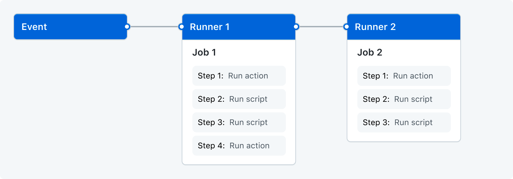

## GitHub Actions 란?

GitHub에서 제공하는 **CI/CD 플랫폼**이다. Pull Request가 생성되면 해당 코드에 대한 테스트와 빌드를 자동으로 실행하거나, Merge된 PR에 대한 배포를 자동화할 수 있다. 이런 DevOps 작업을 넘어, 단순히 Issue가 생성되었을 때 적절한 label을 등록하는 등의 단순한 워크플로우도 작성해볼 수 있다.

Jenkins, Travis CI, Circle CI 등 여러 CI/CD를 위한 제품이 많이 출시되어 있지만, GitHub Actions는 GitHub 자체에서 지원하므로 **GitHub과 함께 사용할 때 그 사용성이 매우 매끄럽다**. 또한, 물론 어느정도 제한이 있지만 컴퓨팅 리소스를 GitHub에서 제공해주며, **무료**로(public 저장소 기준) 사용할 수 있기 때문에 개인 토이 프로젝트를 진행할 때 자주 사용하고 있다. 오늘은 GitHub Actions의 개요와 문법, 간단한 사용 방법에 대해 간단히 정리하려고 한다.

## GitHub Actions 구성 요소



### 워크플로우 (workflow)

하나 이상의 작업이 실행되는 자동화 프로세스이다. 워크플로우가 언제 트리거될지 정의하는 이벤트(Event)와 워크플로우가 트리거되면 실행될 작업(Job)을 포함한다.

### 이벤트 (Event)

워크플로우에 특정한 이벤트를 정의하면, 해당 이벤트가 저장소에서 트리거되었을 때 워크플로우가 실행된다. PR 생성, 이슈 생성, 커밋 푸시 등이 이벤트에 속한다.

전체 이벤트 목록은 **[여기](https://docs.github.com/en/actions/using-workflows/events-that-trigger-workflows)**에서 확인할 수 있다.

### 작업 (Job)

워크플로우를 구성하는 실행 단위를 의미한다. 워크플로우내의 모든 작업은 기본적으로는 병렬로 실행된다. 또한, 같은 워크플로우내의 작업들은 서로 종속성이 기본적으로 존재하지 않는다. 작업은 여러개의 단계(Step)을 포함한다.

### 단계 (Step)

단계는 쉘 스크립트일수도 있고, 일반적인 커맨드일 수도 있다. 작업 내의 단계들은 순차적으로 실행되며, 각 단계는 동일한 러너(Runner)에서 실행되므로 상호 데이터를 공유할 수 있다.

### 액션 (Action)

복잡하지만 자주 사용되는 작업 단위를 재사용이 가능하도록 만든 실행 단위이다. 액션은 GitHub Marketplace에서 공유될 수 있다. 그리고 다른 사용자들이 자신의 워크플로우에 다른 사람들이 만든 액션을 가져와 사용할 수 있다.

대표적인 액션으로는 `actions/checkout` 이 있는데, 이 액션은 러너에 저장소 코드를 다운로드하고 특정 브랜치로 Checkout 하는 작업을 해준다. 거의 대부분의 CI/CD 작업에는 프로젝트의 소스코드가 필요하므로 정말 많이 사용되는 액션이라고 할 수 있다.

### 러너 (Runner)

러너는 GitHub Actions 워크플로우를 실제로 실행하는 서버를 의미한다. GitHub에서는 Ubuntu, Windows, macOS 환경의 러너를 제공한다. 그 외 OS나 특정 하드웨어 스펙에서 실행하고 싶거나, 기타 이유로 GitHub과 독립적인 환경에서 실행하고 싶을 때는 Self-Hosted Runner를 사용할 수 있다.

## 워크플로우 작성하기

한번 예제 워크플로우를 작성해보자. 모든 작업은 저장소 기준 `.github/workflows/` 디렉토리에서 진행된다. 우리는 새로운 PR이 생성되었을 때 스프링부트 프로젝트를 빌드하는 간단한 워크플로우를 작성할 것이다. 방금 이야기한 경로에 `spring-boot-build.yml` 파일을 생성한다.

```yaml
name: Backend CI # 1
on: # 2
  pull_request: # 3
    branches: [develop]
jobs: # 4
  build: # 5
    runs-on: ubuntu-latest # 6
    steps: # 7
      - uses: actions/checkout@v3 # 8
      - run: "./gradlew build" # 9
```

1. 워크플로우의 이름을 정의한다.
2. 워크플로우가 트리거될 이벤트를 정의한다.
3. `pull_request` 는 PR이 생성되었을 때 실행되게끔 해주는 이벤트이다. `branches` 프로퍼티를 사용하여 브랜치를 제한할 수 있다.
4. 작업들을 정의한다.
5. 작업의 이름이다.
6. 작업이 실행될 환경을 정의한다.
7. 작업의 단계를 정의한다.
8. 액션을 사용할 때에는 예제와 같이 `uses` 를 사용한다.
9. 단순한 커맨드를 실행한다. Gradle을 사용하여 스프링부트 프로젝트를 빌드하도록 한다.

워크플로우 작성 문법에 대한 내용은 **[여기](https://docs.github.com/en/actions/using-workflows/workflow-syntax-for-github-actions)**를 참고하면 모든 내용을 자세히 읽어볼 수 있다. 다만, 모든 내용을 한번에 학습하려고 하는 것 보다 필요할 때 찾아보는 것이 좋아보인다.

## 참고

- [https://docs.github.com/ko/actions/learn-github-actions/understanding-github-actions](https://docs.github.com/ko/actions/learn-github-actions/understanding-github-actions)
- [https://www.daleseo.com/github-actions-basics/](https://www.daleseo.com/github-actions-basics/)
