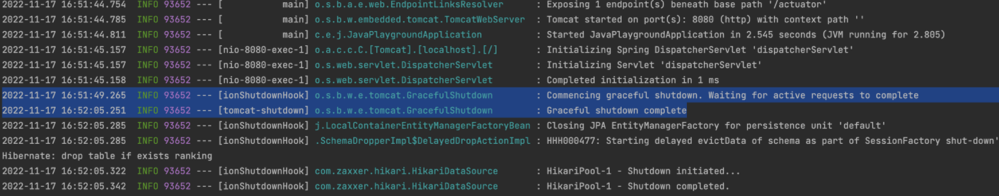
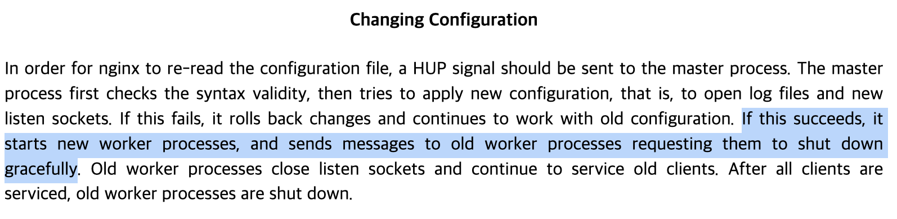

## 학습 배경

우테코 달록 프로젝트에서는 8080 포트와 8081 포트를 번갈아 사용하는 방식의 Blue/Green 무중단 배포 전략을 사용하여, 신 버전 배포시의 다운타임을 최소화하였다. 무중단 배포 프로세스를 간략히 정리하자면 아래와 같다.

1. Github 브랜치에 새로운 버전이 병합된다.
2. Github는 달록 Jenkins에 Webhook 요청을 보낸다.
3. Jenkins는 새로운 버전 코드를 pull 해오고 빌드한다.
4. 빌드한 파일을 배포 서버로 전송한다.
5. (8080 포트를 사용하고 있다는 전제하에) 8081 포트로 신 버전 애플리케이션을 구동한다.
6. 지속적으로 8081 포트로 헬스체크 한다.
7. 8081 포트의 애플리케이션이 떴다면, 리버스 프록시로 사용중인 Nginx의 프록시 설정을 변경하여 8080으로 프록시하던 설정을 8081로 변경하고 reload 한다.
8. 곧바로 8080 포트로 구동중인 애플리케이션의 프로세스를 제거한다.

그런데 위 과정에는 문제가 있다는 것을 최근에 알게되었다. 8번을 보면, **‘곧바로’ 구버전 애플리케이션을 종료**한다고 적혀있다. 이 시점에 구버전 애플리케이션으로 요청이 들어와 **처리중인 작업이 있다면** 어떤 문제가 발생할까?  배포마다 유저의 **일부 요청이 실패**하거나, 심각하면 경우에 따라 **정합성 이슈**가 발생할수도 있을 것이다.

## 우선 Kill 명령부터 개선하자

아래 코드는 달록의 무중단 배포 스크립트 일부이다. 아래 코드를 실행하여, 현재 실행중인 구버전 애플리케이션 프로세스를 종료한다. 문제는 `-9` 옵션이다. 무엇이 문제일까?

```bash
kill -9 $CURRENT_PID
```

### 유닉스의 시그널

```
1) SIGHUP       2) SIGINT       3) SIGQUIT      4) SIGILL       5) SIGTRAP
6) SIGABRT      7) SIGBUS       8) SIGFPE       9) SIGKILL      10) SIGUSR1
11) SIGSEGV     12) SIGUSR2     13) SIGPIPE     14) SIGALRM     15) SIGTERM
16) SIGSTKFLT   17) SIGCHLD     18) SIGCONT     19) SIGSTOP     20) SIGTSTP
21) SIGTTIN     22) SIGTTOU     23) SIGURG      24) SIGXCPU     25) SIGXFSZ
26) SIGVTALRM   27) SIGPROF     28) SIGWINCH    29) SIGIO       30) SIGPWR
```

유닉스는 **시그널(SIGNAL)**을 사용하여 프로세스에 인터럽트를 건다. 위는 유닉스의 시그널 목록이다. 이 중 `9 - SIGKILL`과 `15 - SIGTERM` 은 프로세스를 종료하기 위해 사용하는 시그널이다. 그럼 이 둘의 차이점은 무엇일까?

`15 - SIGTERM` 은 프로세스를 **정상 종료** 시킨다. 프로세스는 이 시그널을 무시할 수 있다. 또한, 프로세스가 현재 사용중인 리소스를 해제하고, 데이터를 저장하는 등 **안전하게 모든 작업을 완료할 때 까지 기다려**준다.

반면 `9 - SIGKILL` 은 프로세스의 의사에 상관없이 **프로세스를 강제로 종료**해버린다. 프로세스는 이 시그널을 무시하거나 차단할 수 없다. 프로세스가 사용중인 리소스를 해제하고, 데이터를 저장하는 등의 작업을 기다리지 않는다. 또한 `SIGKILL` 시그널을 받은 프로세스는 자식 프로세스를 종료하라는 시그널을 보낼 수 없다. 따라서 `SIGKILL` 은 정상적으로 프로세스를 내릴 수 없을 때 사용하는 **최후의 수단**이다.

### SIGKILL을 SIGTERM으로 바꿔야지 😨

그런데 달록은 정말 아무 생각 없이, 그저 프로세스가 더 빨리 내려간다는 이유로 `SIGKILL` 시그널을 사용하였다. 다행히 지금까지는 별 문제는 없었지만, 잠재적인 문제로 남아있던 것이었다. 빠르게 달록의 무중단 배포 스크립트에서 kill 명령 실행 시 `SIGTERM` 시그널을 사용하도록 변경해야겠다. 큰 고민없이 스크립트를 작성하게 된 점 반성하게 된다.

## Spring Boot의 Graceful Shutdown

Graceful Shutdown은 Spring Boot 2.3.0 Release 부터 제공하는 기능이다. Graceful Shutdown을 활성화 하면, 스프링부트는 프로세스 종료 요청이 들어왔을 때 **더 이상 새로운 요청을 받지 않으**면서, **처리중인 요청은 모두 처리한 뒤 프로세스를 종료**하게된다. (그런데, 당연히 `SIGKILL` 시그널에는 graceful shutdown 할 수 없다)

활성화 하는 방법은 아주 간단하다. `application.yml` 에서 아래 내용을 추가해주면 된다.

```yaml
server:
  shutdown: graceful
```

실제로 graceful shutdown 이 적용되었는지 확인하는건 간단하다. `Thread.sleep()` 을 사용해서 응답이 굉장히 느린 엔드 포인트를 만들고, 그 엔드 포인트에 요청한 뒤 프로세스를 꺼보는 것이다. 프로세스 요청 시 곧바로 프로세스가 종료되지 않고, 응답한 직후에 종료된다면 graceful shutdown이 적용된 것이다.



위와 같이 로그가 찍힌것도 확인할 수 있다.

## 설마, 배포 시 발생하는 다운타임 0.03초도?!

현재 달록의 무중단 배포 시 다운타임은 약 0.03초로 측정되고 있다. JMeter 를 사용해 배포 시점에 연속적으로 요청한 결과 한 건의 실패 요청이 발생하였고, 성공한 이전 요청과 이후 요청의 간격을 측정해보니 0.03초였다.

지금까지는 단순히 Nginx가 reload 하는데 결국에는 아주 조금의 다운타임이 존재한다고 ‘어딘가에서 들었기 때문에’ 그냥 그런가보다 하고 넘어갔다. 



그런데, nginx 의 공식문서를 살펴보면 nginx 가 구성 파일을 다시 읽어올 때 예전 프로세스가 처리하고 있던 처리를 모두 끝난 다음에야 안전하게 종료(shut down gracefully)된다고 한다. 즉, nginx의 문제가 아닐 가능성이 크다. 한번 이 부분을 체크해보고, 완벽하게 다운타임을 제거해보는 것을 시도해봐야겠다.

## 더 학습해볼 키워드/주제

- 프로세스를 종료하는 시그널은 왜 `9` 와 `15` 만 많이 사용될까?
- 트랜잭션 실행 중 애플리케이션 프로세스가 종료되면, 트랜잭션은 어떻게 처리되는가?
- 현재 달록에서 발생하고 있는 배포 시 다운타임이 Nginx의 문제인지, graceful downtime이 아니어서 발생한 문제인지 확인할 필요가 있다.

## 참고

- [https://docs.spring.io/spring-boot/docs/current/reference/html/web.html#web.graceful-shutdown](https://docs.spring.io/spring-boot/docs/current/reference/html/web.html#web.graceful-shutdown)
- [https://www.baeldung.com/spring-boot-web-server-shutdown](https://www.baeldung.com/spring-boot-web-server-shutdown)
- [https://www.lesstif.com/system-admin/unix-linux-kill-12943674.html](https://www.lesstif.com/system-admin/unix-linux-kill-12943674.html)
- [https://linuxhandbook.com/sigterm-vs-sigkill/](https://linuxhandbook.com/sigterm-vs-sigkill/)
- [https://linuxhandbook.com/kill-process/](https://linuxhandbook.com/kill-process/)