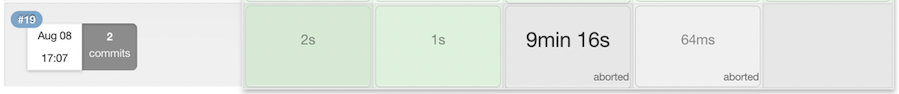
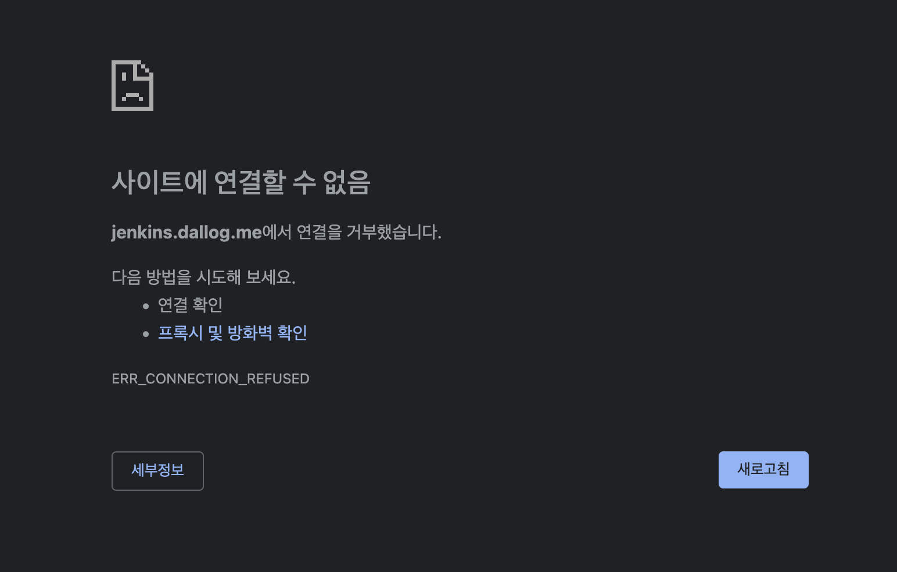
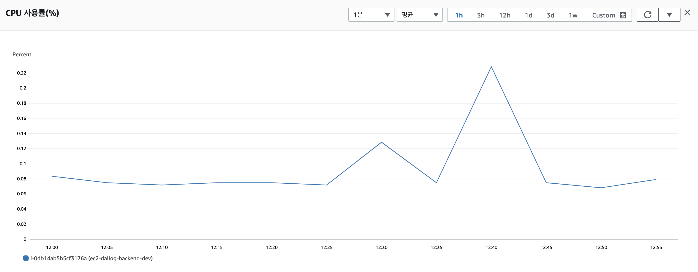
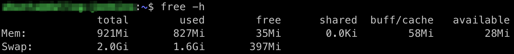
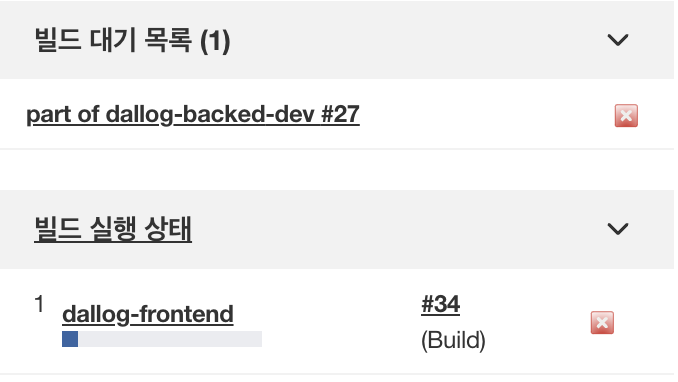
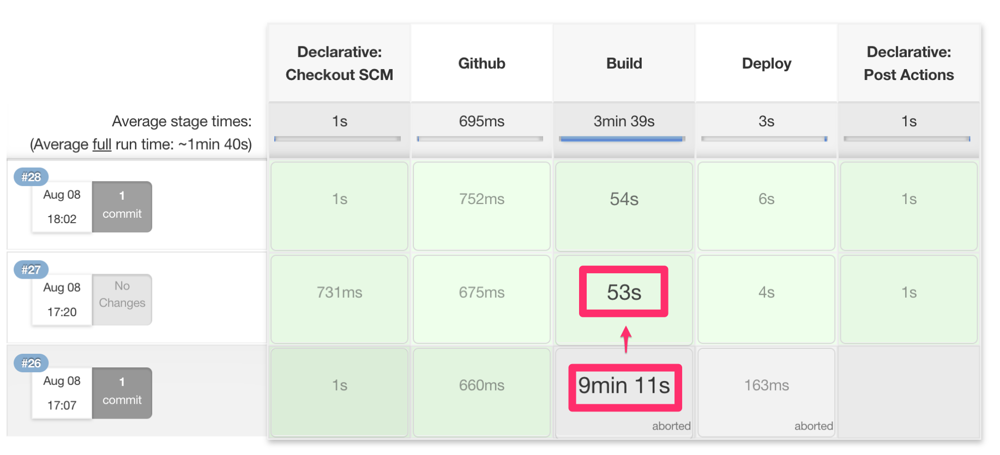

> 이 글은 우아한테크코스 4기 [달록팀의 기술 블로그](https://dallog.github.io/jenkins-build-optimization)에 게시된 글 입니다.

## 문제 상황

현재 달록팀 젠킨스 설정상 프론트엔드와 백엔드 배포를 한 인스턴스에서 진행합니다. `develop` 브랜치에 소스코드가 병합되면, 이것이 트리거가 되어 프론트엔드와 백엔드 배포 파이프라인 스크립트가 실행됩니다. 아직 별도로 분기처리는 하지 않아 프론트엔드와 백엔드 배포가 동시에 시작됩니다.

하지만, 달록팀이 젠킨스를 실행하기 위해 사용하고 있는 EC2 인스턴스는 **t4g.micro** 입니다. 이 인스턴스는 기본 제공되는 **물리 메모리(RAM)가 1GB** 가량입니다. 사실 프론트엔드와 백엔드 배포를 동시에 진행하기에는 턱없이 모자란 사양입니다.

이런 상황에서 프론트엔드와 백엔드 빌드가 각각 10분 가까이 걸리는 경우도 존재하고, 빌드 도중에 아예 서버에 간헐적으로 접속할 수 없게되는 경우도 심심치 않게 목격했습니다.

굳이, 서버가 죽지 않더라도 빌드가 트리거되고 끝나기까지는 젠킨스 웹페이지 이동도 어려울 정도로 성능 저하가 극심했습니다.

## 문제 원인 추정

일단 먼저 EC2 모니터링 탭에서 CPU 사용량을 살펴보았습니다. 예상은 했지만, CPU 사용량이 문제의 원인은 아니었습니다. 그렇다면 메모리는 어떨까요?

현재 달록 젠킨스 서버는 물리 메모리 1gb와 스왑 영역으로 확보해둔 가상 메모리 2gb, 더해서 총 **3gb의 메모리로 운용**되고 있습니다. 이 환경에서 백엔드와 프론트엔드 빌드가 동시에 시작되면 여유 메모리는 어느정도 수준까지 낮아질까요? `free` 명령을 통해 알아 보았습니다.

물리 메모리의 여유 공간이 **고작 30~40mb** 정도의 메모리만 남았습니다. 가상 메모리도 약 **400mb가량** 남아있는 상황입니다. 상황에 따라 다르겠지만, 메모리가 상당히 부족한 것을 보아 역시 메모리의 문제였던 것 같습니다.

메모리가 부족한 것이 정확히 어떤 문제를 일으키게 된건지 확실하지는 않지만 **CPU 스레싱**이 가장 큰 원인이 아닐까 추정됩니다.

### CPU 스레싱

리눅스에서 프로세스가 동작할 때 프로세스 전부를 물리 메모리에 띄우지 않고 **가상 메모리**라는 곳에 보관합니다. 젠킨스 서버도 스왑 영역을 2gb로 지정해서 이 영역만큼을 가상 메모리로 활용하고 있습니다. 스왑 영역은 하드디스크와 같은 저장장치에 위치합니다.

CPU가 작업 처리를 위해 특정 데이터를 메모리에 요청을 했는데, CPU가 원하는 데이터가 물리 메모리가 아니라 가상 메모리에 저장되어 있을 수 있습니다. 이런 상황을 **페이지 부재(page fault)**라고 합니다. 페이지 부재가 발생하면, 스왑 영역에서 물리 메모리로 데이터를 옮겨야 하는 상황, 즉 페이지를 교체해야하는 상황이 발생합니다.

알다시피 하드디스크와 같은 장비는 I/O 속도가 굉장히 느립니다. 그런데 만약 물리 메모리가 매우 한정되어 있어 페이지 부재가 자주 발생하게 되고, 이런 상황이 반복되어 **CPU가 작업을 처리하는 속도보다 페이지를 교체하는 시간이 훨씬 많이 들것**입니다. 이런 현상을 **CPU 스레싱(thrashing)**이라고 합니다.

달록의 젠킨스 서버도 스레싱 현상이 발생해서 빌드 처리 속도가 극도로 낮아진 것이 아닐까 추정됩니다.

## 문제 해결

결국 서버 스펙상 프론트엔드 빌드와 백엔드 빌드가 동시에 실행되어 메모리가 부족해지는 것이 문제라면, 둘을 동시에 실행되지 않게 만들면 손쉽게 문제를 해결할 수 있을것 입니다.

### 젠킨스 노드

젠킨스의 **노드(node)**는 파이프라인 등을 실행할 수 있는 머신을 의미합니다. 노드는 다수의 **실행기(executor)**를 갖습니다. 노드는 실행기의 수 만큼 동시에 빌드를 실행할 수 있습니다.

확인해보니 젠킨스에는 기본 노드 1개가 존재했고, 해당 노드에는 실행기가 2개로 설정되어 있었습니다. 이를 1로 변경하여 더이상 병렬적으로 백엔드, 프론트엔드 빌드가 실행되지 않도록 해줍시다.

**Jenkins 관리 > 노드 관리 > 노드 이름 > 설정 > Number of executors** 를 1로 설정해줍니다. 이제 병렬적으로 빌드가 트리거되어도 하나의 빌드만 진행되고, 나머지 빌드는 빌드 대기 목록에서 자신의 차례를 기다리게 될 것 입니다.

## 최적화 결과

빌드를 동시에 실행하지 않도록 설정하였을 뿐인데, 빌드 성능이 **10배 가까이 상승**했습니다. 아주 간단한 설정만 해주었는데 드라마틱하게 성능이 개선되다니 놀랍네요!

코드가 병합되고 나서 10분은 지나야 빌드가 완료되었다는 알림을 받았었는데, 이제 코드가 병합되고 몇 분내로 프론트엔드와 백엔드 빌드 완료 알림을 받게 되었습니다. 한번에 하나의 빌드만 실행되니 빌드중에도 젠킨스 웹페이지를 접속하는데도 큰 문제가 없게 되었습니다.

많은 삽질을 했지만 그만큼 재밌던 경험이었습니다. 이만 글 줄이겠습니다!
