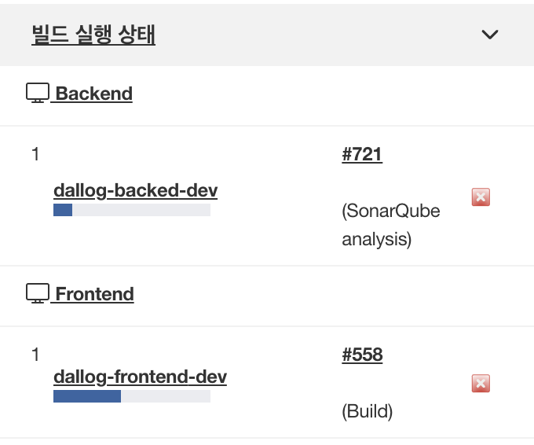

> 이 글은 우아한테크코스 4기 [달록팀의 기술 블로그](https://dallog.github.io/jenkins-distributed-build-architecture)에 게시된 글 입니다.

## ⛳️ 젠킨스 빌드 최적화를 향한 여정

달록은 지속적 배포 (continuous deploy) 도구로 젠킨스를 채택하여 사용중입니다. 젠킨스는 AWS EC2 t4g.micro 인스턴스에서 구동됩니다. 사실 이 인스턴스 사양이 그렇게 좋은 편은 아닙니다. t4g.micro는 vCPU(core) 2개, 메모리 1GiB를 제공합니다.

이 인스턴스에서 자바 스프링과 리액트 애플리케이션은 2가지를 한번에 빌드하고 있습니다. 하지만 t4g.micro는 백엔드와 프론트엔드 2가지를 한번에 빌드하기에는 부족한 사양입니다. 실제로 프로젝트 초반에는 2가지 빌드 job이 동시에 실행되다, 메모리 부족으로 인스턴스 자체가 먹통이 되어버린일이 한 두번이 아닙니다. 우분투 인스턴스에 스왑 메모리 2gb를 확보하여 이 메모리 부족 문제를 해결하려 하였으나, 물리 메모리 부족으로 인한 CPU 쓰레싱(추정)이 잦게 발생하여 인스턴스가 먹통이 되는 일은 여전히 잦았습니다.

이 시기에 참 많은 삽질을 했습니다. 그러던 중 젠킨스 노드의 executor 개수를 1로 조정하면, 한번에 하나의 job만 실행할 수 있도록 강제할 수 있다는 사실을 알아냈습니다. 실제로 Number of executors 설정을 2에서 1로 변경하니, 동시에 실행되던 백엔드, 프론트엔드 빌드 작업이 한번에 하나씩 순서대로 실행되었습니다. 다행히 t4g.micro 가 하나의 빌드 작업은 충분히 소화해낼 수 있었기에 그 이후로 큰 문제는 발생하지 않았습니다. 이 문제 해결 여정은 달록 블로그 **[젠킨스 빌드 최적화를 향한 여정](https://dallog.github.io/jenkins-build-optimization/)** 포스팅에서 깊게 다룬적이 있었습니다.

## 🧯 급한 불은 껐는데…

Number of executors 값을 1로 조정하여, 하나의 한번의 빌드 job이 실행되도록 강제함으로써 급한 불은 껐습니다. 실제로 이후 2달가량 큰 문제가 없었죠. 하지만 마음 한켠에는 찝찝함이 남아있었습니다. 제가 젠킨스 분산 빌드 아키텍처를 고민하게 된 계기는 크게 2가지 입니다.

### 첫째, 빌드 과정이 느리다

한번에 하나의 빌드만 실행되다 보니까 백엔드, 프론트엔드 전체 빌드 시간이 느렸습니다. 그렇다고, 두 빌드 작업을 동시에 실행하기에는 젠킨스에 부하가 심하게 가중됩니다. 특히, 개발 서버로 배포하는 과정이 느리다보니 개발 서버에 배포된 결과물을 확인하기까지 시간이 오래걸린다는 불편함이 있었습니다. 사실 가장 중요한 문제이죠.

### 둘째, 빌드 도중 젠킨스 웹사이트를 이용하기 어렵다

하나의 빌드 작업도 사실 t4g.micro 에게는 버거운 작업입니다. 따라서 빌드가 한번 실행되면 인스턴스의 대부분의 자원을 빌드에 사용되는데요. 따라서 빌드가 진행되고 있을 때는 젠킨스 웹사이트를 이용하기가 어려웠습니다. 젠킨스 설정이 필요하거나, 젠킨스에서 무언가 확인해야할 때에는 빌드가 되고 있지 않을때 접속해야 했습니다. 특히, 개발 서버 배포가 자주 발생하기 때문에 불편했죠.

이런 문제를 가만히 두고만 볼 수는 없었습니다. 최근에 프로젝트에 DB 레플리케이션을 도입해보며 다중화의 이점을 많이 느꼈었는데, 젠킨스에서도 다중화를 적용해보고 싶었습니다.

## ⚙️ 젠킨스 분산 빌드 아키텍처

> 기존에는 이런 분산 아키텍처에서 하위 노드를 Slave, Slave를 관리하는 상위 노드를 Master 라고 부르는 것이 일반적이었는데, 최근에는 윤리적인 문제로 대체어를 사용하는 추세입니다. 젠킨스에서는 2020년부터 **Master를 Controller**로, **Slave를 Agent**로 대체하여 부릅니다 ([참고](https://www.jenkins.io/blog/2020/06/18/terminology-update/)).

젠킨스에서는 단일 서버의 부하를 분산하기 위해서 분산 빌드 아키텍처를 사용할 수 있습니다. 이 아키텍처를 알아보기 위해 관련된 용어 몇 가지 정리해보고 넘어가죠.

- **Jenkins Controller** : Jenkins Controller는 작업의 실행 방법, 시점, 위치등을 총괄하는 젠킨스 아키텍처의 두뇌 역할을 담당합니다. 여러 설정들을 할 수 있는 GUI (웹사이트)를 제공합니다. 또한 agent 들에게 명령을 내려 빌드 작업을 실행시킵니다. agent들에 대한 관리, 작업 예약, 모니터링 등을 오케스트레이션이라고 부릅니다.
- **Agents** : 빌드 작업이 실행되는 프로세스입니다. Java가 실행될 수 있는 모든 운영체제에서 실행할 수 있습니다. 컨트롤러가 에이전트에 명령을 내리면, 에이전트가 빌드 작업을 수행합니다.
- **Nodes** : Agent가 실행되고 있는 머신입니다. AWS EC2에서 agent가 실행되고 있다면, EC2 인스턴스가 node가 되겠죠. Jenkins Controller도 node에서 실행됩니다. 이 node에서도 agent와 빌드를 실행할 수 있겠지만, 저희 달록이 겪은 문제처럼 심각한 성능 저하 혹은 확장성 감소, 보안 문제가 발생할 수 있다고 합니다.
- **Executors** : 사실상 Agent의 쓰레드입니다. Executors의 개수를 설정하여 한 node에서 동시에 실행될 수 있는 작업을 설정할 수 있습니다.

즉, 지금껏 Jenkins Controller의 내장 노드(built-in node)에서 빌드 작업을 수행해왔습니다. 그리고 이 내장 노드에서 백엔드, 프론트엔드 빌드 작업이 동시에 수행되고 있었죠. 저는 이 두 빌드 작업을 각각 다른 노드로 분산해 병렬적으로 빌드하는 구조를 목표로 잡았습니다.


이런 구조가 된다면, 병렬적으로 2개의 빌드 작업이 실행되므로 전체 빌드 및 배포 시간이 짧아질 것이고, 젠킨스 컨트롤러에 부하가 가해지지 않아 빌드중에도 원활히 젠킨스 대시보드를 사용할 수 있을 것 입니다.

## 🛠 젠킨스 분산 빌드 아키텍처 구축하기

> 과정은 AWS EC2에서 진행되었으며, 모든 인스턴스는 같은 AWS Key Chain을 공유합니다. 또한 Jenkins Controller는 이미 구축되었음을 가정합니다.

### 1. EC2 인스턴스 생성 및 JDK 설치

백엔드, 프론트엔드 빌드가 실행될 개별 EC2 인스턴스를 생성합니다. Agent가 실행되기 위해서는 인스턴스에 자바를 설치해야합니다. 아래 명령을 실행해 JDK 11 버전을 설치합니다.

```bash
$ apt update && apt install openjdk-11-jdk
```

### 2. 노드 등록

> 사진은 생략합니다.

Jenkins Controller에서 **Jenkins 관리 → 노드 관리** 메뉴에 들어갑니다. 그리고 좌측의 **신규 노드** 메뉴를 클릭합니다. 원하는 노드 이름을 입력하고, Type에서 **Permanent Agent**를 체크하고 Create를 클릭해 다음으로 넘어갑니다.

이후 노드를 설정할 수 있는 페이지로 넘어갑니다. **Name**과 **Description**을 자유롭게 작성합니다. **Number of executors** 같은 경우 노드 하나당 하나의 executor가 가장 안전한 구성이라고 하여 1개로 설정하였습니다 ([참고](https://www.jenkins.io/doc/book/managing/nodes/)). **Remote root directory**는 agent가 설치되고, workspace가 생성될 공간입니다. 저는 간단히 `/home/ubuntu` 로 설정하였습니다.

**Label**은 여러 에이전트를 논리적인 하나의 그룹으로 묶기 위해 사용됩니다. 빌드 파이프라인 스크립트에서 사용되므로 정확히 적어줍니다. 백엔드 노드는 `Backend` , 프론트엔드 노드는 `Frontend` 로 설정했습니다.

다음으로 Launch method 입니다. Jenkins가 agent를 제어하는 방법을 선택할 수 있습니다. 간략히 이 3가지 방법에 대해 정리해보겠습니다.

- **Launch agent by connecting it to the controller** : Slave에서 직접 Agent를 실행시켜, Jenkins Controller와 연결하는 방법입니다 (Slave → Controller). Jenkins Controller에서 직접 Slave에 명령하지 못하는 상황에서 사용합니다. Agent가 준비될 때 마다 Controller와 연결될 수 있도록 준비합니다. 이때 TCP 50000번 포트가 사용됩니다.
- **Launch agent via execution of command on the controller** : 첫번째 방법과 반대로 Jenkins Controller가 Slave에 명령을 보내는 방식입니다. Jenkins Controller는 SSH를 사용해 agent에 접속하며, 미리 agent에 설치된 `agent.jar` 파일을 실행합니다.
- **Launch agents via SSH** : SSH 연결을 통해 명령을 전달시켜 agent를 등록합니다. Agent 노드에 별다른 설치가 필요 없습니다.

달록의 경우 Jenkins Controller가 SSH 연결을 통해 Agent로 접근이 가능하므로, 마지막 방법인 Launch agents via SSH를 사용했습니다. Agent 노드 측에 별도의 jar 파일 다운로드가 필요 없어 편하기도 했습니다. (사실 많은 레퍼런스에서 이 방식을 사용한 이유도 큽니다 😅)

**Launch agents via SSH**를 선택하면, 아래에 설정할 수 있는 폼이 나올텐데요. 우선 Host에는 agent 노드 IP를 입력합니다. Credentials에는 기존에 등록된 pem 키에 대한 jenkins credentials를 사용하면 되는데요. 기존에 등록된 credential이 없다면, Add → Jenkins를 클릭합니다. Kind에서 SSH Username with private key를 선택하고, Username을 `ubuntu` (혹은 EC2 인스턴스의 계정명) 로 입력합니다. 이후 Entire Directly → Add 를 클릭해 pem 키 내용을 그대로 입력합니다. 마지막으로 Add를 눌러 저장합니다.

Host Key Verification Strategy는 Manually trusted key Verification Strategy를 선택합니다. 이 옵션에 대한 자세한 내용은 **[여기](https://docs.cloudbees.com/docs/cloudbees-ci-kb/latest/client-and-managed-masters/host-key-verification-for-ssh-agents)**를 클릭해 확인해주세요. 이후 최하단의 Save를 클릭하여 저장합니다.

노드의 로그를 확인해보고 아래와 같이 성공 로그가 남아있다면 노드 설정은 성공입니다.

```
SSHLauncher{host='XXX.XXX.XXX.XXX', port=22, credentialsId='XXXXX', jvmOptions='', javaPath='', prefixStartSlaveCmd='', suffixStartSlaveCmd='', launchTimeoutSeconds=60, maxNumRetries=10, retryWaitTime=15, sshHostKeyVerificationStrategy=hudson.plugins.sshslaves.verifiers.ManuallyTrustedKeyVerificationStrategy, tcpNoDelay=true, trackCredentials=true}
[10/20/22 08:45:04] [SSH] Opening SSH connection to XXX.XXX.XXX.XXX:22.
[10/20/22 08:45:04] [SSH] SSH host key matches key seen previously for this host. Connection will be allowed.
[10/20/22 08:45:04] [SSH] Authentication successful.
[10/20/22 08:45:04] [SSH] The remote user's environment is:

(생략)

Agent successfully connected and online
```

### 3. 파이프라인 설정

달록은 젠킨스 Pipeline declarative script를 사용하여 빌드 작업을 설정합니다.

```groovy
pipeline {
    agent any

    stages {
    // ...
```

기존에는 위와 같이 `agent any` 로 설정이 되어 있었습니다. 어떤 agent에서든 실행되어도 상관없다는 의미입니다. 달록은 아래와 같이 label을 설정하여, 빌드 job을 실행할 agent를 지정했습니다.

```groovy
pipeline {
    agent {
        label 'Backend'
    }

    stages {
    // ...
```

## 📈 성능 개선



이렇게 분산 빌드 아키텍처를 적용하니 위와 같이 백엔드, 프론트엔드 빌드 작업이 병렬적으로 동시에 실행되는 것을 확인할 수 있었습니다.

각각의 빌드 시간은 평균적으로 프론트엔드는 **72초**, 백엔드는 **108초**가 소요되었습니다. 이를 순차적으로 실행하게 되면 총 빌드 시간은 **180초**가 소요됩니다. 반면 병렬적으로 실행하게 되면 전체 빌드 시간은 **108초**밖에 소요되지 않습니다. 단순 계산으로는 약 **60%정도로 빌드 시간이 감소**한 것입니다. 단일 횟수로 보자면 그리 긴 시간은 아니지만, 개발 서버를 포함한다면 빌드가 굉장히 자주 발생하게 되므로 누적 단축 시간은 굉장히 클 것입니다.

### 😀 마치며

젠킨스 빌드 최적화 작업은 개인적으로 저의 숙원 사업이었습니다. 다른 더 우선순위가 높은 태스크에 밀려 단일 노드의 executors 개수를 1개로 제한한 임시 방편에 만족해하고 있었는데, 최근 조금 여유가 나서 드디어 분산 빌드 아키텍처를 적용했네요. 생각보다 어렵지 않으면서 확실한 효과를 낼 수 있었습니다.

요즘 같이 애자일하게 개발하면서, 지속적 배포를 자주하는 집단에서는 꼭 분산 빌드 아키텍처를 구축해서 시간낭비를 줄이는 것이 현명해보입니다.

## 참고

- [https://www.jenkins.io/doc/book/managing/nodes/](https://www.jenkins.io/doc/book/managing/nodes/)
- [https://www.jenkins.io/doc/book/using/using-agents/](https://www.jenkins.io/doc/book/using/using-agents/)
- [https://wiki.jenkins.io/display/JENKINS/Distributed+builds](https://wiki.jenkins.io/display/JENKINS/Distributed+builds)
- [https://www.baeldung.com/ops/jenkins-slave-node-setup](https://www.baeldung.com/ops/jenkins-slave-node-setup)
- [https://www.youtube.com/watch?v=ymNHxUZ2EOw](https://www.youtube.com/watch?v=ymNHxUZ2EOw)
