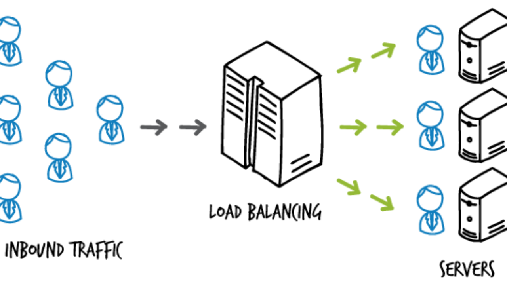

## 로드 밸런싱 (Load Balancing)



**[수직 확장(Scale up) vs 수평 확장(Scale out)](https://hudi.blog/scale-up-vs-scale-out/)** 포스트에서 이야기했듯 서비스 사용자가 늘어가면, 서버를 확장해야 한다. 경제적인 이유로 스케일 아웃을 많이 선택하게 되는데, 이런 다중 서버 환경에서 한 서버에 트래픽이 몰리지 않도록 부하를 여러 서버에 적절히 분산해주는 작업을 로드 밸런싱이라고 한다.

이번 포스트에서는 내가 클라우드 환경에서 Nginx를 이용하여 로드밸런싱 환경을 구축한 과정을 정리해본다. Nginx를 로드 밸런서로 사용하는 이유는 간단하고 저렴하기 때문이다. L4, L7 스위치 등은 하드웨어로 구성해야하며 가격이 비싸다. 반면 Nginx를 사용하면, 서버에 소프트웨어만 설치하면 되므로 시간과 비용이 절약된다.

Nginx는 리버스 프록시를 활용하여 로드 밸런싱한다. 리버스 프록시에 대한 내용은 **[포워드 프록시와 리버스 프록시
](https://hudi.blog/forward-proxy-reverse-proxy/)** 포스트를, Nginx를 활용하여 리버시 프록시 서버를 세팅하는 방법은 **[Nginx와 Let's Encrypt로 HTTPS 웹 서비스 배포하기 (feat. Certbot)](https://hudi.blog/https-with-nginx-and-lets-encrypt/)** 포스트를 참고하자.

## 스프링부트 코드

웹 서버로는 스프링부트 애플리케이션을 사용했다. 큰 기능 없이 현재 접속한 서버가 어떤 서버인지, 그리고 몇번 접속이 되어있는지 보여주는 아주 단순한 코드이다.

### CounterController

```java
@RestController
public class CounterController {

    private final Integer serverNumber;

    private CounterController(@Value("${server-number}") final int serverNumber) {
        this.serverNumber = serverNumber;
    }

    private int count = 0;

    @GetMapping
    public ResponseEntity<Map<String, Integer>> count() {
        count ++;
        Map<String, Integer> data = new HashMap<>();
        data.put("Server Number", serverNumber);
        data.put("Visiting Count", count);
        return ResponseEntity.ok(data);
    }
}
```

### application.yml

```yml
spring:
  config:
    activate:
      on-profile: server1

server-number: 1

---
spring:
  config:
    activate:
      on-profile: server2

server-number: 2

---
spring:
  config:
    activate:
      on-profile: server3

server-number: 3
```

위와 같이 `application.yml` 파일을 작성하였다. `jar` 파일 실행 시 프로파일을 입력하면, 해당 프로파일의 설정으로 애플리케이션을 시작할 수 있도록 구성하였다.

설정으로는 `server-number` 하나만 설정하였다. 이를 통해 어떤 서버에 접속했는지 식별할 수 있다.

## 배포 환경

실제 환경과 비슷하게 실습하기 위해서 로컬에서 환경을 구축하지 않고, 클라우드(Linode)에 3개의 스프링부트 애플리케이션 인스턴스와 로드밸런서로 활용하기 위한 1개의 Nginx 인스턴스를 띄웠다. OS는 Ubuntu 22.04 LTS를 선택하였다.

### 빌드 및 서버로 jar파일 전송

```shell
$ ./gradlew bootJar
```

위 명령으로 애플리케이션을 `jar` 파일로 빌드하고,

```shell
$ scp {파일명}.jar root@111.111.111.111:server.jar
```

위 명령으로 서버로 빌드된 `jar` 파일을 전송하였다.

### 특정 프로파일로 스프링부트 애플리케이션 시작하기

```shell
$ java -jar -Dspring.profiles.active=server1 {파일명}.jar
```

스프링부트 애플리케이션을 시작할 때 `-Dspring.profiles.active` 옵션과 함께 profile 명을 넣어주면, 해당 profile에 대응하는 설정으로 애플리케이션이 시작된다.

## Nginx 설정

### 로드밸런싱 설정

```nginx
upstream samplecluster {
  server 111.111.111.111:8080;
  server 222.222.222.222:8080;
  server 333.333.333.333:8080;
}

server {
  listen 80;

  location / {
    proxy_pass http://samplecluster;
  }
}
```

위와 같이 `upstream` 을 사용하여 로드 밸런싱 대상 서버를 설정할 수 있다. 이름은 `samplecluster` 로 설정하였다.

`server` 는 리버스 프록시를 설정하는 것과 비슷하게, 다만 `proxy_pass` 지시어에 `upstream` 의 이름을 넣어주어 설정한다.

### 설정 다시 불러오기

```shell
$ nginx -s reload
```

설정 파일을 변경한 뒤, 위 명령으로 Nginx의 설정 파일을 다시 로드할 수 있다.

### 접속 결과

아래의 결과와 같이 3개의 서버를 순서대로 순회하며 접속되는 것을 확인할 수 있다. 후술하겠지만, 이렇게 순서대로 서버에 트래픽을 분산하는 방식을 **라운드 로빈(Round Robin)** 방식이라고 한다.

```json
// 첫번째 접속
{
  "Visiting Count": 1,
  "Server Number": 1
}

// 두번째 접속
{
  "Visiting Count": 1,
  "Server Number": 2
}

// 세번째 접속
{
  "Visiting Count": 1,
  "Server Number": 3
}

// 네번째 접속
{
  "Visiting Count": 2,
  "Server Number": 1
}

// ...
```

## 로드 밸런싱 알고리즘 설정하기

### Round Robin

기본 설정이다. 아무 설정도 하지 않으면 기본으로 라운드 로빈 알고리즘으로 로드 밸런싱이 진행된다.

```nginx
upstream samplecluster {
  server 111.111.111.111:8080;
  server 222.222.222.222:8080;
  server 333.333.333.333:8080;
}
```

### Least Connections

연결된 횟수가 가장 적은 서버로 연결되는 알고리즘이다.

```nginx
upstream samplecluster {
  least_conn;
  server 111.111.111.111:8080;
  server 222.222.222.222:8080;
  server 333.333.333.333:8080;
}
```

### IP Hash

클라이언트 IP를 해싱하여 특정 클라이언트는 특정 서버로 연결되게 할 수 있다. Stick Session 세션 방식 처럼 동작하게 할 수 있다.

```nginx
upstream samplecluster {
  ip_hash;
  server 111.111.111.111:8080;
  server 222.222.222.222:8080;
  server 333.333.333.333:8080;
}
```

### Generic Hash

사용자가 정의한 다양한 변수를 조합해 트래픽을 분산할 수 있다.

```nginx
upstream samplecluster {
  hash $request_uri;
  server 111.111.111.111:8080;
  server 222.222.222.222:8080;
  server 333.333.333.333:8080;
}
```

### Random

트래픽을 무작위로 분배한다.

```nginx
upstream samplecluster {
  random;
  server 111.111.111.111:8080;
  server 222.222.222.222:8080;
  server 333.333.333.333:8080;
}
```

> 더 자세하고 다양한 내용은 **[Nginx 공식문서](https://docs.nginx.com/nginx/admin-guide/load-balancer/http-load-balancer/)**를 참고하자.

## server 지시어의 파라미터들

`server` 지시어에 아래와 같은 파라미터를 설정해서 디테일하게 로드 밸런싱 설정을 할 수 있다.

### weight

```nginx
upstream samplecluster {
  server 111.111.111.111:8080 weight=3;
  server 222.222.222.222:8080;
  server 333.333.333.333:8080;
}
```

`weight` 파라미터를 사용하여 특정 서버에 위와 같이 가중치를 설정할 수 있다. 가중치가 설정된 서버는 가중치의 배수만큼 트래픽을 더 많이 분배받는다. 예를 들어 위에서 `111.111.111.111` 서버는 다른 서버에 비해 3배 더 많은 요청을 받게 된다.

### max_conns

```nginx
upstream samplecluster {
  server 111.111.111.111:8080 max_conns=256;
  server 222.222.222.222:8080;
  server 333.333.333.333:8080;
}
```

`max_conns` 파라미터는 서버와의 최대 동시 연결수를 제한하는 파라미터이다.

### max_fails

```nginx
upstream samplecluster {
  server 111.111.111.111:8080 max_fails=5;
  server 222.222.222.222:8080;
  server 333.333.333.333:8080;
}
```

`max_fails` 파라미터는 서버와의 연결이 주어진 횟수만큼 실패했다면, 다른 서버로 트래픽을 보내기 위한 파라미터이다.

### fail_timeout

```nginx
upstream samplecluster {
  server 111.111.111.111:8080 fail_timeout=30;
  server 222.222.222.222:8080;
  server 333.333.333.333:8080;
}
```

`fail_timeout` 파라미터는 서버와의 연결을 전달된 시간(초)만큼 기다렸는데도 연결되지 않으면, 다른 서버로 트래픽을 보내기 위해 사용하는 파라미터이다.

### down

```nginx
upstream samplecluster {
  server 111.111.111.111:8080 down;
  server 222.222.222.222:8080;
  server 333.333.333.333:8080;
}
```

`down` 파라미터를 사용하면 특정 서버로 트래픽을 분산하지 않도록 설정할 수 있다.

> 더 자세하고 다양한 내용은 **[Nginx 공식문서](https://docs.nginx.com/nginx/admin-guide/load-balancer/http-load-balancer/)**를 참고하자.

## 참고

- https://www.theserverside.com/blog/Coffee-Talk-Java-News-Stories-and-Opinions/How-to-setup-an-Nginx-load-balancer-example
- https://docs.nginx.com/nginx/admin-guide/load-balancer/http-load-balancer/
