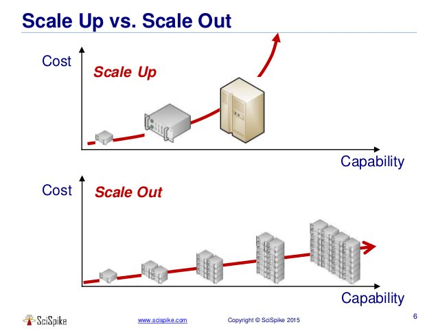

웹 서비스가 성장함에 따라 유저가 많아지게 되고, 그렇게 되면 서버 확장은 필연적일 것 이다. 이때 운영중인 서비스의 서버를 확장하는 방식은 크게 수직 확장과 수평 확장 두가지로 분류된다.

## 수직 확장 (Scale up)

**단일 서버의 스펙을 단순히 더 좋은 것으로 업그레이드 하는 것**이 수직 확장이다. 예를 들어 32gb 였던 서버 메모리를 64gb로 늘리거나, CPU를 더 좋은 제품으로 교체하는 작업을 말할 수 있을 것 이다. 수직 확장은 확장 과정이 비교적 간단하다는 장점이 존재한다. 단 하나의 서버만을 관리하면 되므로 여러 서버를 클러스터링하고, 데이터 일관성을 유지하기 위한 비용이 발생하지 않는다.

하지만 인간이 지금까지 만들어낸 단일 컴퓨팅 파워에는 한계가 존재한다. 즉, 수직 확장은 확장의 한계가 분명히 존재한다. 또한 요구되는 스펙 수준이 높아질수록 더 많은 비용을 지불해야 한다. 자잘하게는 CPU 등을 업그레이드 할 때 메인보드와의 호환성을 체크하는 등 특정 제조사의 제품만을 사용해야하는 문제도 존재한다.

그리고 서버의 스펙을 업그레이드 할 때 발생하는 다운타임(시스템을 이용할 수 없는 시간)을 피할 수 없다.

중요한 것은 단일 서버로 서비스를 운영하기 때문에 하나의 서버로 부하가 집중된다는 문제점이다. 수직 확장의 방식에서는 서비스가 하나의 서버로 운영되기 때문에 곧 **단일 장애점(Single Point of Failure, SPOF)** 을 갖는다. 단일 장애점이란 시스템에서 문제가 발생하면 모든 시스템을 사용할 수 없는 구성요소를 의미한다. 즉, 장애에 치명적이다.

따라서 일반적으로 수직 확장은 데이터 일관성, 무결성이 중요한 데이터베이스 서버에 적합한 방식이다.

## 수평 확장 (Scale out)

운영중인 서버의 부품을 더 좋은 것으로 바꾸는 대신, **여러대의 서버를 추가로 설치**하는 방식을 수평 확장 이라고 한다. 즉, 하나의 서버가 처리하는 일을 여러대의 서버가 처리하도록 만드는 것 이다.

수평 확장은 수직 확장과 다르게 여러 서버를 한 서버처럼 사용하기 위한 **클러스터링 작업에 추가 비용이 발생**한다. 예를 들어 로드 밸런서등이 있다. 따라서 **기술적으로나 관리적으로나 수직 확장에 비해 까다롭고, 어렵다.** 또한 여러대의 서버들은 일반적으로 네트워크를 통해 연결되므로, 네트워크 상황에 따라 확장을 하더라도 원하는 성능을 얻지 못 할수도 있다.

하지만, 단일 장애점을 갖지 않으므로 장애에 치명적이지 않다. 또한 **이론적으로 확장에 제한이 없어 무한대로 확장**할 수 있다.

특히, 오늘날의 서비스들은 일반적으로 사용자수를 예측하기 힘들다. 또한 이벤트 페이지 등 특정 기간, 특정 시간대에만 유저 수요가 급격히 증가할 수도 있다. 이런 특성으로 대부분의 웹(앱) 서비스의 서버는 수평 확장을 사용한다.

유저의 수요가 급증할 때 서버를 여러대 확보하고, 유저 수요가 안정화된 이후에 서버 수를 줄이면 되기 때문이다. 일반적으로 서버 스펙을 다시 낮게 변경하는게 어려운 수직 확장 방식에서는 불가능한 방법일 것 이다. 즉, **수평 확장은 수직 확장 대비 좀 더 유연하다.**
