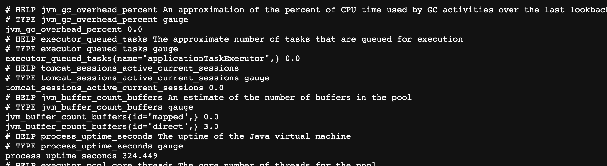

이 포스팅에서는 Spring Actuator, Prometheus, Grafana를 사용하여 스프링부트 애플리케이션과 관련된 여러 메트릭을 수집하고, 시각화하여 모니터링할 수 있는 환경을 구축한다. 이 글에서는 각각의 컨셉과 환경 구성 방법을 전체적으로 다룬다. 각각에 대한 자세한 내용은 추후 학습하여 포스팅 해보도록 하겠다.


전체 구조는 위와 같다. Spring Boot Actuator를 사용하여 Prometheus에서 사용할 **메트릭 정보를 외부에 노출**한다. 그 정보를 Prometheus가 주기적으로 pull 하는 방식으로 **메트릭을 수집**한다. Prometheus에서 수집된 메트릭은 Grafana가 가져가 **시각화**를 한다. 더 자세히 알아보자.

## Spring Boot Actuator

Spring Boot Actuator는 스프링부트의 서브 프로젝트이다. 스프링부트 애플리케이션에서 Spring Boot Actuator를 활성화하면, 애플리케이션을 **모니터링하고 관리**할 수 있는 엔드포인트에 접속이 가능해진다.

### 의존성 추가

```groovy
implementation 'org.springframework.boot:spring-boot-starter-actuator'
runtimeOnly 'io.micrometer:micrometer-registry-prometheus'
```

Gradle 기준으로 의존성을 아래와 같이 추가하면, Actuator를 활성화할 수 있다. 참고로, Spring Boot 2부터 메트릭 수집에 **Micrometer** 라는 라이브러리가 사용된다. 특히, Prometheus에서 사용되는 메트릭을 수집할 때에는 `micrometer-registry-prometheus` 라는 의존성이 요구된다. 따라서 해당 의존성도 추가하였다.

### Prometheus를 위한 엔드포인트 노출


Spring Boot Actuator가 기본으로 제공하는 엔드포인트 목록

의존성을 추가하고 애플리케이션을 실행한 다음, `localhost:8080/actuator` 에 접속해보자. 위와 같이 Actuator가 현재 제공하고 있는 엔드포인트들을 확인할 수 있다. 예를 들어 `/actuator/health` 에 접속하면, `{ "status": "UP" }` 으로 응답이 온다. 헬스 체크를 할 때 사용할 수 있는 엔드포인트이다.

우리는 이 엔드포인트 중 **Prometheus에서 사용되는 메트릭에 대한 엔드포인트를 노출**시켜야한다. 아래와 같이 **application.yml 파일**에 설정을 추가하자.

```yaml
management:
  endpoints:
    web:
      exposure:
        include: prometheus
```

`include` 에 노출할 엔드포인트 이름을 쉼표로 구분하여 기입하면 된다. 반대로 노출하고 싶지 않다면, `exclude` 에 기입하면 된다. 일단 우리는 Prometheus에서 사용할 엔드포인트만 노출하는 것이 목적이므로 위와 같이 설정한다.

> Spring Actuator가 제공하는 다양한 엔드포인트는 [https://docs.spring.io/spring-boot/docs/current/reference/html/actuator.html#actuator.endpoints](https://docs.spring.io/spring-boot/docs/current/reference/html/actuator.html#actuator.endpoints) 에서 더 알아보자.


설정을 저장하고 애플리케이션을 재시작하면, 위와 같이 `prometheus` 라는 엔드포인트가 노출된 것을 확인할 수 있다. 한번 접속해보자.



위와 같이 Prometheus에서 수집해갈 메트릭 정보를 응답받았다. Prometheus는 이 엔드포인트에 접속하여, 주기적으로 메트릭 정보를 수집해간다. 이제 Actuator 설정은 모두 끝났다. Prometheus를 설정하러 가보자.

### 트러블 슈팅 - Springfox와의 충돌

> 이 부분은 Swagger를 사용하기 위해 Springfox 의존성을 프로젝트에 포함시킨 경우에만 읽으면 된다.

필자는 Spring Boot Actuator를 설정하기 전에, 프로젝트에서 Springfox를 사용하여 Swagger 문서를 만들었다. 그런데, **Spring Boot Actuator와 Springfox는 서로 충돌**이 발생한다. 이는 Springfox 저장소 **[#3462 이슈](https://github.com/springfox/springfox/issues/3462)** 에서도 확인할 수 있다. **[Stackoverflow 답변](https://stackoverflow.com/questions/70695150/how-to-befriend-spring-boot-2-6-x-with-actuator-dependency-and-swagger-starter-3)** 에 나와있는 것 처럼 문제를 해결할 수 있다.

하지만 나는 위 방법대로 해결하지 않고, Springfox를 **Springdoc으로 마이그레이션**하여 문제를 해결하였다. Springdoc은 Springfox와 동일하게 Swagger를 통해 API Document를 만들어주는 라이브러리이다. **Springdoc은 Springfox 보다 최신 프로젝트이며, 더 잘 유지보수되고 있으며, 레거시 코드가 적다.** 또한 **Spring Boot Actuator와의 충돌도 발생하지 않는다**. 따라서 필자는 Springfox를 그대로 사용하는 대신, Springdoc으로 마이그레이션 하였다.

## Prometheus

Prometheus는 SoundCloud 사에서 개발한 오픈소스이다. Prometheus는 **메트릭을 수집하고 저장**하며, 이를 통해 **모니터링** 하거나 **경고(alert)**할 수 있게 도와준다.

**메트릭(metric)**이란, 간단하게 말하자면 **숫자 데이터**이다. 메트릭의 예로는 요청 시간, 데이터베이스 활성 연결 수, CPU 사용량 등이 있다. 그리고 Prometheus는 이 메트릭을 **HTTP를 통한 pull model**을 통해 주기적으로 수집하여 **시계열(time series) 데이터로 저장**한다. 따라서, 숫자로 구성된 시계열 데이터를 수집하고 모니터링 하는데 적합하다.

> 일반적인 다른 모니터링 도구는 서버에 클라이언트를 설치하고 클라이언트가 메트릭 데이터를 수집해서 서버로 보내는 방식으로 동작하는데, Prometheus는 반대로 직접 주기적으로 Pull 해오는 방식으로 동작한다.

### 설치

소개는 이쯤하고, Prometheus를 서버에 직접 설치해보자. 본 포스팅에서는 **도커**를 사용하여 설치해볼 것이다. 서버에 도커가 설치되어 있다고 가정하고 진행한다.

#### Configuration

Prometheus는 YAML 파일로 설정을 작성한다. `prometheus.yml` 라는 이름으로 파일을 생성하고 아래와 같이 내용을 채워넣자.

```yaml
global:
  scrape_interval: 15s

scrape_configs:
  - job_name: prometheus
    static_configs:
      - targets: ['<springboot-app-host>:<springboot-app-port>']
		metric_path: '/actuator/prometheus'
```

- `global.scrape_interval` : 메트릭을 수집할 주기를 설정한다. 15초로 설정해두었다.
- `scrape_configs.static_configs.targets` : 메트릭을 수집할 호스트 정보를 명시한다. 만약 스프링부트 애플리케이션이 `localhost:8080` 에서 돌아가고 있다면, 그것을 적어주면 된다.
- `scrape_configs.static_configs.metric_path` : 메트릭 정보의 경로를 명시한다. Actuator를 사용하였으므로, 위와 같이 작성한다.

> 더 자세한 설정 작성 방법은 [https://prometheus.io/docs/prometheus/latest/configuration/configuration/](https://prometheus.io/docs/prometheus/latest/configuration/configuration/) 를 참고하자.

#### 도커 컨테이너 실행

```bash
docker run \
    -d \
    -p 9090:9090 \
    -v <prometheus.yml 경로>:/etc/prometheus/prometheus.yml \
    prom/prometheus
```

위 명령을 통해 도커 컨테이너를 실행한다. 해당 서버의 9090번 포트로 접속해보자.


위와 같이 Prometheus 대시보드가 표시될 것이다. 검색바에 메트릭 정보를 입력해서 조회할 수 있다. Graph 탭에서는 간단하게 그래프로 시각화된 시계열 데이터를 조회할 수 있다.

Prometheus 설정은 이것으로 끝났다. 이제 주기적으로 수집된 메트릭 데이터를 Grafana를 통해 시각화하자.

## Grafana


Grafana는 오픈소스 데이터 시각화 및 메트릭 분석 도구이다. Prometheus도 기본적으로 시각화를 제공하지만, 위 사진처럼 Grafana는 정말 강력한 시각화를 제공한다. 여러 Data Source를 불러와 시각화 할 수 있는데, 그 중 Prometheus도 지원한다.

### 설치

마찬가지로 Grafana도 도커로 설치한다.

```bash
docker run --name grafana -d -p 80:3000 grafana/grafana
```

위 명령을 통해 Grafana 도커 컨테이너를 실행하면, 외부에서 80포트로 접속이 가능하다.

### 설정


Grafana에 접속하면, 위와 같은 로그인 페이지에 접속된다. 초기 유저 네임과 비밀번호는 **admin/admin** 이다. 로그인하면, 새로운 패스워드를 설정할 수 있다.


이어서 Grafana 대시보드에 접속되면, 위 사진과 같이 좌측 하단의 톱니바퀴 아이콘에 마우스를 올리고 Data sources를 클릭한다. 이후 페이지에서 Add data source 클릭하고, 다음 페이지에서 Prometheus을 선택한다.


이후 페이지에서 URL에 Prometheus URL을 입력하고, 하단의 **‘Save & test’** 를 클릭하여 저장한다. 초록색 체크 아이콘과 함께 **‘Data source is working’** 이라는 문구가 표시되면 성공이다.


이제 대시보드를 설정할 차례이다. 대시보드는 우리가 직접 구성할수도 있지만, 잘 설정된 프리셋을 사용하면 더 좋다. 우리는 **[‘JVM (Micrometer)’](https://grafana.com/grafana/dashboards/4701-jvm-micrometer/)** 라는 대시보드를 사용할 것이다. 위 사진과 같이 Import 를 클릭한다.


다음 페이지에서 ‘Import via grafana.com’ 에 **‘https://grafana.com/grafana/dashboards/4701-jvm-micrometer/’** 를 입력하고 **‘Load’** 를 클릭한다.


다음 페이지에서 ‘Prometheus’ 에서 **우리가 방금 추가한 Prometheus** Data Source 를 선택하고, ‘Import’ 를 클릭한다.


위 사진과 같이 멋진 대시보드가 만들어진 것을 확인할 수 있다. Grafana의 더 자세한 내용은 **[Grafana 공식 튜토리얼](https://grafana.com/tutorials/)**을 참고하자.

## 참고

- https://meetup.toast.com/posts/237
- https://blog.outsider.ne.kr/1254
- https://bcho.tistory.com/1372
- https://docs.spring.io/spring-boot/docs/current/reference/html/actuator.html#actuator.endpoints
- https://prometheus.io/docs/introduction/overview/
- https://covenant.tistory.com/244
- https://jongmin92.github.io/2019/12/04/Spring/prometheus/
