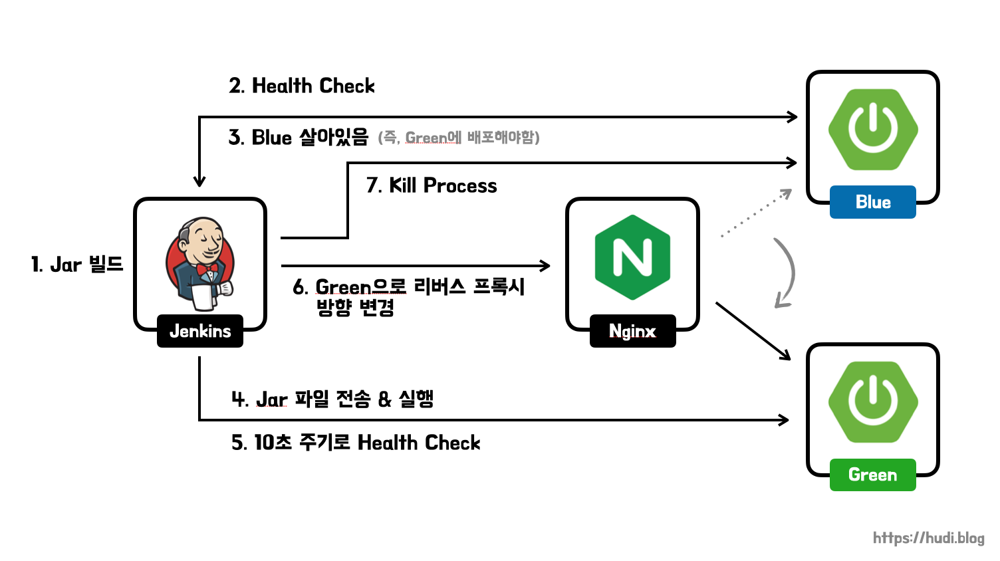
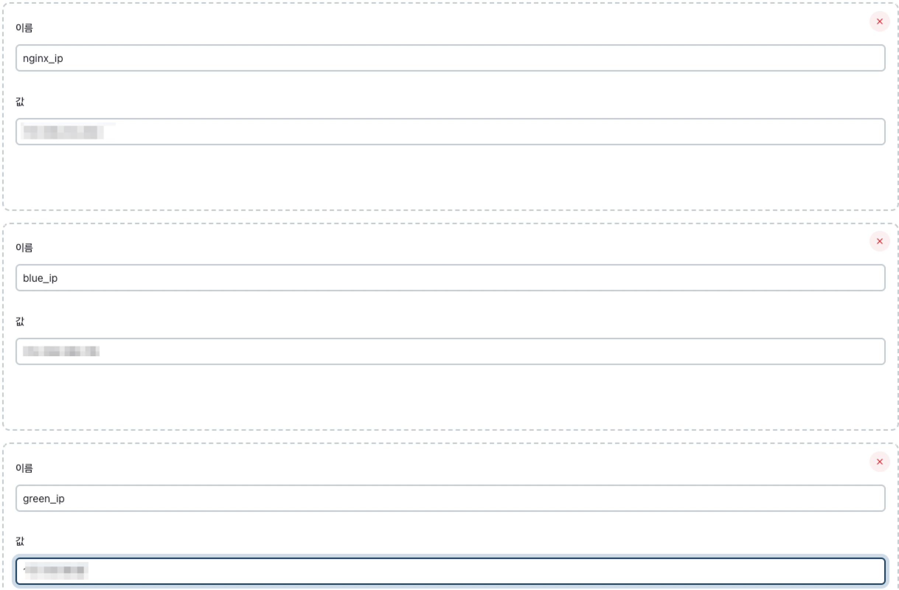

## 무중단 배포가 왜 필요할까?

카카오톡 서버가 새로운 버전이 배포될 때 마다 카톡을 일시적으로 사용할 수 없다면 누가 카카오톡을 사용할까? 더군다나 지금처럼 애자일하게 자주 배포하는 환경에서는 더더욱 중단이 잦을 것이다. **간헐적인 서비스의 일시적 중단**은 **유저 이탈**로 이어지고, 유저 이탈은 곧 **회사의 손실**로 이어진다.

우리는 24시간 중단 없이 서비스를 운영할 수 있는 환경을 구축해야한다. 이렇게 일시적으로 사용자가 일시적으로 서비스를 이용할 수 없는 시간을 **downtime**이라고 하고, downtime 없이 배포하는 전략을 **zero-downtime deployment 즉, 무중단 배포**라고 부른다.

## 어떤 전략을 사용할까?

Rolling 배포 전략 같은 경우 EC2 인스턴스 개수가 제한된 환경에서 사용하기 좋은 전략이다. 다만, 배포가 되고 있는 시점에는 유저의 트래픽이 구버전과 신버전으로 동시에 향하게 되므로 **정합성 이슈**가 발생할 수 있다.

다행히도 우아한테크코스에서는 AWS 인스턴스 개수 제한이 없어 넉넉히 인스턴스를 생성하여 활용할 수 있다. 따라서 **정합성 이슈가 발생하지 않도록 Blue/Green 배포 전략**을 사용해볼까한다. 사실 실무에서는 AWS CodeDeploy를 통해 간단히 Blue/Green 환경을 구축하면 된다. 하지만 우테코에서는 사용할 수 없으므로 Nginx를 사용해서 간단히 Blue/Green을 모방해보려한다.

> 배포 전략의 이론적인 내용은 **[무중단 배포 아키텍처와 배포 전략 (Rolling, Blue/Green, Canary)](https://hudi.blog/zero-downtime-deployment/)** 포스팅을 참고하기 바란다.

## 배포할 애플리케이션 코드

### Application.java

```java
@SpringBootApplication
public class Application {

    public static void main(String[] args) throws Exception {
        System.out.println("서버 기동 중");
        Thread.sleep(10000);

        SpringApplication.run(Application.class, args);
    }
}
```

의도적으로 긴 downtime을 위해서 애플리케이션이 기동되고, 10초가 지나야 스프링부트 애플리케이션이 run 되도록 설정하였다. 무중단 배포를 적용하지 않는다면, 새로운 버전을 배포할 때 마다 최소 10초의 downtime이 발생할 것이다.

### MainController.java

```java
@RestController
public class MainController {

    @GetMapping("/")
    public String showVersion() {
        return "V1";
    }
}
```

단순히 `/` 로 접속하면, 현재 배포된 버전을 표시해준다. 서비스가 중단되지 않고, 자연스럽게 버전업이 되는지 확인하기 위함이다.

## Blue/Green 배포 구조



우선 실습에는 위와 같이 **Jenkins, Nginx, SpringBoot (Blue), SpringBoot (Green) 이렇게 4개의 인스턴스**를 사용한다. 사실 실제 실무의 Blue/Green 배포 환경에서는 애플리케이션 서버 인스턴스가 훨씬 많겠지만, 실습이니 간단히 Blue 1대, Green 1대로 구성했다.

내가 구성한 Blue/Green 배포 흐름은 아래와 같다.

1. 새로운 버전이 Git에 병합되면, **Github Webhook**을 통해 Jenkins에 신호가 들어오고, 젠킨스는 **최신 버전의 Jar 파일을 빌드**한다.
2. 젠킨스는 **Blue에 Health check**를 한다. Blue가 살아있다면 신버전을 Green에 배포하면 되고, 살아있지 않다면 Blue에 배포하면 된다.
3. 그림상 Blue가 살아있는 것으로 판단된다. 따라서 젠킨스는 Green에 배포를 할 것이다.
4. 젠킨스는 **Green에 맨 처음 빌드해둔 Jar 파일을 전송**하고, 원격지에서 **실행**한다.
5. Green의 애플리케이션이 구동되었는지 **10초 주기로 Health Check**를 한다. Green 애플리케이션이 기동됨을 확인하면 (6)으로 넘어간다.
6. **Nginx의 리버스 프록시 방향을 Blue에서 Green으로 변경**한다. 이제 클라이언트의 모든 트래픽이 신버전 애플리케이션으로 향한다.
7. Blue 인스턴스의 애플리케이션 프로세스를 죽인다.

## Nginx 설정

리버스 프록시로 Nginx를 사용한다고 하였다. Nginx 설정을 간략히 살펴보자.

### default.conf

```
server {
    listen 80;
    server_name zero-downtime;

    include /etc/nginx/conf.d/service-url.inc;

    location / {
        proxy_pass $service_url;
        proxy_set_header X-Real-IP $remote_addr;
        proxy_set_header X-Forwarded-For $proxy_add_x_forwarded_for;
        proxy_set_header Host $http_host;
    }
}
```

> 리버스 프록시 설정에 대한 내용은 이전에 작성한 **[Nginx와 Let's Encrypt로 HTTPS 웹 서비스 배포하기 (feat. Certbot)](https://www.notion.so/Jenkins-Nginx-dab56076e6a74e65a8e062382c165b6d)** 포스팅을 참고하기 바란다.

위 설정을 보면 `include` 라는 지시어를 사용하는 것을 볼 수 있다. 이는 외부에서 설정 파일을 불러올 수 있는 Nginx 의 기능이다. `location`의 `proxy_pass` 를 보면, `$service_url` 로 리버스 프록시 요청을 보내는 것을 알 수 있는데, `service-url.inc` 에서 이 `$service_url` 변수 값을 채워준다.

### service-url.inc

```
set $service_url http://XXX.XXX.XXX.XXX:8080;
```

일단 기본으로는 Blue 인스턴스의 IP로 설정해두었다. Green으로 설정해도 상관없다. 젠킨스가 이 파일을 직접 수정하여 리버스 프록시 방향을 바꿔줄 것이다.

## Jenkins 사전 설정

### 환경 변수 설정



우선 젠킨스 환경변수에서 위와 같이 `nginx_ip` , `blue_ip` , `green_ip` 라는 환경변수를 만들고, 각 인스턴스의 아이피 주소를 넣어주었다.

### 젠킨스 파이프라인 생성 및 Github Webhook 트리거 설정

이전에 달록 기술 블로그에 작성한 **[젠킨스를 사용한 달록팀의 지속적 배포 환경 구축기 (1) - 백엔드편](https://dallog.github.io/continuous-deploy-with-jenkins-1-backend/)** 대로 젠킨스 파이프라인을 생성하고, Github Webhook 트리거를 설정하였다. 이 설정 과정으로 Github에 main 브랜치에 push 이벤트가 발생하면 젠킨스의 빌드 잡이 자동으로 실행된다.

## Nginx 설정

## 젠킨스 전체 스크립트

```groovy
pipeline {
    agent any
    stages {
        stage('Github') {
            steps {
                git branch: 'main', url: 'https://github.com/devHudi/zero-downtime-deployment-practice.git'
            }
        }
        stage('Build') {
            steps {
                sh "./gradlew bootJar"
            }
        }
        stage('Deployment') {
            steps {
                sh '''#!/bin/bash

                    if curl -s "http://${blue_ip}:8080" > /dev/null
                    then
                        deployment_target_ip=$green_ip
                    else
                        deployment_target_ip=$blue_ip
                    fi

                    scp -o StrictHostKeyChecking=no ./build/libs/zero-downtime-deployment-practice-0.0.1-SNAPSHOT.jar root@${deployment_target_ip}:/home/ubuntu
                    ssh root@${deployment_target_ip} "nohup java -jar /home/ubuntu/zero-downtime-deployment-practice-0.0.1-SNAPSHOT.jar > /dev/null &" &

                    for retry_count in \$(seq 10)
                    do
                      if curl -s "http://${deployment_target_ip}:8080" > /dev/null
                      then
                          echo "Health check success ✅"
                          break
                      fi

                      if [ $retry_count -eq 10 ]
                      then
                        echo "Health check failed ❌"
                        exit 1
                      fi

                      echo "The server is not alive yet. Retry health check in 10 seconds..."
                      sleep 10
                    done

                    ssh root@${nginx_ip} "echo 'set \\\$service_url http://${deployment_target_ip}:8080;' > /etc/nginx/conf.d/service-url.inc && service nginx reload"
                    echo "Switch the reverse proxy direction of nginx to ${deployment_target_ip} 🔄"

                    if [ "${deployment_target_ip}" == "${blue_ip}" ]
                    then
                        ssh root@${green_ip} "fuser -s -k 8080/tcp"
                    else
                        ssh root@${blue_ip} "fuser -s -k 8080/tcp"
                    fi
                    echo "Kill the process on the opposite server."
                '''
            }
        }
    }
}
```

위는 젠킨스 전체 스크립트이다. stage `Github` 과 `Build` 는 Github 에서 신규 버전의 소스 코드를 가져와 애플리케이션을 빌드하는 과정으로 자세한 설명은 생략한다. 핵심은 `Deployment` stage의 쉘 스크립트이다. 쉘 스크립트를 자세히 뜯어보자.

### (1) Blue Health Check

```bash
#!/bin/bash

if curl -s "http://${blue_ip}:8080" > /dev/null
then
    deployment_target_ip=$green_ip
else
    deployment_target_ip=$blue_ip
fi
```

Blue 인스턴스의 애플리케이션이 작동중인지 `curl` 로 확인한다. `-s` 옵션은 silent 옵션으로 프로그레스바가 출력되지 않도록 만들어준다. `/dev/null` 은 리눅스에서 null device를 나타내며, 이 곳으로 쓰여진 데이터는 마치 블랙홀처럼 공허로 버려진다. 리다이렉션(`>`)을 통해 `curl` 의 표준 출력을 버리기 위해 사용한다. 우리가 필요한 것은 `curl` 의 성공 여부에 따른 `if` 문 분기이므로, 표준 출력은 버린다.

Blue가 살아있다면, `deployment_target_ip` 를 `$green_ip` 로, 죽어있다면 `$blue_ip` 로 설정한다.

### (2) jar파일 전송 및 실행

```bash
scp -o StrictHostKeyChecking=no ./build/libs/zero-downtime-deployment-practice-0.0.1-SNAPSHOT.jar root@${deployment_target_ip}:/home/ubuntu
ssh root@${deployment_target_ip} "nohup java -jar /home/ubuntu/zero-downtime-deployment-practice-0.0.1-SNAPSHOT.jar > /dev/null &" &
```

`scp` 명령으로 `$deployment_target_ip` 인스턴스에 jar 파일을 전송하고, `ssh` 명령으로 해당 파일을 실행하여 애플리케이션을 기동한다. 자세한 내용은 **[젠킨스를 사용한 달록팀의 지속적 배포 환경 구축기 (1) - 백엔드편](https://dallog.github.io/continuous-deploy-with-jenkins-1-backend/)** 포스팅을 참고하자.

### (3) 주기적 Health Check

```bash
for retry_count in \$(seq 10)
do
  if curl -s "http://${deployment_target_ip}:8080" > /dev/null
  then
      echo "Health check success ✅"
      break
  fi

  if [ $retry_count -eq 10 ]
  then
    echo "Health check failed ❌"
    exit 1
  fi

  echo "The server is not alive yet. Retry health check in 10 seconds..."
  sleep 10
done
```

최대 10번 10초 간격으로 `$deployment_target_ip` 인스턴스에 `curl` 을 통해 health check를 한다. 10번 안에 health check가 성공하면, 다음으로 넘어가고 10번동안 서버가 기동되지 않으면 빌드를 실패시킨다.

### (4) Nginx 리버스 프록시 방향 변경

```bash
ssh root@${nginx_ip} "echo 'set \\\$service_url http://${deployment_target_ip}:8080;' > /etc/nginx/conf.d/service-url.inc && service nginx reload"
echo "Switch the reverse proxy direction of nginx to ${deployment_target_ip} 🔄"
```

이번엔 `$nginx_ip` 인스턴스에 접속해서, 아까 Nginx 설정 시 생성한 `service-url.inc` 파일의 내용을 변경하고 nginx 설정을 reload 하여 리버스 프록시 방향을 신버전이 돌아가고 있는 인스턴스로 바꾼다. 명령 특성상 이스케이프 문자가 조금 많다.

### (5) 구버전 애플리케이션 프로세스 죽이기

```bash
if [ "${deployment_target_ip}" == "${blue_ip}" ]
then
    ssh root@${green_ip} "fuser -s -k 8080/tcp"
else
    ssh root@${blue_ip} "fuser -s -k 8080/tcp"
fi
echo "Kill the process on the opposite server."
```

배포된 서버가 `$blue_ip` 라면 구버전인 `$green_ip` 서버의 프로세스를, 반대라면 `$blue_ip` 서버의 프로세스를 죽인다. `fuser` 를 사용하면 특정 포트를 점유하고 있는 프로세스를 죽일 수 있다. `-k` 옵션을 붙여야 프로세스를 죽일 수 있다.

이렇게 설정을 완료했다면, 실제로 중단 없이 새로운 버전이 배포되는 것을 확인할 수 있을 것이다.

## 한계점

Blue에 배포되었다면, Green 인스턴스는 아무것도 실행하지 않고 유휴 상태로 AWS 리소스를 차지하고 있을 것이다. 더 이상적으로 구성하기 위해서는 사용되지 않는 인스턴스를 제거해야할 것이다.

또한 지금은 Blue/Green 그룹에 인스턴스가 1개씩 존재한다는 전제로 쉘 스크립트를 작성했는데, 실제로는 scale-out등의 이유로 인스턴스가 최소 2개 이상은 돌아가고 있을것이다. 이에 대응하기 위해서는 환경변수에서 Blue/Green 인스턴스 IP를 배열로 관리하고, 반복문을 추가하여 모든 인스턴스에 배포 명령, 프로세스 킬 명령 등을 실행하는 추가적인 작업이 필요할 것이다.

## 참고

- 스프링 부트와 AWS로 혼자 구현하는 웹 서비스, 이동욱
- [https://xlffm3.github.io/devops/mock-blue-green-cd/](https://xlffm3.github.io/devops/mock-blue-green-cd/)
