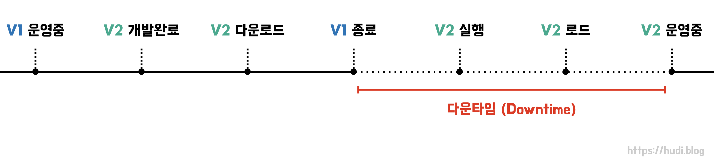
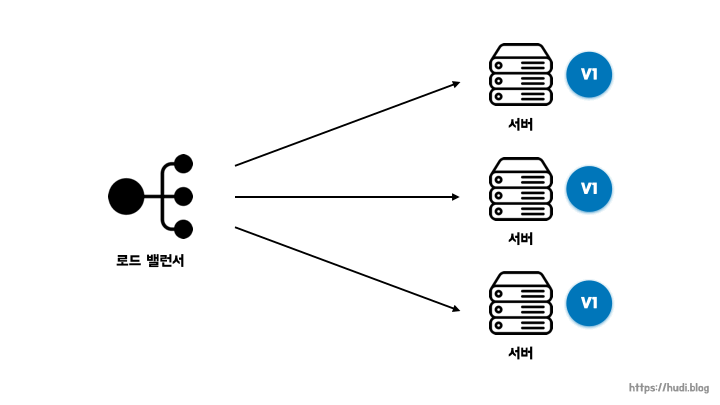
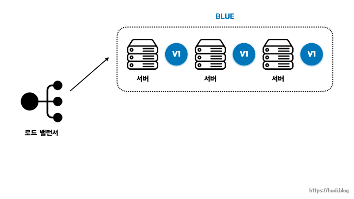
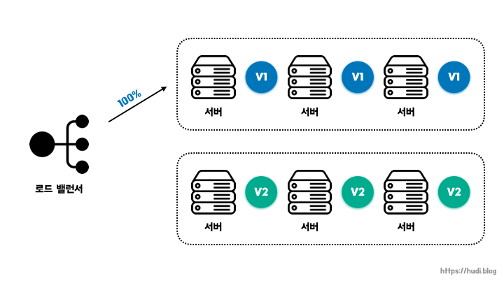

## 중단 배포 방식과 다운타임

서버 한대로 서비스를 운영한다고 가정해보자. 현재 서버에는 **V1** 버전이 실행되고 있는 상황이다. 그리고 우리는 이번에 여러 기능을 추가한 **V2** 버전을 새로 개발했다. 이제 사용자들이 V2 버전을 사용할 수 있도록 배포해야한다.

배포를 하려면 어떤 과정을 거쳐야할까? 일단 새로 만든 V2 버전 빌드를 서버에 다운로드 해야한다. V1 버전과 V2 버전은 서로 같은 포트를 사용하므로, V2 버전을 실행하기 전에 먼저 현재 실행중인 V1 버전의 프로세스를 종료해야한다. 이 시점부터 유저는 서비스를 사용할 수 없게 된다. 유저가 새로운 V2 버전으로 접속할 수 있도록 바로 V2 빌드를 실행한다. 로딩과정을 거치고 V2 버전이 정상적으로 실행되면 유저가 다시 정상적으로 서비스를 이용할 수 있게 된다.

앞서 이야기한 배포 방식을 중단 배포라고 하며, V1 버전이 종료되고 V2 버전이 실행되는 그 사이, 즉 유저가 서비스를 이용할 수 없는 시간을 **다운타임(downtime)**이라고 한다.

## 무중단 배포 (Zero-downtime Deployment)

무중단 배포는 말 그대로 **서비스가 중단되지 않은 상태(zero-downtime)**로, 새로운 버전을 사용자들에게 배포하는 것을 의미한다. 무중단 배포를 하기 위해서는 최소 서버가 2대 이상을 확보해야한다.

## 롤링(Rolling) 배포

트래픽을 **점진적으로** 구버전에서 새로운 버전으로 옮기는 방식이다. 점진적으로 트래픽을 어떻게 새로운 버전으로 옮기는지에 대한 설명은 찾아본 레퍼런스 마다 조금씩 달랐다. 크게 2가지 방식이 있는 것 같은데, 이 포스팅에서는 임의로 방식1과 방식2라고 설명하겠다.

### 방식1

인스턴스를 하나 추가하고, 새로운 버전을 실행한다. 로드 밸런서에 이 인스턴스를 연결하고, 기존 구버전 어플리케이션이 실행되는 인스턴스 하나를 줄인다.

서버 개수를 유연하게 조절할 수 있는 AWS와 같은 클라우드를 기반으로 서비스를 운영할 때 적합한 방식일 것 같다.

### 방식2

V1이 실행되고 있는 서버 하나를 로드밸런서에서 떼어낸다. 이렇게 되면, 해당 서버에는 트래픽이 도달하지 않게 된다. 이 상태에서 해당 서버의 어플리케이션을 V2로 교체한다. 이 과정을 반복해서 모든 서버를 새로운 버전으로 교체한다.

이런 방식은 클라우드 환경이 아닌, 물리적인 서버로 서비스를 운영하는 상황에서도 사용할 수 있을 것이다.

### 장점

롤링 배포 방식은 k8s, elastic beanstalk과 같은 **많은 오케스트레이션 도구에서 지원**하여 간편하다고 한다. 또한, **많은 서버 자원을 확보하지 않아도 무중단 배포**가 가능하다.

점진적으로 새로운 버전이 사용자에게 출시되므로, **배포로 인한 위험성이 다소 줄어들** 수 있다.

### 단점

방식2와 같은 경우 **배포 도중 서비스 중인 인스턴스의 수가 줄어들게 되어 각각의 서버가 부담하는 트래픽의 양이 늘어날** 수 있다. 따라서 전체 트래픽의 양과 단일 서버가 처리할 수 있는 트래픽의 양을 잘 파악하여 배포를 진행해야한다.

또한 구버전과 신버전의 어플리케이션이 동시에 서비스되기 때문에 **호환성 문제**가 발생할 수 있다.

## Blue/Green 배포

트래픽을 한번에 구버전에서 신버전으로 옮기는 방법이다. Blue/Green 배포 전략에서는 **현재 운영중인 서비스의 환경을 Blue라고 부르고, 새롭게 배포할 환경을 Green**이라고 부른다.

Blue와 Green의 서버를 동시에 나란히 구성해둔 상태로 배포 시점에 로드 밸런서가 트래픽을 Blue에서 Green으로 일제히 전환시킨다. Green 버전 배포가 성공적으로 완료 되었고, 문제가 없다고 판단했을 때에는 Blue 서버를 제거할 수 있다. 혹은 다음 배포를 위해 유지해둘수 있다.

### 장점

롤링 배포와 달리 한번에 트래픽을 모두 새로운 버전으로 옮기기 때문에 **호환성 문제가 발생하지 않는다**.

### 단점

실제 운영에 필요한 서버 리소스 대비 **2배의 리소스**를 확보해야한다. 클라우드 환경에서 운영한다면 필요없는 인스턴스를 제거하면 그만이지만, 온프레미스 방식으로 서비스를 운영했다면 비용 부담이 클것이다.

## 카나리(Canary) 배포

점진적으로 구버전에 대한 트래픽을 신버전으로 옮기는 것은 롤링 배포 방식과 비슷하다. 다만 카나리 배포의 핵심은 새로운 버전에 대한 **오류를 조기에 감지**하는 것이다.

소수 인원에 대해서만 트래픽을 새로운 버전에 옮겨둔 상태에서 서비스를 운영한다. 새로운 버전에 이상이 없다고 판단하였을 경우에 모든 트래픽을 신규 버전으로 옮긴다. 이때, 트래픽을 새로운 버전으로 옮기는 기준은 정해진 규칙(특정 유저 등) 혹은 랜덤이다.

이러한 특징으로 인해 [A/B 테스트](https://ko.wikipedia.org/wiki/A/B_%ED%85%8C%EC%8A%A4%ED%8A%B8)를 진행하기에도 적합한 방식이다.

> 카나리 배포의 이름은 예전 광부들이 가스에 예민한 카나리아 새를 활용하여 가스 누출을 감지했다는 이야기에서 유래되었다.

### 장점

**새로운 버전으로 인한 위험을 최소화** 할 수 있다.

### 단점

롤링 배포와 마찬가지로 신/구 버전의 애플리케이션이 동시에 존재하므로 **호환성 문제**가 발생할 수 있다.

## 참고

- https://www.samsungsds.com/kr/insights/1256264_4627.html
- https://www.youtube.com/watch?v=HKkhD6nokC8
- https://www.youtube.com/watch?v=6SvUZqbU37E
- https://www.youtube.com/watch?v=sIPU_VkrguI
