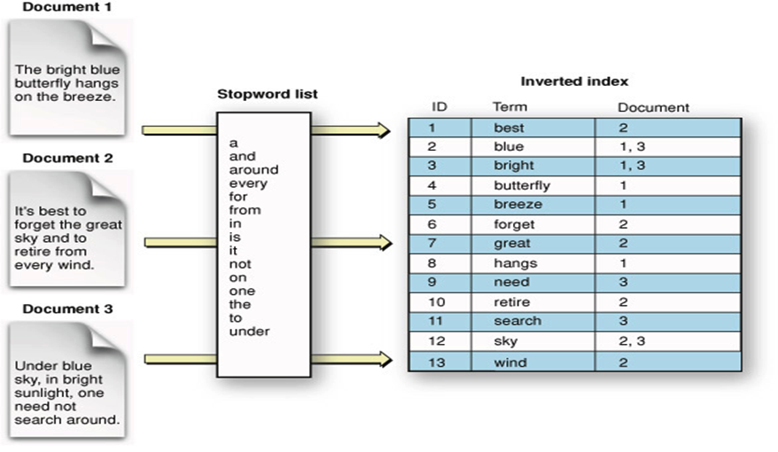

## 역 인덱스 (Inverted Index)

흔히들 인덱스는 책 앞부분의 목차로 빗댄다. 그렇다면 역 인덱스는 책 뒷부분의 찾아보기에 빗댈 수 있다. 책에서 목차는 어떤 챕터나 문단 등의 유일한 정보인 제목을 데이터베이스의 PK와 같이 사용한다. 반면, 찾아보기는 특정 키워드가 어떤 페이지들에서 등장했는지를 나타낸다.

일반적인 RDBMS에서 텍스트로 데이터를 검색하기 위해서는 `LIKE` 연산, 즉 패턴 매칭으로 데이터를 탐색할 것이다. 이 방식은 테이블에 저장된 모든 데이터를 탐색하며 해당 컬럼의 데이터가 주어진 패턴과 일치하는지 여부를 따져보면서, 결과를 필터링할 것이다.

반면 엘라스틱 서치의 역 인덱스 방식은 조금 다르다. 일단 텍스트를 여러개의 키워드로 쪼갠다. 그리고 이 쪼갠 키워드는 자기 자신이 등장한 도큐먼트를 가리킨다. 예를 들어 ‘hudi’ 라는 단어가 5번째, 6,520번째, 10,000번째 도큐먼트에서 등장한다고 가정하자. 일반적인 RDBMS는 `LIKE %hudi%` 로 검색했을 때 10,000번째 행까지 탐색을 하겠지만, 역 인덱스 구조에서는 ‘hudi’ 라는 키워드가 가리키는 도큐먼트가 무엇인지 확인만 하면 된다. 아래 그림을 보자.

위 그림에서 Document 1 ~ 3의 내용을 일반적인 RDBMS에 저장하고, `LIKE` 연산을 통해 패턴 매칭하여 데이터를 탐색한다고 해보자. 저 중 ‘search’ 라는 단어가 포함된 문서를 검색해보자. Inverted Index 에서 바로 ‘search’ 행을 찾아보면 Document 3을 가리키는 것을 확인할 수 있다. 마치 해시 테이블을 사용하는 것 처럼 시간 복잡도가 거의 $O(1)$ 에 수렴한다.

엘라스틱 서치에서는 계속 이야기 하던 키워드를 Term 이라고 부른다. 

## Term이 생성되는 과정

위에서 역 인덱스를 생성할 때 텍스트에서 Term을 생성한다고 이야기했다. 그렇다면 이 Term은 어떻게 생성될까? 

위 예문인 **‘The bright blue butterfly hangs on the breeze’** 를 예로 들겠다. 

1. 텍스트를 **띄어쓰기 단위로 분리**한다. 즉, [”The”, “bright”, “blue”, “butterfly”, “hangs”, “on”, “the”, “breeze”] 로 분리될 것이다. 이렇게 텍스트를 특정 단위로 분리하는 작업을 **토크나이징(tokenizing)**이라고 하며, 분리된 단어들을 **토큰(token)**이라고 한다.
2. 대문자가 있다면 **모두 소문자로 변경**한다. (The → the)
3. 토큰을 **ascii 순서로 정렬**한다.
4. a, an, the, to 와 같이 검색에 큰 의미 없는 **불용어(stopword)를 제거**한다.
5. **형태소 분석 과정**을 거쳐서 **단어를 원형으로 변환**한다. 주로 ~s, ~ing 를 동사 원형으로 변경하는 작업이라고 한다. 단, 한글은 언어 특성상 이 과정이 까다롭다. 엘라스틱 서치는 nori 라는 한글 형태소 분석기를 사용한다고 한다.
6. 중복된 토큰을 병합하고, 동의어를 처리한다.

위 과정만 보아도 데이터를 추가하고 역 인덱스 작업을 처리하는데 꽤 오래걸릴 것 같다. 특히, 한글의 경우 형태소 분석에 영어 대비 더 많은 시간이 걸릴 것이다. 따라서 **삽입된 도큐먼트가 검색 가능한 상태가 될 때 까지 약간의 대기 시간**이 존재하게 된다. 이를 두고 **NRT(near real-time)** 이라고 한다. 

## 더 학습해볼 주제

- MySQL에도 Full-Text Index가 존재하는데, Elasticsearch와 어떤 차이점이 있을까?

## 참고

- [https://steady-coding.tistory.com/581](https://steady-coding.tistory.com/581)
- [https://esbook.kimjmin.net/06-text-analysis/6.1-indexing-data](https://esbook.kimjmin.net/06-text-analysis/6.1-indexing-data)
- [https://siyoon210.tistory.com/132](https://siyoon210.tistory.com/132)