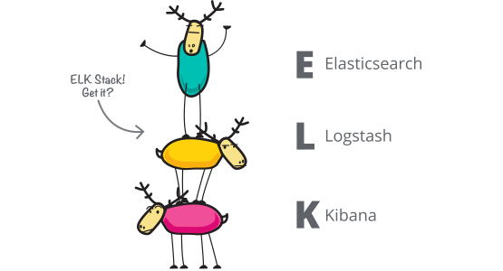
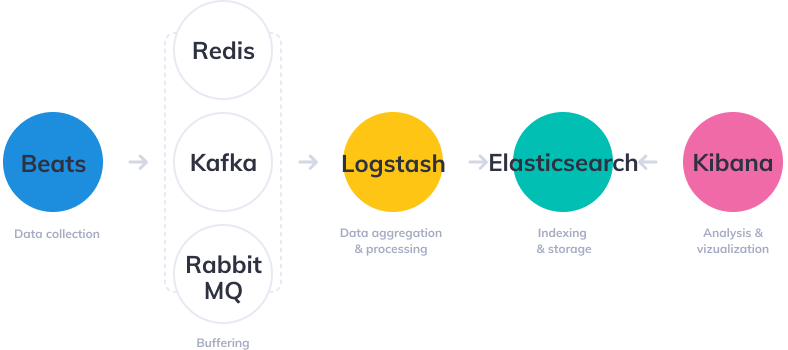
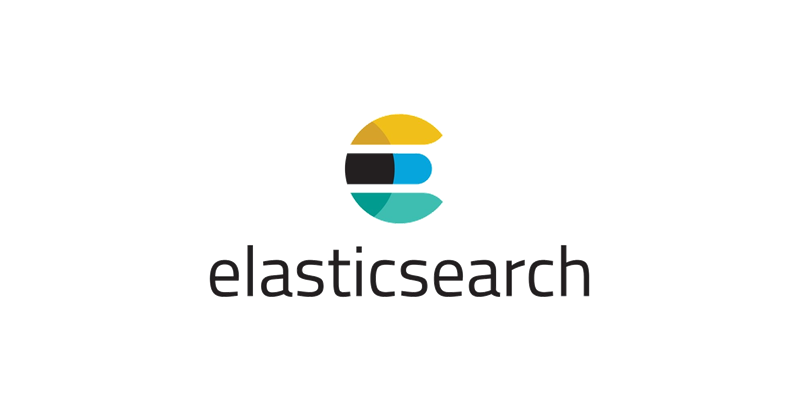
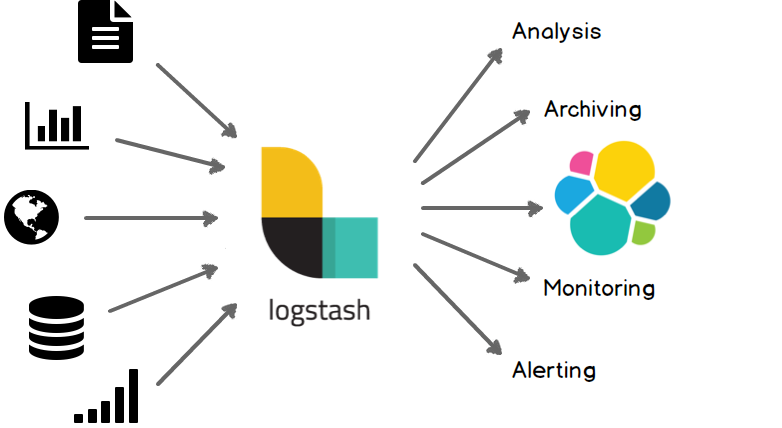
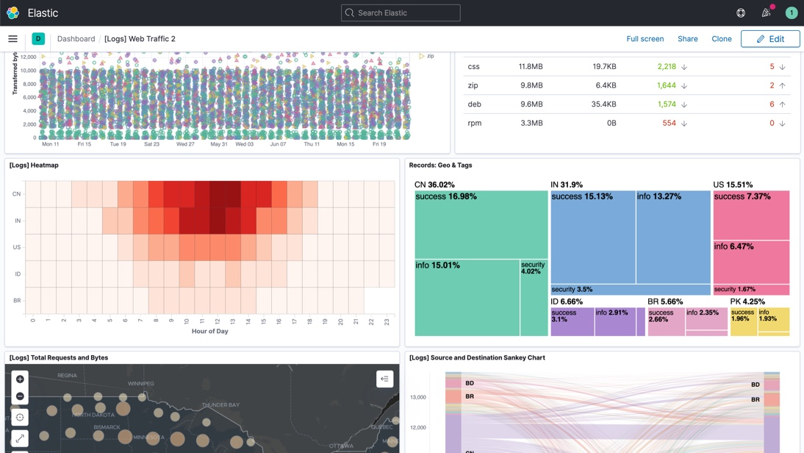
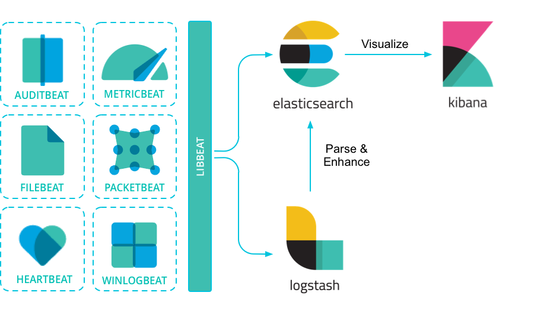

회사에서 ELK 스택을 사용한다. 최근 로그를 확인하기 위해 Kibana를 많이 사용했는데, ELK 스택의 각각이 어떤 역할을 수행하고, 데이터가 어떻게 흘러 저장되고, 검색되고, 시각화 되는지 간단히 이해하면 더 좋겠다는 생각이 들었다. 이 글에서는 ELK 스택의 각각의 기술을 하나하나 자세히 알아보기 보다는, 데이터 흐름 관점에서 각각의 기술이 어떤 역할을 수행하는지를 중점으로 알아볼 예정이다.

## 로그의 필요성

ELK 스택은 일반적으로 로그 수집, 처리 및 분석에 사용된다. 로그, 그게 대체 얼마나 중요하길래 별도의 스택으로까지 관리를 한다는 것일까? 로그는 완성된 시스템을 **안정적으로 운영**하기 위해서는 필수적이다. 개발자 관점에서 생각했을 때 로그 수집과 분석이 필요한 이유는 아래이다.

- 로그를 분석하여 **버그 혹은 장애**가 발생한 경우 **빠르게 원인을 파악하고 해결**할 수 있다.
- 이슈가 발생하여 **CS가 인입**되었을 때 대응하기 위해서, 해당 **사용자가 어떤 액션**을 취했는지, **어떤 데이터가 요청되었는지** 확인할 필요가 있다. 이는 버그나 장애의 경우와는 조금 다르다.
- 사용자의 요청이 들어오고 응답이 나가기까지의 시간을 기록하여 **성능 저하가 발생하고 있는 부분을 파악**할 수 있다. 이를 통해 시스템의 성능을 개선할 수 있다.
- **대용량 배치 작업**은 작업 개수가 굉장히 많으며, 오랜 시간이 걸린다. 전체 작업 중 실패한 작업에 대한 로깅을 하게 되면 원인을 파악하거나 복구하기 쉬워진다.

그 외로 로그는 **보안 이슈** 발생 시 로그 데이터를 활용하여 시스템의 취약점을 분석할 때, 혹은 **비즈니스 의사결정**을 수행할 때도 사용할 수 있다.

## ELK 스택과 아키텍처

ELK는 **Elastic Search, Logstash, Kibana**의 약자로 **데이터를 수집하고 분석하는 도구 모음**을 의미한다. 여기에 **Beats**라는 경량 데이터 수집 도구가 추가되어, 이를 묶어 ELK Stack 이라고 부른다. Beats는 **경량 데이터 수집기**, Logstash는 **데이터 처리 파이프라인 도구**, Elastic Search는 **검색 엔진**, Kibana는 **데이터 시각화 대시보드**이다. ELK 스택에서 데이터는 어디서, 어떻게 발생하고 흘러가며 저장되고 검색되어 시각화될까?

1. Beats는 로그 혹은 메트릭이 발생하는 **서버에 에이전트로 설치**되어 **데이터를 수집**하고, 이 데이터를 Logstash로 전송한다. 위 다이어그램에는 Beats와 Logstash 사이에 메시지 큐가 위치하는 것을 확인할 수 있는데, 이는 **안정성 또는 확장성** 등을 위함이다.
2. Beats (혹은 메시지큐) 로부터 데이터를 전달받은 Logstash는 데이터를 적절히 **필터링, 가공**하여 Elastic Search로 전달한다.
3. Logstash 로부터 데이터를 전달받은 Elastic Search는 데이터를 **굉장히 빠른 속도로 검색될 수 있도록 인덱싱**한다.
4. Kibana는 REST를 통해 Elastic Search로부터 데이터를 가져와 유저에게 **시각화와 간편한 데이터 검색 기능 등을** 제공한다.

## Elastic Search

ELK 스택은 Elastic Search로부터 시작된다. Elastic Search는 Lucene 기반 검색엔진 (경우에 따라 NoSQL 데이터베이스로 분류하기도 한다) 이며, **대용량 데이터를 신속하게 저장하고 검색**할 수 있다. 데이터를 빠르게 검색하기 위해 데이터를 **역 인덱싱 (Inverted Index)** 하여 저장한다. 이에 관련된 내용은 이전에 작성한 포스팅인 **[Elasticsearch는 왜 검색속도가 빠를까? - Inverted Index](https://hudi.blog/elasticsearch-inverted-index/)** 포스팅을 참고하기 바란다.

Elastic Search는 클러스터 구조로 분산되어 구성되어 있으며, 따라서 높은 가용성과 확장성이라는 특징을 갖는다. 또한 일반적인 관계형 데이터베이스와 다르게 SQL을 지원하지 않으며, **RESTful API**를 통해 데이터를 추가하고 검색한다. SQL의 Select, Insert, Update, Delete 명령은 REST 기반의 엘라스틱 서치에서 각각 GET, POST, PUT, DELETE 에 대응된다.

관계형 데이터베이스의 Database, Table, Row, Column, Schema는 엘라스틱 서치에서는 각각 **Index, Type, Document, Field, Mapping** 에 대응된다.

## Logstash

Elastic Search를 사용하면서 데이터를 손쉽게 수집할 방법이 필요해졌다. 따라서 데이터 처리 파이프라인 도구인 Logstash가 등장한다. Logstash는 **Input → Filter → Output** 순서로 데이터를 수집하고, 가공하고, 전달한다.

### Input

Logstash는 **다수의 데이터 소스**로부터 동시에 **로그 혹은 메트릭 데이터를 수집**한다. 수집하는 데이터 소스는 Beats, File, TCP, HTTP, Kafka, Redis 등이 있다. **[Elastic 공식 문서](https://www.elastic.co/guide/en/logstash/current/input-plugins.html)**에서 Logstash가 지원하는 모든 데이터 소스를 확인할 수 있다.

### Filter

Logstash는 Input과 Ouput 사이에 데이터를 **Filter**하여 아래와 같은 일을 할 수 있다.

- grok 플러그인을 사용하여 정규표현식을 통해 비정형 데이터로부터 구조를 도출해낼 수 있다.
- IP 주소로부터 위치 좌표를 얻어올 수 있다.
- 개인 식별 정보를 익명화하거나 완전히 제외할 수 있다.

위와 같은 데이터의 가공은 **[200개가 넘는 플러그인](https://www.elastic.co/guide/en/logstash/current/filter-plugins.html)**으로 코딩 없이 간단히 적용할 수 있다.

### Output

Input과 마찬가지로 Logstash는 다양한 **데이터 소스로 출력**할 수 있다. Ouput의 예시로는 Elastic Search, Email, File, TCP, HTTP, Kafka, RabbitMQ, MongoDB, Redis, S3, Websocket 등이 있다. Logstash가 지원하는 모든 Ouptut 목록은 **[Elastic 공식 문서](https://www.elastic.co/guide/en/logstash/current/output-plugins.html)**에서 확인할 수 있다.

## Kibana

Elastic Search 만으로 데이터를 검색할 수 있지만, Elastic Search 단독으로 사용하면 RESTful API를 호출해야만하기 때문에 불편하다. 따라서 **Elastic Search에 저장된 데이터를 보기 쉽도록 시각화 할 도구**가 필요했다. 그렇게 Kibana가 등장하였다. Kibana는 HTML + Javascript 엔진으로 사용자가 Elastic Search에 저장된 데이터를 쉽게 검색하고, 분석하는데 도움을 준다.

Kibana는 일반적인 텍스트 데이터를 포함하여, 히스토그램, 차트, 위치 데이터, 시계열, 그래프 등 정말 **다양한 시각화**를 제공한다. 또한 사용자가 데이터를 쉽게 검색하고 필터링할 수 있는 기능을 제공한다. 추가로 키바나는 데이터를 모니터링 하며 사용자에게 경고 알림을 제공하는 기능도 제공한다.

## Beats

Beats는 로그, 메트릭 등의 다양한 데이터 소스에서 다양한 유형의 데이터를 수집하고 전달하는 경량 데이터 수집기이다. 일반적으로 Beats는 Logstash 혹은 메시지 큐 (Kafka, RabbitMQ 등)에 데이터를 전달한다. Beats는 수집하는 데이터 소스, 형태에 따라 아래와 같이 제품이 나뉜다.

- **Filebeat** : 서버의 로그 파일을 수집한다.
- **Metricbeat** : 서버의 CPU, 메모리, 디스크 용량과 같은 시스템 메트릭이나 MySQL, Nginx 같은 서비스 메트릭 정보를 수집한다.
- **Packetbeat** : 서버와 클라이언트 간의 트래픽을 실시간으로 모니터링해서 네트워크 상태 정보를 수집한다. HTTP, DNS, MySQL과 같이 다양한 프로토콜에서 트래픽 정보를 수집한다.
- **Winlogbeat** : 윈도우 시스템에서 발생하는 이벤트 로그를 수집한다.
- **Auditbeat** : 리눅스 시스템에서 발생하는 사용자 접속과 이벤트 관련 로그 정보를 수집한다.
- **Heartbeat** : 주기적으로 지정된 URL로 요청을 보내 서비스의 상태를 모니터링한다.
- **Functionbeat** : AWS Lambda, Azure Functions, Google Cloud Functions 등의 FaaS (Function-as-a-Service) 플랫폼에서 데이터를 수집한다.

## 참고

- [https://aws.amazon.com/ko/what-is/elk-stack/](https://aws.amazon.com/ko/what-is/elk-stack/)
- [https://www.elastic.co/kr](https://www.elastic.co/kr/what-is/elk-stack)
- [https://www.youtube.com/watch?v=bH0tw5aKxK8](https://www.youtube.com/watch?v=bH0tw5aKxK8)
- [https://edu.goorm.io/lecture/4013/elk-스택-elasticsearch-logstash-kibana-으로-데이터-분석](https://edu.goorm.io/lecture/4013/elk-%EC%8A%A4%ED%83%9D-elasticsearch-logstash-kibana-%EC%9C%BC%EB%A1%9C-%EB%8D%B0%EC%9D%B4%ED%84%B0-%EB%B6%84%EC%84%9D)
- ChatGPT
