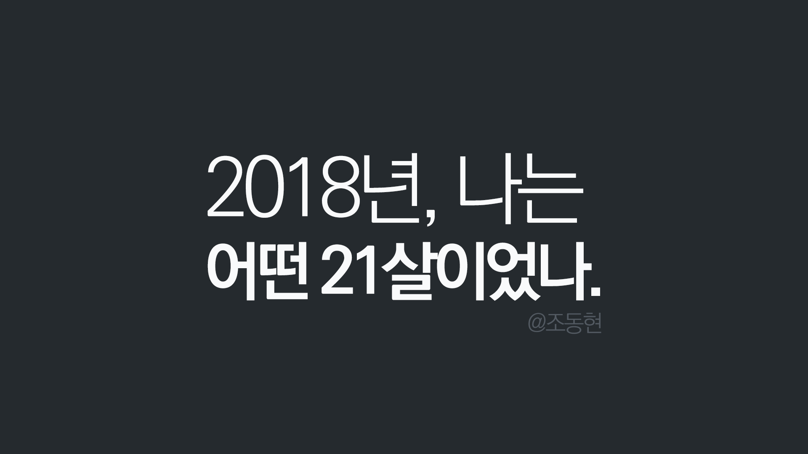
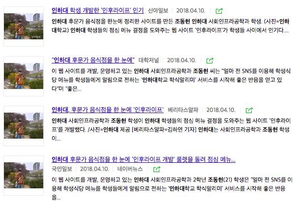
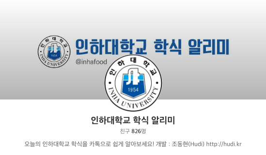
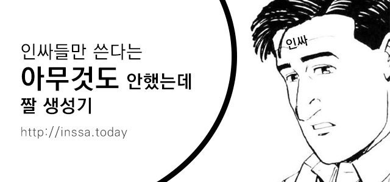
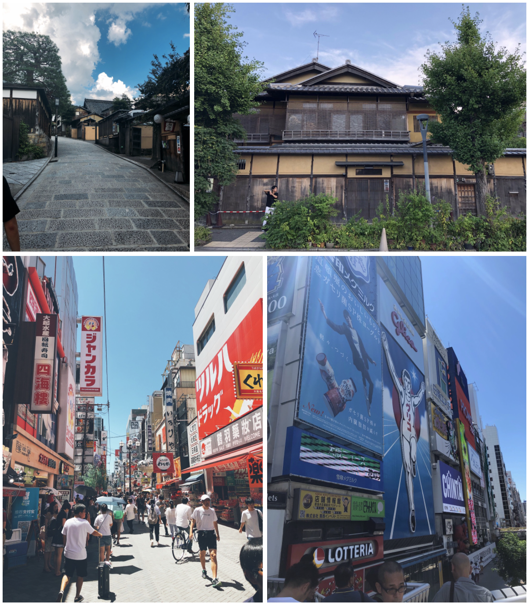
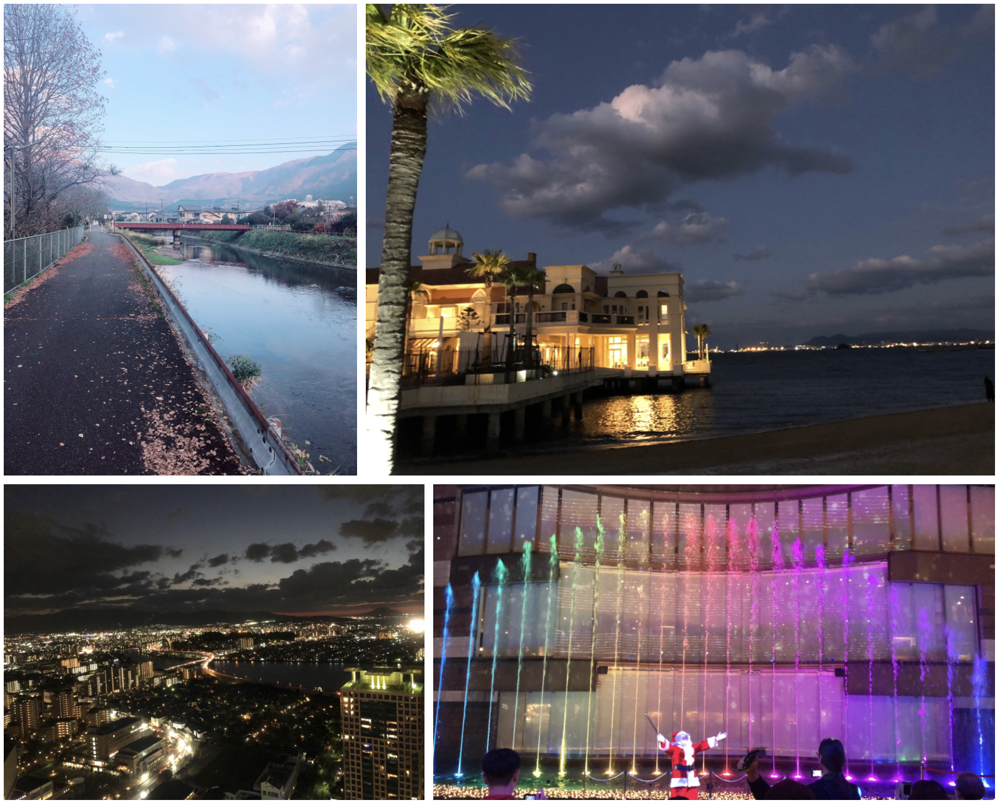
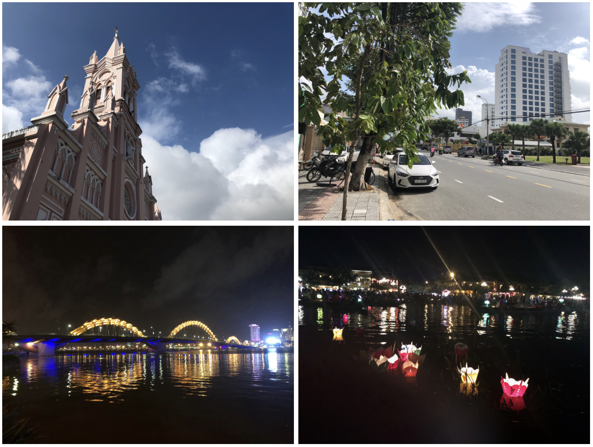
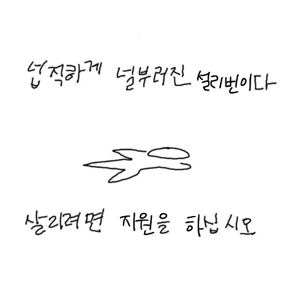
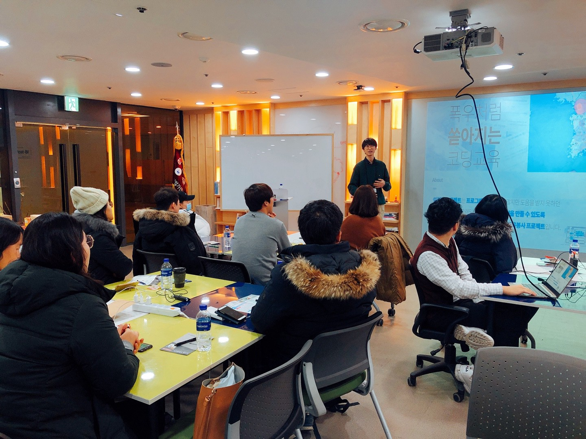

> 이전 [Medium에 작성한 글](https://medium.com/@devHudi/2018%EB%85%84-%EB%82%98%EB%8A%94-%EC%96%B4%EB%96%A4-21%EC%82%B4%EC%9D%B4%EC%97%88%EB%82%98-6b31c1f9dfc0)을 이전한 글 입니다.

엄청나게 게으르게 살았는데도, 올 한해가 이렇게 빨리 간 것 보니 이런 나도 무언가에 몰두 한 듯 하다. 도대체 나는 2018년에 무엇을 하고, 무엇을 배우고, 무엇을 느꼈을까? 2017년의 나에 비해 2018년의 나는 어떤 모습으로 성장하였을까? 2018년을 되돌아 보며, 내가 한일, 경험을 최대한 자세히 적고 올 한해를 반성 해보고자 한다.

## 블로그

개발자에게 가장 중요한 습관 중 하나는 블로깅이라고 생각한다. 꾸준한 블로깅은 그 자체가 나의 발자취이며, 나를 브랜딩하기 가장 좋은 수단 중 하나이다. 2018년 올해, 나는 블로그에 어떤 글을 썼을까?

1. **[스스로를 개발자라 해도 부끄럽지 않도록.](https://hudi.kr/%EC%8A%A4%EC%8A%A4%EB%A1%9C%EB%A5%BC-%EA%B0%9C%EB%B0%9C%EC%9E%90%EB%9D%BC-%ED%95%B4%EB%8F%84-%EB%B6%80%EB%81%84%EB%9F%BD%EC%A7%80-%EC%95%8A%EB%8F%84%EB%A1%9D/)** (2018.01.22)

   기본적인 알고리즘, 자료구조 관련 물음에도 답하지 못할 처참한 나의 기본기를 한탄하며, 당차게 책을 구매하며 기본기를 다지겠다는 년초 다짐글이다. 과연 나는 저 당시 구매한 책 “모던 자바스크립트 개발자를 위한 리액트 프로그래밍” 을 완독 했을까? 아니, 다 읽기는 커녕 1/4조차 읽지 않았다. 개발 실력도 2018년초와 비교 했을 때 비약적으로 성장한 것 같지는 않다. 부끄럽다.

2. **[암호화폐 투자하는 이야기 ft. 흙수저](https://hudi.kr/%EC%95%94%ED%98%B8%ED%99%94%ED%8F%90-%ED%88%AC%EC%9E%90%ED%95%98%EB%8A%94-%EC%9D%B4%EC%95%BC%EA%B8%B0-ft-%ED%9D%99%EC%88%98%EC%A0%80/)** (2018.01.23)

   한창 암호화폐 투기판에 뛰어 들다가 고점에 물려 포기하고 나온 뒤, 돈이 가진 소중함(?)을 갑자기 깨닫게 된 한탄 글이다. 고점에 물려서 돈을 잃은 것에 대한 후회 보다는 “왜 더 일찍 투기판에 뛰어들지 않았을까” 에 대한 후회에 가깝다. 지금 돌아보니 이때 참 비이성적이었던 것 같다. 별로 영양가 있는 글은 아닌 듯. 이때 ICO 에도 관심가지고, 알트코인에도 투자했었는데… 다만, 암호화폐 투기를 하면서도 블럭체인에 대한 이해가 조금 생긴 것을 보면 마냥 나쁜 경험을 한 것 같지도 않다. 그리고 또 배운것. 남들이 하는 말 듣고 줏대 없이 투자하지 말자.

3. **[Wall Street 처럼.](https://hudi.kr/wall-street-%EC%B2%98%EB%9F%BC/)** (2018.01.28)
   암호화폐 투자하는 이야기 ft. 흙수저 글과 약간 이어지는 글이다. 조금 더 욕심을 가지고, 조금 더 기민하게 움직여 이득을 취해야겠다는 다짐의 글이다. 굉장히 짧네.
4. **[[node.js 기초] npm 소개 및 활용 ft. package.json](https://hudi.kr/npm-%EC%86%8C%EA%B0%9C-%EB%B0%8F-%ED%99%9C%EC%9A%A9/)** (2018.01.30)

   올해 첫 기술적인 포스트이다. 솔직히 node.js 사용하는 사람들은 모를 수가 없는 npm 의 아주 기초적인 사용법만을 나열해둔 글이다. 분명 node.js 를 처음 시작 하는 사람에게는 도움이 될 수 있겠지만, 이런 단순 튜토리얼 형식의 글은 누구나 쉽게 작성할 수 있으며, 공식 Docs 를 번역해둔 수준밖에 되지 않는다. 분명 도움 받는 사람은 있겠으나, 이런 쉬운 내용으로 글 수를 채우는 것은 크게 의미있지는 않은 것 같다.

5. **[소프트웨어융합공학 연계전공(SCSC) 을 시작하게 된 이야기](https://hudi.kr/%EC%86%8C%ED%94%84%ED%8A%B8%EC%9B%A8%EC%96%B4%EC%9C%B5%ED%95%A9%EA%B3%B5%ED%95%99-%EC%97%B0%EA%B3%84%EC%A0%84%EA%B3%B5scsc-%EC%9D%84-%EC%8B%9C%EC%9E%91%ED%95%98%EA%B2%8C-%EB%90%9C-%EC%9D%B4%EC%95%BC/)** (2018.03.06)

   SCSC 를 시작하게 된 계기를 적어 내려갔다. 이와 관련해서는 본 연간 회고에서 다시 한번 이야기 해보려고 한다.

6. **[L0GIC에서 Hudi로 닉네임을 변경하였다](https://hudi.kr/l0gic%EC%97%90%EC%84%9C-hudi%EB%A1%9C-%EB%8B%89%EB%84%A4%EC%9E%84%EC%9D%84-%EB%B3%80%EA%B2%BD%ED%95%98%EC%98%80%EB%8B%A4/)** (2018.02.07)

   맞다, 이 쯤 닉네임을 오래 사용했던 L0GIC을 내려놓고, Hudi 로 바꿔서 활동하기 시작했다. 블로그 도메인도, hudi.kr 을 새로 구매하여 사용했다. Hudi 로 닉네임을 변경한 이후 페이스북에서도 글을 공유해가며, 프론트엔드 개발자로서의 퍼스널 브랜딩을 잘 해온것 같아 뿌듯하다.

7. **[[정렬 알고리즘] 1. 선택 정렬 (Selection Sort)](https://hudi.kr/%EC%A0%95%EB%A0%AC-%EC%95%8C%EA%B3%A0%EB%A6%AC%EC%A6%98-1-%EC%84%A0%ED%83%9D-%EC%A0%95%EB%A0%AC-selection-sort/)**(2018.02.07)

   컴퓨터 공학적인 지식이 너무 없어, 이대로는 위험하다 싶어 알고리즘 공부 겸 시리즈로 정렬 알고리즘 글을 작성하려 했다.

8. **[[정렬 알고리즘] 2. 버블 정렬 (Bubble Sort)](https://hudi.kr/%EC%A0%95%EB%A0%AC-%EC%95%8C%EA%B3%A0%EB%A6%AC%EC%A6%98-2-%EB%B2%84%EB%B8%94-%EC%A0%95%EB%A0%AC-bubble-sort/)** (2018.02.07)

   위 글에서 이어지는 정렬 알고리즘 시리즈이다. 이 이후로 정렬 알고리즘 시리즈 글은 작성하지 않았다 (…).

9. **[블럭체인에 매료되다.](https://hudi.kr/%EB%B8%94%EB%9F%AD%EC%B2%B4%EC%9D%B8%EC%97%90-%EB%A7%A4%EB%A3%8C%EB%90%98%EB%8B%A4/)** (2018.02.18)

   암호화폐 투기판에서 발을 살짝 뺀 이후, 순수하게 블럭체인 기술 자체를 동경했던 시절이다. 어떤 개인의 아이디어가 세상을 바꾼 것 같은 기분이 들어 정말 두근거렸었다. 아직도 블럭체인을 사용한 유의미한 서비스가 등장하지 않아서 예전보단 덜하지만, 분명 추후에는 생각보다 많은 부분에서 (특히 행정) 블럭체인이 도입될 것이라고 믿고는 있다. 문제는 블럭체인이 의미가 없는 곳에도 돈을 위해 억지로 끼워 넣는 사람들이지. 블럭체인은 아직도 충분히 매력있는 기술이다.

10. **[[Tip] Mac Python 3.X Urllib의 SSL: CERTIFICATE_VERIFY_FAILED 오류 해결](https://hudi.kr/tip-mac-python-3-x-urllib%EC%9D%98-ssl-certificate_verify_failed-%EC%98%A4%EB%A5%98-%ED%95%B4%EA%B2%B0/)** (2018.02.19)

11. **[[펌] 2018년 웹 개발자 로드맵](https://hudi.kr/%ED%8E%8C-2018%EB%85%84-%EC%9B%B9-%EA%B0%9C%EB%B0%9C%EC%9E%90-%EB%A1%9C%EB%93%9C%EB%A7%B5/)** (2018.03.02)

12. **[Javascript map 메서드](https://hudi.kr/javascript-map-%EB%A9%94%EC%84%9C%EB%93%9C/)** (2018.03.02)

13. **[내 발자취는 얕고, 흐렸다.](https://hudi.kr/%EB%82%B4-%EB%B0%9C%EC%9E%90%EC%B7%A8%EB%8A%94-%EC%96%95%EA%B3%A0-%ED%9D%90%EB%A0%B8%EB%8B%A4/)** (2018.03.02)

    남들보다 크게 노력하지 않았으면서, 그저 프로그래밍을 시작한 시기가 이른 것을 근거로 스스로 멋지게 포장만 해온 나를 반성하고, 비판하는 내용의 글이다. 취지는 정말 좋고 맘에 드는데, 왜 이렇게 암울한 글 밖에 없지.

14. **[비동기적 Javascript — 싱글스레드 기반 JS의 비동기 처리 방법](https://hudi.kr/%EB%B9%84%EB%8F%99%EA%B8%B0%EC%A0%81-javascript-%EC%8B%B1%EA%B8%80%EC%8A%A4%EB%A0%88%EB%93%9C-%EA%B8%B0%EB%B0%98-js%EC%9D%98-%EB%B9%84%EB%8F%99%EA%B8%B0-%EC%B2%98%EB%A6%AC-%EB%B0%A9%EB%B2%95/)** (2018.03.07)

    그저 자바스크립트 코더가 아닌, 엔지니어가 되기 위해서 조금 더 Deep 한 레벨의 지식을 공부해야겠다는 생각이 들었다. 싱글 스레드로 작동하는 자바스크립트가 비동기 명령을 처리하는 방법에 대한 글이다. 내가 작성한 글들 중 역대 최고로 심도있고, 복잡한 글이다. 한참이 지난 지금 봐도 아주 맘에 드는 글이다! 다만, 글을 직접 작성한 나도 완벽하게 이해가 되지 않고, 머리에 한번에 들어오진 않는다.

    대외적으로도 인기가 굉장히 좋아서, 페이스북 공유만 192회, 글 조회수는 14000회를 넘어섰다. 아무튼 정말 잘 썼다고 생각하는 글 중 하나.

15. **[Reactstrap — Bootstrap4를 React에서 사용하는 방법](https://hudi.kr/reactstrap-bootstrap4%EB%A5%BC-react%EC%97%90%EC%84%9C-%EC%82%AC%EC%9A%A9%ED%95%98%EB%8A%94-%EB%B0%A9%EB%B2%95/)** (2018.05.05)

16. **[[node.js] dotenv — 환경 변수 사용하기](https://hudi.kr/node-js-dotenv-%ED%99%98%EA%B2%BD-%EB%B3%80%EC%88%98-%EC%82%AC%EC%9A%A9%ED%95%98%EA%B8%B0/)** (2018.05.27)

17. **[허슬 (Hustle) 하는 개발자](https://hudi.kr/%ED%97%88%EC%8A%AC-hustle-%ED%95%98%EB%8A%94-%EA%B0%9C%EB%B0%9C%EC%9E%90/)** (2018.07.04)

    스타트업에 취직을 도전해보고, 그 과정에서 연봉과 커리어, 사회생활의 두려움 등의 현실적인 고민들을 적어 내려간 글이다. 이맘때 어떤 스타트업에 지원을 했었는데… 이와 관련한 이야기는 아래에서 더 자세히 써보겠다.

18. **[ES6 문법으로 다시 시작하는 자바스크립트](https://hudi.kr/es6-%EB%AC%B8%EB%B2%95%EC%9C%BC%EB%A1%9C-%EB%8B%A4%EC%8B%9C-%EC%8B%9C%EC%9E%91%ED%95%98%EB%8A%94-%EC%9E%90%EB%B0%94%EC%8A%A4%ED%81%AC%EB%A6%BD%ED%8A%B8/)** (2018.07.05)

    ES6의 벽 때문에 최신 자바스크립트 기술을 배우는데 어려움을 겪는 사람들을 위해 작성한 글이다. 나름 수요가 있었는지, 페이스북 공유 126회, 글 조회수는 약 9000회를 기록하였다. 두번째로 잘 쓴 게시물이라고 생각한다. 마음에 든다.

19. **[인후라이프 (inhoolife.com) 개발일지](https://hudi.kr/%EC%9D%B8%ED%9B%84%EB%9D%BC%EC%9D%B4%ED%94%84-inhoolife-com-%EA%B0%9C%EB%B0%9C%EC%9D%BC%EC%A7%80/)** (2018.07.05)

    이 쯤에 나의 대표 사이드 프로젝트인 인후라이프가 개발되었다. 그에 대한 개발 일지이다.

20. **[Styled Components — 스타일을 품은 컴포넌트](https://hudi.kr/styled-components-%EC%8A%A4%ED%83%80%EC%9D%BC%EC%9D%84-%ED%92%88%EC%9D%80-%EC%BB%B4%ED%8F%AC%EB%84%8C%ED%8A%B8/)** (2018.07.09)

    CSS Module, SASS, classnames 와 더불어서 대표되는 리액트 컴포넌트 스타일링 방법중 하나인 Styled Components 에 관한 글이다. Styled Components 를 사용해보니 굉장히 편하다는 생각에 다른 사람에게 소개하고 싶어 작성한 글이다. 요즘은 classnames 와 CSS Module 를 사용하여 스타일링을 해보고 있는데, SC 에 익숙해져서 그런가 영 불편하다.

21. **[인후라이프 2.0 개발일지](https://hudi.kr/%EC%9D%B8%ED%9B%84%EB%9D%BC%EC%9D%B4%ED%94%84-2-0-%EA%B0%9C%EB%B0%9C%EC%9D%BC%EC%A7%80/)** (2018.09.15)

22. **[노마드코더를 보며 따라만든 Typescript 블럭체인](https://hudi.kr/%EB%85%B8%EB%A7%88%EB%93%9C%EC%BD%94%EB%8D%94%EB%A5%BC-%EB%B3%B4%EB%A9%B0-%EB%94%B0%EB%9D%BC%EB%A7%8C%EB%93%A0-typescript-%EB%B8%94%EB%9F%AD%EC%B2%B4%EC%9D%B8/)** (2018.09.18)

23. **[Surge.sh 로 무료로 정적 웹 어플리케이션 배포하기](https://hudi.kr/surge-sh-%EB%A1%9C-%EB%AC%B4%EB%A3%8C%EB%A1%9C-%EC%A0%95%EC%A0%81-%EC%9B%B9-%EC%96%B4%ED%94%8C%EB%A6%AC%EC%BC%80%EC%9D%B4%EC%85%98-%EB%B0%B0%ED%8F%AC%ED%95%98%EA%B8%B0/)** (2018.10.18)

    Surge, 굉장히 좋아하는 서비스인데, 국내에서는 영 자료를 찾기 힘들어서 직접 작성해본 게시글이다.

올해 나는 총 23개의 글을 블로그에 업로드 했다. 한달에 약 1.9개 꼴로 글을 작성한 것이다. 이중 약 43%는 회고와 반성 등의 글이고, 57%가 기술적인 글이다. 블로그에 굉장히 글 게으르게 올렸다고 생각했는데, 나름 2주에 하나 꼴로 글을 작성한 것 같다. 나쁘지 않은 성적인 것 같다.

다만, 앞으로는 회고와 반성, 생각 등은 Medium 에 게시할 생각이며, 기술적인 글 중 단순 튜토리얼은 최대한 지양하려 한다. 아무튼 블로깅은 이 정도면 만족!

## 학업

올해 2018년에는 1학기만 학교를 다니고, 2학기부터는 휴학을 하게 되었다. 짧다면, 짧은 1학기동안 나는 대학교에서 어떤 것을 배웠을까?

이전에 블로그에서 작성한 [소프트웨어융합공학 연계전공(SCSC) 을 시작하게 된 이야기](https://hudi.kr/%EC%86%8C%ED%94%84%ED%8A%B8%EC%9B%A8%EC%96%B4%EC%9C%B5%ED%95%A9%EA%B3%B5%ED%95%99-%EC%97%B0%EA%B3%84%EC%A0%84%EA%B3%B5scsc-%EC%9D%84-%EC%8B%9C%EC%9E%91%ED%95%98%EA%B2%8C-%EB%90%9C-%EC%9D%B4%EC%95%BC/) 를 읽어 보면 알 수 있듯이 나는 SCSC 연계전공을 시작하게 되었다. 나의 주전공(이자 내 인생과 관련이 없을 것 같은) 사회인프라공학 즉, 토목공학을 잠시 내려놓았다. 그리고 내가 가장 좋아하고 가장 잘할 수 있는 분야인 소프트웨어 공부에 집중을 하기로 했다.

SCSC 커리큘럼에 따라 이번 학기는 자바 프로그래밍과 인터넷 정보 과목을 수강하였다. 자바 프로그래밍 수업은 자바랑 전혀 친하지 않은 나도 대부분 아는 내용을 다루기 때문에 크게 도움은 되지 못하였다. OOP 개념을 정규 교육으로서 배운 것은 처음이고, 나름 다시한번 객체와 객체지향에 대해 생각해 볼 기회는 되었다.

이에 반해 인터넷 정보는 의외로 나에게 많은 도움이 되었던 수업이었다. 물론 수업 내용 자체는 이론 위주의 딱딱한 수업이었지만, 수업내용과는 관련 없는 교수님의 말씀에서 많은 것을 배웠다. 교수님은 미래 산업 전반의 변화에 대해 흥미로운 이야기를 많이 해주셨다. 깊고 테크니컬한 이야기 보다는 AI 와 VR 등이 산업 전반에 끼칠 영향, 우리의 삶에 끼칠 영향, 그 변화의 소용돌이 속에서 우리, 비전공자 (일단 나도 비전공자니까) 들이 가져야할 태도 등에 대해 듣게 되었다. “많은 지식을 공부했다” 라는 느낌 보다는, 다가올 미래를 간접적으로 체험하고, 시야가 넓어진 느낌이 들었다. 무엇보다 수업이 굉장히 재밌어서 좋았다.

나름 컴퓨터를 못하는 것은 아니기에 SCSC 과목에서 A+ 를 받지 않는 것은 내 자존심이 용납하지 않을 것 같았다. 시험 기간에는 오히려 아는 것일 수록 실수하지 않도록, 혹여나 내가 알고 있던 지식이 틀린 것은 아니었을지 꼼꼼히 검토하며 공부하다보니 두 과목 전부 A+ 를 받게 되었다.

하지만, 일반화학과 일반수학1 둘다 D+를 받아서 평점은 3.0 점을 최종으로 받게 되었다. 일반화학과 일반수학을 너무 못봐서 3점대도 못 넘을 것이라 확신하고 있었는데, 무려 3.0 점이나 나와서 성적보고 소리질렀다. 나는 흥미있는 과학 현상 같은것은 인터넷에서 찾아보고 재미를 느끼는 편인데, 왜 학업으로써 마주하면 재미가 이렇게 처참하게 없어질까?

1학년이 끝나갈 무렵 나는 휴학을 결정하게 되었다. 딱히 고민하지 않았고, 크게 지쳐있지 않았지만 한번쯤 쉬어보고 하고싶은 것에 온전히 집중해보고 싶다는 생각이 들었다. 돌아보니 무 계획적이고 충동적으로 휴학을 신청한 것 때문에 정말 의미없는 반년이 될 수도 있었다. 나름 여러가지 활동들을 하다보니 이상적이진 않았어도, 나쁘지 않은 휴학생활이 되었다.

## 사이드 프로젝트

### 인후라이프

기술적인 이야기인 [인후라이프 개발 일지](https://hudi.kr/%EC%9D%B8%ED%9B%84%EB%9D%BC%EC%9D%B4%ED%94%84-inhoolife-com-%EA%B0%9C%EB%B0%9C%EC%9D%BC%EC%A7%80/) 와 [인후라이프 2.0 개발 일지](https://hudi.kr/%EC%9D%B8%ED%9B%84%EB%9D%BC%EC%9D%B4%ED%94%84-2-0-%EA%B0%9C%EB%B0%9C%EC%9D%BC%EC%A7%80/)는 이미 블로그에 작성해둔 터이니, 이번에는 운영 후기와 비슷한 성격으로 기술 외적으로 생긴 일들에 대해 써 내려가 본다.

인후라이프는 원하는 음식 카테고리를 선택하면 무작위로 인하대학교 후문가의 음식점을 제공해주는 서비스이다. 정말 간단하게 거의 하루만에 개발한 서비스는 에브리타임 실시간 인기 게시물과 인하광장 월간 최대 추천게시물 2위에 올라갈 정도로 괜찮은 반응이 있었다. 인후라이프에서 영감을 받은 웹 서비스까지 생길정도로 교내에는 적지 않은 영향을 준 듯하다.

괜찮은 반응 속에서 교내에서 두번의 인터뷰를 진행하고, 그 중 하나는 인터넷 뉴스에도 게재되었다.

1학기가 끝난 방학부터 인후라이프 2.0을 기획하고, 개발하기 시작했다. 목표는 디자인 및 UI 개선, 유용한 기능 추가, 새로운 개발 스택 사용 정도였다. 인후라이프 2.0 개발을 끝 마치고 오픈하기 직전, 홍보를 위해 스타벅스 아메리카노 기프티콘 5개를 사비로 구매하여 추첨을 통해 사용자에게 제공해야할 상황이 오게 되었다. 학교에 도움되는 프로젝트를 개발하기 위해 사비를 사용하고 있는데, 문이라도 두드려보자는 생각에 용기를 내어 학생 지원팀, 기업가 센터 등으로 연락을 돌렸다. 능동적으로 학교 등에 지원 요청을 드린것은 처음이었다. 물론 결국 지원받는 것에는 성공하지 못했지만, 항상 수동적으로 살아온 나에게 나름 조그만 태도의 터닝 포인트가 되었던 사례이다.

인후라이프를 통해 나를 알게된 JTBC의 한 작가님에게 요즘애들이라는 예능의 출연 신청 제의를 받기도 하였다. TV 출연에 대한 부담 때문에 신청을 포기하긴 했으나… 나름 출연 신청 제의도 받고, 나름 내가 쌓아온 것들이 헛되지 않았다는 생각에 기분이 좋았다.

### 인하대학교 카카오톡 학식 알리미

인후라이프의 흥행 이후 인하대학생 학우들에게 도움이 되는 다른 프로젝트를 진행해보고 싶었다. 다른 대학교는 보통 학교만의 카카오톡 학식 알리미 챗봇을 가지고 있다. 이상하게도, 특히 공대가 강세인 인하대학교가 학식 알리미 챗봇을 아무도 개발하고 운영하고 있지 않았다. 이 기회에 내가 직접 챗봇을 개발하고, 서비스를 제공하면 좋겠다는 생각에 개발하게 되었다.

원래는 node.js 와 express 스택으로 개발하였으나, 최근에 서버리스에 관심이 크게 생긴이후 AWS 의 Lambda 를 사용하여 다시 개발했다. node.js 와 Serverless 프레임워크로 개발하였다.

글을 쓰는 지금 기준으로 친구수 826명으로 상당히 많은 사람들이 내 서비스를 이용하고 있음에 감사하다.

### 인싸투데이

2018년 중반에 “아무것도 하지 않았는데 ~” 라는 스마트폰 잠금화면이 유행이었다. 다들 포토샵이나 다른 편집 도구를 이용하여 문구를 수정하고, 그림을 수정해서 자신만의 잠금화면을 만들어서 설정하였다. 문득 이 도구를 웹사이트에서 편하게 만들게 해준다면, 사람들이 많이 쓸 것 같다는 생각이 들어 빠르게 개발해낸 웹사이트이다.

홍보를 위해 생활코딩에 글을 올렸는데, 좋아요가 430명을 넘는등 의외로 큰 인기몰이를 하며 정말 많은 방문자가 접속하였다. 기술적으로 큰 의미는 없었지만, 트렌드를 파악하고 사람들의 니즈를 정확히 예측하여 개발한 프로젝트이다 보니 큰 의미가 있다고 생각한다.

올해도 별로 사이드 프로젝트는 만족스럽지 못하다. 고질적인 내 게으름 때문과, 완벽하지 않으면 완결짓지 못하는 이상한 나의 강박적인 성격이 크게 작용 한 듯 하다.

## 외주

휴학 기간동안 해외 여행은 세번정도 가자는 목표를 가지고 있었다. 여유롭게 잡아도 300만원 정도 필요한 해외여행 자금은 외주로 확보하게 되었다. 때 마침 300만원 정도의 외주가 들어오게 되었고, 나는 인생 처음으로 100만원이 넘는 크다면 큰 외주 프로젝트를 진행하게 되었다.

개발 스택은 node.js + express + MySQL + ejs 정도이다. 정확한 내용은 말하기 힘들겠지만, 피시방 사장님을 위한 대시보드 개발이다.

예전에는 몇백만원 단위의 외주 진행이 너무 부담스럽고, 해내지 못할 것이라 생각해서 시도조차 못했다. 이런 답답한 내가 생각 그만하고 행동하자는 마인드로 진행해보니, 생각보다 어렵지 않았다. 본 외주 프로젝트로 총 450만원 정도의 수익을 냈고, 나도 할 수 있다는 자신감이 늘게 되는 아주 좋은 계기가 되었다. (그리고 많은 돈 ㅎㅎ)

## 해외여행

### 처음 가보는 일본 오사카

수학여행을 제외하면 해외로 나가본 적 없는 내가 2018년 여름, 처음으로 일본 오사카를 가게 되었다. 일본에 도착했을때, 구글 지도의 핀이 한국이 아니라 일본에 위치한 사실이 너무 신기했다.

낯설고, 신기하고, 맛있는 여행이었지만, 계획부터 의사소통까지 일본 여행을 많이 다녀본 친구에게 전적으로 의지하여 무언가 배웠던 점은 크게 없었다.

그 해 여름이 정말 기록적으로 뜨거운 여름이라 아직도 샌들 모양으로 살이 탄 모양이 발등에 남아있다. 아직도 발등에 남은 모양을 보고 오사카 여행을 추억하곤 한다.

### 혼자 다녀온 일본 후쿠오카

2018년 11월에는 후쿠오카로 3박 4일의 해외여행을 혼자 다녀왔다.

어렸을 때는 수학여행을 어디로 가던지 관심도 없을 정도로 비 주도적인, 그저 끌려 다니던 수동적인 아이였다. 나의 줏대는 찾아보기 힘들 정도로 항상 남의 의견에 휩쓸리기 마련이었다.

이런 내가 항공권 예매부터 여행 계획 그리고, 현지에서의 의사소통까지 용기있게 해내었다. 한국에서도 모르는 사람에게 말걸기 부끄러워 하던 내가 능동적으로 대체적으로 모든 일을 해내다니. 쉬러 간 해외여행이었지만, 그 이상의 가치를 얻어낸 것 같다.

### 대학교 형과 다녀온 베트남 다낭

2018년 12월에는 처음으로 동아시아권을 벗어나 동남아시아인 베트남, 다낭으로 4박 5일의 여행을 떠났다. 처음 베트남에 발을 디뎠을때, 습한 공기와 냄새가 적응이 될거라 생각하지 않았지만 의외로 이런 기후적인 환경은 하루만에 적응해버렸다.

도착 후 2일 내내 기록적인 폭우가 내려 정상적으로 야외활동을 할 수 없어 조금 우울했다. 또, 베트남 화폐 단위가 우리나라와 매우 달라 계산을 잘못하여 금전적인 문제가 여러번 발생하였다.

그래도 이 여행은 오사카때와 다르게, 거의 모든 여행일정과 의사소통을 혼자서 해내었고, 내가 같이 여행온 형에게 이것 저것 알려주고 도와주며 주도적으로 다닌 여행이었다. 연속으로 주도적으로 여행을 다녀보니 스스로에 대한 믿음이 많이 커졌다.

## 취업 도전

올해는 나의 개발 실력이 어느정도 인지, 나는 대체 어느 위치에 있는지 스스로에 대해 객관적으로 깨달아 보고 싶어, 그리고 당연히 일자리를 얻기 위하여 몇몇 기업에 지원해보기도 하였다.

### 첫번째, 스타트업

첫번째로 넣어본 기업은 딥링크를 이용한 애널리틱스 서비스와 블럭체인 기반 개인 데이터 거래 플랫폼을 개발하는 스타트업이다. 해당 스타트업을 다니는 친구에게 면접 제의를 받고, 채용 과정을 밟게 되었다. 기업 입사를 위한 면접은 처음인지라, 긴장하지 않을 것 같았는데도 정말 정말 몸이 떨릴정도로 긴장이 되었다. 1차, 2차 기술면접을 합격하였지만, 간단하고 기초적인 질문 몇개를 대답 못하는 모습을 보고 나는 아직도 한참 성장이 필요하다는 확신이 들었다. 1년후 군입대를 거의 확정하고 지원한 탓에 최종면접에서 탈락하게 되었다. 첫 면접이었고, 첫 탈락이었기에 그 당시에는 정말 자존심이 상하고, 허탈한 느낌만 들었다.

하지만, 지금 생각해보니 나 자신의 실력을 객관적으로 확인할 수 있는 좋은 기회였던 것 같다. 그리고 실제로 1년만 일하고 나가는게 확실한 직원을 회사에서 굳이 리스크를 안고 채용할 이유는 없다. 사실 내 실력에 대해 자신감이 굉장히 없던 편이었는데, 괜찮은 스타트업의 기술 면접정도는 통과할 정도의 실력은 갖춘 것이라 생각하니 자신에 대한 신뢰가 생기는 계기였다.

### 두번째, 카카오

두번째로 도전한 기업은 아는 사람이 많이 없을텐데, 카카오이다. 사실 카카오는 정말 충동적으로 지원한 회사이다. 프론트엔드 개발자 채용 공고를 보고나서, 이 회사에 지원하지 않으면 후회할 것 같은 기분이 들었다. 급하게 포트폴리오와 자기소개서를 작성하고, 온라인으로 서류를 제출하였다. 사실 감히 카카오인데, 나같은게 서류도 통과하면 대단한거라고 생각했었고, 반쯤은 사실 기대를 하지 않고 있었다.

그런데 정말 예상과는 반대로 서류에 합격을 하고 말았다. 서류 합격 공고와 함께 기술 면접 일정이 나왔다. 대체 카카오같은 큰 기업은 어떤 방식으로 코딩 테스트를 진행할까 궁금했다. 잘은 기억 안나지만, 백준과 같은 온라인 코딩 채점 시스템을 사용하였다. 간단한 알고리즘 문제가 여러가지 있었고, 마지막에는 자바스크립트로 간단한 웹사이트의 어떠한 기능을 구현하는 문제가 있었다. (문제가 될까 싶어 자세한 면접 내용은 작성하지 않겠다.) 알고리즘 문제는 원하는 언어를 자유롭게 선택할 수 있어, 파이썬으로 풀이하였다. 그런데, 마지막 자바스크립트로 기능 구현하는 문제에서 문제 해결 조건과 제약이 정확하게 제시되어 있지 않아서, 바닐라 자바스크립트로 개발하라는건지, Jquery, React, Vue 등 자신있는 자바스크립트 라이브러리를 채택하여 개발하라는 건지 몰랐다. 코딩 테스트 도중에 계속 카카오측에 문의를 넣었으나, 문의 작성시간과 답변 시간도 오래 걸리면서 시간내에 명확한 답변을 듣지 못했다. 시간 제한이 결국 지나서 제대로 된 결과물을 제출하지 못했다.

이렇게 당연히 기술 면접에서 떨어질 줄 알았다. 그런데, 며칠 뒤 재 테스트 안내 메일을 받게 되었다. 그렇게 되어 명확한 제한 상황과 조건 하에 코딩 테스트를 다시 진행하게 되었고, 기술 면접도 통과하게 되었다.

그 다음 면접은 전화로 진행되었다. 전화 면접은 너무 긴장을 한 탓에 어떤 것들을 물어봤는지 대부분이 기억이 나지 않는다. 그리고 대부분 정말 바보같이 대답하였다… 가장 기억에 남는 멍청한 대답은 _“React Router 를 프로젝트에서 사용하셨는데, 어떻게 사용하였는가?”_ 에 대한 대답이다. 나는 대체 뭐라 답해야할지 몰라 우물쭈물 거리다가 그냥 정석대로 개발했다고 대답했다. 그리고 수화기 너머로 여기저기 웃음을 참는 소리가 들렸다… (솔직히 아직 저 질문은 의도가 파악이 안되긴 한다)
저렇게 대답을 하였으니, 탈락을 정말 확신한 상태로 전화 면접을 끝내게 되었고, 내 예상대로 당연히 광탈하게 되었다. 준비를 전혀 하지 않은 것 치고, 카카오의 기술 면접까지 통과한 것에 의의를 두고 있다.

### 세번째, 중견기업

세번째로 넣어본 기업은 한 중견기업이다. 이 기업은 친구에게 병역특례 TO 가 있다고 소개받은 기업이었다. 친구의 소개를 통해 면접이 진행되었다. 특이하게도, 나의 포트폴리오와 이력서를 몇번 훑어보더니, “이 정도면 이 나이대에서 잘하는 거죠?” 라는 말이 오갔다. 면접은 나와 나의 기술에 대한 질문을 하는 것 보다는 병역특례 제도에 대해 나와 면접관들끼리 상의하는 자리가 되어있었다. 자격증은 빨리 따야한다, 정보처리기능사 시험이 언제 있고, 필기와 실기를 치면 이쯤에 아슬아슬하게 자격증 취득이 가능하다 등등… 채용은 전제로 깔아두고 어떻게 병역특례 자격을 나에게 줄 수 있을지 고민하는 자리가 되어버렸다. 굉장히 긍정적인 분위기가 오간 뒤 희망 연봉과 근무 시작일을 질문 받았다.

붙을 것이라고 확신하고 가벼운 마음으로 집을 가는데, 면접이 끝나고나니 올해 TO 가 없다는 소식을 전화로 듣게 되었다. 2019년 하반기는 되어야 TO 가 나온다고 한다. 안 그래도 현역 병역특례는 복무기간이 34개월로 굉장히 긴 편에 속한데, 2019년 하반기까지 기다리게 된다면 최소 4년은 복학이 미뤄지는 것이다. 현역 복무 기간은 단축되고 있는 시점이어서, 나는 너무 복학이 미뤄지게 되는 리스크를 짊어지고 싶지 않아서 결국 병역특례 복무를 포기하게 되었다. 하지만, 나는 아직도 이 선택이 옳은 선택인지 확신을 하지 못하겠다. 하지만, 이미 내가 한 선택이고, 돌이킬 수 없기 때문에 최대한 후회하지 않으려 한다.

결론적으로 여러 회사에 지원한 이 경험은 나를 더 객관적으로 바라볼 수 있는 계기가 되었고, 내 생각보다 나는 잘해 왔다는 자신감이 생기게 되었다. 이런 값진 경험들이 조금 더 어른이 된 미래의 나에게 반드시 큰 도움이 될 것이라 믿는다.

## 병역

위에서 언급했듯이 한번의 병역특례 기회가 있었으나, 그 기간의 문제 때문에 병역특례를 포기하게 되었다. 일반적인 군복무에 비해 복학이 2년이나 미뤄지는 문제와, 제대로 진로를 정하지 않은 상태에서 재직하는 것에 대한 두려움도 있었다.

그래서 육군 기술행정병과 공군 사이에서 고민을 하다 공군을 선택하게 되었다. 일 처리와 사고방식도 육군에 비해 훨씬 합리적이라고 하고, 개인의 시간이 보장되는 군 문화 때문이다. 물론 병역특례와는 비교도 되지 않겠지만, 육군과 비교해서 다소 널널한 시간동안 패스트 캠퍼스, 인프런 등의 동영상 강의를 듣거나, 프로그래밍 서적, 인문계열 서적 등 책을 많이 읽어 소양 쌓기에도 집중할 것이다. 2019년 2월부터 병사들도 일과가 끝나고 휴대폰 사용이 자유화 된다고 한다. 휴대폰과 태블릿 반입이 가능한 공군 환경에서 어떻게든 프로그래밍을 이어나갈 수 있지 않을까 싶다. 군대에서 머리나 굳지 않고, 꼰대만 되어 나오지 않았으면 좋겠다. 그리고 월 2회 외출이 가능한데, 이 외출때 어벤져스 엔드게임 못보면 울거다.

아직 합격하지는 않아서 공군 입대가 확실하지는 않지만, 아무쪼록 군 복무가 나에게 있어 긍정적인 터닝 포인트가 되기를 바란다.

## 설리번교육연구소

설리번교육연구소는 내가 만들고 싶은 것을 만들기 위해, 나만의 교육을 제공해주는 것을 목표로 운영되어 온 비영리 단체이다. 올해 설리번교육연구소의 구조 개편이 이루어졌다.

설리번교육연구소의 장기적 목표를 이루기 위해 방향을 제시해주고, 조언을 해주는 이사와 연구소의 모든 실무를 담당하게 되는 사무국, 그리고 그 아래에 설리번 프로젝트를 이끄는 중심인 설리번, 교육을 받는 헬렌. 2018년의 설리번은 이런 구조하에 운영되었다. 사실 이전까지 나는 설리번 프로젝트에서 설리번으로서 교육은 진행했었지만, 설리번교육연구소에서는 활동하지 않았는데, 이 기회에 연구소 사무국으로 합류하게 되었다. 사무국은 매주 토요일마다 모여 연구소의 실무 처리를 위한 회의를 진행하였다.

맨 처음으로 설리번 프로젝트 신청 사이트와 설리번교육연구소 사이트를 분리하였다. 기존에 설리번교육연구소만을 소개하는 웹사이트는 존재하지 않았기에 새로 만들어야하는 상황이었다. 워드프레스와 같은 CMS 혹은 웹사이트 빌드 엔진으로 웹사이트를 만들지, 그런 엔진에 의존하지 않고 직접 코딩을 하여 웹사이트를 만들지 의견이 분분하였다. 하지만 경험상, 무언가 처음부터 직접 만들게 된다면 책임 분배가 항상 명확히 되지 않아 제대로 마무리가 된 적이 없었다. 워드프레스를 사용하면 코딩을 할 줄 모르는 사람도 유지보수하기 편한 이유도 있기 때문에 워드프레스로 웹사이트를 빌드하기로 결정했다.

그리고, 웹사이트 제작 업무는 나에게 배정되었다. 적당한 유료 테마를 구매하여, 제공되는 웹사이트 빌더 툴로 이곳 저곳의 UI 를 참고하여 제공되는 컴포넌트들을 배치했다. 생각보다 더 자유도가 낮아서 원하는 형태로 만들기 까다로웠으나 나름 만족스러운 형태로 웹사이트를 완성했다.
설리번교육연구소는 현재 2019년 설리번 프로젝트의 성공적인 진행을 위해 노력하고 있다.

### 유료 교육에 관한 논의

이렇게 운영되어 가는 도중 2018년 하반기에, 유료 교육에 대한 논의가 오갔다. 지금까지 무조건 모두 무료로 교육을 제공 해온 설리번이, 교육자에게 금전적인 동기를 부여하여 조금 더 정제되고 차별적인 교육을 제공하자는 의미였다. 또한 설리번 프로젝트에서 생산된 교육 콘텐츠를 생산자인 설리번에게 대가를 지불하고, 더 정제하여 유료로 제공하는 그리고, 발생한 수익을 설리번 프로젝트에 재 투자하는 선순환 구조도 고안해보았다.

처음에는 설리번프로젝트의 유료교육 브랜드를 만들고자 하였다. 설리번 프리미엄, 설리번 플러스, 설리번 블랙 등… 여러가지 이름이 제안되었으나, 최종적으로 스플래시 코드라는 이름으로 결정되었다. 스플래시란, 물보라를 의미한다. 물에 빠뜨린 커다란 조약돌은 사방으로 물을 튀긴다. 돌 하나가 일으킨 확산효과이다. 우리의 교육이 한 사람에게 큰 영향을 주었다면, 자연스레 교육은 그 주변으로 확산되어갈 것이다.

스플래시 코드는 여러가지 유료 코딩 교육 사업 모델을 참고해가며, 스터디 형식의 유료 교육 형태로 결정되었다. 그리고 나는 유료교육의 커리큘럼과 신청 안내를 위한 웹사이트를 개발하였다.

이렇게 돈과 직접적으로 연관되는 일을 하면서, 팀원들에게 조금 더 확실한 동기부여가 필요하다는 생각이 들었다. 그래서 제안된 것이 영리법인 설립이다.

### 스플래시

당차게 유료교육을 기획했지만, 자금의 부족과 마케팅 역량의 부족으로 애초에 다수의 사람에게 노출조차 되지 않고, 유료교육은 흐지부지 끝나게 되었다.

그러던 도중 한 스타트업으로부터 연락을 받게 된다. 그 스타트업은 스마트폰 환경에서 작동하는 아두이노 블럭 코딩 IDE 를 제작하는 회사였다. 그 쪽에서 필요한 것은 자사 블럭 코딩에 올라갈 컨텐츠 즉, 아두이노 교육용 키트 제작, 키트용 교육 자료 그리고 교육 인력이다. 우리도 캐시카우가 필요한 시점이어서, 서로 파트너사로서 협력을 시작하게 되었다.

고정된 자리가 없이 여기저기 옮겨 다니며 근무하는 것은 굉장히 업무 효율을 저해한다. 특히나 아두이노 같이 물리적인 소자들이 필요한 프로젝트라면 더더욱. 그래서 우리는 영리법인 설립을 결정하고 난 뒤, 사무실부터 구하기로 결정했다. 그렇게 스플래시 팀은 선릉의 공유 오피스인 스파크 플러스에 입주하게 되었고, 그 곳에서 키트를 개발하기 시작했다.

오랜만에 아두이노를 다뤄 보는 것이라 어려운 점이 많았다. 애초에 전자 공학적인 지식이 해박한 것도 아닌 상태로 트랜지스터와 다이오드 등 생소한 소자들에 익숙해지는 과정도 어려웠다. 또한 판매용으로 개발되는 키트이기 때문에 외관 디자인과 설계도 무시할 수 없는 요소인데, 이 부분은 전혀 경험이 없다보니 정말 미숙하게 진행되었던 것 같다.

키트 대부분을 완성하고, 프로토타입을 들고 주 구매층이 될 학교 선생님들 앞에서 연수를 진행하게 되었다. 내가 거의 처음부터 끝까지 담당한 키트를 실제 구매층에 내놓고 반응을 본다는 것 자체가 굉장히 긴장 되었다. “나름 이 정도면 괜찮겠지” 라고 생각했던 키트 프로토타입이 생각보다 시연 도중 많은 문제점이 있다는 것을 발견하고, 우리 팀 전체가 스스로 회고하고 반성하는 시간을 갖게 되었다. 이 과정이 완성도 높고, 정교한 키트를 만들게 되는 계기로 작용했으면 좋겠다.

사실, 키트 개발은 우리의 주 목표가 아닌 캐시카우 중 하나이다. 특히 우리의 핵심 역량은 주로 소프트웨어 엔지니어링에 조금 더 집중되어 있다. 현재 스플래시는 더 효율적이고 흥미있는 아두이노 교육을 위해 아두이노에서 받아오는 센싱 데이터를 시각화 하는 플랫폼을 기획중이며, 개발중이다.

2018년도의 4분기는 거의 모든 에너지를 스플래시에 쏟았다. 창업이라고 말하긴 부끄럽지만, 이런 과정을 거치면서 찰나의 시간이지만 많은 것들을 배웠다. 사람 관리와 사내 문화 형성, 역할 분배, 마일스톤 수립, 일정 및 태스크 관리, 대외적인 미팅, 투자금 확보 등등등 … 신경쓸 일들이 굉장히 많다. 본인의 주 업무보다 잡무를 처리할 때가 더 많은 경우도 있다.

박스 주문 제작을 위해 선릉에서 방산시장까지 가서 견적을 낸 적도 있고, 사이즈가 맞는 고무호스를 급하게 구하기 위해 용산역과 왕십리역 주변을 4시간동안 추위에 떨며 걸어다닌적도 있다.

항상 프로그래밍만 해오다가, IT 산업과는 전혀 다른 곳에서 발로 뛰며 다니니 평소에는 보이지 않던 것들이 보이는 느낌이 든다. IT 산업을 넘어 다른 산업에 까지 시야가 넓게 트인 느낌이 들었다. 굉장히 산뜻한 기분이었다.

> Connecting the dots

스티브 잡스가 스탠포드 대학교 연설에서 한 말이다. 과거에서 배우거나 경험했던, 전혀 필요 없어 보이는 분야도 결국 현재의 나와 이어져 하나의 가치를 만들어낸다는 의미이다. 스티브 잡스는 대학교 시절, 엔지니어링과 전혀 관련 없는 서체과목을 수강하였다. 그 시절 잡스는 서체 공부가 삶에 있어 전혀 연관이 없다고 생각했지만, 10년뒤 매킨토시를 설계하며 서체 지식은 빛을 발했다. 이 모든 경험은 더욱 성장한 미래의 나에게 아주 큰 자산이 될 것이라 믿는다.

## 정신적인 성장

대학 생활을 하면서 수많은 사람들과 부대끼며 정신적인 에너지는 온전히 밖으로 누수되고 있었다. 인간관계가 정리되고 간단해지면서, 그 에너지는 온전히 나의 내부와 내가 하는 일들로 향하게 되었다. 모든 에너지가 나에게 혹은 내가 하고 있는, 하고 싶은 일들에게 조명되며 나는 어떤 성장을 겪어냈을까?

### “어린 나이치고” 의 독

나는 어렸을 때 부터 주변의 남들과 다르게 빠르게 하고 싶던 것을 찾았고, 프로그래밍을 그저 흥미를 쫒아 해왔다. 남들과 다르게 열심히 알바를 하지 않아도 내가 좋은 프로그래밍을 하면 나름 즐겁고 편하게 돈도 벌었다. 남들은 무엇을 할까 정하지도 못하고 끙끙 앓고 고민할때, 나보다 나이 많고 컴퓨터 전공인 사람보다 내 실력이 뛰어날때 어리석게도 우월감을 느꼈다.

어릴 때부터 느낀 그런 우월감에 취해 점점 인생을 만만하게 보게 되었다. 이대로 생각 없이 살아도 내 실력이 뒷받침 해줄 오만한 생각. 나는 잘 하고 있는 줄 알았다. 나는 뛰어난 천재인줄만 알았다. 다른 사람들은 나를 치켜 세워주고, 정말 뭐든 다 할 줄 알았다.

성인이 되고 나서, 그리고 나이가 먹어감을 느끼면서 어렸을 때 부터 누려왔던 “어린 나이 치고 뛰어나다” 라는 시선은 희미해져 가고 있다.

어린 나이 치고 뛰어난 개발자로 끝나는 시시한 개발자가 되고 싶지 않다. 나는 개발 능력으로만 평가 받아도 좋은 평가를 받는 훌륭한 개발자가 되고 싶다.

사람들은 나의 본질을 보지 않고, 멋지게 포장된 모습만 바라본다. 내 모습을 멋지게 포장하는 것이 잘못된 것은 아니다. 아니, 오히려 살아가면서 굉장히 중요한 부분일 것이다. 하지만, 중요한 것은 나 스스로 마저 그런 포장된 본인의 모습에 취해 있으면 안된다는 것이다. 항상 나의 본질을 바라보고, 나태함과 오만함을 경계하며, 어제의 나와 비교하여 얼마나 더 성장했는지 생각하며 살아야겠다.

### 생각 그만하고 행동해!

그저 두렵기만 하던 해외여행, 부담스러운 거액의 외주 … 하지만, 결국 부딪히니까 해내었다. 스타트업, 중견기업, 대기업을 합격하지 못했지만, 기술 면접과 코딩테스트는 전부 합격하지 않았는가?

나는 의외로 해낼 수 있었다. 나는 내 생각보다 더 가치 있던 사람이었다.

그러니까, 2019년 부터는 자신감 갖고, **제발 생각 그만하고 행동하자!**

### 비교적 노련해진 인간관계

항상 나는 남들에게 주목받는 것을 그다지 좋아하지 않았다. 오히려 자의식 과잉이 심해, 나에게 전혀 관심 없는 모르는 사람도 나를 쳐다보는 것 같고, 나에 대한 안좋은 생각을 한다고 생각했었다. 최근에는 타인에 시선이라는 족쇄에서 벗어나 조금 더 자유롭게 행동을 하게 된 것 같다. 생각보다 타인은 나에게 관심이 없다. 안 그래도 짧은 인생인데, 타인 시선 신경쓰며 내가 하고싶은 것들을 못하면 얼마나 억울할까? 나는 조금 더 나를 위해 살기로 했다.

또한 내 자랑, 내 이야기, 내 주장을 말하기 보다 상대의 이야기를 경청함의 중요성을 느꼈다. 내 대화 태도를 스스로 돌아본 결과 나는 크게 의미없는 부분에서도 내 주장을 굽힐 줄 몰랐다. 상대의 말을 인정할 줄 몰랐고, 나만 옳다고 생각했다. 이제 고집을 내려두고, 내 의견과 합치가 되지 않아도 일단 인정하고, 수긍하는 태도가 필요하다.

조언은 함부로 하는 것이 아니며, 내가 가장 잘 알고 있다는 자만심도 내려 놓아야 한다. 항상 꼰대가 되지 않기 위해 노력하며, 스스로를 경계하도록 하자.

## 기술적인 성장

올해는 정신적인 성장에 비해 기술적인 성장은 크게 이루지 못한 것 같다. 굳이 나열하자면 다음과 같다.

1. ES7 이상의 스펙으로 트렌디한 코드를 작성할 수 있게 되었다.
2. Javascript Runtime 환경을 이해하며, 싱글 스레드 환경에서 자바스크립트가 어떻게 작동하는지 이해할 수 있게 되었다.
3. 비동기 작업 핸들링을 노련하게 해낼 수 있게 되었다.
4. 헷갈리던 Promise 개념을 완벽히 이해하고, Async 와 Await 를 사용하여 가독성 있는 비동기 코드를 작성할 수 있다.
5. Express 의 Middleware 개념을 이해하게 되었다.
6. AWS 의 EC2, S3 서비스를 사용할 줄 알게 되었다.
7. AWS하면 마냥 어려워 보였지만, 용어가 조금 달라진 것 뿐 이었다. 오히려 이전의 복잡한 기술을 더 추상화하여 편하게 이용할 수 있다는 점이 마음에 들었다.
8. Serverless Architecture 에 익숙해지고, Lambda 를 활용하여 Serverless 기반의 서비스를 만들 수 있게 되었다.
9. Surge.sh 를 사용하여 프론트엔드 퍼블리싱을 할 수 있게 되었다.
10. React 프로젝트의 구조를 짜는 것에 대해 조금 더 노련해졌다.

올해는 개발자로서의 나보다 한 인격체로서의 내가 더 크게 성장했다.

## 마무리

앞으로 한동안 년도를 작성할때 2018로 적고, 8을 9로 수정할 일들이 한동안 잦을 것 같다. 벌써 22살이다. 20살에서 21살이 될때는 별다른 생각이 들지 않았는데, 21살에서 22살이 되니 왜 이리 허무한걸까? 뭔가 21살은 철없어 보이지만, 22살은 한없이 어른처럼 보였다. 나이를 먹는다는 것이 실감된다. 1년만 더 지나면, 20대의 중반을 맞이한다는 사실이 있기 때문일까.

아무것도 이뤄놓은 것 없이 20대 초중반을 낭비하고 싶지 않다. 빛나는 20대를 보내기 위해 2018년 보다 나은 2019년의 내가 되도록 노력해보자.
