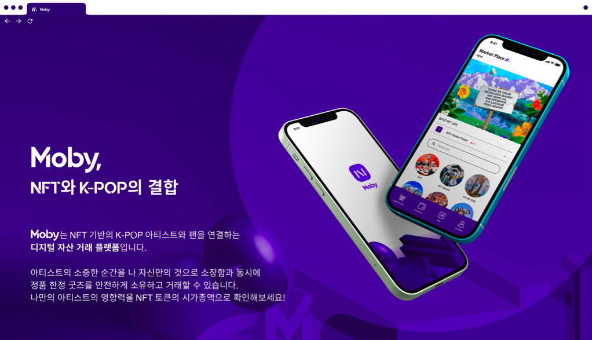

## Prologue

이렇게 긴 호흡의 글을 작성하기 위해 노트북 커버를 열어본 것은 오랜만일 것이다. 그도 그럴 것이 처음이자 마지막 회고가 2018년이 마지막이니. 그때 회고 제목은 [**_‘2018년, 나는 어떤 21살이었나.’_**](https://hudi.blog/2018-retrospect/) 였는데, 벌써 본 회고를 작성하고 있는 2022년의 나는 25살이다. 시간이 참 빠르다는게 체감된다.

올해는 많은 좌절과 한계를 느꼈으나, 열심히 살다보니 좌절을 딛고 가장 많이 성장한 뜻 깊은 해가 아니었나 싶다. 이번 회고는 2019년 3월 군입대 이후부터 기록하지 못한 나의 생각, 좌절, 반성, 성장, 성취를 더닝 크루거 곡선을 따라서 되돌아본다.

 📖 

## Chapter 01. 우매함의 봉우리

> **더닝 크루거 효과(Dunning–Kruger effect)** 는 인지 편향의 하나로, 능력이 없는 사람이 잘못된 판단을 내려 잘못된 결론에 도달하지만, 능력이 없기 때문에 자신의 실수를 알아차리지 못하는 현상을 가리킨다. 그로 인해 능력이 없는 사람은 환영적 우월감으로 자신의 실력을 실제보다 높게 평균 이상으로 평가하는 반면, 능력이 있는 사람은 자신의 실력을 과소 평가하여 환영적 열등감을 가지게 된다. _— 위키백과 (더닝-크루거 효과) —_

### 아는 만큼 보인다

나는 작동하는 프로그램을 작성할 줄 알면, 그것이 좋은 실력인 줄 착각했다. 좋은 설계, 읽기 좋은 코드의 중요성을 모른채, 고민을 하지 않았다. 컴퓨터 공학과에서 배우는 전공 지식들을 낡은 지식으로 치부했다.

전공 지식의 중요성을 깨닫기 시작한건 SCSC 과정 에서 컴퓨터 시스템이라는 과목을 수강했을 때 부터 였던 것 같다. 컴퓨터 시스템은 흔히 CSE 전공자들이 전공 필수 과목으로 수강하게 되는 ‘컴퓨터 구조’ 와 ‘운영체제’ 를 한 과목으로 합친 비전공자를 위한 과목이다.

아는 만큼 보인다라고 하던가, 제대로 알지 못하고 단언한 것과 다르게, 전공자들은 높은 수준의 근본적인 지식을 공부하고 있었다. 이런 지식을 쓸모없다고 함부로 판단한 나의 무지가 부끄러워졌다.

독학이 어려운 이유는 멘토나 학습 체계의 부재로 학습자가 ‘무엇을 모르는지’ 조차 알기 힘들기 때문인 것 같다. 무엇을 모르는지를 알지 못하니, 우물안 개구리가 되기 쉽다. 오히려 자신이 모든 것을 알고 있다는 자만에 빠지게 된다.

## Chapter 02. 절망의 계곡

> 전공자와 비전공자에 대한 이야기는 필자가 ‘비전공자’ 의 입장에서 느낀점에 대해 짧은 식견과 경험을 토대로 작성되었다.

### 근거 없는 자신감

그 전에는 ‘난 알고리즘이나 자료구조 잘 모르니까, 그냥 스택 오버플로우에서 남이 짜놓은 코드 복사해서 사용하면 되지’, ‘컴퓨터 구조? OS? 어차피 나보다 훨씬 더 잘하는 개발자들이 최적화 해둔 라이브러리가 널려있는데 왜 알아야해?’ 같은 생각을 하면서 발전하려고 하지 않았다. ‘그래도 작동하는 결과물은 만들어낼 수 있으니, 아무튼 난 잘해!’ 라는 근거 없는 자신감이 들었다.

나는 10년 가량을 낮은 밀도로 학습해오며, 내가 알던 좁은 세상이 전부라고 착각해왔다. 최근 SCSC 과정을 이수하며 더 넓은 세상이 있음을 이제야 깨닫게 되었다.

나는 비전공자이다. 뭐, 조금 더 엄밀히 따져보자면 SCSC 과정을 이수중인 '준 전공자' 이다. 다만, 썩 마음에 드는 표현은 아니다. 그러니까 일단은 비전공자라고 해두자.

### 잘못된 전략

지금까지는 짧은 기간에 다작으로 만든 프로젝트들을 포트폴리오에 기록해두면 큰 어려움 없이 취업할 수 있을 줄 알았다. 최신 기술을 튜토리얼만 훑어본 수준으로 프로젝트에 적용하면, 실력있는 개발자가 되는 것 이라고 생각했다. 살면서 딱 한번만 써본 기술을 내 기술 스택에 나열 해놓고 그것이 진짜 내 실력인줄 알았다.

몇달 전, 현업에서 근무하는 개발자분과 함께 식사를 할 기회가 있었다. 그 분과 이야기를 마친 후, 나는 내가 잘못된 전략으로 살아왔다는 생각을 하게되었다. 그 분께서는 사실 어떤 기술 (프레임워크나 라이브러리 등)을 학습하는데에는 빠르면 6개월, 길어도 1년이면 충분하다고 하셨다.

비슷한 시기에 교수님과 상담을 잡고, 포트폴리오를 보여드릴 기회가 있었다. 교수님께서는 어느정도 프로그래밍 스킬은 있는 것 같아보이지만, 결국에는 남이 만들어 놓은 API 를 가져다 쓰는 것으로밖에 보이지 않는다는 피드백을 해주셨다. 정작 핵심 기능은 내 것이 아니라는 이야기였다.

만약 인사 담당자가 ‘당신이 만든 여러 프로젝트를 구현하기 위해서, 높은 수준의 기술이 요구됩니까?’ 라는 취지의 질문을 한다면 나는 선뜻 ‘네’ 라고 답할 수 있을까?

### 학위의 의미

혹자는 ‘고도의 신뢰성이 요구되는 시스템 개발 (금융, 원자력 발전소, 로켓 등)’ 혹은 ‘코드보다 논문을 더 많이 접하는 직종 (AI, 데이터 사이언스와 같은 분야 등)’ 에서 일할 것이 아니라면, CSE 학위는 필요 없다고 이야기 한다. 어느정도 동의한다.

하지만 이를 전공 ‘지식’ 자체가 필요 없다는 의미로 받아들이면 곤란하다. 위와 같은 이야기는 ‘많은 컴퓨터 공학 학사들이 실무에서 코드 한줄 제대로 못 치는 경우가 많으니, 차라리 의미 없는 학위 증명서보다는 실제 전공 지식과 실력의 검증이 더 중요하다’ 라는 의미로 받아들여야 한다.

현실적인 관점에서 살펴보자. 채용은 기업 입장에서 많은 리소스를 부담해야하는 과정이다. 기업은 이익 단체이고, 가능하다면 가장 적은 리소스를 투입해서 최상의 결과를 만들어내려 할 것이다. 하지만, 정성 평가는 맨 파워가 많이 투입된다. 채용의 마지막에는 결국 정성 평가가 필요하겠지만, 적어도 초반 단계에서 많은 지원자를 효율적으로 필터링 하기에는 정량 평가가 경제적이다. 그리고 정량 평가의 대표적인 척도는 ‘학위’ 와 ‘학점’ 이다.

생각없이 시키는것만 공부해온 전공자라고 하더라도, 4년이라는 긴 시간 동안 증명된 교육 과정을 통해 습득한 지식은 그리 쉽게 사라지진 않을 것 이다. 따라서 전공자들은 평균적인 학점만 보유하더라도 구태여 자신을 시장에 증명할 필요가 없다.

비전공자의 디메리트는 여기서부터 시작된다. 비전공자는 정량적으로 증명할만한 학위와 학점이 없으니, 정성적으로 자신을 시장에서 증명해야한다. 그렇지 않아도 설득의 연속인 구직 과정에서 한 단계 과정이 추가되는 것 이다. 또한 전공자와 비전공자 사이의 차이점이 전공 여부 뿐 이라면 기업이 비전공자를 선택할 이유는 없다.

### 전략 수정

현재 내 자신을 객관화 하여 바라볼 수 있게 되니, 무엇을 공부해야할지, 어떤 지식이 중요한지 비로소 깨닫게 되었다. 결국 중요한것은 좀 더 근본적인 지식을 학습해야하는 것이었고, 그것은 전공 지식이다. 지금껏 내가 해온것들은 4년 간 전공자들이 갈고 닦은 CSE 지식보다 난이도가 훨씬 낮다는 것을 인정하게 되었다.

물론 시장에 공개된 프레임워크나, 라이브러리를 잘 알고 능숙하게 사용하는 것도 굉장히 중요한 덕목이다. 프로그래머는 연구자가 아니라 제품을 만드는 사람이니까. 하지만 동작만 하는 프로그램은 특수 분야를 제외하고는 누구나 개발이 가능하다. 특히 서비스 개발이라는 영역이라면 더더욱. 결국 제품의 질을 결정하는 것은 CSE 지식이다.

좀 더 깊은 단계에서 기계로서의 컴퓨터 (컴퓨터 구조), 그리고 운영체제, 네트워크 등의 이해가 동반되어야만 좀 더 빠르고, 안정적인 코드를 작성할 수 있다. 자료구조와 알고리즘에 능숙해야 같은 동작을 하는 코드라고 하더라도 수배, 수십배 최적화된 코드를 작성할 수 있을 것 이다. 또한 알고있는 기반 지식이 넓을수록 이슈가 발생했을 때 빠른 대응이 가능할 것이고. (이슈 대응은 소위 말하는 ‘짬’ 의 영역도 무시할 수 없지만)

취업의 영역에서도 마찬가지이다. 흔히 마법의 주문처럼 일컬어지는 네카라쿠배와 같은 탑티어 IT 기업은 지금 유행하고 있는 프레임워크나 라이브러리를 잘 쓰는지에 대한 관심은 생각보다 적다. 그보다는 얼마나 전공지식을 열심히 공부하였는지, 그리고 얼마나 논리적으로 사고할 수 있는지 (알고리즘) 에 대한 것을 중점으로 지원자를 선발하고, 이후 실무교육을 진행하는 전략으로 채용을 진행한다. 즉, 성장 가능성으로 인재를 평가한다. 또한 채용이 되더라도 인력 시장의 입장에서 CSE 지식이 부재한 개발자는 다른 개발자로 쉽게 대체 가능 할 것이다.

뭐, 요즘 흔히 뉴스에서 들리는 ‘채용할만한 잘하는 개발자가 없다’ , ‘전공자를 뽑아서 가르치나, 비전공자를 뽑아서 가르치나 똑같다’ 등등… 소위 ‘전공 무용론’ 이 간간히 들려오긴 하지만, 적어도 글을 작성하고 있는 지금까지는 전공지식과 알고리즘을 중요한 평가 척도로 사용하는 기조가 유지되고 있다고 생각된다. 그리고 개인적으로도 전공 지식은 매우 중요하다고 생각한다.

### 재미만 있을 수는 없더라

정리해보자. 지금까지는 작동하는 것을 만들고 재미를 느끼는 것에서 만족하고 멈췄더라면, 이제부터는 훨씬 근본적이고 어려운 것을 공부해야한다. 성장하기 위해서는 재미만 있을 수는 없더라. 재미있고, 좋아서 시작한 공부지만 한계점을 뚫고 성장하기 위해서는 고통을 감수하는 것은 언젠간은 겪어야할 일인 것 같다.

이론적으로는 운영체제, 시스템 프로그래밍, 컴퓨터구조, 컴퓨터 네트워크, 데이터베이스, 알고리즘 등을 익히고 실무적으로는 디자인 패턴, 클린코드, 클라우드 컴퓨팅 등을 깊게 학습해서 ‘좋은 코드’ 를 작성할 수 있는, 대체 불가능한 개발자가 되자는 굳은 다짐을 하게 된 2021년 이었다.

하고 싶은 이야기가 많이 남아있지만, 이 이상 작성하게 되면 회고가 아니라 전공 지식의 중요성에 대해 역설하는 글이 될 것 같아 이 주제에 대한 이야기는 여기서 마치도록 하겠다. 기회가 된다면 별개의 포스트에서 학벌과 전공에 관한 이야기를 작성해보고 싶다.

## Chapter 03. 깨달음의 비탈길

지난 해는 많은 좌절을 겪기도 했지만, 가장 많은 좌절을 극복한 해이기도 하다. 감히 이야기 해보건데, 2021년은 나의 24년 인생에서 가장 열심히 살았다고 당당히 이야기할 수 있다. 소위 우스개소리로 말하는 ‘전역 버프’ 일까? 아니면 절망의 계곡에서 느낀 ‘위기감’ 때문이었을까?

좌우지간, 이번 챕터에서는 지난 2021년의 많은 도전들과 그 결과에 대해 돌아본다.

### 학업적 성취

필자는 대학생이다보니, 학업적 성취를 빼고 지난해를 이야기하기는 힘들다. 필자는 군 제대 이후 엇학기로 복학했기 때문에 봄·여름에 2학년 2학기, 가을·겨울에 3학년 1학기를 보냈다. 위 사진이 2학년 2학기 성적이고, 아래 사진이 3학년 1학기 성적이다. 참고로 성적표의 ‘일반선택’ 으로 되어 있는 과목은 SCSC 과목이다. 전산상으로는 SCSC 과목이 전공필수가 아닌 일반선택으로 표기가 된다.

COVID-19 로 인한 학점 인플레이션을 감안한다고 하더라도, 나쁘지 않은 성취라고 할 수 있다! 또한 학점 인플레이션 최소 대학 톱3에 우리 학교가 포함된 것을 보면 (**[학점인플레 최소대학 성균관대 한양대 인하대 톱3](https://www.veritas-a.com/news/articleView.html?idxno=366433)**) 꽤 봐줄만하지 않는가 😄

지난 2018년 회고 때에는 학기 평점 3.0을 받고 자조적으로 기뻐하는(?) 글을 썼는데, 그랬던 내가 2학기 연속으로 성적표에 ‘우등생’ 글자가 박혀 나올줄이야. 인내심 측면으로도 많은 성장을 거둔 해였다고 할 수 있다.

### 네이버 부스트캠프 6기 탈락

2021년 여름, 네이버 부스트캠프 6기 웹 풀스택 분야에 지원하였다. 사실 모집 기간이 중간고사 기간과 겹치기도 하였고, 지원 결심도 늦게하는 바람에 급하게 지원하게 되었다. 중간고사가 끝나는 다음날이 지원서 마감일 이어서, 하루만에 자소서를 작성하고 제출했다. 물론, 코딩테스트도 전혀 대비하지 않은 상황이었다. 아마 이때는 백준 문제를 10문제 마저도 풀지 않아서, [solved.ac](https://solved.ac) 에서도 Unranked 로 분류되었을 것 이다.

다행히 1차는 합격하여, 2차 코딩테스트를 볼 수 있는 기회를 받게 되었다. 하지만, 제목과 같이 쓰디쓴 탈락을 맛보게 되었다. 뭐, 사실 결과에 큰 기대를 하지 않았다. 2차 코딩테스트를 본 직후, 제대로 망쳤다는 느낌을 받았기 때문이다. 너무 아쉬운 나머지 부끄럽지만… 코테 직후에 베개에 얼굴을 묻고 울었다. 워낙 눈물이 없는 성격인데 나 조차도 그때 울면서 당황했던 것 같다.

과신하고 있던 내 실력에 배신당한 기분이라고 해야할까. 자존심이 많이 상하기도 했고. 부스트캠프 탈락도 지난해에 느낀 회의감에 큰 지분을 차지했다.

(TMI. 불합격 메일을 캡처하려고 했지만, 아무리 메일함을 찾아봐도 나오지 않아 구글에 검색해서 나온 다른 사람의 불합격 통보 메일 사진을 캡처해서 첨부했다. 같은 불합격자 처지이니 괜찮… 겠지?)

### 코딩테스트 스터디

**[스터디 Repository 링크](https://github.com/LIKELION-INHA-9-ALGORITHM-STUDY/likelion-inha-9-algorithm-studyhttps://github.com/LIKELION-INHA-9-ALGORITHM-STUDY/likelion-inha-9-algorithm-study)**

그간 느끼던 비전공자로서의 자격지심과 함께 엎친데 덮친격으로 부스트캠프 탈락의 쓴맛까지 느낀 뒤로는 적어도 코딩테스트는 대비해야 겠다는 위기감이 다가왔다. 알고리즘 공부 같은 경우 혼자하면 분명 쉽게 지칠 것이라 생각되어 언젠간 그룹으로 스터디를 운영해야겠다는 생각은 계속 가지고 있었다.

부스트 캠프도 탈락해서 동기부여도 확실히 되었겠다, 바로 그 해에 활동하던 교내 코딩동아리 멋쟁이 사자처럼에서 코딩 스터디를 개설하고, 스터디장이되어 스터디를 운영하게 되었다.

돌이켜보면 그렇게 빡세게(?) 운영하진 않은 것 같다. 각자 현재 가지고 있는 실력과 스터디를 통해 이루고자 하는 목표가 제 각기 다를 것이기 때문에 문제 풀이 목표 개수를 개인별로 따로 정하도록 하였다.

그리고 문제 난이도를 상, 중, 하 로 구분하고, 하 1문제, 중 3문제, 상 1문제 씩 총 5문제를 내가 직접 가져와 매주 스터디원들에게 공지했다. 그리고 문제 풀이 점수를 난이도에 따라 각각 1점, 2점, 3점으로 부여하였고, 스터디원 각자 주 별 목표 점수를 3점, 5점, 7점 중 선택할 수 있게 규칙을 세웠다.

주차별 문제를 아예 제출하지 않으면 벌금 3000원, 제출하였지만 목표 점수에 도달하지 못할 경우 1000원을 벌금 통장에 제출해야한다. 기타 규칙들은 레포지토리의 Readme 를 읽어보면 알 수 있다.

스터디에 참여해보는 것도 처음인데, 스터디장이라니. 코딩 테스트 스터디가 어떻게 운영되는지 몰라, 주변에 물어보거나 Github 의 다른 저장소를 참고하기도 하였다. 그래도 운영을 함께 도와주시는 3분이 계셔 더욱 즐겁게 운영할 수 있었던 것 같다.

나 혼자만의 생각일 수도 있지만, 여름방학과 2학기 기간 동안 스터디원 분들의 참여율도 매우 높고, 벌금도 얼마 쌓이지 않아, 나름 성공적으로 운영했다고 생각이 든다.

사실 스터디 기간 중 심화적인 문제는 많이 못 풀어봤으나, 대표적인 코딩 테스트 유형별 문제는 한번씩 풀어보았다. 학기말즈음 대회 마감이 겹쳐 많이 해이해진 것 같아서 아쉬웠다. 그래도 학업과 여러 대회 활동, 후술할 운영체제 등의 공부등을 함께 병행한 것 치고 꽤나 좋은 성과를 냈다고 생각한다!

### 운영체제, 시스템 프로그래밍 공부

사실 운영체제 과목은 SCSC 과정의 ‘컴퓨터 시스템’ 이라는 과목에서 어느정도 다루기는 한다. 하지만, 실제 주변 전공자들이 운영체제 과목에서 사용하는 강의 노트나, 제출하는 과제물 등을 참고 해볼 기회가 있었는데, 내가 겉핥기 수준으로 얕게 배운 지식과는 깊이가 확연하게 차이난다는 느낌을 크게 받았다.

물론, 그런 높은 수준의 교육은 평생을 컴퓨터 공학 연구를 해오신, 해당 분야의 권위자인 교수님 밑에서 배우지 않고서야 기대하기 어렵겠지만… 그래도 지금보다는 나아져야 겠다는 생각이 머리속을 맴돌게 되었다. 여러 선택지가 있었지만, 가장 접근성이 좋은 패스트캠퍼스 (뒷광고 아님 😅) 에서 운영체제와 시스템 프로그래밍 강의를 학기와 병행하여 듣게 되었다.

강의는 당연하게도 대학교 교육 수준에는 미치지 못했다. 하지만, 적어도 구직 시 면접 대비용으로는 충분하다는 생각이 들었다. 사실 애초에 교육의 목적이 서로 다를텐데 (연구와 취업) 대학 수준의 교육을 바라는 것이 도둑놈 심보일지도?… 🤔

또한, 운영체제 혹은 시스템 개발자가 되는 것이 목표가 아닌 이상, 프로그래머가 필요한 ‘교양’ 으로써의 지식으로는 이 정도 수준 이라면 괜찮다는 생각도 들었다. 아무리 컴퓨터가 좋아도 어디까지나 나는 B2C 서비스를 개발하는 기업에 입사해서 코드를 작성하고 싶을 뿐 이지, 리눅스 커널에 코드를 컨트리뷰트 할 일은 없을 것 같기 때문이다.

전에는 패스트 캠퍼스의 자극적인 마케팅 (‘6개월만에 인공지능 전문가로 취업하기’ 따위의 말도 안되는 카피 등) 때문에 막연한 거부감이 있었는데, 생각보다 강의 질은 괜찮다는 생각이 들었다. 딱, ‘돈 값은 한다’ 라는 표현이 적당하다. 사실 비전공자가 반찬 투정할 입장은 아니기도 하고.

오히려 사교육 인터넷 강의도 적절히 선택한다면 학습에 있어 나쁘지 않은 선택이라는 생각이 들게 되었고, 이후 적극적으로 인프런 등지에서 괜찮은 강의를 탐색하게 되는 계기가 되었다.

### ZZIM - IGRUS 제2회 인하대학교 IT 경진대회 대상 수상

**[ZZIM Repository](https://github.com/devHudi/zzim-frontend)**

IGRUS 는 역사 깊은 교내 프로그래밍 동아리다. 가입 후, 이런 저런 일로 바빠 이 대회 말고는 활동을 전혀 못했지만… 😓

ZZIM 은 여러 쇼핑몰의 URL 만으로 관리할 수 있는 통합 위시리스트 서비스이다. 지원하는 쇼핑몰의 상품 URL을 입력하면, 자동으로 상품 데이터를 파싱하여 나의 위시리스트에 추가해준다. 평소에 꼭 있었으면 하던 서비스였는데, 좋은 분들과 함께 완성하게 되어 즐거웠던 경험이었다.

운이 좋게도, 서비스를 출품한 IGRUS 인하대학교 IT 경진대회에서 1위를 차지하고 대상을 수상하게 되었다.

### Carrier - 멋쟁이 사자처럼 9기 중앙 해커톤 TOP10 진입

**[Carrier Repository](https://github.com/devHudi/carrier)**

멋쟁이 사자처럼은 코딩 교육 동아리라고는 하나, 학기 초 HTML, CSS, Python, Django 의 기초적인 튜토리얼을 제외하면 대부분 동아리원 간의 자율적인 스터디와 여러 대회 참여를 중심으로 운영된다. Carrier 는 멋쟁이 사자처럼에서 개최된 첫 대규모 대회에 출품한 서비스이다.

Carrier 는 여행자의 여행 일정에 맞춘 개인화된 가이드를 추천해주며, 실시간 채팅 등을 통해 성공적인 여행을 마칠 수 있도록 돕는 여행 가이드 매칭 서비스이다. 참여해주신 팀원 분들 대부분이 프로덕트 개발은 처음이셨지만, 다들 정말 열심히 해주신 덕에 내 기대를 상회하는 퀄리티의 결과물이 나온 것 같다.

개인적으로 Git-Flow 전략을 도입하고, AngularJS Commit Convention 을 적용해서 프로젝트를 관리하고자 하는 욕망이 있었지만, 그 점은 아쉽게도 잘 지켜지지 않은 것 같아 약간의 아쉬움으로 남는다.

Carrier 는 약 110개의 여러 대학교의 멋쟁이 사자처럼 팀 중 BEST 10 에 선정되어 최종 결선으로 진출 하였으나, 아쉽게도 최종 결선에서 수상은 하지 못했다.

사실 프로덕트 구현에만 눈이 멀어 있어서 그런지, 경쟁/유사 서비스와의 차별점이나 BM에는 전혀 신경을 쓰지 못한 점이 있다. 최종 결선에서 심사위원분께 마이리얼트립과의 유사성을 지적 받았는데, 아마 그게 치명타이지 않았나 싶다.

아무튼 정말, 진심으로 즐거운 경험이었다 😊

### RULE 25 - 멋쟁이 사자처럼 9기 연합 해커톤 1위 수상

**[RULE 25 Front-End Repository](https://github.com/devHudi/rule-25-frontend)** , **[RULE 25 Back-End Repository](https://github.com/devHudi/rule-25-backend)**

요즘 해커톤이라는 이름을 달고 나오는 대회들이 사실 대부분 전통적인 의미의 해커톤이 아닌 경우가 많다. 해커톤이라는 워딩이 이제는 IT 경진대회의 트렌디한(?) 대체어 즈음으로 의미가 희석된 감이 없지 않아 있다.

하지만, 이번 멋사 연합 해커톤은 전통적인 의미의 해커톤과 거의 비슷한 기간으로 운영되었다. 당연히 코로나 상황 하에서 운영되어 42시간동안 오프라인으로 개발이 진행되는 것은 아니지만, 그에 준하는 짧은 기간동안 온라인 + 오프라인 상에서 대회가 진행되었다.

이 대회는 연합 해커톤이어서, 타 학교 학생들과 무작위로 팀이 편성되었다. 나의 경우는 우리 학교 학생 한분, 숭실대학교 학생 한분, 홍익대학교 학생 한분, 그렇게 총 4명이 한 팀으로 구성되었다. 이번에도 사람 대 사람간에 발생하는 이슈가 전혀 없이 처음부터 끝까지 즐거운 마음으로 임할 수 있었다. 난 인복(人福)은 타고난 것 같다.

또한 스스로 반성하게 되는 계기가 되기도 하였는데, 기간이 짧음에도 불구하고 개인적으로 스케일 있는 서비스를 개발하고 싶은 욕구가 있어 다소 서비스를 과잉 기획하게 되었다. 절대 2~3일 내로 구현할 수 없는 여러 기능을 기획에 추가하였고, 밤잠 줄여가며 개발했지만 역부족이었다. 그래서 대회 마감이 가까워질 때 마다, 기능을 하나씩 빼도 될까 팀원들에게 물어보는 나를 발견할 수 있었다. 과욕은 언제나 금물이다.

과잉 기획으로 인해서, 퍼블리싱을 제외한 대부분을 내가 구현하게 된 점도 아쉽다. 내가 힘들었다고 아쉽다는 뜻은 절대 아니다. 내가 욕심을 조금 덜어내고 현실적으로 기간 내 구현할 수 있는 기능만을 계획했다면, 다른 팀원분들께도 동등하게 코드 작성의 기회를 드릴 수 있었을텐데… 경험의 기회를 빼앗아간 기분이들어 죄송했다.

그래도 다행히 1위라는 훌륭한 성과를 거두어냈다. 모두가 기쁜 마음으로 하이파이브하며, 홀가분한 마음으로 집에 돌아갈 수 있어 기뻤다. 대회 전날에 악명높은 모더나 2차 백신을 접종한 상태였지만, 나쁘지 않은 컨디션으로 좋은 결과를 낼 수 있어서 다행이었다.

### Moby - K-Hackaton 9회 장려상 (소프트웨어교육혁신센터 이사장상) 수상

K-Hackaton 은 아주 긴 기간동안 진행되는 대회였다. 기억하기로는 2학년 2학기 (2021년 상반기) 기말고사 즈음 모집이 시작되어, 3학년 1학기 (2021년 하반기) 중간고사까지 진행되었던 것으로 기억한다.

Moby는 K-POP 관련 굿즈를 NFT 로 발행하고, 거래할 수 있는 플랫폼이다. 한창 NFT 라는 키워드가 떠오르는 때, 트렌드 측면에서 우위를 점하기 위해 NFT 와 K-POP 을 주제로 서비스 기획하게 되었다.

대회 초반에는 다른 팀원분들은 학업과 창업을 병행하거나, 직장을 병행하는 등 다들 바쁘셔서 대회 후반에 많은 에너지를 쏟았다. 대회의 기간도 길었지만, 함께한 팀원분들 모두가 경력자 못지 않는 실력을 가지고 계셔서 그런지 지난 해 만든 모든 서비스 중 가장 높은 퀄리티로 개발한 것 같다.

이 대회는 나와 또래인데도 불구하고, 동 나이대 중 탑급 개발 실력의 보유자라고 불러도 손색없는 [윤상석 (amamov)](https://amamov.com/) 이라는 개발자 친구를 만나게 된 계기가 되었다. 낯부끄러운 이야기일 수도 있지만, 상석이는 가장 가까운 곳에 있는 롤모델이자 존경하는 개발자이다. 나에게 귀감이 되어줬으며, 배울점도 정말 많은 친구이다.

정말 배울점이 많은 것이, 실제로 상석이는 [인프런에서 잘나가는 강사](https://www.inflearn.com/users/@amamov) 이기도 하다. 2021년 인프런 연말 어워드에서 슈퍼루키 상을 수상하기도 했다. NestJS 강의부터 최근 파이썬 동시성 프로그래밍 강의도 오픈 되었으므로 관심있는 사람은 수강신청 하도록 하자. (뒷광고 아님 🙄)

또한 이 대회는, 내가 프론트엔드 개발자에서 방향을 바꾸어 백엔드 개발자로 방향을 바꾸게 된 결정적인 계기이기도 하다. 프로젝트에 따라 천차만별이겠지만, 적어도 내가 일하고 싶은 분야에서 프론트엔드 기술은 내가 해결하고 싶은 문제를 해결하기 위한 도구는 아니라는 생각이 들었다.

이번 대회의 프로덕트도 이더리움 네트워크에서 동작하는 NFT 시스템과 그 시스템을 호출하며, DB를 관리하는 백엔드가 문제의 본질을 해결하고 있다고 생각한다. B2C 특성 상 높은 수준의 UI/UX 를 유저에게 제공하는 것도 물론 중요한 문제이다. 하지만, 내가 진정 해결하고 싶은 문제는 백엔드 측에 존재한다는 것을 깨닫게 되었다.

### SAVE INHA

2021년 큰 사건 중 하나인 ‘인하대학교 재정지원 탈락’ 은 나에게 분노를 일으키기도 했지만, 한편으로는 ‘학생사회의 구성원인 내가 학교를 위해 어떤 것을 할 수 있을까?’ 라는 고민을 안겨주기도 하였다.

당시 심각한 코로나 상황에 학생들끼리 단체로 시위를 할수도 없는 상황이었다. 그럼에도 학우분들은 마음이라도 함께 하고자 소위 ‘과잠’ 을 모아 인하대학교 대강당 의자에 걸어두어 변화에 대한 의지를 내비쳤다. 그리고, 태스크 포스처럼 결성된 개발자팀 SAVE INHA 는 우리가 가장 잘 할 수 있는 소프트웨어 기술로 문제를 타파하고자 하였다.

처음에는 현재 진행중인 교내에서의 단체적인 움직임과 관련 뉴스자료를 실시간으로 수집해서 서빙하는 웹서비스로 시작하였다. 프로젝트 진행 도중 교내 일러스트레이터 분과 협업하게되어, 온라인 환경에서 ‘과잠 시위’ 를 이어갈 수 있는 ‘온라인 과잠시위’ 프로젝트를 추가로 진행하게 되었다.

각자 자신이 가지고 있는 과잠의 색상과 여러 소품을 선택해서 이미지를 생성하고, 인스타그램 등 SNS로 공유하는 간단한 서비스였다. 처음에는 최소한의 과잠 색상과 소품만을 제공하였는데, 학생사회에서 반응이 뜨거웠다. 이미지 생성 횟수는 2000회가 넘었고, 인스타그램에도 중복 게시 포함하여 1000여개의 온라인 과잠 시위 게시물이 게재되었다.

온라인 과잠시위 프로젝트는 2개의 온라인 뉴스 기사 ( ["묵묵부답 교육부 규탄하라"…인하대, '과잠 시위'도 불사](https://cm.asiae.co.kr/article/2021082316384921559) , ["이의신청 평가위원 7→17명 증원"...인하대 등 탈락대 면밀 검토](https://www.hankyung.com/society/article/202108261509h) ) 에서도 주목할 정도로 파급력이 있었다.

### Gatsby-starter-hoodie

**[gatsby-starter-hoodie](https://github.com/devHudi/gatsby-starter-hoodie)**

블로그에 글을 쓰는 것을 좋아하는 나는 내 마음에 쏙 드는 블로깅 플랫폼을 개발하는 것이 꿈이었다. 지난해는 이 꿈을 이룬 해 이기도 하다.

Gatsby-starter-hoodie 는 작년 1년간 틈틈히 개발한 Gatsby 기반의 블로그 스타터이다. 이미 개발 후기는 **[Gatsby 를 이용한 기술 블로그 개발 후기](https://hudi.blog/gatsby-starter-hoodie-dev-log/)** 에 장문으로 포스팅 해두었으니 관심있는 사람은 한번쯤 읽어보시기를 바란다. 또한, 아직 기술 블로그가 없으나 블로그 시작을 고려하고 계신 분께는 자신있게 적극 추천드린다.

gatsby-starter-hoodie 는 작성 시점을 기준으로 Repository 스타 수가 56개이며, 지인의 블로그를 제외하고 3개의 기술 블로그에 사용된 것으로 파악된다.

### 우아한 테크코스 4기 합격

언제봐도 기분이 짜릿한 이미지다. 우테코 4기를 준비하면서 3기분들의 합격 수기를 많이 읽어보아서 이미 익숙해진 이미지인데도 메일로 직접 받아보니 얼마나 기분이 날아갈 것 같던지.

우아한 테크코스는 자소서, 1차 코딩테스트로 1차 합불이 결정되고 이후 프리코스가 진행된다. 프리코스에서는 3주간 3번의 미션이 주어지며, 3번째 미션을 마무리하고 2차 코딩테스트가 진행된다. 최종 합격 여부는 자소서와 프리코스 미션, 2차 코딩테스트로 평가하여 결정된다.

기말고사 기간과 우아한 테크코스 모집 일정이 완벽하게 겹쳐서, 잘 해낼 수 있을지 겁을 지레 먹었는데 그 힘들다던 두마리 토끼를 한번에 잡게 되어 후련하다.

우아한 테크코스는 지난 기수부터 프론트엔드 커리큘럼이 개설되었다. 나를 실제로 알고 계신 분들은 몇 년간 리액트로 개발을 해온 내가 당연히 프론트엔드 직군으로 지원을 할 것 이라고 예상하셨을 것 이다. 하지만, 지난해에는 비전공자로서의 고민 뿐 아니라 프론트엔드와 백엔드 직군 사이에서 어떤 직군으로 취직을 할 것인가에 대한 고민도 개인적으로 많이 했었다.

‘내가 진정으로 하고싶은 것이 무엇일까?’ 많은 고민 끝에 화면에 무언가 나타내는 단(Side) 보다는 실제 기업의 비즈니스 로직과 더 밀접하게 관련 있는 일을 하고 싶다는 생각이 들었다. 그래서 백엔드 직군으로 지원하게 되었다. 1차 합격 이후에는 모든 평가에 Java 만을 사용할 수 있었다. Java 의 사용은 처음이라 익숙치는 않았지만, 이런 저런 언어를 거쳐온 나로서는 새로운 언어에 익숙해지는 것은 그리 힘든일은 아니었다. 특히 Java 의 Lambda 나 Stream 같은 부분은 자바스크립트와 여러 부분 같은 철학을 공유한다는 느낌을 많이 받았다.

우테코 합격 후기는 이곳에 담기에는 분량이 많아질 것 같아 여기서 마무리하고, 별개의 포스트로 작성할 예정이다.

## Epilogue

### 네트워킹의 중요성

2021년은 멋쟁이 사자처럼 동아리 활동이나, 스터디, 대회 참여 등 예전보다 훨씬 에너지를 외부로 쏟아낸 한 해였다. MBTI 첫 자리가 천성 ‘I’ 인 나는 사람이 많은 곳에 섞이는 것을 즐기는 성격은 아니다. 한번 모임등에 나가게 되면 한동안 집에서 에너지를 재충전 해야하는 유형의 사람이다.

그럼에도 불구하고, 나 자신을 밖으로 내던져보니 소중한 인연들을 많이 만나게 되더라. 같은 관심사를 주제로 이야기할 사람도 많이 생겼고, 뛰어난 실력으로 나에게 귀감이 되는 사람도 만나게 되었다.

그러니 개발자들이여, 방 밖으로 나가자!

### Github 잔디 관리

나름 열심히 커밋 로그를 채워간 한해였다만, 대학생이다 보니 중간고사, 기말고사 기간은 아무래도 커밋하기 쉽지 않았다. 올 2022년은 우아한테크코스 과정을 진행하기 위해 휴학을 해야해서, 1년간은 시험기간이란 것이 없다. 1일 1커밋은 힘들다고 하더라도, 몇 주간의 긴 공백은 없도록 열심히 잔디 농사를 지어봐야겠다!

### 비교 대상은 언제나 ‘어제의 나’

남과 나를 비교하며 받는 스트레스는 누구에게나 있다고 생각한다. 비교가 건전한 방향으로 이뤄진다면, 타인이 나의 롤모델이 되거나 좋은 멘토가 될 수 있겠지만 조금만 방향이 벗어나면 열등감, 질투, 자존감 하락이라는 좋지 않은 결과로 귀결될 수 있다.

타인을 참고하되, 비교대상으로 삼지는 말자. 언제나 나는 어제의 나와 비교하자. 가끔은 멀리서서 나의 절대적인 위치를 확인해보며 방향을 조정하는 것도 좋으나, 매일을 살아갈 때에는 성장의 변화량에만 집중하자.

### 마치며

비록 초 중반은 좌절을 겪어 자격지심에 빠지긴 했지만, 다행히 좌절을 거름삼아 건전한 에너지로 변환하여 여러 성취를 이루고, 정신적으로도 한 단계 더 도약한 한해였다.

방문해주신 분들도 새해 복 많이 받으시고, 원하는 것 모두 이루는 2022년이 되기를 바랍니다 😊

 📕 

