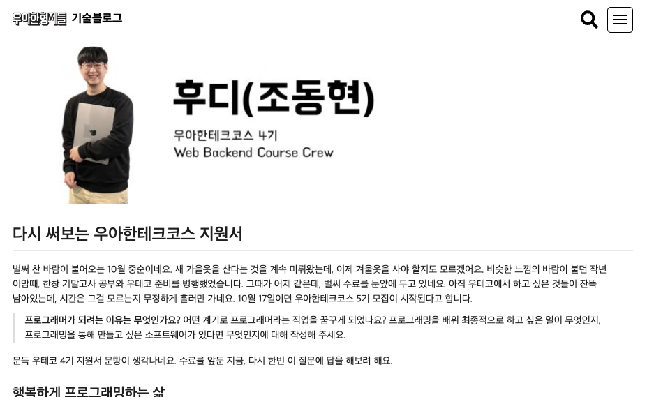
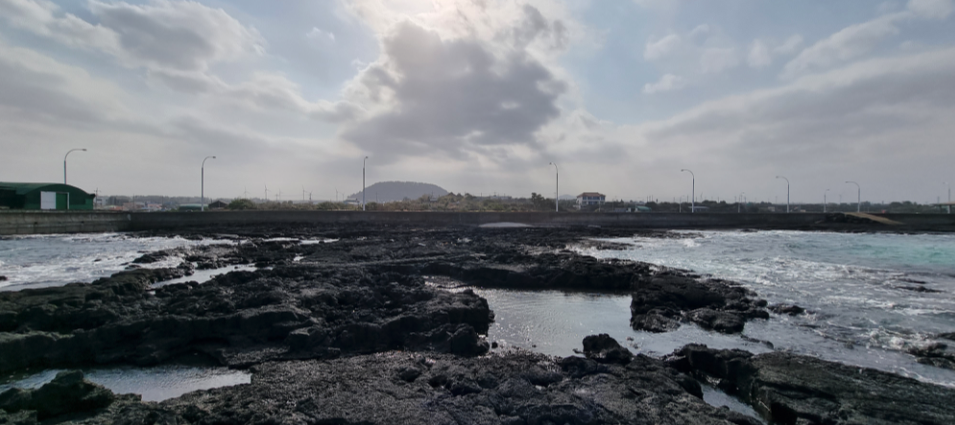

나는 걸리지 않고 무사히 지나갈 줄 알았던 코로나를 하필이면 연말에 걸리고 말았다 🤒. 연말 약속도 있고, 가족끼리 새해 해돋이도 보러 가기로 했었는데, 아쉽지만 모두 취소했다. 격리 중 할것도 없으니 제주도 여행 중 쓰기 시작한 2022년 회고를 마무리 지어보려고 한다.

## 우아한테크코스 4기 백엔드 수료

올해 2월부터 11월까지 진행된 우아한테크코스 4기 백엔드 교육 과정을 성공적으로 수료했다. 올 한해의 대부분을 차지한 빅 이벤트였으므로 이 이야기부터 먼저 해볼까한다.

### 미션에서는 무엇을 배웠을까?

#### 레벨1

레벨1 때에는 자바, 객체지향 설계, 유닛 테스트와 TDD, 페어프로그래밍과 코드리뷰 등 다양한 것을 기초적으로 학습하고 고민했다. 이 때는 아직 코로나 집합 금지가 시행중이었던 시기였기에, 온라인으로 과정을 진행했다.

나는 스프링은 커녕 자바 조차 몇번 사용해보지 않은 상황이었다. 레벨1 때 자바에 대해 기초적인 수준으로 학습했다. 특히 자바8 스펙에 대해 많은 학습을 했다.

**객체지향**에 대해 처음으로 고민해보았다. 프리코스를 준비하며 앞부분만 읽어봤던 **객체지향의 사실과 오해**를 다시 읽어보며 **적절한 역할과 책임을 부여받은 능동적인 객체**를 설계하려면 어떻게 해야할지 많은 고민을 했다. **응집도**를 높이고, **결합도**를 낮추는 설계에 대해서도 많은 고민을 했다. 이 과정에서 전략 패턴, 템플릿 메소드 패턴 등의 **디자인 패턴을 학습하고 적용**해 미숙하게나마 객체간의 의존 관계에 대한 다이어그램까지 그려보면서 많은 고민을 했었던 것 같다. 이 과정에서 **객체지향 생활체조 원칙**을 지켜가며 코드 퀄리티도 높은 수준으로 유지하기 위해 노력했다. 

**기초적인 애플리케이션 성능에 대해 고민**해보기도 했다. 자주 사용되는 값 객체를 미리 상수화 시켜놓는 방식으로 캐싱을 한다던가, String, String Builder, String Buffer 의 차이점에 대해 공부를 해본다던가… 정확한 성능 테스트는 수행하지 않았지만, 개발하면서 설계와 기능 구현뿐 아니라 성능도 신경쓰는 버릇이 이때 만들어졌다.

마지막 체스 미션에서는 콘솔 기반으로 동작하던 애플리케이션을 코드의 큰 변경 없이 **웹 애플리케이션으로 마이그레이션**해보는 경험을 하였다. 이때 스프링을 사용하지는 않았고, Spark라는 프레임워크를 사용했다. 도메인 코드를 변경하지 않고도, 콘솔 환경에서 웹 환경으로 마이그레이션 할 수 있다는 것이 너무 신기했다. **'의존의 방향은 변화가 적은 쪽으로 향해야한다' 라는 말이 어렴풋이 이해**가 되었다.

또, 처음으로 **유닛 테스트**라는 것을 작성하고 테스트를 자동화해보았다. 유닛테스트를 해보니 자연스럽게 **테스트하기 좋은 코드**에 대해서도 많이 고민했다. 첫번째 미션인 '자동차 경주'에서는 랜덤하게 동작하는 객체에 대한 테스트를 작성해야 했는데, 이 때 의존성 주입을 활용하여 테스트에 용이한 설계를 했었다. 이 과정에서 테스트 더블이란 것을 알게 되었다. 테스트를 작성하는 과정은 귀찮고 지루했다. 하지만, 많은 두려움을 없애주었다. 그리고 결과적으로 높은 생산성을 얻어갈 수 있었다.

유닛 테스트를 작성할 때에는 **TDD**를 적극 사용했다. TDD를 하는 버릇을 테스트를 작성하기 시작할 때부터 들여놓으니, 지금도 자연스럽게 TDD를 사용한다. 좋은 버릇을 만들어 놓은 것 같다.

페어 프로그래밍과 코드 리뷰 등 기초적인 협업도 처음 경험해봤다. 페어 프로그래밍을 하지 않았다면, 미션을 하나의 관점으로만 수행하게 되어 좁은 시야를 가졌을 것이다. 페어 프로그래밍을 해보니 내 생각 뿐 아니라 페어의 생각, 특히 **나와 다른 생각**을 들어볼 수 있게 되어 좋았다. 그 과정속에서 **크고 작은 토론**도 성장에 아주 큰 도움이 되었던 것 같다. 다만 페어 프로그래밍이 처음일 때는 코드를 작성하는 것 보다 말을 더 많이 하게 되어 목이 많이 아팠다 😅. 10~15분 간격으로 타이머를 맞춰두고 드라이버, 네비게이터를 번갈아가며 코드를 작성했던 그 어색함이 아직도 기억난다.

코드리뷰는 우테코를 수료하신 현업 개발자 분들께 받게 되어 정말 질 좋은 조언을 많이 받을 수 있었다. 확실히 처음 학습하는 사람의 관점과, **현업에서 여러 문제를 겪어본 실무자 관점은 큰 차이**가 났다. 내가 전혀 고려하지 않았던 케이스에 대해 리뷰어분이 문제를 제기해주시면서, 소프트웨어를 만들 때 어떤 부분을 신경써야 하는지 많이 배우게 되었다. 나도 기회가 된다면 나중에 꼭 우테코 코드 리뷰어를 해보고 싶다.

레벨1때는 주변에 잘하는 크루들이 너무 많아서, 조금 주눅 들었었다. 레벨1 기간동안 쏟아진 키워드들은 나는 온통 처음 들어보는 것들 투성이었는데, 다른 크루들은 이미 그 수준보다 한 발짝 더 나아가 있었다. 이 격차를 최대한 없애기 위해 **늦은 새벽까지 공부**했던 기억이 난다. 이 과정속에서 피로감이 꽤 많이 쌓였었고, 레벨1이 끝나갈 때 쯤에는 **번아웃 비슷한 것**이 찾아왔다. **지속 가능한 학습에 대해 중요성**을 느꼈던 것이 이쯤이었다. 조급해 하지말고, **우선순위**를 잘 설정해서, 중요한 것 부터 차근차근, **꾸준히** 공부하는 것을 목표로 하자고 생각했다. 그래도 이런 부담감 덕분에 많이 성장한 레벨이었다.

또, **좋은 학습 습관도 형성**한 레벨이었다. 예전에는 모르는 것이 생기면, 무작정 한글로 구글 검색을 해서 한글 블로그를 보는 편이었다. 이때부터는 관심있는 분야에 대해 책을 먼저 구매한 뒤, 모르는게 있으면 책장에서 책을 먼저 꺼내보는 습관이 들었다. 책이 없다면, 공식 문서를 찾아보기도 했다. 우테코 이전에는 나에게 책이란 것은 '무조건 처음부터 끝까지 읽는 것' 이었다. 그렇게 생각하다보니 책과 거리를 둔지 오래였다. 끝까지 읽을 자신이 없었기 때문이다. 지나고보니 꼭 책을 처음부터 끝까지 읽을 필요가 없었다. 물론, 서사가 있는 책은 처음부터 순서대로 읽어야겠지만, **그렇지 않은 책들은 발췌독을 해도 충분**했던 것이다. **독서에 대한 부담감을 내려 놓으니, 책을 자주 구매하게 되고, 이는 선순환**이 되었다.

#### 레벨2

이 때부터 코로나 집합 금지가 해제되어 드디어 기다리던 **캠퍼스 등교**를 하게 되었다. 우테코 합격 이후 유튜브로만 봐왔던 캠퍼스에 내가 등교하게 된다니... 정말 설렜었다. 하지만, 백엔드는 유튜브에 나왔던 루터 회관(잠실 캠퍼스)이 아니라 새로 오픈한 선릉 캠퍼스로 등교했다. 물론, 레벨3 부터는 선릉, 잠실을 번갈아가면서 등교했지만, 레벨2 때에는 조금 아쉬웠다.

레벨2때는 **스프링 프레임워크**를 이용하여 웹 애플리케이션을 개발하는 경험을 하였다. 맨 처음 '스프링 체스' 미션에서 레벨1 마지막 미션으로 작성한 체스 도메인을 그대로 스프링 애플리케이션으로 마이그레이션 하는 경험을 하였다. 외부에 종속성이 없도록 **도메인을 POJO**로 설계하는 것이 얼마나 중요한지 느꼈다.

이전에는 node.js 기반으로만 백엔드 프로그래밍을 해와서, **'빈'** 이라는 개념이 정말 난해하게 다가왔다. 어디서 생성되는지도 모르겠고, 왜 빈을 사용해야하는지도 모르겠고… 처음에는 정말 혼란스러웠다. 레벨2 첫 페어인 아스피도 스프링을 처음 사용해서 함께 신나게 헤맸던 기억이 난다. DataSource 빈을 사용하지 못해서, XML로 빈 설정을 시도하는 등 참 많이 돌아갔었다 😅.

스프링 프레임워크를 사용하면서 자연스럽게 **레이어드 아키텍처**에 대한 고민을 하게 되었다. 왜 레이어드 아키텍처를 사용해야하는지, 각각의 레이어의 역할은 무엇인지 많은 고민을 했다. 마틴 파울러 블로그에 가서 서비스 레이어의 정의를 찾아봤던 것이 기억 난다. 특히, DTO를 반환하는 레이어가 무엇이 되어야하는지, 도메인은 어디까지 노출해도 되는지에 대한 내용을 주변 크루들과 많이 이야기했었다. 또, 레이어드 아키텍처에 대한 내용은 아니지만 이때 Repository와 DAO의 차이점이 무엇인지도 관심있게 공부했었다.

자연스럽게 웹 애플리케이션을 만들게 되니, 유닛 테스트 뿐 아니라 **계층 별 테스트와 통합 테스트**에 대한 고민도 하게 되었다. 특히, 통합 테스트는 테스트 대상에 데이터베이스가 포함되다 보니 **테스트 격리**도 함께 고민하였다. 비 결정적인 테스트를 왜 피해야하는지, 어떻게 테스트간 격리를 할 수 있는지 이런 것들을 고민했었다.

'지하철 노선도 미션'을 할 때 도메인간 순환참조가 발생했을 때 머리를 쥐어 싸매고 어떻게 해결할지 고민을 많이 했던 경험이 기억난다. 의존성의 한쪽 방향에서 직접 참조를 하고, 다른 한쪽 방향에서는 ID 컬럼을 통한 간접참조를 하는것이 가장 나은 선택이라고 생각했었다. 다만, 간접 참조를 사용하는 것이 그 때에는 '객체지향적이지 않다' 라는 생각이 들어 굳이 굳이 다른 방법으로 고민을 했던 것 같다. 레벨3가 되어서야 깨달은 것은 내가 했던 고민이 당연한 과정이었고, JPA와 같은 ORM에서는 이 문제를 프록시를 사용한 지연 로딩을 통해 해결할 수 있다는 점이다.

데이터베이스는 JDBC Template을 사용하여 연결하고, 쿼리를 실행하고, 쿼리 결과를 도메인과 매핑했다. JDBC Template을 사용하는 과정에서 코드가 굉장히 더려워지고, 불편하고, 매핑하는 과정이 굉장히 귀찮았던게 기억난다. 

마지막 '장바구니 미션' 에서는 **프론트엔드 크루들과 처음으로 협업**을 해보며, 직접 애플리케이션을 EC2 환경에 배포해보는 경험까지 해보았다. 이 과정에서 AWS에 대한 아주아주 기초적인 내용과, 리눅스 커맨드, 쉘 스크립트에 대한 기초적인 내용을 학습했다. 이때, 수직 확장과 수평 확장, 세션 불일치 문제 등 인프라적인 학습도 조금 진행했었다. 이때쯤 인프라에 대한 관심이 높아졌다.

이 시기에는 처음만난 스프링이라는 거대한 프레임워크에 압도 당했었다. 스프링은 정말 복잡하고, 규모가 커대한 프레임워크이다. 아직도 함부로 '스프링 프레임워크를 잘 알고있다'는 이야기를 하기 어렵다. 어디서부터, 어떻게, 무엇을 공부해야할지 막막했었다.

사실, 지금도 스프링을 바라보면 비슷한 감정이 든다. 레벨2때와 다른 점은, '조바심을 갖지 말고, 작은 부분부터 분할 정복해 나아가면 된다'는 사실을 알고있다는 점이다.

레벨2가 시작하고 얼마 지나지 않아 16인치 M1 맥북 프로를 구매했다. 항상 금전적인 문제로 노트북을 구매할 때 저렴한 옵션으로 타협을 했었는데, 이번에는 그러고 싶지 않았다. 16인치 깡통과 14인치에 메모리를 추가한 옵션 중 고민을 많이 했다. 고민 끝에 32GB 램은 나에게는 오버 스펙이라는 생각에 도달했고, 예전부터 시원시원한 화면의 랩탑을 갖고 싶기도 해서 16인치 모델로 결정했다. 이 결정은 지금도 후회하지 않는다 😄.

#### 팀 프로젝트 (레벨3 ~ 레벨4)

레벨3과 레벨4때는 팀 프로젝트를 하며 **진한 협업과 장기간 프로젝트 경험**을 쌓았다. 감사하게도 달록이라는 정말 좋은 팀을 만났고, 큰 트러블 없이 행복하게 팀 프로젝트를 끝 마쳤다. 좋은 사람들과 함께 일하고 성장하는 것이 얼마나 행복한 일인지 알게 되었다.

처음으로 **JPA**를 사용해보았다. JDBC Template 을 사용하면 느꼈던 불편함 대부분이 해소되는 경험을 했다. 하지만 N+1 문제라던가 양방향 매핑이라던가 성능이나 도메인 구조상 신경써야하는 것도 참 많았다. 단순히 눈에 보이는 부분도 그렇지만, 영속성 컨텍스트 처럼 눈에 보이지 않는 부분에 대해서도 이해하고, 신경써야하는 부분도 쉽지 않았다.

팀원들과 함께 프로젝트 구조에 대한 고민도 참 많이했다. 서비스 레이어가 서비스 레이어를 참조하면서 발생하는 순환참조 문제부터, 도메인과 도메인간의 순환참조, 분리 인터페이스 패턴 적용, 패키지 구조에 대한 고민 (레이어 별로 패키지 분리하기 vs 도메인 별로 패키지 분리하기) 등등... **명확한 정답이 존재하지 않은 문제에 대해 달록 팀원끼리 활발하게 토론**을 했다.

배포 자동화에 참 많은 시간을 쏟았던게 기억 난다. 젠킨스를 사용하여 CD 환경을 구축했는데, 이 과정에서도 많은 문제를 겪고 해결했었다. 아무래도 EC2 t4g.micro 인스턴스를 사용하다보니 빌드를 하다 서버가 자꾸만 죽는일이 발생했다. 처음에는 스왑 메모리를 설정해서 메모리를 확보하거나, Executors 수를 1개로 제한하여 병렬적으로 빌드가 되지 않도록 제한하는 방법을 사용하였다. 그럼에도 불구하고 문제가 계속 발생해서, 마지막으로는 아예 **Controller - Agent 구조로 분산 빌드 환경**을 구축했다. 프론트엔드와 백엔드 애플리케이션이 각각 다른 인스턴스에서 빌드되면서, 기존에 존재했던 문제를 모두 해결했다. 정말 뿌듯한 경험 중 하나이다.

팀원끼리 **읽기 좋은 테스트에 대한 논의**도 오래 했다. 우리는 JUnit을 사용하면서 Given-When-Then 패턴의 BDD스타일로 테스트를 작성했다. 이때 테스트 환경 세팅 코드를 `beforeEach` 에 둘지, 각 테스트 메소드 Given 절에 둘지도 많은 토론을 했었다. 테스트 코드의 환경은 테스트 메소드에 모두 드러나있어야 한다는 의견이 우세해 중복되더라도 Given절에 **테스트 코드 가독성과 테스트 픽스쳐에 대한 고민**도 많이 했다.

토스 유튜브에 올라온 토스 SLASH 21에서 토스뱅크 이응준님께서 발표하신 **'테스트 커버리지 100%'** 라는 발표 영상을 우연찮게 본 적이 있다. 실무에서 실제 테스트 커버리지가 100%에 도달할 수 있다는 것이 정말 대단하다고 느껴졌다. 제대로 감명 받은 나는, 우리 팀도 100%는 아니더라도 **커버리지가 75% 미만으로 떨어지면 빌드가 실패**하도록 설정했다. 덕분에 높은 테스트 커버리지를 계속 유지할 수 있었다.

애플리케이션을 만들면서 **성능에 대한 깊은 고민**도 처음으로 하게 되었다. **데이터베이스 인덱스 생성, 레플리케이션을 통한 부하 분산, 로컬 캐시를 사용한 외부 API 호출 최적화** 등등… 성능을 개선하고 나서는, 실제로 성능이 개선된 것은 맞는지, 개선 되었다면 어느정도 수준으로 개선되었는지 확인하기 위해서 **JMeter를 사용하여 성능 테스트**를 진행하였다.

예전이었다면 고민 해볼 생각조차 하지 않았던, **동시성 이슈** 해결에 대해서도 많은 시간을 쏟았다. 달록에서는 동시성 이슈가 발생하지 않을 줄 알았고, 그런 이슈가 그렇게 쉽게 발생할 수 있는지도 몰랐기에 처음에는 거의 신경도 쓰지 않았다. 그런데, 예상치 못한 곳에서 동시성 이슈가 발생하였고, **낙관적 락**을 통해 이를 해결하였다.

그 외로 로깅에 대한 고민, AWS Cloudwatch를 사용한 모니터링, Sonarqube를 사용한 정적 분석, (적용하지는 않았지만) 이벤트 드리븐 아키텍처에 대한 고민, 무중단 배포 적용 등 실무에서 할 법한 고민과 기술 도입을 하게 되었다.

이 과정에서 우리 팀이 배우고, 해결한 그 과정들을 기록하기 위해 기술 블로그를 만들고 운영했다. 처음에는 처음에는 블로그와 기록을 중요하게 생각했던 나와 매트가 주도적으로 포스팅을 작성했다. 이후 글쓰기가 익숙하지 않았던 다른 팀원에게도 글쓰기를 독려하면서, 우리는 **4달동안 50개가 넘는 포스팅**을 팀 기술 블로그에 발행할 수 있었다. 글을 작성하는 과정은 당장에는 추가적인 비용이다. 하지만 글을 한번 작성해두면 나, 혹은 다른 팀원이 동일한 문제를 겪을 때 마다 문제 해결 비용을 크게 낮춰주어, 전체적인 팀 생산성을 증가시켰다.

#### 레벨4

레벨 4때는 팀 프로젝트와 미션을 병행했다. 톰캣, Spring MVC, JDBC 등 **실제 존재하는 프레임워크나 라이브러리를 아주 간단한 버전으로 바닥부터 만드는 경험**을 해보았다. 또한 **인프라 아키텍처 구성** 방법에 대해 학습했고, **레거시 코드를 리팩토링** 해보는 경험도 해보았다.

톰캣을 직접 구현하면서 **TCP 소켓을 이용하여 직접 스트림을 가져와 HTTP 요청을 처리**해보는 경험을 해보았다. 이 과정에서 서블릿에 대한 이해도가 많이 늘어났다. 프레임워크에 맡겼던 HTTP 요청 처리를, 내가 직접 처리하는 것이 굉장히 재밌었다.

@MVC 프레임워크 만들기 미션에서는 **리플렉션을 본격적으로 사용하여, 어노테이션 기반의 Spring MVC 비스무리한 프레임워크를 만들어보는 경험**을 했다. 직접 해보니 생각보다 별것 아니었다는 생각도 들었고, Spring MVC가 왜 그렇게 복잡한 과정을 통해 요청을 처리하는지 대강 알 수 있었다. 시간만 있다면, 나만의 프레임워크를 한번 만들어보는 것도 재밌을 것 같다는 생각을 했다.

JDBC 라이브러리 만들기 미션에서는 JDBC Template 라이브러리를 직접 만들어보는 경험을 했다. JDBC를 직접 사용해서, 이를 Wrapping하고 추상화하는 과정에서 템플릿 콜백 패턴을 이용해 코드 중복을 제거한 것이 생각난다. 또, 제네릭도 드디어 유의미있게 사용해보았다. 이 미션은 생각보다 어렵지는 않았었다.

마지막, 레거시 코드 리팩토링 미션은 주어진 레거시 코드를 말 그대로 리팩토링 하는 경험을 했다. 그냥 리팩토링 한 것은 아니고, **DDD를 곁들여** 리팩토링 하였다. **조영호님의 '우아한 객체지향'** 영상을 보면서, **객체의 의존관계**를 고민하느라 정말 머리를 쥐어 싸매면서 했던 미션이다. **도메인간 의존 관계를 단방향으로 유지하고, 의존성 사이클을 끊고, (적용하지는 못했지만) 도메인 이벤트도 고려하고, Bounded Context니 애그리거트니 낯선 DDD개념도 계속 튀어나오고...** 마지막 미션답게 정말 쉽지 않았다. 미션을 마무리 해가는 시점까지 '이게 맞나? 저게 맞나?' 하면서 명확한 확신이 들지 않았다. 설계에는 답이 없기 때문에, 그래서 더 어려운 것 같다.

#### 레벨5

레벨 5때는 부족한 부분에 대해 추가 학습을 진행하고, 이력서를 만들고, 면접 연습을 하는 등 취업준비에 전념하였다. 그리고 11월 25일, 수료했다.

### 스터디

레벨 별로 스터디를 하나씩 참여했다.

> - 레벨1 - [**데일리 이펙티브 자바 스터디**](https://github.com/woowacourse-study/2022-daily-effective-java)
> - 레벨2 - [**우아한 WIL (Weekly, I Learned)**](https://github.com/woowacourse-study/2022-woowahan-wil)
> - 레벨3 - [**코딩테스트 대비 알고리즘 스터디**](https://github.com/woowacourse-study/2022-lv3-algorithm-study)
> - 레벨4 - [**CS Plant 스터디**](https://github.com/woowacourse-study/2022-cs-plant)
> - 레벨5 - 면접 스터디

레벨1 때 참여한 '데일리 이펙티브 자바 스터디'는 책 **'이펙티브 자바 3판'을 하루에 3명이 각각 한 파트씩 맡아 3분내외로 발표**하는 스터디였다. 이펙티브 자바가 후반에 갈 수록 내용이 정말 어려워져서 자바도 거의 처음 써본 마당에 멘붕이 많이 왔었다.

레벨2의 '우아한 WIL'은 **내가 스터디장**을 맡았던 스터디이다. 매주 월요일 아침에 자신이 일주일간 공부해서 블로그에 포스팅 하거나, 노션에 정리했던 내용을 스터디원들에게 발표하는 스터디이다. 소수 인원으로 스터디를 진행했는데, 나름대로 성공적으로 마무리한 것 같다.

레벨3 때 참여한 '코딩테스트 대비 알고리즘 스터디'는 시간을 많이 쏟지 못한것 같아서 아쉽다. 제출을 하지 않아 벌금도 몇번 내고, 벌금을 내지 않을 정도의 최소한의 문제풀이만 했었다. 평소에 PS를 하던 버릇이 없어서 그런가, 아직까지 알고리즘 문제 풀이는 나한테는 지루한 영역이다. 요즘에는 이런 점 때문에 조금 위기감이 든다. 알고리즘 역량이 내 커리어의 발목을 잡지 않도록 앞으로는 쉬운 문제라도 꾸준히 PS 해야겠다는 생각이 든다.

레벨4와 레벨5 스터디는 달록 팀원들과 함께 진행한 스터디이다. CS Plant 스터디는 매주 각자 **자유주제로 전공 지식**을 학습하고, 그 내용을 토대로 **모의 면접**을 진행했다. 레벨5도 거의 비슷하지만, 미리 학습한 주제가 아니라 실전 면접처럼 각자가 적어온 이력서를 기반으로 모의 면접을 진행했다. 이 때에는 컬쳐핏 면접 대비를 위해 기술과 관련되지 않은 면접 질문들도 주고 받았다. 면접이 끝나면 서로 피드백을 주고 받고, 복기도 해가면서 점점 개선해나갔다. 이 때 면접을 많이 연습해둔 덕분에 실전 면접에서 큰 도움이 되었다.

### 발표

우테코는 개발자 소프트 스킬 증진을 위해 수료 조건으로 모든 크루가 **최소 한번 이상 '테코톡'과 팀 프로젝트의 데모데이에서 발표**를 해야한다. 당연히 나 또한 1번의 테코톡, 2번의 데모데이 발표를 진행하였다.

> - [**[10분 테코톡] 토닉, 후디의 인증과 인가 - 부족사회부터 소셜로그인까지**](https://youtu.be/BotXDfBPvDA?t=592)
> - [**[프로젝트 4차 데모] 달록 - 달력이 기록을 공유할 때**](https://www.youtube.com/watch?v=29Q7xo68kk0)
> - [**[프로젝트 5차 데모] 달록 - 달력이 기록을 공유할 때**](https://youtu.be/W5J49Z4qGPg?t=256)

발표는 고등학교 때 워낙 발표 수업이 많았고, 많은 사람들 앞에서 이야기한 경험이 많아서 큰 부담은 되지 않을... 거라고 생각했는데 막상 오랜만에 발표 자리에 서니 많이 긴장했다. 특히, 발표가 녹화되어 우아한형제들 유튜브에 업로드 된다고 하니 더 떨렸다. 그래도 연습을 많이 했기 때문인지 크게 절지 않고 잘 마무리했다.

테코톡은 우테코 첫번째 페어인 토닉과 함께 발표했다. 레벨2 방학 때 부터 정말 오랜 기간동안 준비한 발표인 만큼 유튜브 조회수도 나름 기대했었는데, 생각보다 그리 높은 조회수가 나오지 않아서 아쉽다 😅.

### 글쓰기

우테코는 수료 조건으로 테코톡과 더불어 **레벨 별 글쓰기**를 하나씩 제출해야한다. 따라서 나도 아래의 4개 글을 작성하게 되었다.

> - [**우아한테크코스 한 달 생활기**](https://hudi.blog/woowacourse-diary-for-a-month/)
> - [**우테코에서 찾은 나만의 효과적인 공부법**](https://hudi.blog/woowacourse-way-of-effective-study/)
> - [**팀 프로젝트가 나에게 남긴 것**](https://hudi.blog/what-the-woowacourse-team-project-left-me/)
> - [**내가 꿈꾸는 프로그래머로서의 삶 - 다시 써보는 우아한테크코스 지원서**](https://hudi.blog/rewriting-woowacourse-apply/)

매 글쓰기 마다 투표를 하여, 선정된 글은 우아한형제들 기술 블로그에 올라가게 된다. 나름 욕심을 가지고 매 글쓰기마다 많은 시간을 할애했으나, 번번히 선정되지는 않았다.

그러다 마지막 글쓰기인 주제인 '내가 꿈꾸는 프로그래머로서의 삶'의 '다시 써보는 우아한테크코스 지원서'가 다른 크루들에게 많은 투표를 받아 결국 **우아한형제들 기술블로그에 등재가 되었다**!

사실 레벨3 글쓰기까지 좋은 성과를 이루지 못해서 레벨4 글쓰기는 크게 시간을 쏟지 말고 그 시간에 다른 공부를 더 열심히 할까 고민도 했다. 하지만, 나름 글쓰기에 욕심이 있는 만큼 마지막 기회를 그냥 보내버리면 후회할 것 같아, 마지막인 만큼 가장 시간을 많이 들여 글을 작성했다. 중요한 것은 꺾이지 않는 마음이라고 했던가.

글은 [**우아한형제들 기술 블로그 '내가 꿈꾸는 프로그래머로서의 삶'**](https://techblog.woowahan.com/9433/)에서 확인할 수 있다.

글쓰기 미션은 아니지만, 우테코 크루들이 글을 기고하는 **'테코블'** 이라는 블로그에 내가 작성한 아티클이 업로드되었다. 프리코스를 준비하며, 테코블에 올라온 아티클을 읽었었다. 그 공간에 이제 내가 글을 올리게 되었다는 사실에 가슴이 벅찼다.

### 아쉬웠던 점

아쉬운 점도 조금 있다. 우선 너무 다양한 키워드가 쏟아지는데, 그 키워드들을 모두 공부하려는 욕심에 다소 학습의 깊이를 못 채웠던 것 같다. 특히, 신입에게는 크게 요구하지 않는 인프라, DevOps 과 같은 지식에 필요 이상으로 관심가졌던 것 아닌가 하는 아쉬움도 조금 든다. 물론, 재미있는 것을 공부하는것이 잘못되었다는 것은 아니지만… 그것보다 더 중요한것이 무엇인지 우선순위를 생각해볼 필요는 있었다. 그러니까, 포비가 우테코 초반부터 줄곧 강조해온 '선택과 집중'을 현명하게 하지는 않은 것 같다. 뭐, 이 부분은 앞으로 잘 채워나가면 되는 것이니까 지금 와서 생각해보면 크게 잘못되었다고는 생각하지는 않는다. 

또 아쉬웠던 점은 아무래도 인간관계를 그다지 넓게 형성하지는 않은 점이다. 우선 산더미같이 쌓인 학습양이 큰 부담으로 다가왔다. 우테코 중후반까지는 거의 자정을 넘겨 학습하다가 잠에 들었다. 그러다보니 자연스럽게 여러 친목 도모 활동이나 술자리에는 자주 참석하지 않았다. 그리고 내 내향적인 성향도 큰 영향이었다. 사실 대학교를 다닐 때에는 이 정도는 아니었는데, 여러 요인이 합쳐져서 아쉬운 결과를 만들지 않았나 싶다. 레벨1 초반에 브라운이 '우테코는 여러분들이 새로운 것을 시도해볼 아주 좋은 환경이다' 라고 이야기한 것이 생각난다. 우테코에는 참 멋진 사람들이 많았는데, 이 좋은 환경을 아쉽게 활용한 것 같다. 

마지막으로 건강 관리를 제대로 하지 않았던 점도 많이 아쉽다. 앉아서 코드만 작성하던 삶이 1년정도 반복되다보니 우테코 합류 이전과 비교해서 살이 15kg 넘게 쪄버렸다. 학습에 대한 부담감 때문이었는지, 건강은 전혀 돌아보지 못했던 것 같다. 

## 복학 vs 취업

우테코에 지원할 당시 나는 대학교 3학기를 남겨둔 상황이었다. 다들 졸업하고 우테코에 합류하거나, 1학기 정도 짧게 남겨두고 우테코를 지원하는 것을 생각하면 꽤나 많이 남겨둔 상황이었다. 당시에는 우테코에 한번에 합격할거라 생각하지 않아서, 졸업 전 기회가 있을 때 최대한 여러번 지원해보는게 유리할 것이라는 생각이었다.

사실 우테코 레벨1 ~ 2 까지는 '그냥 복학하고 공부 조금 더 한다음에 졸업하고 취업하면 되지' 라는 생각에 큰 고민은 없었다. 고민은 레벨3 중반부터 시작되었던 것 같다. 이른 사람들은 이 즈음부터 취업 준비를 시작하고, 그렇지 않은 다른 사람들도 우테코 수료 이후의 이야기를 슬슬 시작하던 때였던 것 같다. 취업계를 내어 1학기 정도는 회사와 병행한다고 하더라도, 1년은 꼬박 학교를 다녀야한다.

사실 내가 컴퓨터 공학과였다면, 크게 거부감은 없었을 것 같다. 나에게 좋아하는 공부 1년 더 하는 것은 큰 문제가 아니었다. 다만, **나는 IT와 전혀 관계 없는 토목공학과 학생**이다. 이 점이 큰 불안 요소로 다가왔던 것 같다. 또, '1년 뒤에 개발자 대우가 지금보다 훨씬 낮아지면 어쩌지?', '우테코를 수료하고 1년의 공백이 생기면, 취업할 때 불리한 것 아닐까?' 라는 별 쓸모없는 걱정도 했다. 내가 원래 걱정이 워낙 많은 사람이다.

우테코에서는 레벨별로 담당 코치님에게 면담을 신청할 수 있다. 레벨3 중반에 달록 팀 담당 코치님이셨던 네오에게 면담을 신청했고, 수료 후 복학할 생각인데 이 시기를 어떻게 보내면 좋을지 조언을 구했다. 내게 돌아온 것은 예상치 못한 대답이었다.

> **"후디는 목적과 방향성이 굉장히 확실해보이는데, 학교로 돌아가 토목 공부를 다시 하는 것은 돌아가는 길 아닐까요?"**

이 한 마디가 내 마음을 크게 움직였다. 이후 네오는 **'왜 4년제 졸업장이 필요한가?', '목표가 확실하다면 내 선택이 목표에 가까워지는 것인지 생각해보면 좋을 것 같다.', '돌아가 토목 공부를 한다고 후디의 행복도가 높아질 것 같지는 않다.', '포비가 이야기하는 반란군이 되어보는 것은 어떤가? 사회적인 통념이 나의 생각과 다르다면 나의 생각대로 살아보면 어떤가?'** 와 같은 이야기를 해주셨다.

사실 네오의 이야기처럼 생각해본적이 없던 것은 아니었다. 고등학교 시절의 나는 대학 진학에 큰 뜻을 가지고 있지는 않았다. 굳이 4년이란 시간을 대학교에서 보내기 보다는 곧바로 창업이나 개발자로서 일을 시작하고 싶었다. 그게 훨씬 더 재밌어 보였기 때문이다. 여러 현실적인 여건으로 결국 대학에 진학하긴 했으나, 그랬던 나에게 네오의 한마디는 다시 내 마음을 크게 움직였다.

포비와도 비슷한 주제로 면담했고, 비슷한 방향의 조언을 얻었다. 포비는 **오직 학위만을 위해서 복학하는 것은 그리 좋은 선택은 아닌것 같다**고 하셨다. 나도 크게 동의했다. 포비와 네오가 공통적으로 해준 이야기가 있다. 우선 섣불리 결정하기전에 **이력서 넣고, 면접 보고 합격한 곳을 만든 다음에 생각**해보라고. **선택지를 우선 늘려놓은 상태에서 고민**을 하는 것이 좋겠다는 것 이었다.

## 토스뱅크 합류 

그렇게 올해 진행된 토스 대규모 채용 때 **토스 뱅크**에 이력서를 넣었고, **최종 합격**하게 되었다.

토스의 대규모 채용 공고는 우테코 등하교길 **지하철 역 광고**를 통해 알게 되었다. 처음 채용 공고를 보았을 때는 지원할 마음이 크게 없었다. 토스 대규모 채용이 9월 21일부터 시작되었는데, 그 당시에는 위에서 이야기했듯이 복학하는 쪽으로 마음이 많이 기울어있었기 때문이다. 그런데, 시간이 지나고 많은 사람들과 이야기를 나누고, **'지금 당장 복학하는 것이 답은 아니겠다'** 라는 생각이 들었다.

그래서 채용 공고가 끝나기 하루 전, 그러니까 10월 30일날 토스 뱅크 Server Developer 포지션으로 이력서를 제출했다. 원래 토스가 채용 과정이 굉장히 속도감 있게 진행된다고 알고 있어서 서류 결과가 빨리 나올 줄 알았는데, 대규모 채용 막바지에 지원을 해서 그런가 서류 결과는 5일정도 지나서 전달받을 수 있었다.

서류 합격 결과 10일 후에 직무 인터뷰를 보게 되었다. 직무 인터뷰는 1시간 30분 정도로 긴 시간동안 진행되었으며, **꼬리 질문 형태로 깊이감 있는 질문**이 이어졌다. 내가 단순히 지식을 암기하고 있는지 검증하기 보다는, **주어진 문제를 스스로 해결해나갈 수 있는지**를 깊게 검증하려는 느낌이 컸다. 면접 전에 너무 긴장이 되어서 우황청심원을 먹었는데, 크게 효과는 없었던 것 같다. <strike>헬스 체크를 자꾸 헬스 케어라고 잘 못 말해서 부끄러웠다.</strike> 다행히 내 직무 능력을 좋게 봐주셨는지, 당일날 저녁 바로 합격 전화가 오게 되었다.

문화 적합성 인터뷰는 직무 인터뷰 13일 뒤에 보게 되었다. 면접 준비를 위해 토스의 코어 밸류는 물론, 토스 피드의 문화 관련된 모든 게시물, 유튜브, 뉴스 등을 모두 찾아보며 **내가 공감하거나, 나와 핏이 맞는 부분을 위주로 내 생각과 사례를 정리**했다. 어차피 거짓말 해봤자 바로 들통날테니, **그냥 내 스스로를 온전히 보여주자는 마음으로 준비**했다. 문화 적합성 인터뷰는 CTO님과 1:1로 카페에서 커피를 마시며 이야기하는 것과 같은 정말 편안한 분위기에서 진행되었으며, 내가 가진 토스뱅크에 대한 애정 그리고 개발에 대한 애정을 가감없이 보여주는 자리었다.

토스의 전체적인 채용 경험은 정말 좋은 기억으로 남았다. 특히, 토스의 리크루터분들이 지원자를 정말 잘 케어해주신다는 것이 느껴졌다.

그리고 문화 적합성 인터뷰 다음날 점심, **최종 합격 전화**를 받게 되었다... 😭 원래 '최종합격을 하게 되면, 그 때 복학과 취업에 대해 진지하게 고민해보자' 라는 마인드였는데, 막상 **정말 최종합격 해버리니 학교는 이미 안중에도 없더라**. 언제든지 등록금만 내면 돌아갈 수 있는 학교에 소중한 기회를 쳐내고 복학하고 싶지는 않았다.

올해 여름쯤에 토스 채용 공고를 한번 본적이 있다. 채용 공고 아래에는 **'토스가 첫 직장인 팀원은 6% 예요'** 라는 문구가 적혀있었다. 그 문구를 보고는 친구에게 장난 반, 진담 반으로 '토스의 6퍼센트가 돼야겠다' 고 카톡을 보냈던게 생각난다.

그 당시에는 그냥 던져본 패기넘치는 한 마디일 뿐이었는데, 어쩌다보니 현실이 되었다. 지금와서 다시 저 카톡을 읽어보니 기분이 새롭다. 저 메시지를 보낼때만해도 '에이, 설마 되겠어?' 하는 마음이었다. 돌이켜보니 스스로의 한계를 너무 빨리 단정하지 않았나 싶다.

회사 생활은 설렘 반, 걱정 반이다. '토스라는 업계 최고의 개발자들이 모여있는 집단에서 잘 따라갈 수 있을까?' 라는 생각과 동시에 '훌륭한 개발자 집단에 속해서 성장할 수 있어서 감사하다' 라는 2가지 감정이 동시에 느껴진다. 그래도 지금껏 잘 해내온 것 처럼 나는 토스에서도 훌륭히 해낼 수 있을 것이라고 믿는다 🙂

입사일은 2023년 1월 16일이다. 남은 기간동안은 푹 쉬면서 첫 출근할 날을 즐겁게 기다려야겠다.

### 졸업은?...

학위가 없다면, 자기자신을 끊임없이 증명하고 다녀야한다는 이야기를 꽤 자주 들었다. 포비와 면담할 때에도 이 이야기를 했었다. 포비는 딱히 이 말에 대해 부정하지는 않으셨다. 다만, '끊임없이 증명하고 다니는' 기간은 5년이면 끝난다고 한다. 아마 5년차부터는 커리어가 그 사람을 확실하게 증명하기 때문이겠지?

포비는 면담에서 **'직접 그 길을 걷기 전까지는 그 길이 괜찮은지, 그렇지 않은지 알 수 없다'**고 하셨다. **'이렇게 살아봐도 문제가 없네?' 라는 경험**을 젊을수록 겪어봐야 한다고 말씀해주셨다. 이렇게 **용기 있는 행동을 하게되면, 두려움이 사라진다**고 한다.

> 지금까지 **사회가 당연하다 생각하는 것에 의구심**을 가져보는 것은 어떨까요? (...) **동의되지 않는 권위에 굴복하지 않으며**, 저와 같이 **반란군**의 길을 걸어봐요. 반란군의 길을 걷는 것이 외롭고, 힘들때 우리 서로 의지하고, 지탱하며 같이 걸어가요. 앞으로 걸어나가는 여러분의 길을 응원합니다. *― 우아한테크코스 수료증 포비의 손편지 중*

'해외 취업을 할 때는 4년제 학위가 필요하지 않나?' 라는 생각이 들어 이와 관련한 내용을 네오와 면담할 때 이야기해보았다. 네오는 당장 명확히 해외 취업 계획이 있는것이 아니고, '언젠간 하지 않을까?' 정도의 생각으로 학위를 따려는 것은 오버 엔지니어링(ㅋㅋ)이지 않냐는 말씀을 해주셨다. 듣고 보니 맞는 말이다.

여러 사람들의 이야기를 듣고 '학위는 필요할 때 취득하자' 정도로 결론을 냈다. 추후 내 커리어에 학위가 걸림돌이 되는 순간 학위를 취득하는 것이 가장 좋다는 생각이 든다.

> 예전에는 목표를 정하는 걸 되게 좋아했어요. 취업할 때도 그랬고, 줌인터넷이라는 포털 회사로 이직할 때도 그랬었는데 일단은 그렇게 목표를 정하고 한눈 팔지 않고 끝까지 달리는 게 되게 중요하다고 생각했어요. 그렇게 달성하는 게 저한테 성취감을 많이 주니까요. 근데 이게 생각해보니까 **목표라는 건 내가 경험해본 범위 내에서 나오는 게** 목표더라고요. 그러니까 내 **경험 밖의 무언가가 벌어지려면, 목표가 있으면 안되더라고요**. 왜나면 목표를 정하면 다른 데를 안 쳐다보니까 내가 생각한 그 길밖에 못 가더라고요. 

감명깊게 봤던 이동욱님의 인터뷰이다. 이동욱님은 목표를 명확히 정하기 보다는, 하루하루 주어진 일을 열심히 하되, 전체적인 인생은 제멋대로 산다고 하신다. 그때 그때 들어온 것에 대해서는 하고 싶은 것들을 다 하는게 내가 생각해보지 못했던 것, 경험해보지 못했던 기회들을 많이 얻을 수 있다고 한다.

나도 인생의 대략적인 방향성만 가진 상태로, 기회가 주어지면 그 때 마다 내가 생각하는 최선의 선택을 하면서 살고 싶다. 대학을 졸업한 다음 취업하고, 취업한 다음 집 사고, ... 이렇게 **인생을 사회가 정해놓은 정답대로 살고 싶지는 않다**. 인생을 스타크래프트 테크트리처럼 살고 싶지는 않다. 나는 **매일을 최선을 다해 살되, 그때 그때 들어오는 좋은 기회를 잡아가며** 살아가고 싶다.

조금 다른 이야기를 해보자면, 내년 상반기부터는 정말 본격적으로 채용 한파가 예상된다. 이미 라인은 내년 3월까지 모든 채용을 동결했다고 한다. 대학을 졸업하고 천천히 취업을 준비했다면, 채용 한파를 직격으로 맞았을수도 있다. 의도한 것은 아니었지만, 어찌어찌 한파를 잘 피하고 커리어를 시작하게 됨이 다행이라는 생각도 든다.

## 누구보다 열심히 운영한 블로그

'인생에서 이 만큼 몰입할 수는 없겠다' 라는 생각이 들 정도로 **블로그 운영에 수 많은 시간을 쏟았던 한 해**이다. 내가 우테코에서 학습한 대부분의 내용을 모두 블로그에 기록했다. 회고를 작성하는 지금 기준으로 **2022년 한 해 동안 160개의 포스팅**을 작성했다. 대략 이틀에 한번씩 포스팅을 작성한 것이다.

내가 어떠한 내용에 대해 학습을 마쳤을 때, 마치 마침표 처럼 그 내용을 블로그에 정리해 올렸다. 하루하루 내가 학습한 내용이 블로그에 쌓여가는 그 즐거움 덕분에 블로깅을 계속 이어나갈 수 있었다. 내가 이렇게 열심히, 꾸준히 학습하고 있다는 것을 다른 사람에게 보여줄 수 있다는 것도 소소한 기쁨 중 하나였다.

또, 블로그는 학습 수단으로도 최고이다. 웬만하면 나는 블로그에 책 내용이나, 강의 내용을 그대로 베껴적지 않는다. 물론, 몇몇 포스팅은 책을 읽거나 강의를 듣고 적은 포스팅도 있지만, 그런 글에도 반드시 내 개인적인 생각이나, 경험을 함께 적어두려 노력했다. 이러다 보니 자연스럽게 블로그에 적은 글에 내용은 내가 이해한 내용을 나만의 문장으로 풀어쓰게 되었고, 자연스럽게 메타인지가 향상되는 경험을 하였다. 수동적인 Input 학습만으로는 내가 얼마나 이해했는지 인지하기 어렵다. Input한 내용을 능동적으로 누군가에게 설명하듯이 Output 하는 과정 속에서 비로소 메타인지가 발현된다. 이에 대한 내용은 [**경험 중심 학습을 통한 능동적인 성장**](https://hudi.blog/active-growth-through-experiential-learning/) 포스팅에서 길게 다룬 바 있으니, 여기서는 길게 이야기하지는 않겠다.

블로그를 열심히 운영하다 보면, 모르는 분들께서 가끔 글을 잘 보았다는 댓글을 남겨주시는데 그 뿌듯함 또한 큰 동기부여가 되었다. 그래서 가끔은 잘 쓴것 같은 글은 페이스북 생활코딩 그룹에 공유도 하는 편이다. 사람들이 좋아요를 눌러주고, 내 아티클을 공유해가는 것을 보면 기분이 좋다.

이렇게 운영해온 블로그는 내 자부심이 되었다.

## gatsby-starter-hoodie

2020년 11월 부터 [**gatsby-starter-hoodie**](https://github.com/devHudi/gatsby-starter-hoodie) 라는 오픈소스 활동을 해왔다. 이 프로젝트에 대해서는 블로그에서 많이 이야기 했기 때문에 자세한 설명은 생략하겠다 (여러분이 접속해있는 이 블로그가 gatsby-starter-hoodie 로 빌드되었다 😉).

이 프로젝트가 올해 드디어 **스타 수가 100개를 넘게 되었다**. 회고를 작성하고 있는 이 시점의 스타 수는 109개이다. 가끔은 다른 분들께서 이슈를 남겨주시기도 한다. 올해 우테코 생활 때문에 거의 유지보수를 하지 못했는데, 시간이 날 때 마다 쌓여있는 이슈를 처리해야겠다. 

원래 이 프로젝트는 **프론트엔드 개발자를 목표로 학습을 하던 때** 시작했다. 따라서 백엔드 코드 전혀 없이 웹 사이트를 서비스할 수 있는 React 기반의 정적 웹사이트 생성 프레임워크 **Gatsby** 를 사용하여 프로젝트를 진행했다.

하지만 나는 **작년 말부터 백엔드 개발자로 전향**했고, 백엔드 개발자가 되었다. 이 프로젝트를 현재 내 커리어에 맞는 방향으로 더 디벨롭 시켜보고 싶다는 욕심이 든다. 프론트엔드는 이미 모두 개발 되었겠다, 이제 이 프로젝트를 정적 사이트 생성기에서 실제 서버와 데이터베이스가 있는 온전한 웹 서비스로 만들어볼까한다. 사람들이 가입하고, 본인의 블로그를 개설해서 운영하는 형태로 말이다. 

물론 이미 벨로그라는 개발자를 위한 훌륭한 블로그 서비스가 존재하지만, 내가 사용할 서비스를 직접 만드는 과정은 즐거우니까 (개발자 말로는 이걸 '개밥먹기' 라고 한다 😋). 겸사겸사 유저도 생기면, 서비스 운영 경험도 생기고 좋지 뭐.

## 누군가에게 도움이 될 수 있는 사람

우아한테크코스에 합류 하면서, 주변으로부터 연락을 많이 받았다. 진로나 학습 방법을 고민하던 동아리 후배부터, 내 깃허브나 블로그를 보시고는 연락주신 일면식도 없던 분까지... 내가 가진 지식과 경험이 남들에게 큰 도움이 된다는 사실을 많이 느낀 1년이었다.

그렇게 대단한 사람이 아님에도 불구하고, 감사하게도 나를 좋게 평가해주시고 고맙다는 이야기를 건네어주시는 분들 덕분에 이런 활동에 큰 의미를 느낀다. 나는 언젠가 교육자가 될 것이다. 이런 여러 경험들이 분명 좋은 초석이 될 것이라 생각한다.

이럴수록 **자만하지 말고, 겸손하게** 내가 해야할 학습을 꾸준히 이어나가자.

## 인생 첫 자취 

레벨2 시작, 그러니까 올해 4월 즈음부터 우테코가 대면 활동으로 전환되었다. 인천에 본가를 둔 나로써는 서울로 매번 등하교하기 쉽지 않아 자취를 해야했다. 마침 감사하게도 우테코 근로 장학에 선정되어, 소정의 생활비를 지원받을 수 있게 되었다.

원래 계획대로라면 우테코를 수료하고 다시 인천 본가로 돌아가 학교를 졸업할 예정이었기에 4월부터 11월까지 단기 월세방을 구했다. 너무 단기다보니 방을 구할 수 있을지도 걱정이었는데, 다행히 2개의 선택지 정도는 있었다. 내가 취업을 해서 11월을 넘어 내년 8월까지 이 집에 더 살게될 것을 알았다면, 더 많은 선택지 중에서 더 많은 고민을 한 뒤 집을 골랐을 텐데. 조금 아쉽다.

자취를 시작하기 전에는 로망이 있었다. **널찍한 책상에 모니터암을 붙여두고, 듀얼 모니터로 사용하면서, 큰 서재에 내가 좋아하는 책을 잔뜩 꽂아두고, 액자, 조명과 같은 아기자기한 소품으로 감성도 챙기고, 집 한켠에는 소파와 50인치 TV, 닌텐도 스위치를 두고 쉴 수 있는 공간도 마련해두고, 매일 저녁 장을 보고 요리 해먹는 자취 라이프**... 지금 생각해보니 정말 말도 안되는 이야기였다.

현실은... 급하게, 저렴하게 구한 방이라서 방은 좁지, 책상, 책장은 옵션이라 원하는대로 배치도 못하지, 공부하느라 바쁘고, 귀찮아서 식사는 레토르트나 배달로 떼우고, 소파는 커녕 침대를 둘 공간도 없어서 3단 매트리스 깔고 자는 궁핍한 자취생활을 했다.

내년 8월쯤 회사 근처의 괜찮은 전세집으로 이사할 계획이다. 그 때에는 내 자취방 로망을 충족시키는 집으로 이사할 수 있기를 🥲

## 제주도 여행 

우테코를 수료하고 생각을 정리하기 위해, 꼭 혼자서 여행을 한번 떠나야겠다는 생각을 해왔다. 나는 여행을 좋아한다. 일상에서 잠깐 벗어나는 그 해방감을 즐기는 편이다. 취업에도 성공했겠다, 홀가분한 마음으로 홀로 4박 5일간의 제주도 여행을 다녀왔다.

제주시를 지나 성산읍까지 북동쪽을 여행했다. 숙소는 모두 에어비엔비로 경치가 좋거나, 감성적인 숙소 위주로 예약했다. 뚜벅이 여행이기도 하고, 다양한 숙소를 경험해보고 싶기도 해서 매일마다 숙소를 바꿨다. 카페 옆에 함께 작은 숙소도 함께 운영하고 있는 **'블랑 드 오조'** 라는 숙소가 기억에 남는다. 방 시설이 그렇게 좋지는 않았지만, 인테리어가 정말 감성적이고, 무엇보다 창밖에 성산 일출봉이 예쁘게 위치했다.

사실 여행을 시작하기 전에는 '느긋하게 걸어다니며, 올 한해를 회고하기' 라는 거창한 목표가 있었다. 다만, 하루종일 한껏 걸어다니면서 쌓인 여행의 피로 앞에서는 장사가 없었다. 밖을 조금만 걸어도 예쁜 경치가 쏟아지는데, 고작 10.9인치 아이패드 에어 화면만 바라보며 키보드를 치기에는 시간이 아까웠다. 회고 초안을 조금 끄적여오긴 했는데, 결국 노느라 목표 달성 실패 😂.

그런데 여행을 준비할 때 기대했던 것과 달리, 생각보다 그렇게 여행이 즐겁지는 않았다. 왜 그럴까 곰곰히 생각해보니, 내가 여행을 좋아하는 이유가 **'익숙함으로부터 벗어나는 것'** 이었기 때문이다. 한창 혼자 여행을 다닌 초창기에는 혼자서 여행을 떠난다는 것 자체가 나에게 낯선 일이었기 때문에, 그 자체로 신나고 설렜었다. 하지만, 이미 혼자 여행을 해본 경험이 쌓이다보니 **'혼자 여행하는 것'은 이제 나에게 새로운 것이 아니게 되었다**. 제주도에서 시간이 지날 수록 '친구랑 올걸...' 이라는 후회가 되었다. 다음 여행은 꼭 사람들과 도란도란 다니는 여행으로 계획해봐야겠다.

그리고 꼭, 다음 제주 여행때는 **차를 빌려야**겠다. 제주도는 뚜벅이로 여행하기에는 벅친 곳이라는 것을 뼈저리게 느꼈다. 난 여행지에서 생각없이 걷는 것을 좋아하는 편인데, 이번엔 너무 걸었다. 걷는게 지겹고, 힘들어서 택시를 많이 탔는데 이 돈으로 차라리 렌트를 하는게 좋았겠다. 다만, 나는 장롱면허이다. 그러니까 운전 연수부터 받아야겠다. 자동차는 여행의 질을 훨씬 높여준다는 것을 고생해가며 배웠다.

## 2023년 목표

이전까지 회고에서는 한 해를 돌아보는 정도로만 글을 작성했었는데, 이번 회고에서는 내년에 이루고자할 명확한 목표를 한번 정해보려고 한다.

### 예쁘고 넓은 집으로 이사하기

근속 6개월을 하면, 회사에서 주택 자금 명목으로 대출이 지원된다. 일단 근속 6개월까지는 지금 살던 자취방에 계속 살다가, 대출 지원을 받을 수 있는 시기에 회사 근처에 집을 구할 생각이다.

조금 비싸도 괜찮으니, 온전히 내가 좋아하는 것들로 가득 채울 수 있는 넉넉한 집으로 이사가고 싶다. 살면서 한번쯤은 내 로망으로 가득 찬 개인 공간을 만들어보고 싶다.

### 운전 연수 받기

제주도 여행하면서 차를 좀 몰 줄 알아야겠다는 생각이 많이 들었다... 제주도 여행은 뚜벅이로는 정말 쉽지 않다. 운전 면허는 이미 21살에 취득을 해두었지만, 실 운전 경력이 없어서 사실 혼자서 운전은 쉽지 않다. 자동차를 운전할 줄 알면, 생활 반경이 정말 넓어진다고 한다. 꼭 생활반경이 아니더라도, 자동차를 몰 줄 알면 여러가지 편의적인 측면에서 도움이 될 것이다.

### 재테크, 경제 공부

나는 원래부터 자산 관리나 투자 등 재테크에 관심이 있었다. 2019년 부터 소액으로 꾸준히 S&P 500이나 나스닥 ETF를 적립식 매수 했었다. 지금은 자취를 하면서 부족한 생활비를 충당하느라 꽤 많이 매도했지만… 투자를 시작하니 자연스레 경제 뉴스에도 관심이 많아졌다. 다만, 어디까지나 깊게 공부한게 아니라 유튜브 정도에서 주워들은 지식으로 투자를 하다보니 깊이가 깊지는 않다.

올해부터는 고정 수입이 생긴다. 지금은 주식만 보유하고 있지만, 이제 주식 뿐 아니라 채권, 금, 현금 등으로도 적절히 헷징해서 위기에도 유연하게 대응할 수 있는 **레이 달리오의 올웨더 포트폴리오**를 구성해보는 것이 목표이다. 또, 사회 초년생이라면 꼭 알아야하는 부동산, 대출, 보험에 대한 여러 지식도 학습해야겠다. 

이를 위해 책 **'경제상식 오늘부터 1일'**, **'월급쟁이 재테크 상식사전'** 을 구매했다. 틈틈히 읽고 경제, 재테크 상식을 키워나가야겠다!

### Passive Income 만들기

부자가 되기 위해서는 노동 수입 이외로, 내가 잠을 자도 돈을 벌어다 줄 시스템을 구축해야겠다는 생각이 든다. 두 가지로 계획 중이다. 첫번째 계획은 투자인데, 이에 대한 이야기는 바로 앞서 '재테크, 경제 공부'에서 이야기 했으니 패스하겠다.

두번째로 생각중인 방법은 **'지식 공유 사업'**이다. 인프런이나 유데미등에서 내가 알고 있는 지식을 영상으로 가공하여 판매하는 것이다. 내가 관심이 있는 주제이면서, 수요가 확실히 있는 지식이지만, 아직 국내에서 강의 형태로 판매되고 있지 않은 분야를 찾아 도전해볼 생각이다.

만만하게 보고 덤비는 것은 아니다. 주변에도 인프런에서 지식 공유 사업을 하는 지인이 있기에, 얼마나 어려운 과정인지 잘 알고 있다. 다만, **지식을 공유하는 것 자체가 내가 좋아하는 일이기도 하고, 그것으로 수익을 낼 수 있다는 사실이 매력적**이다. 나 스스로도 해당 주제에 대해 더 깊은 공부를 할 분명한 동기가 되기도 하고.

### 운동 및 건강관리

핑계지만… 올해 우아한테크코스에 집중하면서 15키로 넘게 살이 쪄버렸다. 첫 자취라서 건강하게 식단을 챙긴것도 아니고, 새벽 늦게까지 공부하면서 간식도 많이 먹었다. 더도 말고, 덜도 말고 딱 10kg만 감량하자. 회사에서 체력 단련비 지원이 나오니, 그 돈으로 헬스장에 등록해 아무리 못해도 꾸준히 런닝이라도 해보려한다.

### 사이드 프로젝트

위에서 잠깐 이야기했지만, **gatsby-starter-hoodie 를 서비스화** 시켜보려 한다. 사실 혼자 사이드 프로젝트를 진행하면서 어려운 점은 본인이 백엔드 개발자라면 프론트엔드 개발이고, 프론트엔드 개발자라면 백엔드 개발일 것이다. 나는 프론트엔드를 개발 해두었으니, 에디터라던가 관리 페이지와 같은 부분만 추가로 개발하면 나머지는 백엔드 개발에만 집중하면 된다.

### 부족한 부분 학습하기

우테코를 수료하면서 느낀 것은, 세상에 배울것은 정말 많고 아직 나는 많이 부족하다는 점이다. 우테코 과정에 참여하면서 신입 백엔드 개발자에게 요구되는 기술을 전체적으로 한 사이클 체험해보았다. 이제 1년간 넓게 수집한 키워드들에 대해 깊이 있게 공부해야할 때인것 같다.

토스뱅크 서버 개발자 직군의 기술 스택은 위와 같다. 바로 위에 적혀있는 여러 기술들과 함께, CS 지식을 함께 학습하여 펀더멘탈도 탄탄하게 만들어야겠다. 2023년엔 아래와 같이 학습하는 것을 목표로 삼고자 한다!

> - **Spring + JPA**: 인프런 [김영한님 로드맵](https://www.inflearn.com/roadmaps/149)
> - **MySQL**: 'Real MySQL' 8.0 완독
> - **네트워크**: '성공과 실패를 결정하는 1%의 네트워크 원리' 완독
> - **운영체제**: [이화여대 반효경 교수님 '운영체제'](http://www.kocw.net/home/search/kemView.do?kemId=1226304) 강의
> - **코틀린**: 'Kotlin IN ACTION' 과 '이펙티브 코틀린' 완독

그리고 내가 **회사에 합류하고 요구되는 기술**들은 그 **필요와 우선순위에 따라 다시 한번 목표를 세워**봐야겠다. 아직 첫 출근도 안한 상태로 어떤 기술을 어떻게 배워야겠다고 계획을 하는 것은 조금 무리가 있다고 생각된다.

이 외로 학습하고 싶은 키워드는 클린 아키텍처, 헥사고날 아키텍처, MSA, 이벤트 드리븐, Spring Batch, Spring Security, Docker, k8s, AWS, Redis, Kafka, Query DSL, ELK Stack, Grafana, Prometheus 등등… 전부 나열하자면 끝도 없는 것 같다. 배우고 싶은 것은 가득하지만, 한번에 모두 배울 수 없으니 우선순위를 잘 설정하여 선택과 집중을 해보자.

### 꾸준히 알고리즘 문제 풀기

PS를 너무 등한시해왔다. 이제 정말 알고리즘 공부를 할 때가 되었다. 대책없이 거창한 목표는 실패하기 마련이니, **'백준 골드 달성' 정도**로 목표를 잡을까 한다. 2023년까지 '알고리즘 마스터가 될거야!' 같은 느낌보다는 '아, 알고리즘 문제 풀이도 재밌구나' 라는 느낌을 얻어가고 싶다.

## 2022년 총평

벌써 2022년이 훌쩍 지나가버렸다. **20대의 60%**가 지나갔다. 시간이 예전과 다르게 정말 빠르게 흐르는 것 같다. 그 만큼 올해를 꽉 채워 몰입했다는 증거인 것 같기도 하다.

올해는 말 하는대로 성취해온 성공적인 한 해였다. 우아한테크코스도 잘 수료하고, 감사하게도 나에게 과분한 좋은 회사에 합류하게 되었다. 취업은 끝이 아닌 시작이다. 앞으로 내가 가지고 있는 훌륭한 개발자 이미지에 더 가까이 다가갈 수 있도록 꾸준하게, 겸손하게 살아가야겠다.