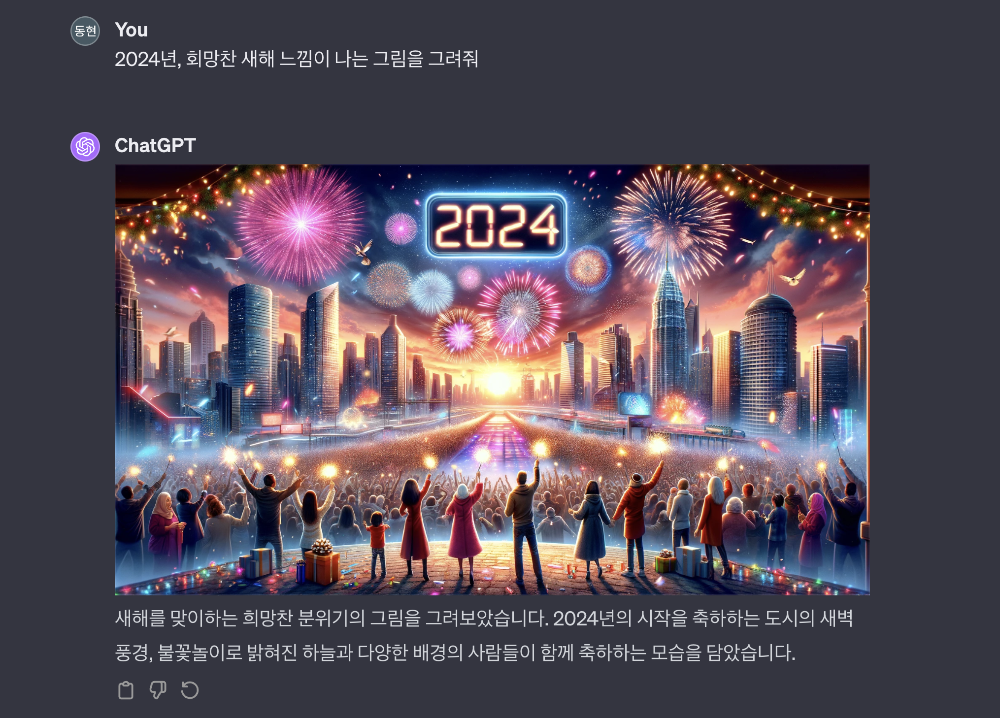

벌써 20대 후반이다. 아직 친구들과 만나면 중고등학교 시절 이야기를 마치 어제일처럼 이야기 하는데, 벌써 20대 후반이라니.

항상 회고는 12월 31일 또는 1월 1일에 올렸던 것 같은데, 올해 회고 작성은 바쁘다는 핑계로 차일피일 미루다 지금에서야 완성해서 포스팅한다. 그리고 회고가 단지 매년 형식적으로, 의례적으로 하는 행위가 되지 않기 위해서 고민을 많이 했던것도 크다.

2023년에는 어떤 것들을 배웠고, 2024년에는 어떤 목표를 갖고 살아가면 좋을까?

## 2023년 돌아보기

### 1년차 개발자

눈 깜짝할새에 2년차 개발자가 되었다. 현재 크게 만족하며 회사 생활을 하고 있다. 일이 결코 쉽지는 않지만, 대한민국 금융 혁신에 자그마한 기여를 하고 있다는 사실에 큰 자부심을 가지고 있다. 여전히 코딩은 재미있기도 하고.

회사 문화 특성상 개발과 출시 사이클이 빨라서, 크고 작은 다양한 제품을 출시했다. 몇몇 내가 참여한 몇 제품은 인터넷 뉴스로 보도되기도 했다 (**[기사1](https://www.mk.co.kr/news/economy/10755487)**, **[기사2](https://biz.sbs.co.kr/article/20000148965)**).

사실 중간중간 기록 없이 온전히 기억에만 의존하려 1년을 되돌아보려니 생각보다 어려웠다. 모든 경험을 적고 싶으나, 기억에만 의존한 탓에 빼먹은 경험들도 많을 것이다. 올해는 짧은 주기로 회고를 꾸준히 해두어야겠다.

#### 첫 출시

회사에 합류한지 얼마 되지 않았을 무렵 새로운 제품을 도맡아서 출시하게 되었다. 개발 기간은 대략 2주정도 주어졌던 것 같다. 다만 비슷하게 동작하는 기능이 존재했고, 새로운 비즈니스 요구사항에 따라 약간의 코드만 얹으면 완성될 것이라고 생각했다.

내 예상은 틀렸다. 단순하게 핵심 기능만 생각하고 괜찮은 일정이라고 생각했는데, **개발을 이어가다보니 점점 더 개발해야할 것들이 드러났다**.

이를테면 기능을 사용하기 위한 퍼널에서 받아야하는 약관 동의가 있었다 (핀테크 회사에 재직중이다 보니 약관, 법률 등의 컴플라이언스 측면도 고려해야할 때가 많다). 약관을 동의받아야 하는지도 알지 못했고, 약관에 대한 도메인 지식, 약관을 처리하는 기술적인 방법도 모르고 있었다. 찾아보니 약관에 대해 처리하는 서버가 있어, 해당 서버를 호출하는 방식으로 구현해볼까 했는데, 또 우리팀에서는 약관 동의와 다른 비즈니스 로직을 한번에 처리하도록 aggregation 된 API가 있어서, 그것을 호출해야 했다. 마감 기간이 임박했는데, 이런 복잡한 도메인과 구조를 단번에 이해하기 어려웠고 멘탈이 흔들렸다.

이와 같이 **필요한 비즈니스 요구사항을 구현이 한창 진행되는 도중에 인지하게 되는 문제가 발생하여, 최초 계획한 출시일 대비 며칠 더 늦게 출시하게 되었다**. 다행히 테스트코드를 촘촘히 잘 작성하여 기능이 오작동하는 일은 발생하지 않고, 지금까지 평화롭게 잘 운영되고 있다 (다만, 여러 사정으로 지금은 Fade out 되었다).

이 경험을 포함해서, 이후 계속 신규 기능을 런칭해가면서 배운 점들을 아래에 정리해보았다.

- **도메인 지식 이해도는 정말로 중요**하다.
  - 도메인에 대해서 모르거나, 잘못알고 있으면 엉뚱한 결과물이 나올 수 있다.
  - 도메인 지식 이해도가 낮다면, 비개발자와의 커뮤니케이션 비용이 높아진다.
  - 따라서 시간이 날 때 마다 도메인 지식에 대한 공부도 필요하다.
- **비즈니스 요구사항을 이해하는 것은 개발자의 중요한 책임 중 하나**이다.
  - 모르는 것에 대해 질문하는 것을 부끄러워 말고, 더 적극적으로 질문하자.
  - 기획 시점에 정책, UI 등을 꼼꼼히 검토하고, 이상한 지점이 있다면 이야기하자.
- **개발 기간 산정에 대한 책임 또한 개발자에게** 있다.
  - 비개발자는 해당 기능이 완성되려면 얼마나 시간이 소요되는지 알 수 없다.
  - 심지어 개발자도 이를 예측하기 어렵다. 따라서 고려하지 못한 부분이나, 엣지케이스 등의 돌발상황을 대비하기 위한 충분한 버퍼 기간을 두어야 한다.
  - 이미 정해진 기간을 넘길 것 같다면, 이를 솔직하게 팀에 공유하는 것도 개발자의 책임이다.

#### 트래픽 이관 작업

다른 팀이 가지고 있던 일부 DRI(Directly Responsible Individual, 쉽게 역할/책임 범위 정도로 생각하면 될 것 같다)가 우리 팀으로 이관되면서, API를 신설하여 **대략 4000~5000 TPS 규모의 트래픽을 우리 팀 서버로 옮겨오는 작업**이 필요했다. 해당 작업을 내가 맡아 진행하게 되었다.

다른 팀 서버에 있었을 때에는 **캐시가 적용되어 있지 않아서, 요청마다 데이터베이스 부하도 정비례하여 상승**하는 구조였다. 또 옮겨오려는 TPS가 기존 우리 팀 서버가 받고있던 전체 TPS의 4~5배는 되는 규모여서, 최대한 부하를 낮추는 것이 안전해보였다.

따라서 우리팀 서버로 해당 API를 옮겨오면서 적절히 캐시도 함께 적용했다. 배포 전 SRE, Devops 분들의 도움을 받아 nGrinder를 통해 부하 테스트도 진행해보았고, 별다른 특이한 지표도 보이지 않았다. 이 결과 리소스 증설은 필요 없다는 판단이 들었고, **문제 없이 대량의 트래픽을 우리 서버로 이관**해올 수 있었다.

캐시가 잘 적용되어 **데이터베이스 조회 부하도 절반**으로 줄어들었고, **단건 조회 API를 여러건 호출하는 구조를 다건 조회 API를 1회로 호출하는 구조로 개선하여 타 팀에서 발생하고 있던 8000 TPS가 우리팀에 이관되며 4000 TPS 정도로 줄어들었다**.

#### 돈을 버는 조직에서의 개발 경험

돈을 버는 조직에서 일한 경험은 내게 일정과 우선순위의 중요성을 깨닫게되는 계기가 되었다.

1. 시간과 자원이 한정된 환경에서는 **품질과 일정 사이에서 저울질**을 잘 해야한다.

   > 일정과 퀄리티는 어느 한쪽을 포기해야한다와 같은 시소 관계가 아니라, **어떻게 하면 아무리 급해도 항상 80~90점의 소프트웨어를 개발할 수 있는지**가 중요하다.

   이동욱님의 [**소프트웨어 원칙 만들기**](https://jojoldu.tistory.com/686) 라는 포스팅에서 읽게된 문장이다.

2. 시장에 임팩트를 내기 위해서는 일의 **우선순위**를 잘 설정해야하며, 특히 **해야할 일과 하면 좋은 일을 구분**할 수 있어야한다.
3. **의사결정은 실제 데이터를 기반으로 수행되어야 한다.**
4. 처음부터 완벽함을 추구하기 보다는, **우선 작은 단위로 빠르게 출시하여 시장의 피드백을 받고, 제품을 점진적으로 개선해나가야한다.**

   예전부터 교과서적으로 알고 있던 애자일 원칙인데, 회사에서 직접 일을 해보며 제대로 경험했다.

#### 높은 난이도의 도메인과 그에 따른 복잡한 로직들

핀테크 기업에 재직중이다보니, 금융 도메인과 자주 마주하게 된다. 금융 도메인은 그 특성상 난이도가 높다. 거기에 더해 각종 복잡한 법률과, 여기에 맞춰진 정책들은 매우 복잡하였다. 거기에 더해 수 많은 엣지케이스와 히스토리 까지… 이런 정책을 구현한 거대한 코드베이스에 압도당하기 쉬웠다. 이러다보니 변경에 대한 두려움은 컸다.

이 두려움을 극복할 수 있게 만들어 준 것은 테스트 코드 덕분이다. 우리 팀은 무려 테스트 커버리지 100%를 유지하고 있다 (**[토스 SLASH 21 - 테스트 커버리지 100%](https://www.youtube.com/watch?v=jdlBu2vFv58)**의 팀이 맞다). 물론, 높은 테스트 커버리지가 버그와 장애가 발생하지 않음을 보장하는 것은 아니다. 그럼에도 불구하고 테스트 커버리지가 높다면 아래의 두가지 장점이 존재한다.

1. **리팩토링 자신감이 크게 높아진다.**
2. **테스트 코드 자체가 문서역할을 하여 기존 도메인을 이해하는데 도움을 준다. 이는 테스트 코드를 신규로 작성할 때에도 마찬가지이다.**

다만 복잡한 도메인, 정책 등을 이해하고 잘 기억하는 것에 대한 고민은 여전히 남아있다. 문서화를 잘 해두는 방법도 있겠지만, 일정에 맞춰 달려가다보면 놓치기 쉬운 부분인 것 같다. 도메인 전문가와 적극적으로 대화하며 의문점들을 해소해나가는게 가장 중요할텐데, 나에겐 그런 적극성이 부족하지 않았나 반성해본다.

복잡한 도메인과 코드들을 다루며 배운것들은 아래와 같다.

- **타인이 작성한 거대한 코드베이스는 이해하기가 정말 어렵다**.
  - 단순히 로직이 이해가 어려울수도 있지만, 여러 도메인 지식과 히스토리가 엮이면 복잡도가 더 커진다.
  - 이 문제를 어떻게 슬기롭게 해쳐나갈 수 있을지는 아직 고민중이다.
- **새롭게 알게된 내용은 반드시 메모**하자.
  - 인간은 망각의 동물이므로, 겨우 한번 들은 내용은 까먹기 마련이다.
  - 타인과 망각한 미래의 나를 위해 귀찮고 시간이 들더라도 문서화를 할 필요가 있다.
  - 유용한 도메인 지식, 히스토리, 정책 등은 슬랙의 '나중에' 기능을 사용하면 좋다.
- 누군가 정책이나 로직을 물어보았을 때 바로 답변할 수 없다면, **이해한 것이 맞는지 의심**하자.
  - 시간이 조금 걸려도 괜찮으니, 구현하는데만 급급하지 말고, 정책과 로직을 완전히 이해하는데 시간을 많이 쏟자.

#### 외부 기관과의 협업 경험

최근 개발하고 있는 기능이 외부 기관과 연계되어 동작하다보니, 외부 기관과 유선 또는 이메일을 통해 연락을 주고 받거나 외부에서 미팅을 하는 경우가 잦았다. 사실 이런 경험은 일반적인 서버 개발자의 경우 많이 겪어볼 일은 아닐것이다.

앞서 이야기한 **높은 난이도의 도메인과 연동 기관의 레거시 시스템**(전문통신)은 나를 막막하게 만들었다. 모르는것이 무엇인지 모르는 상황에서는 무엇을 질문해야하는지 알 수 없으니 질문 조차 어려웠다. 적어도 의미있는 질문정도는 하기 위해서, 연동 기관에서 준 설계서(이런 설계서를 읽게될 줄 몰랐다)를 정말 수 번 반복하며 읽어보았다. 그 결과 전체적인 그림이 머리속에 그려졌고, 그 세부적인 내용은 연동 기관과의 커뮤니케이션을 통해 그려 나아갔다.

덕분에 성공적으로 연동, 대사, 정산 절차를 모두 구현하였다. 이 과정을 스스로의 힘으로 해내었다는 점이 큰 성취라는 생각이 든다. 다만 돌아보면 너무 주변 동료의 도움을 받지 않았다는 생각도 든다. 주변 동료의 도움을 받으면서 진행했다면, 훨씬 더 매끄럽고 빠르게 일을 처리할 수 있었을지 모른다. 또 동료와 함께 자연스럽게 맥락을 공유할수도 있었을 것이며, 이는 **장기적으로 보았을 때 팀에 더 이롭다**. 나 스스로 해내는 것도 좋지만, **욕심을 조금 덜어내고 기꺼이 동료에게 도움을 요청할 수 있는 사람이 되고 싶다**.

#### 장애 경험

로직의 최적화를 위해 특정 조건에서는 데이터를 적재하지 않아도 된다고 판단하여, if문 한줄을 추가한적이 있었다. 그런데 이는 잘못된 판단이었다. 실제로는 적재가 필요 없다고 생각한 조건에서도 데이터는 반드시 적재해야되는 상황이었으며, 따라서 이 데이터를 참조하고 있는 다른 팀의 서비스에서 데이터 정합성이 깨져버리는 문제가 발생하였다.

데이터 정합이 깨진 상황은 단순히 특정 서비스가 다운되어 이용이 불가능한 상황보다 **복구가 더 까다롭다**. 장애 발생 범위를 파악하고, 정합이 맞도록 DB 데이터를 정정해야하기 때문이다. 그런 장애를 내가 내버린 것이다.

시급도가 높았던 까닭에 밤을 새서 복구하였다. 다른 팀의 도메인에 대해 잘 알지 못하는 상황이었고, 긴장하면 사고가 더 느려지는 까닭에 (정말 극복하고 싶다), 같은 팀 개발자분께서 정말 큰 도움을 주신것은 지금까지도 죄송하고 감사한 마음이다. 그리고 갑자기 마른하늘에 날벼락을 맞으신 다른팀 개발자분들께도 아직도 죄송한 마음이 든다.

다행인것은 배포 당시에 민감한 로직에 대한 변경이므로 **카나리 배포를 아주 천천히** 나가고 있었고, 10% 정도 배포된 상황에서 문제를 인지했다는 점이다. 카나리 배포의 의의를 온몸으로 맞아가면서 배웠다.

MSA는 모놀리식 아키텍처와 다르게 **의존 관계가 명확히 보이지가 않는다**. 해당 로직과 데이터를 다른 서비스가 어떻게 참조하고 있는지 코드를 전수조사하거나, 호출 로그를 살펴보는 방법 외에는 알길이 없다. 따라서 **인터페이스의 변경이나, 데이터를 기존과 다르게 적재하는 등의 변화는 신중히 적용**해야한다.

#### 훌륭한 동료들

입사 전 나의 기대처럼 회사에는 정말 훌륭한 동료들이 많았다. 주변을 둘러보면 온통 배울점들이 가득하다. 롤모델로 삼고 싶은 분들도 가득하다. 요즘엔 어려운 문제를 마주하면 'OO님 이라면 어떻게 생각했을까?' 라며, 훌륭한 다른 동료라면 어떻게 대응했을지를 생각해보기도 했던 것 같다.

> **가장 못하는 사람이 되라.** 역량을 갖추고, 인정받는 개발자가 되는 가장 좋은 방법은 주변에 뛰어난, 역량 있는 개발자와 함께 하는 것이다. 내가 속해 있는 커뮤니티, 스터디 모임, 팀 내에서 가장 못하는 사람이 되는 것이다.

[**박재성(자바지기)님의 브런치**](https://brunch.co.kr/@javajigi/46)에서 발췌해온 문장이다. 좋은 의미로 나는 회사에서 가장 못하는 사람이다. 다만, 이런 환경은 내 관점에 따라 압박감이 느껴지는 환경이 될 수 있다. 따라서 나는 더 마음을 더 단단하게 만들고, 이 훌륭한 환경을 내 성장의 동력원으로 사용해야할 필요가 있다. 타인과 비교하지 말고, 내 페이스에 맞춰, 스스로와 경쟁하자. 어제보다 더 나아진 나의 모습을 바라보며 성장의 기쁨을 만끽하자. 그걸로 충분하다.

#### 코드리뷰

어떻게 하면 코드리뷰를 잘 할 수 있는지 고민하고 있다. 코드리뷰를 시작한지 초반에는 **'코드 스타일만 리뷰하지 않았으면 좋겠다'**는 피드백을 받은적이 있다. 사실 단순한 코드 스타일에 대한 리뷰는 린터에게 맡겨도 충분하다. 그리고 코드 스타일은 개인의 취향에 따라 갈리는 경향이 있고, 이는 팀의 전체적인 컨벤션만 크게 벗어나지 않는다면 존중해야 한다고 생각한다.

코드 리뷰는 기존 코드베이스에 대한 이해와 상대방이 작성한 코드에 대한 이해가 필요하다. **일이 많다는 것을 핑계삼아 더 깊이 있는 리뷰를 포기한 것은 아닐까**. 내 리뷰가 팀원들에게 실질적으로 도움을 줄 수 있도록, 내 리소스를 더 할애할 필요가 있다. 또 다른 팀에서는, 다른 회사에서는 코드리뷰를 어떻게 하는지 참고해보고, 나에게 도움될만한 방법론을 찾아볼 필요도 있다.

#### 초조함과 부담감 걷어내기

대부분의 일은 일정이 정해져있고, 그 일정은 대부분의 경우 넉넉치 않다. 그런 상황이다보니 더 좋은 설계, 성능을 신경쓰지 않았다. 단위 시간 당 쳐내는 이슈 티켓의 개수가 그 사람의 생산성과 능력을 나타내는 지표라고 오해 하기도 했던 것 같다. 초기에는 스스로를 증명해야한다는 부담감도 컸고.

좋은 코드를 작성하기 위한 원칙들은 무시한채, 동작하는 코드를 작성하는데만 집중했다. 이후에 리팩토링을 하기 위한 시간도 확보하기 어려웠고, 그 코드는 새로운 레거시가 되었다.

언젠가 다른 팀원분과 함께 문제 원인을 분석할일이 있었다. 나는 적당한 선에서 만족하고 넘어가려 했는데, 팀원분께 **'어, 이거 왜 그런지 더 궁금하지 않으세요?'** 라는 이야기를 듣게 되었다. 그러게, 나는 왜 더 궁금해하지 않았을까.

잃어버린 호기심을 되찾을 차례다. 조금만 더 문제의 원인과 결과, 내부 동작 방식, 도메인 지식과 정책에 조금 더 관심을 쏟았다면 더 좋지 않았을까? 사실 심적으로 여유가 없던것이지, 물리적인 절대 시간은 내 생각만큼 부족하지 않았을지도 모른다.

비슷한 이유로 스터디 참여나 기술 공유 자리에 참여하는 것을 소홀히 했다. 그렇지 않아도 컨텍스트 스위칭이 잦게 되는 환경인데, 그런 자리까지 참여하기에 심리적인 부담이 컸던 것 같다.

**초조함과 부담감을 조금 걷어내고 여유를 확보할 필요가 있다. 확보한 여유를 깊이있는 고민과 학습에 투자하자.**

#### 극복해야할 심리적 허들

나에게는 극복해야하는 큰 심리적 허들이 있다. **타인의 시선과 평판에 크게 예민**하다는 점이다.

그래서 그런지 질문하는 것이 어렵다. 질문은 스스로의 무지를 타인에게 드러내는 과정이다. 나의 무지를 상대방에게 드러내는 것이 두려웠다. 뭐랄까 스스로의 밑천을 드러낸다는 생각이 들었던 것 같다. 질문을 할 때에는 상대방의 시간을 빼앗는 것 같은 기분도 들고, 스스로가 바보같아 보이고, 신뢰를 잃지 않을까 걱정한다.

같은 이유로 적극적으로 의견을 피력하는게 어렵다. 스스로의 의견이 있음에도 위와 비슷한 이유로 입 밖으로 꺼내기를 꺼려한다.

'나는 이 모든걸 알고 있어야 해', '나는 항상 모두가 납득할만한 옳은 말만 해야해' 라는 **오만함**일 수도 있다. 자신의 **부족함을 인정하고, 내려놓고, 드러내는 과정**이 있어야 인간은 성장하는 것 같다.

희망적인 점은 지금은 의식적으로 개선해보려고 노력을 하고 있고, 아주 조금이나마 점진적으로 개선되고 있다는 것이 느껴진다. 나는 아직 실패 내성이 부족하다. 조금 더 도전하고 실패를 해보며 내성을 키울 필요가 있다. 지금 내가 이 위치까지 성장해왔던 것 처럼 **나는 반드시 이런 심리적인 허들도 극복**할 것이다.

### 스터디

2023년엔 크게 2개의 스터디를 했다. 첫번째로 인프런에서 수강 가능한 **'김영한님의 스프링 로드맵'**을 함께 모여서 수강하는 스터디, 두번째로는 책 **'코틀린 코루틴'** 스터디이다.

#### 김영한님의 스프링 로드맵 스터디

대학교 멋쟁이 사자처럼 동아리 사람들 중 스프링 학습에 관심있는 사람들을 모아 내가 직접 개설한 스터디이다. 23년 3월 12일에 시작해서 9월 3일까지 진행했다.

스터디는 한 공간에 모여서 인프런 김영한님의 스프링 강의 로드맵을 일정 시간동안 듣고, (어쩌다보니) 마지막에 내가 질의응답을 받는 형식으로 진행되었다. 질의응답 과정에서 내가 잘못 알고 있었거나, 알고 있던걸 다시 정리할 수 있었다.

아쉬운점은 거대한 로드맵을 다같이 모여 처음부터 듣는것이 꽤 **피로감** 있었던 것 같다. 난이도가 쉽지는 않다보니 중간에 많이 버거워하는 스터디원도 보였는데, 잘 챙겨주지 못한 것 같아 미안한 마음이다.

사실 그래서 로드맵을 처음부터 끝까지 완주하는데는 실패했다. 스프링 DB 2편 - 데이터 접근 활용 기술 (JdbcTemplate, JPA, QueryDSL 등 단순 라이브러리 사용 부분 제외) 까지만 듣고, 스프링 핵심 원리 고급편과 스프링부트 강의는 수강하지 못했다. 다행히 거대한 페이즈(?)는 끝났던 때라서 스터디를 끝내기에 애매하지는 않은 타이밍이었다.

사실 로드맵의 9개의 강의 중 6강(HTTP 강의는 스터디 전에 각자 들어오기로 했다)을 함께 들었는데 결코 적은량을 스터디 한건 아니라고 생각한다. 당연히 후반부까지 달려왔다면 지칠만 하다고 생각한다. 내가 스터디 처음에 열정에만 가득 차서 사이징을 잘 못했다고 생각한다.

무작정 로드맵을 다 들어야한다는 약간의 강박이 있었던 것 같다. 그리고 그 부작용으로 당장 내가 현업에서 사용하지 않고 있고, 또 근시일내로 사용하지도 않을 것 같은 부분을 공부할때는 크게 지루함을 느꼈다. 역시 **내가 진정 필요로 하는 것을 학습할때가 가장 효율이 높은 것** 같다.

#### 코루틴 스터디

회사 코드 베이스가 100% 코틀린이다보니, 비동기 작업을 쓰레드를 사용하기 보다는 대부분 코루틴을 사용한다. 그런데 코루틴에 대해 이해도가 높지 않다보니, 코루틴을 쓰는 코드는 (안그래도 비동기라서 로직이 복잡한데) 이해하기가 어려웠다.

그래서 사내 우테코 동기들과 함께 코루틴 스터디를 시작했다. 스터디에서 사용하는 책은 **코틀린 코루틴**이다. 아직 스터디 초반이라서 회고에서는 크게 돌아볼 내용은 없다. 호기롭게 시작했으나 막상 책을 열어보니 높은 난이도에 다들 당황했는데, 무사히 잘 마무리 했으면 한다.

그 외로도 회사내에서도 스터디가 자주 개설되는데, 이런 저런 스터디에 많이 참여하지 못해 아쉽다. 당시에는 일에 익숙해지는 과정 그리고 주어진 이슈 티켓을 쳐내는 것들에 대부분의 에너지를 쓰고 있었다. 올해는 관심 있는 주제가 있다면 무리 하지 않는 선에서 적절히 스터디에 참여해야겠다.

### 퍼블릭 스피치

올해는 대중 앞에서 이야기를 할 기회를 몇번 얻었다.

첫번째는 대학생 시절에 활동했던 '멋쟁이 사자처럼' 동아리 후배들 앞에서 현업자로서 질의응답을 하게된 경험이다. 우리 학교 멋쟁이 사자처럼은 종종 자체적으로 해커톤을 개최하는데, 중간 쉬는 타임에 들어가 이야기하게 되었다. 그곳에서 나를 원래부터 알고 있었고, 나와 이야기를 나누고 싶어했던 분도 만나뵙게 되었다. 이런 경험은 나에게 큰 에너지가 된다.

두번째로는 IMPACT CONNECT 세미나에 연사로 참여하여 발표했던 경험이다. 개발자를 꿈꾸고 있는 고등학생분들을 위한 발표이다보니, (물론 나도 한참 부족하지만) 개발자로서 어떻게 성장하면 좋을지 개인적인 생각을 발표자료에 담았다. 그래서 나온 발표제목 **“개발자, 성장하는 '척' 말고, 진짜 성장하기”**. 개발자를 꿈꾸던 초, 중, 고등학생 시절, 깊은 고민 없이 소프트웨어를 만들면서도 스스로 성장하고 있다고 착각했었던 내 모습이 생각나 이렇게 짓게 되었다. 발표자료는 [**슬라이드 쉐어**](https://www.slideshare.net/ssuserc36e7d/ss-9318)에 올려두었다. 세미나는 추후 기사로도 보도되었다 (**[기사1](https://platum.kr/archives/211747)**, **[기사2](https://www.eduyonhap.com/m/page/view.php?no=75461)**).

발표가 끝나고 많은 분들이 나에게 와주셔서 질문을 해주셨는데, 정말 고등학생이 맞는지 의심될 정도로 수준 높은 질문을 주셔 도리어 내가 긴장될 정도였다. 특히, 코틀린에서 JPA를 사용할 때 data class 를 사용할 때 얻는 장점(copy 가능성 등)과 단점(dirty checking 불가능 등)을 사이에 두고 고민을 하고 계신 분이 기억에 남는다.

마침 발표를 준비하던 때가 주변 잘하는 사람들의 성장 공식에 대해 고민을 많이 하던 시기였는데, 발표를 준비하면서 내 스스로도 여러 생각들이 정리된 것 같았다. **앞으로도 내가 갖고 있는 것들을 나눌 수 있는 행사에 많이 참여하고 싶다**.

### 블로그

2023년에는 블로그에 포스팅을 많이 하지 못했다. 겨우 11개 썼다. 22년에 160개를 작성한 것과 크게 비교된다. 근데 당연히 22년의 나는 굳이 따지자면 공부하는게 직업이었으니 그럴만 하다고 생각한다. 그렇기에 당연히 그때의 페이스와 비교하기엔 무리가 있다.

올해에는 블로깅을 통해 더 가파른 성장을 하기 위해 2가지 실험을 해볼까 한다.

첫째로 **블로그 포스팅 작성 방식**이다. 이전에는 공부하고 싶던 주제에 대해 자료를 수집해가며, 새로운 내용을 알게될 때 마다 즉시 정리하였고, 정리한 내용을 베이스로 글을 쓰기 시작했다. 그러다보니 이미 존재하는 자료들을, 내 문장으로 수식하는 정도의 글쓰기를 하게 되는 경우도 있었다. 이 과정은 비교적 생각의 깊이가 낮다는 생각도 들게 되었다. 올해부터는 특정 주제에 대해 학습하며 자료는 수집하되, **글 작성은 백지부터 시작**해보고자 한다. 방금 학습한 내용을 키워드 중심으로 완전히 재구성하면, **더 효과적으로 인출(Output)**해볼 수 있을 것 같다는 생각이다.

두번째는 블로그 작성 루틴에 대한 실험이다. 지금까지는 남들에게 보여줄만큼 적절히 높은 난이도인지, 글의 길이가 너무 짧지는 않은지, 글의 퀄리티는 일정 수준 이상인지를 스스로 판단하고 게시물을 공개했었다. 덕분에 블로그에는 스스로 만족할만한 일정 수준 이상의 퀄리티의 글만 발행할 수 있게 되었다. 그런데 블로그를 나의 '성장 수단'이라는 관점에서는 이 제한이 하나의 허들로서 작동했다. 꾸준히 글을 작성하는 것 또한 중요한데, 이런 허들이 되려 스스로 하여금 글을 작성하지 않게 한다는 사실을 발견했다. 그래서 올해에는 **글을 발행하는 주기를 강제하여, 퀄리티 상관없이 꾸준히 글을 발행해볼까** 한다. 그리고 둘 중 어떤 점이 더 내 성장을 부스팅 하는지 판단해보려고 한다.

내가 블로그를 하는 목적은 첫번째가 스스로의 성장, 두번째가 타인에게 도움을 주는 즐거움, 세번째가 퍼스널 브랜딩이다. 예쁜 글을 쓰는 것도 좋지만, 우선순위를 잊지 말자.

### 좋은 휴식에 대한 고민

이전에는 나에게 취미란 코딩뿐이었다.

당연히 여전히 코딩이 정말 즐겁고, 나름 꽤 높은 직업 만족도를 가지고 있다고 생각한다. 다만 이제는 코딩을 취미의 영역으로 완전히 포함하기에는 이전보다 **피로도가 높아진 것은 어쩔 수 없는 사실**인 것 같다. 아무리 **업무 외 코딩이라고 하더라도, 결국 업무와 연관지어 생각할 수 밖에 없다**. 이건 그다지 올바른 쉼이 아니라는 생각이 들었다.

취미에 대한 고민이 시작된건, 아마도 유튜브 채널 '너 진짜 똑똑하다' (이하 너진똑) 채널의 **남들보다 효율적으로 일하는 법 (5권 분량 핵심 요약)** 라는 영상을 보게 된 이후인듯 하다. 영상에 따르면 좋은 쉼의 조건으로는 아래 4가지가 있다.

1. **편안(이완)**: 휴식이 끝났을 때 심신의 안정을 얻을 수 있어야한다. 휴식이 끝났는데 불구하고, 긴장이 풀리지 않거나 되려 더 스트레스를 받게 되는(롤과 같은 경쟁 게임, 자극적인 뉴스, 공포 영화 등)것은 좋은 휴식이 아니다.
2. **통제**: 자율성은 인간의 가장 기본적인 심리 욕구이다. 아무리 좋은 휴식이더라도 남에게 등 떠밀려 하게되는 휴식은 결코 좋다고 할 수 없다.
3. **몰입**: 우리 뇌는 무언가에 몰입할때 도파민이 분출된다. 반면 인스타 피드, 쇼츠를 보는 등의 의식적이지 않은 (몰입하지 않는) 여가 활동은 되려 일을 할때보다도 행복도를 낮춘다 (내가 인스타그램과 페이스북을 지워버린 이유이기도 하다).
4. **거리두기**: 가장 중요한 조건이다. 휴식의 대한 모든 연구가 강조하는 지점은 휴식이 '일과 거리를 얼마나 두었냐'이다. 업무 외적인 시작에도 업무를 생각해야 업무 능률이 더 향상될 것 같다. 하지만 최근 신경과학 연구 결과에 따르면, 휴식 뇌가 더 효율적으로 일을 했다고 한다.

코딩은 **거리두기**라는 가장 중요한 조건을 만족하지 못한다. 나는 더 높은 업무 능률을 위해, 일주일 중 적어도 몇 시간은 일에서 의도적으로 거리를 둘 필요가 있다. 결코 여가 시간 내내 쉬고만 있을거라는 이야기는 아니다. 다만, **'편안한 휴식'과 '즐거운 자기계발'을 명확히 구분 짓자**는 것이다.

여튼 각설하고, 좋은 휴식을 위해서 할 수 있는 활동이 무엇이 있을까 고민을 많이 했다. '오티움'으로 유명한 문요한 정신건강의학과 전문의는 **'좋은 휴식은 그 활동 자체가 우리에게 기쁨을 주는 놀이같은 휴식'** 이라고 말했다. 오티움은 라틴어로 '내 영혼을 기쁘게하는 능동적 여가활동'을 말한다. 오티움은 설렁설렁하는 여가활동이 아니라, **일부러 시간을 내어 배워야하고, 노력하여 깊이 있게 할 필요가 있는 난이도 있는 여가활동**이다.

23년부터는 내게 오티움이 무엇인지 고민하기 시작했다. 그 과정 중 그림 학원과 기타 학원에 등록해보았지만, 흥미가 빠르게 사라져서 오래 지속하지는 못했다. 또 나는 평소에 게임을 그다지 즐겨하지 않는다. 다만 유일하게 젤다의 전설 야생의 숨결을 정말 재미있게 플레이했던 기억이 있어, 23년 출시된 후속작인 젤다의전설 왕국의 눈물도 큰 기대를 가지고 플레이 했지만 재미와 감동이 이전만 못했다.

결국 2023년에는 아직 나에게 큰 즐거움과 몰입을 주는 오티움을 발견하지는 못했다. 올해에는 나만의 오티움을 찾아보자.

### 그 외 이런저런 이야기

#### 독서

2023년은 독서를 많이 한 편은 아니다. 그 중에서도 기술 서적은 거의 읽지 않았다. 너무 개인적인 이야기라서 여기에 적지는 않겠다만, 기술 서적 대신에 내 내면의 문제를 해결해줄만한 심리학/뇌과학 책을 읽었다. 23년은 개발 외적으로 신경쓰이는 것들이 더 많았던 해였고, 그 문제의 해답을 책으로부터 찾으려 시도했다. **이전까지는 나에게 닥친 문제들을 혼자서만 앓고 있었는데, 그 대신에 책을 펼쳤다는건 좋은 변화**인 것 같다.

문제에 수동적으로 대처하는 대신, 책을 통해 문제를 적극적으로 해결하려는 접근방식은 어느정도 잘 동작했던 것 같고, 깔끔하진 않지만 많은것들이 정리되었다. 결과적으로 **23년 초반보다 23년말이 더 여유로워지고, 밝아지고, 행복**해졌다.

**독서는 우리가 지불하는 비용 대비, 얻어가는 가치가 압도적으로 크다**. 위대한 사업가와 철학가, 특정 분야의 권위자들이 몇년을 쏟아 부어 얻어낸 성취와 지식을, 혹은 인류 전반에 걸쳐 쌓인 지혜를, 우리는 서점에 가서 단돈 2만원에 얻을 수 있다.

2024년에는 독서를 반드시 습관화 할 것이다. 꾸준히 **독서하는 것이 가장 빠르게 똑똑해지고, 성장할 수 있는 길**이라는 것을 늦게나마 깨달았다.

#### 이사

23년엔 이사도 했다. 전에 살던 집은 우테코 기간에만 살기로 계획했으나, 복학 대신 취업 노선으로 계획이 변경되어 처음 계획했던 것 보다 오래살게 되었다. 이 과정에서 중학교 친구가 내 집에서 1달정도 머무르게 되었는데, 이러다가 자연스럽게 함께 집을 구하게 되어 같이 살게 되었다.

이삿짐 센터를 부르는 것이 돈이 아까워서, 그린카 쿠폰을 사용하여 저렴하게 차량을 빌리고, 직접 이삿짐을 옮겼는데 진짜 힘들었다. 여튼 어찌저찌 이케아와 당근마켓에서 가구도 저렴하게 사서 나름대로 집처럼 잘 꾸며두었고, 지금까지 큰 문제 없이 잘 살고 있다.

다른 이야기인데 무거운 짐을 많이 든 뒤 허리가 너무 아파서 휴가를 쓰고 정형외과를 다녀왔는데, 허리디스크 진단을 받았다. 알고보니 고등학교 쯤 이미 하나는 터져 있었고, 최근에 하나가 더 터졌다고 한다. 허리 건강은 항상 조심하고, 이사는 전문가에게 맡기자...

#### 소음을 차단하고, 나에게 집중하기 시작했다

계기는 잘 생각이 나지 않는다. 사실 특별한 계기가 없었다. 어느날 그냥 SNS를 그만두어야겠다는 생각이 들었고, 인스타그램과 페이스북 앱을 지웠다. 습관적으로 인스타그램 스토리를 넘기고 릴스를 내리던 나였기에, 금방 일상이 지루해질거라고 생각했는데, 사실 그렇지도 않더라. SNS를 그만두고 나니 내가 얼마나 타인의 하이라이트만을 바라보며 감정을 소모했는지 체감되었다. 타인과 자신을 비교하는 버릇도 크게 없어졌다. 그 이후에는 카톡 친구 목록도 항상 접어두도록 설정해두었다. 역시나 효과는 매우 좋았다.

이어서 여기저기서 들리는 사회적인 소음도 차단했다. 누가 누굴 죽였다느니 사기를 쳤다느니 떠들어대는 뉴스, 파벌을 갈라 서로 죽자살자 싸우기를 반복하는 정치판, 인터넷 여기저기 퍼날라지는 진상손님 이야기, 주변 사람 뒷담화, 그리고 갈등과 혐오. 내 에너지를 갉아먹기만 하는 모든 정보들에 관심을 뗐다.

인간의 에너지는 유한하다. 그렇기에 더이상 나와 타인을 비교하거나, 부정적인 소식을 보고 분노하는데 에너지를 소모하지 않을 것이다. 나는 좀 더 나 자신에 집중하기로 했다. 이런 변화는 유의미하게 내 행복도를 높였다. 앞으로도 이런 삶을 유지할 생각이다.

#### 여행

올해에도 많은 곳으로 여행을 떠났다. 여행지는 오사카, 강원도 안반데기, 제주도, 후쿠오카 이렇게 4곳이다. 틈이 날 때 마다 '이렇게 여행할 기회는 좀처럼 쉽게 오지 않지' 라는 생각이었다.

특히 후쿠오카 여행이 기억에 남는다. 후쿠오카는 친구 1명과 함께 회사 겨울방학에 다녀왔다. 내가 재직중인 회사는 전 직원이 휴식하는 겨울방학이라는 문화가 있다. 이 기간 만큼은 전사 직원들이 잠시 일을 내려놓고 충분한 휴식을 취하고 오기로 합의되어 있다. 따라서 나도 의도적으로 슬랙과 일에 대한 여러 생각과 거리를 두었다. 그리고 이것이 얼마나 중요한 것인지 체감하였다.

겨울방학을 마치고 다시 일을 시작했을 때 이전과 비교했을 때 확실히 에너지가 넘쳤다. 실제로 다른 분에게 **'표정이 많이 좋아졌다'**라는 이야기도 들었다. 조금 지쳤는지 나도 모르게 찡그린 표정을 하고 있었나보다. 열심히 일 하는 것도 중요한 만큼, 적절한 휴식을 취하는 것도 굉장히 중요하다.

## 2024년 개인 OKR

더 시스템 저자는 실패하는 목표 대신 실패하지 않는 시스템을 구축하라고 한다. 따라서 2024년은 추상적인 3가지 목표를 설정하고, 그 목표를 이루기 위한 시스템을 구축할 것이다. 형식은 OKR 방법론을 차용해왔다.

### Objective1. 서버 개발자로서 탁월한 성장을 이뤄낸다

> 성공을 가로막는 가장 큰 장애물이자 에너지를 갉아먹는 주범은 바로 두려움이다. 이 두려움은 자신이 원하는 성과를 얻기 위해 필요한 일들을 처리할 방법을 모르는 데서 온다. ― 더 시스템

> 스트레스를 없애는 가장 정확한 방법 역시 스트레스를 주는 문제의 원인을 파악하고 그 원인을 뿌리째 뽑아 버리는 것이다. 장담하건대 그 모든 원인은 일이나 인간관계에서 발생한 문제를 어떻게 해결하여야 하는지 모르는 당신의 무지 그 자체이다. 즉, 외부적 상황 때문에 스트레스가 생기는 것이 아니라 그 외부 상황을 어떻게 해야 해쳐 나가는지를 모르고 있는 당신의 두뇌 속 무지 때문에 생긴다는 말이다.― 세이노의 가르침

작년은 회사 생활에 적응하는 해였다면, 올해는 서버 개발자로서 탁월한 성장을 이뤄내는 해가 된다.

#### Initiative1. 회사에서 사용하는 기술에 대한 깊이있는 이해를 다진다

회사에서 사용하지 않고, 단순히 개인 호기심 충족을 위한 학습은 아쉽지만 우선순위를 낮게 배정한다. 지금 공부했을 때 가장 크게 업무효율을 늘릴 수 있는, 즉 **ROI(Return on Investment)가 높은 학습을 우선**으로 한다 (ROI는 비유다).

예를 들어 Kubernetes는 아주 중요한 기술이지만, 지금 학습한다고 하더라도 내 업무 효율이 당장 늘어나지는 않으므로 지금 시점에서 ROI가 낮다. 반면 카프카는 동일하게 중요한 기술이며, **지금 학습하면 당장의 업무 효율이 크게 상승하므로(회사에서 매우 자주, 중요도 높게 사용하고 있으므로) 지금 시점에서 ROI가 높다**.

이렇게 학습한 내용은 **일정 주기**를 갖고, 꾸준히 블로그에 발행한다. 중요한 것은 포스팅 발행 주기를 정해놓는다는 점이다. 끌릴 때 계획없이 시작하는 학습이 아니라, **시스템화하여 루틴**을 만들 계획이다.

#### Initiative2. 더 나은 코드를 위한 소프트웨어 엔지니어링을 학습한다

클린코드, 리팩터링, 오브젝트, 이펙티브 코틀린, 이펙티브 엔지니어, 필독! 개발자 온보딩 가이드 등 소프트웨어 엔지니어링 스킬을 높일 수 있는 책을 읽는다.

#### Initiative3. 더 나은 커뮤니케이션을 위한 좋은 소프트스킬을 갖춘다

조리있게 논리적으로 말하는 스킬, 잘 구성된 가독성 높은 글을 쓰는 스킬, 타인을 설득하는 스킬 등 동료와 매끄럽게 커뮤니케이션 하여 불필요한 비용이 늘어나지 않도록, 소프트 스킬을 높일 수 있는 책과 아티클 등을 읽고, 실천해본다.

#### Initiative4. 주변 훌륭한 사람들의 특징을 관찰하고, 내재화 한다

내 주변에는 높은 실력을 갖고 있으면서, 꾸준히 성장도 하는 사람들이 많다. 이들의 패턴을 분석하고 내재화 한다. 지금까지 봐온 성장하는 사람들의 특징은 아래와 같다.

- 언제나 학습한다.
- 책을 많이 읽는다.
- 자신보다 훌륭한 사람들이 많은 집단에 소속된다.
- 높은 지적 호기심을 갖고 있으며, 적당한 수준에서 받아들이기 보단 더 깊게 파보는 성향이 있다.
- 기술적 토론을 즐긴다.
- 정보의 공유를 즐긴다.
- 다른 사람이 작성한 코드를 많이 읽는다.
- 실행력이 좋다 (시작함을 주저하지 않는다).

또 성장을 위한 방법론이 잘 소개되어 있는 책을 읽고, 내가 몰랐던 높은 실력을 갖고 있는 사람들의 공통점을 찾아낸다.

- 프로그래머의 길 멘토에게 묻다
- 커리어 스킬
- …

### Objective2. 건강하고, 행복한 삶을 위한 초석을 마련한다

삶의 근본적인 목표는 행복이다. 행복한 삶이라는 토픽이 그간 뒷전이었는데, 올해에는 눈 앞으로 끌어올려보려고 한다. 올해는 행복과 성장의 선순환을 만든다.

#### **Initiative1. 단단한 마음 만들기**

- 심리학과 뇌과학에 관련된 책을 읽고, **실천한다**.

#### **Initiative2. 건강한 몸 만들기**

- 운동하기 위한 시스템을 만들고, **실천한다**.
- 지속가능한 건강한 식습관을 만들고, **실천한다**.

#### **Initiative3. 질 좋은 휴식 만들기**

- 깊이있게 몰입할 수 있고, 끝나면 마음이 이완되는, 적당히 난이도 있는, 연습을 통해 꾸준히 실력이 향상될 수 있는 (성장의 즐거움을 느낄 수 있는) 취미생활을 만든다.

### Objective3. 돈에 대한 이해도를 높인다

자본주의 사회를 살아가고 있는 한, 돈과 거리를 둘래야 둘 수 없다. 돈에 대한 이해도는 곧 생존과 직결된다. 또한 내가 사랑하는 것들에 더 집중할 수 있도록, 경제적 자유와 시간의 자유를 얻기 위한 토대를 마련한다.

#### **Initiative1. 돈과 자본주의를 이해한다.**

EBS 다큐 프라임 자본주의, 돈의 속성, 부의 추월차선, 부자 아빠 가난한 아빠 등과 같이 자본주의와 돈에 대한 통찰을 담고 있는 여러 책들을 읽는다.

또한 사회인이라면 꼭 알아야할 세금, 부동산과 같이 삶에 직결되어 있는 경제지식도 습득한다.

#### **Initiaitve2. 포트폴리오를 재정비한다.**

연간 목표금액을 설정하고 고정비, 생활비, 투자, 저축, 비상금 등을 재정비한다. 또 현재 나의 투자자산을 재점검하고, **내 삶의 패턴에 맞는 최적의 포트폴리오**를 구성한다.

예를 들어 나는 부자가 되는 것도 목표지만, **누구나 인정할만한 훌륭한 프로그래머가 되는 것도 커다란 인생의 목표**이다. 따라서 **나의 학습/운용 리소스가 크게 들어가지 않는 포트폴리오**를 구성할 필요가 있다.

### Objective 달성을 위한 시스템 구축

원하는 바를 이루기 위해 성공한 사람들의 마인드셋, 지침, 방법론을 참고하여 나만의 시스템을 구축한다. 불확실한 인간의 열정에 기대지 않고, 시스템에 몸을 맡겨볼 생각이다.

이를 위해 이미 읽을 책을 몇 권 뽑아두었다:

- 더 시스템 (읽음)
- 아주 작은 습관의 힘 (Atomic Habit)
- 최강의 인생
- 타이탄의 도구들
- 1만시간의 법칙
- …

또한 집에서 생산적인 활동을 하는 것에 한계를 느끼고, 파이브 스팟이라는 라운지형 공유 오피스를 결제하게 되었다. 다른 사람은 어떨지 모르겠으나, 나는 쉬는 공간과 생산적인 활동을 하는 공간을 확실히 구분짓는게 집중력이 크게 높아진다는 것을 느꼈다. 앞으로 약속이나, 일정이 있지 않은 경우엔 주말은 파이브 스팟에서 대부분의 시간을 보내려고 한다.

## 마치며

우연히 유투브에서 '100미터'라는 만화의 줄거리를 요약한 영상을 보았다. 위 인물은 천재와 같은 시대에 태어나, 만년 2등만 하고 있는 육상 선수이다. 다만 그는 그런 상황에 좌절하기는 커녕, 매일 자신이 달려가야할 목표가 존재함에 역설적으로 인생의 즐거움을 느낀다.

실력이 뛰어난 사람을 보고 좌절하거나 부러워하는 대신에, 내가 올라가야할 뚜렷한 지점이 눈앞에 있음에 감사하고, 그 들을 이정표 삼아 하루하루 묵묵히 나아가는게 정답 아닐까 싶다.
