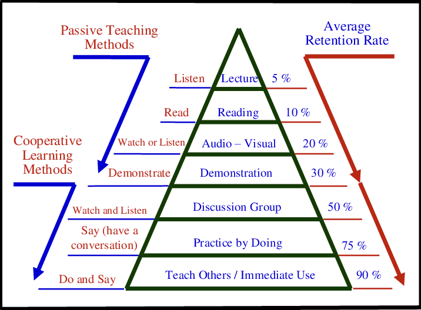
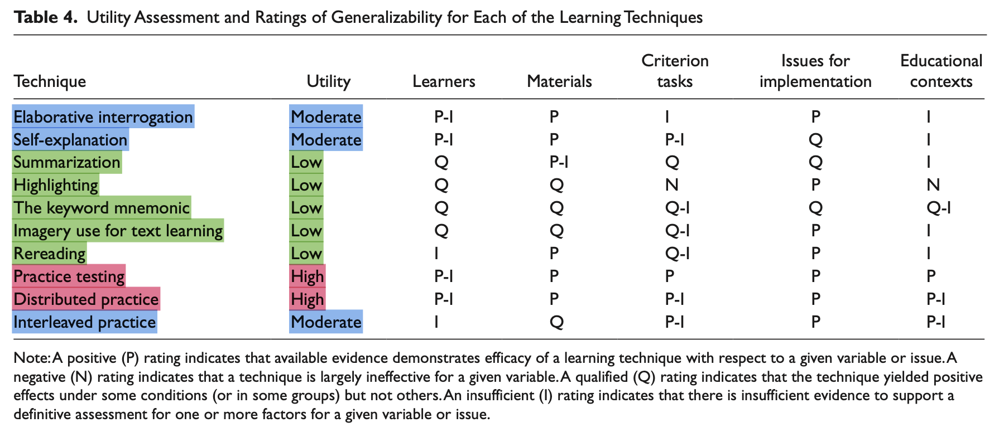
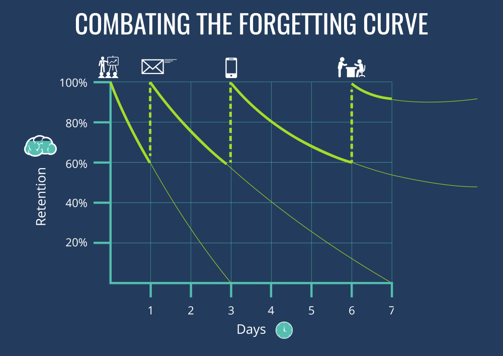

내가 프로그래밍을 처음 시작한 주변 사람들에게 항상 권하는 2가지가 있다. 첫번째는 **사이드 프로젝트**, 두번째는 **블로깅**이다. 이유가 무엇일까? 내가 지금까지 이 2가지로만으로 학습해왔고, 나름 나쁘지 않은 성과를 얻었기 때문이다.

주변을 둘러보니 실제로 사이드 프로젝트와 블로깅을 강조하시는 분들이 많다. 성장을 위해 왜 사이드 프로젝트와 블로깅은 항상 추천되는걸까? 나도 경험적으로만 알고 있었지, 이유에 대해서 깊이 고민해본적은 없던 것 같다. 마침 토요일이니 여유롭게 생각을 정리해볼 겸 글을 써본다.

## Learning By Doing

나는 초등학교 3학년 때부터 프로그래밍을 시작했다. 하지만 나는 컴퓨터 학원을 다닌적도, 학교에서 배운적도 없었다. 그럼에도 불구하고 나는 혼자 공부하며 액션 스크립트로 플래시 게임을 만들고, 비주얼 베이직과 C#.net으로 윈도우 폼 애플리케이션을 만들고, PHP로 웹 백엔드를, React로 웹 프론트엔드를 개발해왔다. (물론, 지금은 우아한테크코스에서 자바와 스프링을 공부하고 있지만)

나는 항상 **무언가를 만들고 싶다는 욕구**로 학습을 시작했다. 초등학교 저학년때에는 텔레비전에 나오는 도라에몽 같은 애니메이션을 직접 만들어보고 싶다는 생각이 들었다. 무작정 그 시절 네이버에 검색해가며 '만화 만드는 법'을 검색했고 '이지툰' 이라는 GIF 애니메이션 제작툴을 알게 되었다.

간단한 애니메이션을 만들수 있게 된 이후에는 그때 한창 즐겨한 게임 메이플스토리와 같은 RPG 게임을 만들고 싶다는 생각이 들었다. 그렇게 플래시와 액션스크립트를 알게 되었고, 주전자 닷컴 등에서 자작 플래시 강의를 읽어보며 프로그래밍 세계에 첫 발을 내딛었다.

초등학교 고학년즈음엔 그때 당시 말로 '유틸리티 프로그램'을 만들어보고 싶어 비주얼 베이직 6.0을 접했고, 네이버 프로그래밍 카페에서 활동하며 내가 만들고싶은 프로그램을 완성하기 위한 정보를 학습했다. VB 6.0이 워낙 낡은 언어라서 이후엔 C#.net 으로 옮겨탔다.

한창 카카오스토리가 유행했을 때는 웹 프로그래밍에 관심이 생겨 SNS에서 많이 공유될만한 웹 서비스를 만들어보고 싶다는 생각이 들었다. 중학교 3학년 즈음 HTML과 CSS 그리고 PHP를 배워 웹사이트를 만들고, 동시 접속자 700명대를 달성해본 경험도 있다. 웹 서비스 개발자가 되기로 결심한 시기가 이즈음 이었던 것으로 기억한다.

내가 지금까지 프로그래밍을 공부해온 과정을 돌이켜보면, **누군가가 미리 선택한 지식을 수동적으로 주입받은적이 없었다**. 나는 항상 **우선 무작정 무언가를 만들기 시작**했고, 그리고 **많은 문제를 마주하고 해결하는 과정에서 필요한 지식을 습득**해왔다. 그래서 그런지 나는 **경험 중심 학습**의 효과를 굳게 믿고 있다.

## 수동적인 학습과 능동적인 학습

국내에서 유명한 프로그래밍 격언중엔 **'백견불여일타'** 라는 말이 있다. 백번 보는것보다 한번 코드를 작성하는 것이 훨씬 낫다는 뜻이다. 눈치챘겠지만, 백문불여일견이라는 고사성어에서 유래된 격언이다. '백견불여일타' 는 **능동적인 학습의 중요성을 관통**하는 격언이다.

위 그림 자료는 Role of Engineering Design in Enhancing ABET Outcomes of Engineering Programs at Taif University 라는 논문에서 발췌한 **Learning Pyramid** 라는 그림이다. **위에서 아래로 내려갈 수록 Average Retention Rate 즉, 평균적으로 기억에 남는 평균 비율이 높아**진다.

위에서 4개의 학습 방법인 **강의 듣기, 읽기, (시청각 수업을) 보고 듣기, 시연 강의 보기는 수동적인 학습 방법**이다. 반면, 그 아래 3개의 학습 방법 **토론하기, 실제 해보며 연습하기, 가르치기, 즉시 사용해보기는 능동적인 학습 방법**이다.

피라미드 아래로 내려갈수록 학습자가 더 적극적으로, 능동적으로 학습에 참여하는 학습 방법인것을 알 수 있다. **즉, 학습자 스스로 능동적으로 고민하는 비율이 높아질수록 학습 효율이 높아진다는 점이다.**

위 표는 Improving students' learning with effective learning techniques: Promising directions from cognitive and educational psychology 라는 논문에서 발췌한 자료이다. 여러 학습 방법과 그 효과가 나타나있다.

자료를 살펴보면 요약하기, **밑줄 긋기(highlighting), 키워드 암기하기(the keyword mnemonic), 텍스트에 대한 심상 만들기(imagery use for text learning), 다시 읽기는 낮은(low) 학습 효과**를 보인 것을 알 수 있다. 이런 방법은 학습자가 <u>**수동적으로 입력(input)받는 방법**</u>이다.

그 다음으로는 **정교화 질문(elaborative interrogation), 스스로 설명(self-explanation), 여러 문제를 섞어 연습하기(interleaved practice) 가 중간정도의 학습 효과**를 보인다. **가장 높은 학습 효과를 보인 방법은 바로 연습 시험(practice testing), 나눠서 연습하기(distributed practice)** 이다. 이런 방법은 학습자가 <u>**능동적으로 인출(output)**</u>하는 방법이다.

타인의 지식을 수동적으로 머리에 입력하는 것은 고통스럽지 않다. 가만히 앉아 듣거나, 보거나, 읽으면 되기 때문이다. 학습자의 고민은 그다지 들어있지 않다. 반면 능동적인 학습은 어떤가? 토론하고, 설명하고, 가르치고, 연습하는 과정은 많은 고민을 필요로 한다. 그래서 고통스럽다.

위 논문이 시사하는 점은 무엇일까? **높은 학습효과를 내기 위해서는 학습자 스스로가 주도적으로, 능동적으로 학습에 참여해야한다는 것이다.**

## 사이드 프로젝트와 블로깅이 왜 중요할까?

프로그래밍을 처음 시작하신 분들이 학습하는 과정을 옆에서 지켜보면, 책을 읽고 책의 내용을 열심히 벨로그나 노션에 요약하는 것이 대부분이다. 책 '유시민의 글쓰기 특강'에도 나왔듯 '발췌와 요약'은 좋은 독서 전략이다. 하지만, 그 단계에서 만족하고 학습을 끝내서는 안된다.

### 사이드 프로젝트를 통해 지식과 경험 잇기

개발자는 무엇을 하는 사람이고, 개발자의 궁극적인 목적은 무엇일까? 개발자는 <u>**세상에 존재하는 문제**</u>를 <u>**코드라는 수단**</u>으로 <u>**해결**</u>하는 사람이다. 즉, 개발자의 목적은 **문제를 해결**하는 것이다. 그리고 지식은 문제 해결을 위한 **재료**이다.

지식을 단순히 머리속에 넣고, 잘 외웠는지 확인하고 만족하는것으로 끝내선 안된다. 즉, **지식 그 자체가 목적이 되어서는 안된다.** 우리는 한 걸음 더 나아가야한다. 바로 **문제 해결 경험**이다. 경험으로 이어지지 않은 지식은 체화되지 않는다. 체화되지 않은 지식은 더 빨리 휘발된다. 지식은 경험과 이어져야한다. 그럼 지식과 경험을 잇는 가장 효과적인 방법은 무엇일까? 바로, **문제를 먼저 겪은 다음**에 문제 해결에 필요한 지식을 학습하는 것이다. 순서를 바꾸는 것이다.

이것이 내가 사이드 프로젝트를 강조한 이유이다. 우리는 사이드 프로젝트를 통해 **실무에서 발생할 법한 문제를 의도적으로 겪어볼 수** 있다. 강의나 책과 같은 자료만으로 학습하면 문제를 마주할일이 없다. 따라서 문제를 해결하기 위해 고민하는 경험도 얻을 수 없다. 해결해야할 문제가 없는 상황에서의 학습은 동기가 결여되어있다.

그에 반해 **문제를 겪고 있는 상황에서는 큰 학습 동기**가 만들어진다. 동기가 부여된 학습은 큰 효과를 낸다. **경험 중심의 학습은 학습의 목적을 뚜렷하게** 만든다. 사이드 프로젝트를 통한 학습에서는 **학습자가 문제를 먼저 마주하고, 필요에 의해 능동적으로 지식을 탐색하고, 선택하고, 학습한다.** 학습에 **이유**가 생기고, 학습한 **지식이 문제 해결로 즉시 이어진다**. 확실한 동기가 존재하는 상태로 학습하는 것은 즐겁기까지하다.

반면, 경험 없이 수동적으로 지식을 주입 받아 학습하는 사람은, 처음 보는 문제를 마주했을 때 스스로 필요한 지식을 탐색하고, 학습하는 능력이 떨어진다. 우리 개발자들은 항상 새로운 문제를 마주한다. 물론 아키텍처니, 디자인 패턴이니 하는 것들이 있지만 어디까지나 일반론이다.

실무에서는 우리 모두 각자 다른 도메인에, 다른 비즈니스적 상황에, 다른 레거시 코드에 처해있다. 우리가 실무에서 마주할 문제는 **그 누구도 해결해본 적 없는 문제**이다. 따라서 우리는 **스스로 생각하고, 스스로 필요한 리소스를 탐색하고, 그 리소스를 각기 다른 상황에 맞게 적절히 사용할 줄 알아야한다**. 우리는 이런 능력을 문제 해결 능력이라고 한다. 그리고 이 문제 해결 능력은 앞서 설명한 것과 같은 경험 중심의 학습으로 만들어진다.

### 블로깅을 통해 지식과 경험을 인출하기

논문 자료에서 언급했듯 누군가를 **가르치는 것**은 가장 큰 학습 효과를 보인다고 한다. 블로그를 작성할 때 모르는 사람을 위해 작성해보자. 또, 블로깅은 **스스로 설명(self-explain)과 정교화 질문(elaborative interrogation)**을 하여 지식을 머리 밖으로 **인출**할 수 있다. 즉, 블로깅은 자신의 경험, 알고있는 혹은 새로배운 지식을 능동적으로 인출하기 위한 좋은 학습 수단이다.

또한, 블로깅은 자신이 정말 이해하고 있는지 판단하기 위한 **메타인지**의 수단으로도 활용할 수 있다. 모의면접을 해보면, 우리가 잘 알고있다고 생각했던 것이 생각보다 입 밖으로 잘 나오지 않는다는 것을 알 수 있다. 그렇다면, 그 지식은 실제로는 잘 모르고 있는 개념인것이다. 내가 특정 지식을 잘 알고있는지 아니면 잘 모르고 있는지 알기 위한 즉, 메타인지를 얻기위한 좋은 수단 중 하나가 블로깅이다.

또한, 인간은 망각의 동물이다. 아무리 효과적으로 공부한다고 하더라도 단 한번만 학습했다면 결국엔 망각으로 이어진다. 망각 곡선에 따르면 여러번 복습을 해야지 단기 기억이 장기 기억으로 남아 오랫동안 기억할 수 있다. 경험으로 학습한 지식을 블로그에 기록하고, 잊을때마다 블로그에 작성한 포스팅을 읽어 지식을 장기 기억에 보관할 수 있다. 우테코에서 강의해주신 우아한형제들 기술이사 손권남님께서는 이를 **'기록과 누적적 발전'** 이라고 표현하셨다.

또한 덤으로 블로깅을 통해 글쓰기 능력도 기를 수 있다. 실무에서 문서화를 잘 하는 개발자는 높은 평가를 받는다. 평소에 블로그를 통해 글을 자주 쓰다보면 이런 문서화 능력도 키울 수 있다.

## 부족한 부분을 책으로 메꾸기

이렇게 project-driven 하게 학습하는 것은 매우 좋지만, 프로젝트만 하다 보면 **이론적인 부분에서 구멍**이 생기기 마련이다. 당연하다. 이 구멍을 메꾸기 위해서는 결국 **책을 펼쳐 이론적인 내용을 추가로 공부**해야한다.

하지만, 아무런 경험도 없는 상태에서 책을 무작정 읽는 것과 관련 프로젝트 경험이 존재하는 상태에서의 학습은 효율이 크게 차이가 난다. 아무런 경험이 없는 상태에서의 독서는 지식과 경험이 이어지지 않아 공감도 이해도 되지 않은 상태로 흐지부지 학습을 끝낼 가능성이 높다. 하지만, **학습하고자 하는 지식에 대한 프로젝트 경험이 존재하면, 부족한 이론을 메꾸는 과정에서도 지식과 경험이 계속해서 이어**진다.

> _'아, 이런 개념이 있었구나. 프로젝트에 적용해보면 더 개선해볼 수 있겠네.'_

> _'끝내 해결하지 못한 문제가 있었는데, 이런 원인이 존재했구나.'_

> _'이 개념은 이번 프로젝트에서는 쓰이지 않겠지만, 다음 프로젝트에서는 이렇게 적용해볼 수 있겠네.'_

책 '함께 자라기' 에서 소개된 **적극적 읽기**를 할 수 있게 된다.

## 마치며

여전히 내 생각을 긴 글로 조리있게 작성하는 것은 어려운 것 같다. 그래도 평소에 계속 글로 쓰고자 했던 생각을 쓰게되어 후련하다.

글 내용은 어디까지나 나의 경험 위주의 주관적인 의견이다. 어떤 사람은 다른 방법으로 훨씬 더 효율적으로 공부할 수 있을 것이다. 다른 의견이 있다면 댓글 바란다.
