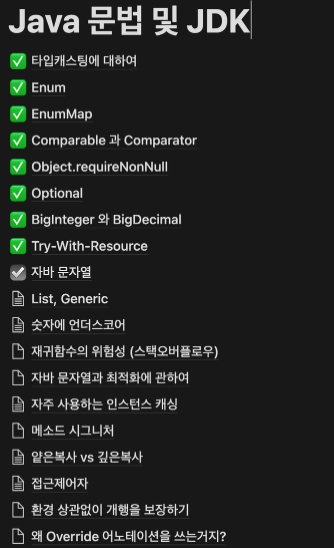
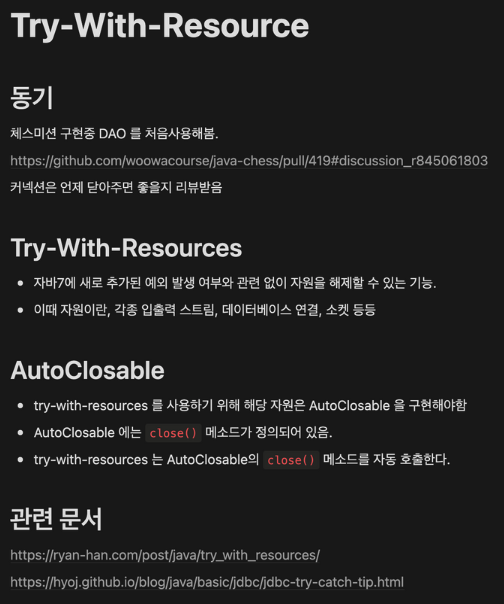
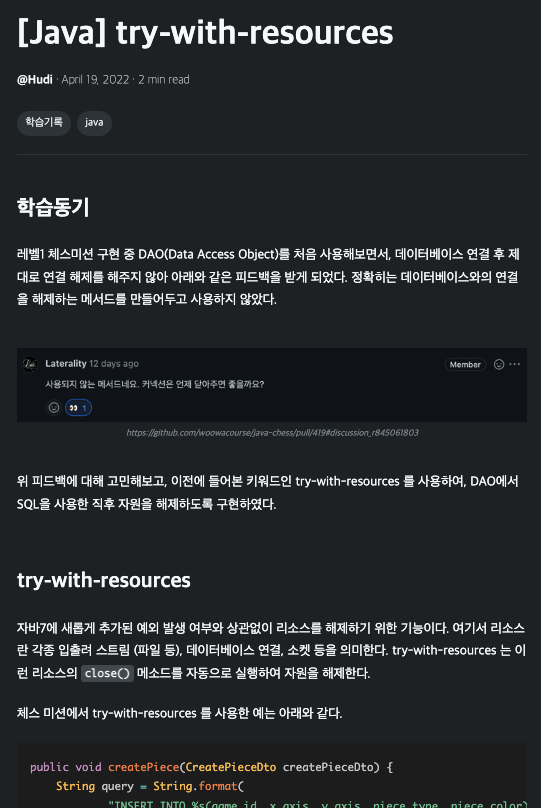

## 들어가며

우아한테크코스 레벨1 생활 동안 자연스럽게 형성된 나의 학습 습관을 레벨2 시작 기념으로 기록해볼까 한다. 다만 책에서 읽거나, 공신력 있는 강의를 듣고 알게된 방법론을 체화한 것은 아니다.

나름 직접 생각해낸 여러 방법을 시도해보면서 '어? 이렇게 해보니까 생각보다 괜찮네?' 라는 생각이든 방법에 정착한 것일 뿐이므로, **'이런 방법으로 학습하는 사람도 있구나' 수준으로 가볍게 읽어주었으면 좋겠다** 😅

## 나만의 학습 방법론

일단 이 방법은 '완전히 모르고 있는 새로운 개념을 공부' 할때와 '알고 있다고 생각한 개념을 실제로는 어느정도까지 이해하고 있는지 검증' 할때 둘다 유효하다. 대략적인 과정은 아래와 같다.

### 1. 정의 하기

이미 알고있지만 더 깊게 알고싶은 개념에 대한 학습이라면 내가 알고 있는 개념에 대한 설명 혹은 정의를 그대로 적는다.

새롭게 공부해보고 싶은 개념이라면 책이나 공신력 있는 문서를 참고하여 해당 개념의 정의나 내용이 잘 설명된 문장을 찾아 적는다.

> _ex) 의존성 주입이 뭐지? ⇒ '클래스간 의존성을 클래스 외부에서 주입하는 것'_

### 2. 키워드 발견

적은 문장에서 핵심 키워드, 특히 잘 모르고 있는 키워드를 발견하고, 1번을 다시 수행한다. 이 과정을 (본인이 만족할 수 있는) 일정 수준까지 반복한다.

> _ex) '클래스간 의존성을 클래스 외부에서 주입하는 것' ⇒ 의존성이 뭐지? ⇒ 의존성이란 '의존성은 코드에서 두 모듈간의 연결' ⇒ '두 모듈간의 연결' 이 뭐지? ⇒ ..._

### 3. 왜?

도출된 문장들에 대해 '왜?' 라는 질문을 던진다.

> _ex) '이건 왜 사용하는 거지?', '이건 왜 존재하는 거지?', '왜 굳이 이런 방법으로 하는거지?', '왜 이름을 이렇게 지었을까?' ..._

어떤 개념에 대해 깊게 알아보기 위해서는 해당 개념을 설명 혹은 정의하는 문장에서 사용된 키워드에 대해서도 모두 이해하고 있어야 하며, 해당 개념이 '왜 존재하는지', '왜 사용되는지' 등에 대한 이해가 가장 중요하다고 생각한다.

따라서 위 3단계 과정에서 발생한 모든 키워드를 이해하고 '왜?' 라는 의문이 해소되었다면, 원래 알고자 했던 개념에 대해 완벽히 이해했다고 생각한다.

이 과정에서 정보의 출처는 최대한 공신력있는 웹사이트 혹은 책을 통해 얻는다. 특히 책이 아무래도 정보를 얻기 편하다. 궁금한 키워드가 있을법한 책을 집고, 목차 혹은 책 맨 뒷장의 '찾아보기' 페이지를 활용하여 알고자 하는 개념에 대해 찾고 읽어보자.

## 분류하고, 기록하기

위 단계를 반복하며 발견한 여러 키워드 중 덩치가 큰 키워드는 별도로 기록할 필요가 있다. 나 같은 경우 키워드를 발견하거나, 혹은 이야기, 강의 도중 새로운 키워드를 듣게 되었을 때에 노션에 해당 키워드를 제목으로 빈 페이지를 생성한다.

그리고 그 빈 페이지는 나중에 그 개념에 대해 알게된 단편적인 정보를 그때 그때 정리하거나, 아예 날을 잡고 다시 위 3단계(정의하기, 키워드발견, 왜?)를 반복하며 페이지를 채워나간다. 단, 예쁜 문장으로 작성하려 하지말고 키워드 위주로 개조식으로 작성한다. 당연히 이 과정에서 또 모르는 키워드가 생기면 다시 3단계를 반복한다.

## 블로깅하기

남에게 설명하는 것 만큼 메타인지 형성이 잘 되는 방법은 없다고 생각한다. 하지만, 24시간 동안 나를 따라다니며 내 설명을 들어줄 학생은 없다. 하지만 우리에겐 블로그라는 훌륭한 대안이 존재한다.

노션에 특정 개념에 대한 페이지가 어느정도 채워지면, 블로그에 해당 키워드를 남들에게 설명한다고 생각하면서 글을 작성한다. 분명 글을 작성하면서 모르는 개념이 다시 등장할 것 이다. 그렇다면 다시 위 3단계를 반복하면 된다.

블로그에 작성한 글을 나의 학습 지표로 사용하여 내가 얼마나 성장했는지 가늠해볼때도 사용해볼 수 있을 것 이다.
