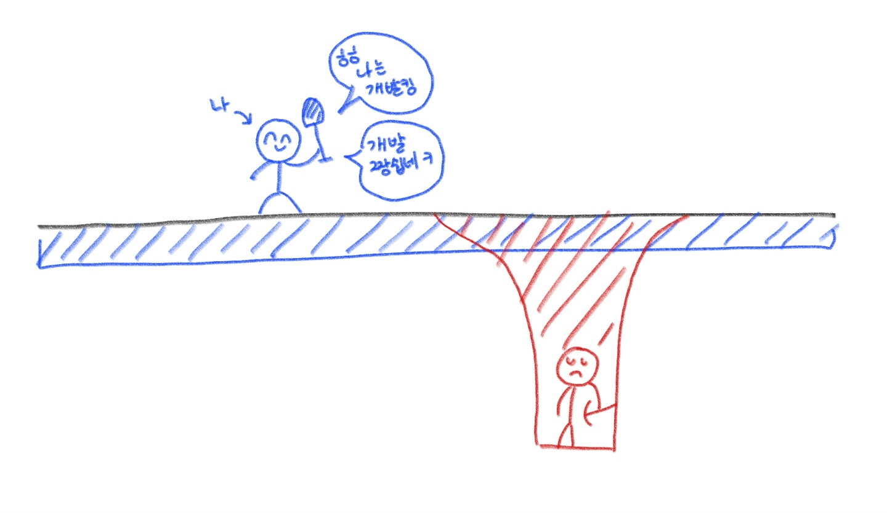
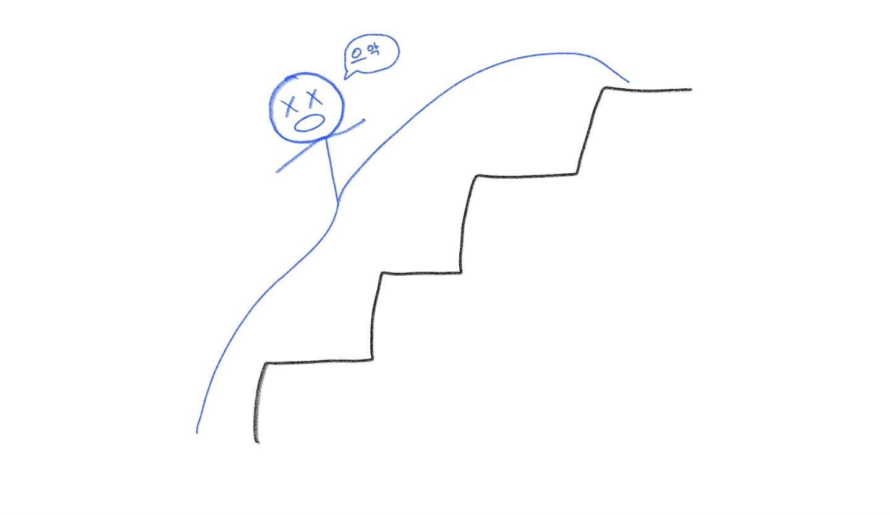

우아한 테크코스 4기 본 과정이 시작된지 9일정도가 지났다. 우물안에서 운 좋게 점프 한번 잘 뛰어 우물 밖으로 나간 개구리의 심정이 된 것 같다. 실력을 떠나서 정말 열심히 사는 크루들만 모였구나 라는 생각이 들고, 지금까지 평생 가져온 내 학습태도에 대해 한번 의심해보는 계기가 되었다.

사실 원래는 '내가 프로그래밍을 학습하는 방법' 에 대해 글을 준비하고 있었는데, 부끄러워져서 그만두기로 했다. 그런 글은 내가 충분히 전문가가 되었다고 말할 수 있을 때 적어보는게 좋을 것 같다.

## 넓지만 얕게? 좁지만 깊게.

지금 돌이켜보면 지금까지 관심을 가진 분야가 너무 광범위 하다는 것을 새삼 느낀다. 물론 당연히 개발은 나에게는 즐거운 일이고 여러가지를 해보고 싶은 마음이 나쁜것은 아니라고 생각한다. 하지만 공부하고 있는 분야를 어느정도 수준으로 깊게 파본 다음에 다른 분야로 넘어가야 하는데, 학습에 대한 철학 없이 너무나도 흥미 위주로 이것저것 찍먹만 해본것은 아닌가 반성해본다. 학습에 대한 명확한 기준이 없다보니, 질리면 쉽게 다른 분야로 넘어갔던 것 같다.

지금까지 관심갖고 찍먹해본 분야만 생각나는대로 나열해봐도 백엔드, 프론트엔드, 데브옵스, 윈도우 프로그래밍, 게임, IoT, 안드로이드 개발, 데이터 시각화, 인공지능, 블럭체인, 웹해킹 등등 ... 물론 무릇 좋은 개발자라고 한다면 자신이 일하고 있는 분야만 알고 있는 것이 아니라, 산업 전반으로 두루 관심을 갖는 것이라고 생각한다. 하지만 그것은 **'주력 기술'** 과 **'주력 기술에 대한 깊은 이해'** 가 있다는 전제하에 성립되는 이야기라고 생각된다. 글쎄, 나는 '주력 기술' 이라고 당당하게 말 할만한게 있을까?

명확한 학습에 대한 잣대없이 이것 저것 찍먹만 하는 것은 분명 나쁜 학습 태도이다. 하지만, 위험하게도 그것은 열심히 노력해서 공부했다는 착각을 하게 한다. 뭔가 아는게 많아진 것 같게 한다. '진짜' 전문가 사이의 대화에서 한 두마디 알아듣고, 몇 마디 거들 수 있는 자신의 모습에 취하게 되기 쉽다. 실제 내가 그랬고. 다양한 것을 아는것은 좋지만, 다양한 것'만'을 아는 것은 위험하다. 주력 기술이 없는 상황에서 남들이 주력 기술 한 우물만 판다면 나는 구직 시장에서 차별점 있는 사람이 될 수 있을까?

## 계단을 한번에 3~4개씩 오르다보면 다치기 십상이다.

우아한 테크코스를 진행하며 이미 좋은 학습 태도를 갖춰 깊이있는 학습을 오래 해온 크루들을 여럿 보게된다. 내 수준은 1단계 정도인데, 다른 크루들이 3단계 정도를 이야기하고 있다면, 뒤쳐지지 않으려면 **'이것도 해야하나? 저것도 해야하나?'** 같은 생각에 쉽게 휘둘리게 된다.

이런 것들에 휘둘리면 불안해지고 쉽게 지치게 되는 것 같다. 스트레스를 받을 수 있고, 자존감이 떨어질 수도 있다. 이것이 결국에는 위에서 이야기한 '넓고 얕은' 학습을 하게될 수도 있고.

이런 나쁜 생각들로부터 나의 멘탈을 지키기 위해서는 **'나를 남과 비교하지 않고, 어제의 나와만 비교하는 태도'** 가 가장 중요한 것 같다. 당연히 모든 사람의 출발선은 다르고, 모든 사람의 역량도 다르다. 남과 나를 비교하며, 일희일비 하기보다는 항상 경쟁의 포커스를 어제의 나로 고정해두자. 잘하는 사람을 경쟁의 대상으로 생각하지 않고, '좋은 멘토' 로 생각하자. **느리지만 그래도 꾸준히 성장해 나가는 것을 목표**로 해야겠다.

현재 나의 위치에서 학습해야할 것이 무엇인지 명확히 인지하고, 아는척 하기 위한 학습이 아닌 진짜 성장을 위한 학습을 해야겠다는 생각이 든다. 조바심 갖지 말자는 이야기다.

## I자형 인재, T자형 인재, π자형 인재

위의 '넓지만 얕게? 좁지만 깊게.' 와 상통하는 내용이다. 최근 '개발자로 살아남기' 라는 책을 읽었다. 다만 끝까지 읽은 것은 아니고, 마지막 내용은 관리자의 대한 내용이거나 비즈니스에 대한 내용이라 완독은 보류해두었다.

책 38p 정도에 'π자형 인재되기' 에 대한 내용이 나온다. 간략하게 요약하자면, 예전에는 한가지를 깊게 파서 전문가가 되는 **I자형 인재**를 선호했다면, 변화가 빠른 지금은 적어도 하나는 깊게 그리고 나머지는 골고루 잘 아는 **T자형 인재**를 선호한다고 한다. 그것을 넘어서 최근에는 **π자형의 인재**가 요구된다고 한다. 쉽게 말해 '부전공' 이 필요하다는 것이다. 프론트엔드 개발자도 백엔드 영역을 이해해야하고, 백엔드 개발자도 프론트엔드 영역을 이해해야한다. 꼭 프론트엔드, 백엔드 뿐만 아니라 머신러닝도 좋고, 블럭체인도 좋고, 임베디드도 좋다.

책은 시작은 I자형 인재로, T자형을 거쳐 π자형 인재로 나아가야한다고 한다. **중요한 것은 일단 I자형으로 시작하는 것이다.** 지금은 당당히 잘한다고 이야기 할 수 있는 기술을 습득하는데 집중하자.

## 지금 나는 무엇에 집중해야 할까?

지금 나는 잔재주나 화려한 스킬 같은 것들을 배울 때가 아니다.

프로그래밍 언어를 공부하거나, 프레임워크, 라이브러리를 공부하기 전에 반드시 선행 공부 해야하는 것이 있다.**언어와 프레임워크는 생각과 철학을 표현하는 도구일 뿐이지, 상황에 따라 언제든 대체될 수 있다.** 어떤 기업에서는 Java 를 사용하지만, 다른 기업에서는 Go를 사용할 수도 있다.

언어, 프레임워크 보다 더 중요한 것은 **어디에서도 통용되는 기반 지식**이다. 컴퓨터 공학적인 지식, 객체지향, 좋은 코드에 대한 고민, 좋은 설계에 대한 고민, 디자인 패턴 그리고 Agile, TDD 와 같은 좋은 개발 방법론 등등이 해당된다고 할 수 있을 것 같다.

## 글을 쓰는 태도

자기 객관화를 해보자. 지금 나는 학습자인가, 교육자인가? 당연히 학습자이다. 배우는 것에 집중해야하는 때이다. 물론, 남을 가르치며 공부하는 것은 굉장히 효과적인 학습 방법이라고 생각한다. 그런데, 나의 글쓰기는 아래와 같은 문제점이 있다.

1. **예쁜 문장, 예쁜 글에 집착한다.**
2. **길이가 긴 글을 쓰는 것에 집착한다.**
3. **잘 모르는 개념을 아는척 하기 위해 서술할 때가 있다.**

학습을 위한 글쓰기의 목적은 내가 학습한 내용을 적으며, 내가 이해했다고 착각한 것은 없는지, 놓친 개념은 없는지 확인하고, 모호하게 알고 있던 개념이 명확해지는 경험을 하는 것 이다. 그런데 지금의 나는 학습을 위한 글쓰기가 아니라, 예쁜 글을 쓰는데 더 집중한다. 주객이 전도됐다.

지금은 남을 보여주기 위한 글을 쓰는것은 잠시 내려둘 때이다. 블로그의 소개글도 '배움을 글로 정제해 공유하는 것을 좋아하는 개발자입니다.' 에서 '꾸준히, 의미있는 학습을 기록하기 위한 공간입니다.' 로 바꾸었다. 지금은 이 공간을 오로지 나의 학습을 위한 공간으로만 사용하자. 조회수나 방문자수는 신경쓰지 않도록 하자.

긴 글을 써야한다는 강박을 잠시 내려놓고, 다소 글이 불완전하더라도 학습에 도움이 된다면 막힘 없이 작성하자. 대신 '아 모르겠다' 라고 글을 끝내지 말고, 처음 세운 학습의 목적을 달성하도록 노력하자.
