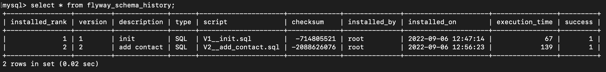

> 이 글은 우아한테크코스 4기 [달록팀의 기술 블로그](https://dallog.github.io/dallog-flyway)에 게시된 글 입니다.

## Flyway 란?

Flyway는 오픈소스 **데이터베이스 마이그레이션 툴** 입니다. 데이터베이스 마이그레이션 툴이란 데이터베이스의 **변경 사항을 추적하고, 업데이트나 롤백을 보다 쉽게** 할 수 있도록 도와주는 도구입니다.

데이터베이스 마이그레이션을 왜 해야할까요?


프로젝트를 진행하다 보면, 데이터베이스가 위 그림처럼 **여러 환경**에서 존재하게 됩니다. 각자의 로컬 환경에 데이터베이스가 존재하고, 테스트 서버에도 프로덕션 서버에도 각각 별도의 데이터베이스가 존재합니다. 각자의 로컬 환경에서 개발을 하게 되면, 엔티티의 구조가 변경되고 이로 인해 데이터베이스의 **스키마도 변경**될 것 입니다.

소프트웨어의 소스 코드와 같은 경우에는 Git과 같은 형상관리 툴을 사용하여 이런 문제를 비교적 잘 해결해왔습니다. 하지만, 데이터베이스는 그렇지 않았습니다.

예를 들어 JPA를 사용하는 환경에서 엔티티 구조가 변경되면 이 변경된 구조를 다른 배포 환경의 데이터베이스에도 적용해야합니다. 즉, **일일히 스키마 수정을 위한 DDL을 각 환경별로 모두 실행**해줘야합니다.

물론, 로컬 개발 환경이나 개발 서버에서는 Hibernate 설정 중 `ddl-auto` 을 `create` , `create-drop` , `update` 등으로 설정하여 DDL을 변경된 엔티티 구조에 맞춰 실행할 수 있지만, **프로덕션에서는 이와 같은 설정이 불가능**합니다.

```java
@Table(name = "members")
@Entity
public class Member extends BaseEntity {

    // ...

    @Id
    @GeneratedValue(strategy = GenerationType.IDENTITY)
    @Column(name = "id")
    private Long id;

    @Column(name = "email", nullable = false)
    private String email;

    @Column(name = "display_name", nullable = false)
    private String displayName;

    @Column(name = "profile_image_url", nullable = false)
    private String profileImageUrl;

    @Enumerated(value = EnumType.STRING)
    @Column(name = "social_type", nullable = false)
    private SocialType socialType;
```

위 코드는 달록의 `Member` 엔티티 코드입니다. 만약 달록이 이후에 서비스 가입 시 휴대전화 번호도 추가로 제공받게 된다면, 아래와 같은 필드가 엔티티에 추가될 것 입니다.

```java
@Column(name = "contact", nullable = false)
private String contact;
```

사실 로컬 개발 환경이나, 개발용 서버에서는 큰 문제가 없습니다. 테이블을 DROP 하고 엔티티 구조에 맞게 CREATE 하면 되니까요. 하지만, **프로덕션 서버에서 테이블을 DROP 하는 것은 미친짓**이죠. 실제 유저들의 데이터가 저장되어있기 때문입니다.

그렇다면 프로덕션 서버에서는 어떻게 테이블 스키마가 변경된 것에 대응할 수 있을까요? `ALTER TABLE` 과 같이 테이블 스키마를 변경하는 **DDL을 사용**해야합니다.

```sql
ALTER TABLE members ADD COLUMN contact VARCHAR(255) NOT NULL;
```

엔티티 구조가 별로 변경되지 않았다면, 사람 손으로 위와 같은 DDL을 작성하고 프로덕션 서버에서 실행할 수는 있겠습니다. 하지만, 굉장히 번거로운 작업이며 **사람의 실수(human error)**가 발생하기 쉽습니다. 또한 **형상관리도 어렵습니다.**

포스팅에서 설명할 Flyway와 같은 데이터베이스 마이그레이션 툴을 사용하면, 위와 같은 문제를 해결할 수 있습니다. 이번 포스팅에서는 Flyway에 대한 기본적인 개념과 달록이 프로젝트에 적용한 과정에 대해 정리해봅니다.

## 실습 준비

### 실습 환경

실습은 아래와 같은 환경에서 진행합니다. JPA를 사용하는 점 참고해주세요.

- SpringBoot
- Spring Data JPA (Hibernate)
- MySQL 8.0

### JPA 엔티티

```java
@Entity
public class Member {

    @Id
    @GeneratedValue(strategy = GenerationType.IDENTITY)
    private Long id;

    private String name;
    private String email;
    private String password;

		// ...
```

위와 같은 JPA 엔티티가 존재한다고 가정합니다.

## Flyway 실습 환경 구축

원래라면 Gradle에 스크립트를 작성하는 등 명령줄 인터페이스에서 Flyway를 사용해야 합니다 ([참고](https://flywaydb.org/documentation/getstarted/firststeps/gradle)). 하지만, **Spring Boot는 기본적으로 Flyway와 Liquibase라는 고수준의 데이터베이스 마이그레이션 도구를 지원**합니다. ([참고](https://docs.spring.io/spring-boot/docs/2.1.1.RELEASE/reference/html/howto-database-initialization.html#howto-use-a-higher-level-database-migration-tool)) 따라서 Spring Boot 에서는 더 쉽게 Flyway를 프로젝트에 적용할 수 있습니다. 이번 포스팅에서는 Spring Boot에서 Flyway를 적용하는 방법에 대해서 다룹니다.

### MySQL 컨테이너 띄우기

> 꼭 도커를 사용할 필요는 없습니다. 본 포스팅에서는 빠른 실습 환경 구축을 위해 도커를 사용합니다.

```yaml
version: "3"
services:
  mysql-db:
    image: mysql:8.0
    volumes:
      - ./mysql:/var/lib/mysql
    ports:
      - 3306:3306
    environment:
      MYSQL_ROOT_PASSWORD: root
      MYSQL_DATABASE: flyway-study
    platform: linux/x86_64
```

`docker-compose.yml` 파일을 생성하고, 위 내용으로 채워줍니다. 아래 명령으로 MySQL 도커 컨테이너를 간단하게 띄울 수 있습니다.

```bash
$ docker-compose up -d
```

### 의존성 추가

`build.gradle` 의 `dependencies` 에 아래 내용을 추가합니다.

```sql
implementation 'org.flywaydb:flyway-core'
```

만약 여러분의 DBMS가 MySQL 8.X 버전이거나, MariaDB를 사용하신다면, 아래와 같이 종속성을 추가해야합니다.

```sql
implementation 'org.flywaydb:flyway-mysql'
```

### DataSource 설정

`application.yml` (혹은 `application.properties`) 에 DataSource 관련 설정을 추가 해야합니다. Spring Boot는 **DataSource 설정으로 Flyway를 자동으로 연결**하기 때문입니다.

```yaml
spring:
  datasource:
    driver-class-name: com.mysql.cj.jdbc.Driver
    url: jdbc:mysql://localhost:3306/flyway-study
    username: root
    password: root
```

### JPA 설정

```yaml
spring:
	# ...
	jpa:
    hibernate:
      ddl-auto: validate
```

`ddl-auto` 옵션을 `validate` 로 설정하면, 실제 데이터베이스 스키마와 JPA 엔티티의 구조가 서로 같은지 비교하고, 같지 않다면 어플리케이션을 실행하지 못하도록 합니다. 이 옵션을 사용하여 Flyway를 사용했을 때 올바르게 데이터베이스 마이그레이션이 진행되었는지 확인해볼 것입니다.

### Flyway 활성화

```yaml
spring:
	# ...
	flyway:
	    enabled: true
```

위 설정을 추가하여 Spring Boot에서 Flyway를 활성화 합니다.

## 첫번째 마이그레이션 스크립트 작성

Flyway는 마이그레이션 스크립트의 버전 순서대로 SQL 스크립트를 실행합니다. 우리는 아직 아무런 마이그레이션 스크립트를 작성하지 않았습니다. 최초로 실행될 마이그레이션 스크립트를 아래와 같이 작성합니다. 파일 경로는 `resources/db/migration` 이며 파일명은 `V1__init.sql` 로 생성해주세요. 이때, **언더스코어**(`_`)**가 2개임을 주의**합니다.

```sql
CREATE TABLE member (
    id BIGINT AUTO_INCREMENT,
    name VARCHAR(255),
    email VARCHAR(255),
    password VARCHAR(255),
    PRIMARY KEY (id)
);
```

마이그레이션의 버전과 명명법은 조금 있다가 다루겠습니다.

## JPA 엔티티 구조 변경

시간이 흘러 애플리케이션이 기능 변경을 거듭하고, 회원가입 시 연락처 정보도 제공받게 되었습니다. JPA 엔티티 구조는 아래와 같이 변경되겠죠?

```java
@Entity
public class Member {

    @Id
    @GeneratedValue(strategy = GenerationType.IDENTITY)
    private Long id;

    private String name;
    private String email;
    private String password;
    private String contact; // 추가된 필드
```

그리고, 애플리케이션을 실행해봅니다. 예상하신것처럼 아래와 같이 JPA에서 에러가 발생하며 애플리케이션이 실행되지 않습니다.

```
Schema-validation: missing column [contact] in table [member]
```

`ddl-auto` 를 `validate` 로 설정했기 때문입니다. 실제 테이블에는 `contact` 라는 컬럼이 존재하지 않았는데, `Member` 엔티티에는 `contact` 필드가 추가되어 스키마가 불일치해서 발생하는 에러입니다.

## 새로운 버전의 마이그레이션 스크립트 작성

새로운 버전의 마이그레이션 스크립트를 생성하여, 현재 데이터베이스 테이블의 스키마를 엔티티와 일치하도록 만들어봅시다. `V2__add_contact.sql` 라는 이름으로 동일하게 `resources/db/migration` 디렉토리에 추가하고, 아래의 내용을 채워넣습니다.

```sql
ALTER TABLE member ADD COLUMN contact VARCHAR(255);
```

`ALTER TABLE` 은 이미 존재하는 테이블의 컬럼을 추가, 제거, 수정 등의 작업을 하기 위해 사용되는 DDL 입니다.

## 마이그레이션 스크립트 명명 규칙


기본적으로 Flyway의 마이그레이션 스크립트의 파일 이름 명명법은 위를 따릅니다.** 숫자가 작은 버전의 마이그레이션부터 숫자가 큰 버전 순서대로 스크립트가 실행**됩니다.** 1부터 2, 3, 4, … 처럼 순차적으로 늘어나는 방식으로 사용해도 좋고, 20220101, 20220115, … 처럼 날짜 형태로 사용해도 좋습니다.**

단, 버전은 정수로 인식되므로 `3.10` 과 `3.2` 중 `3.2` 가 먼저 실행됨을 주의하셔야합니다.

### Versioned Migrations

Flyway의 핵심 기능입니다. 마이그레이션 스크립트의 최신 버전과 현재 데이터베이스의 스키마 버전을 비교하고,**차이점이 있다면 마이그레이션 스크립트를 순차적으로 실행하여 최신 스키마와 격차를 좁혀** 나갑니다.

마이그레이션 버전이 1부터 9까지 있다고 가정해봅시다. 현재 개발환경의 데이터베이스 스키마가 5버전일 때, 최신 버전에 대해 마이그레이션을 실행하면, 마이그레이션 스크립트 6 ~ 9 버전이 순차적으로 실행됩니다. 개발 환경의 최신 스키마가 9버전이면, 아무 스크립트도 실행되지 않습니다.

최신 마이그레이션 버전의 숫자보다 작은 숫자의 버전으로 마이그레이션 스크립트를 추가한다면, 그 마이그레이션 스크립트는 무시됩니다. 예를 들어 최신 버전이 `V10` 인데, `V9` 를 이후에 추가하는 경우입니다. 즉, 마이그레이션 스크립트를 추가할 때에는 **항상 최신 마이그레이션 스크립트의 버전보다 큰 숫자로 버전을 설정**해야합니다.

### Undo Migrations

이 기능은 Flyway Teams 라는 유료 버전에서만 사용할 수 있습니다. Undo 기능은 때때로 위험할 수 있으므로 주의해서 사용해야한다고 합니다 ([참고](https://flywaydb.org/documentation/command/undo)).

### Repeatable Migrations

모든 마이그레이션 스크립트가 실행된 이후 실행되는 스크립트 입니다. Repeatable Migrations 끼리는 description 순서대로 실행됩니다. **한번 실행되며, 파일이 변경되어 체크섬이 변경되면 또 실행**됩니다.

## flyway_schema_history



데이터베이스를 확인해보면, 우리가 생성하지 않은 테이블이 하나 생성된 것을 확인할 수 있습니다. `flyway_schema_history` 라는 이름의 테이블인데요, Flyway는 이 테이블을 사용하여, 마이그레이션에 대한 버전 관리를 합니다. 한번 `V2__add_contact.sql` 을 제거하고, `V1__init.sql` 에 `contact` 컬럼을 추가해볼까요? `V1__init.sql` 을 아래와 같이 변경하고, 애플리케이션을 실행해봅시다.

```sql
CREATE TABLE member (
    id BIGINT AUTO_INCREMENT,
    name VARCHAR(255),
    email VARCHAR(255),
    password VARCHAR(255),
    contact VARCHAR(255),
    PRIMARY KEY (id)
);
```

애플리케이션이 잘 실행되나요? Flyway에서 아래와 같은 에러가 발생할 것입니다.

```
Caused by: org.flywaydb.core.api.exception.FlywayValidateException: Validate failed: Migrations have failed validation
Migration checksum mismatch for migration version 1
-> Applied to database : -714805521
-> Resolved locally    : 1143495658
Either revert the changes to the migration, or run repair to update the schema history.
```

Flyway는 각 마이그레이션 스크립트 별로 체크섬을 비교하여 유효성을 검사합니다. 따라서, 스키마에 대한 모든 변경은 반드시 새로운 버전의 마이그레이션 스크립트를 추가하는 방법으로 진행해야합니다.

## 주의점

Spring Boot는 기본적으로 `schema.sql` 과 `data.sql` 을 통해 데이터베이스 스키마를 초기화하고, 데이터를 추가할 수 있는 기능을 제공합니다. 하지만, 이 기능은 당연하지만 Flyway와 함께 사용해서는 안됩니다 ([참고](https://docs.spring.io/spring-boot/docs/current/reference/html/howto.html#howto.data-initialization.using-basic-sql-scripts)).

또한, 엔티티의 구조가 변경되었을때 반드시 마이그레이션 스크립트를 작성해야합니다. 일반적으로 프로덕션에서는 `ddl-auto` 를 `validate` 로 설정합니다.

## 참고

- [https://www.code4copy.com/java/spring-boot-flyway-db-migration-integration-example/](https://www.code4copy.com/java/spring-boot-flyway-db-migration-integration-example/)
- [https://www.techgeeknext.com/spring-boot/spring-boot-flyway-example](https://www.techgeeknext.com/spring-boot/spring-boot-flyway-example)
- [https://blog.gangnamunni.com/post/introducing-flyway/](https://blog.gangnamunni.com/post/introducing-flyway/)
- [https://flywaydb.org/documentation/](https://flywaydb.org/documentation/)
