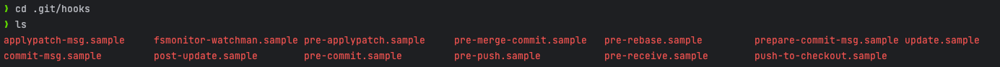
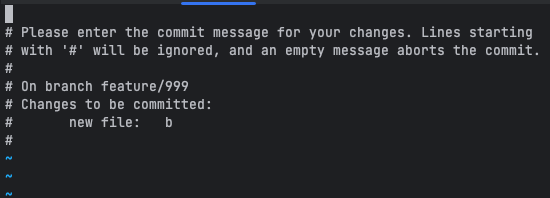
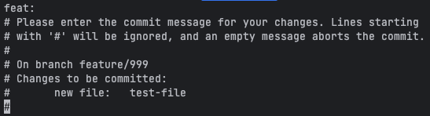
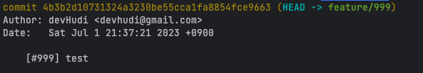
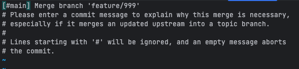
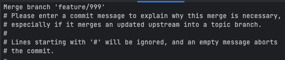

사이드 프로젝트를 진행하며, 간단한 이슈 트래킹을 위해 Github Issue를 사용하고 있다. 개발을 하다 보면, 이전의 커밋이 어떤 이슈를 해결하기 위한 작업이었는지 배경을 파악할 필요가 있다. 따라서 나는 커밋과 연관된 이슈를 파악하기 쉽도록 **이슈 티켓 번호를 커밋 메시지 Prefix**로 두는 것을 선호한다. 하지만 일일히 이슈 티켓 번호를 사람이 커밋 메시지에 작성하면, **누락하거나 실수할 위험**이 있다.

Git은 Git Hooks라는 기능을 제공한다. 이를 이용하여 커밋 메시지에 자동으로 Prefix를 달아보려고 한다. 먼저 Git Hooks가 무엇인지에 대해 알아보자.

## Git Hooks

Git Hooks는 Git 레포지토리 내에서 **특정 이벤트**가 발생하면, **자동으로 특정 스크립트를 실행**할 수 있는 기능을 제공한다.



Git Hooks 스크립트는 모든 Git 레포지토리에 기본적으로 존재한다. 다만 `.sample` 확장자로 인해 실제로는 실행되지 않고 있는 상황이다. 위 처럼 Git Hooks는 많은 이벤트를 제공한다. 우리는 이 중 `prepare-commit-msg` 훅을 사용할 것이다.

### prepare-commit-msg

이 훅은 pre-commit 훅 이후에 실행되며, 커밋 시 제공된 커밋 메시지를 수정할 수 있다. 더 자세하게 이야기해보자면, prepare-commit-msg 는 **기본 커밋 메시지가 생성된 이후, 커밋 메시지 편집기가 실행되기 이전 시점**에 실행된다.

prepare-commit-msg는 아래의 **1~3개의 파라미터**를 받는다. 파라미터 순서대로 나열하면 아래와 같다.

1. **COMMIT_EDITMSG 파일 이름**: `COMMIT_EDITMSG` 파일이란, 우리가 흔히 `git commit` 명령을 실행했을 때 커밋 메시지 작성을 위해 편집하게 되는 파일이다. 기본적으로는 **./git/COMMIT_EDITMSG** 에 생성된다.

   

2. **커밋 메시지의 출처(Source of the Commit Message)**: 커밋 메시지가 어디서 왔는지 알 수 있다. 그 값은 아래와 같다.
   - **message**: -m 혹은 -F 옵션이 주어졌을 때
   - **template**: -t 옵션이 주어졌거나 혹은 `commit.template` 설정이 있을 때
   - **merge**: 머지 커밋일 때 혹은 `.git/MERGE_MSG` 파일이 있을 때
   - **squash**: `.git/SQUASH_MSG` 파일이 있을 때
   - **commit**: 위에 해당되지 않는 경우
3. **커밋 SHA-1**: 정확히는 commit object name을 나타낸다. `-c`, `-C` 혹은 `--amend` 옵션이 있을 때만 주어진다.

> 💡 **참고**: 이 훅의 Exit Status가 0이 아닌 경우, Git은 진행중인 커밋을 abort 한다.

## 직접 훅 작성하기

내 사이드 프로젝트 브랜치 네이밍 컨벤션은 `feature/이슈_티켓_번호` 의 형태를 지킨다. 이 포스팅에서는 브랜치 이름에서 이슈 티켓 번호만 가져와 커밋 메시지에 `[#이슈_티켓_번호]` 형태로 Prefix를 삽입하는 것을 목표로 한다. 단계별로 prepare-commit-msg 훅을 작성해보며 목표를 달성해보자.

> 글을 읽는 여러분의 컨벤션이 다르다면, 아래 내용을 응용하여 자신만의 훅을 작성하면 되겠다. 작성하게 될 훅은 커밋 메시지의 Prefix를 브랜치 이름으로부터 가져오므로, 혹시 브랜치 이름에 이슈 티켓 번호가 포함되어 있지 않다면 다른 방법을 사용하기를 권한다.

### 파일 생성하기

우선 `./git/hooks` 에 `prepare-commit-msg` 파일을 생성하자. Git Hooks는 실행가능하지 않은 스크립트는 실행하지 않는다. 따라서 방금 생성한 파일에 실행 권한을 부여해야한다.

```bash
chmod +x .git/hooks/prepare-commit-msg
```

### 커밋 메시지에 Prefix 넣기

우선 첫번째 단계로 `feat:` 이라는 고정된 Prefix를 커밋 메시지 앞에 삽입해보자. 아래는 그 예제이다.

```bash
#!/bin/bash

COMMIT_EDITMSG_FILE_PATH=$1
DEFAULT_COMMIT_MSG=$(cat $COMMIT_EDITMSG_FILE_PATH)
PRFIX="feat:"

echo "$PRFIX $DEFAULT_COMMIT_MSG" > $COMMIT_EDITMSG_FILE_PATH
```

- **Line 3**: Bash Shell 에서는 커맨드 라인으로 전달된 인자를 `$n` 의 형태로 받는다. 이 때 n은 인자의 순서이다. 위에서 알아보았듯 `prepare-commit-msg` 의 첫번째 인자는 COMMIT_EDITMSG의 파일 이름이다. 이를 `COMMIT_EDITMSG_FILE_PATH` 에 저장한다.
- **Line 4**: `$(command)` 의 형태를 사용하면, 커맨드 라인 명령 결과를 변수에 저장할 수 있다. `cat` 은 파일 내용을 읽어와 표준 출력으로 보낸다. 즉 `COMMIT_EDITMSG` 의 파일 내용을 읽어와 `DEFAULT_COMMIT_MSG` 에 저장할 수 있다.
- **Line 5**: PREFIX 변수에는 커밋 메시지 Prefix 로 사용할 `feat:` 이라는 문자열을 미리 저장한다.
- **Line 7**: `echo` 는 표준 출력을 만든다. `>` 는 Redirection 라고 불리며, 표준 출력을 파일의 입력으로 변경할 수 있다 ([관련 포스팅](https://hudi.blog/linux-standard-stream-redirection-pipe/)). 즉, `PREFIX` 변수 값과 기존 `COMMIT_EDITMSG` 파일 내용을 합쳐 `COMMIT_EDITMSG` 에 덮어 씌우게 된다.



위와 같이 훅을 작성하고 커밋을 시도하면, 위 사진과 같이 커밋 메시지에 자동으로 `feat:` 이라는 prefix가 생성된 것을 확인할 수 있을 것이다.

### 브랜치 이름에서 Prefix 가져오기

```bash
#!/bin/bash

COMMIT_EDITMSG_FILE_PATH=$1
DEFAULT_COMMIT_MSG=$(cat $COMMIT_EDITMSG_FILE_PATH)

CURRENT_BRANCH_NAME=$(git rev-parse --abbrev-ref HEAD)
ISSUE_TICKET=$(echo "$CURRENT_BRANCH_NAME" | sed 's/.*\///')

echo "[#$ISSUE_TICKET] $DEFAULT_COMMIT_MSG" > $COMMIT_EDITMSG_FILE_PATH
```

- **Line 6**: `git rev-parse` 명령은 특정 커밋 혹은 브랜치에 대한 정보를 얻기 위해 사용된다. 예를 들어 `git rev-parse HEAD` 명령은 현재 브랜치의 가장 마지막 커밋의 Hash를 얻어온다. 여기에서 `--abrev-ref` 옵션을 사용하면 현재 브랜치 이름을 얻어올 수 있다. 이렇게 얻어온 브랜치 이름을 `CUREENT_BRANCH_NAME` 변수에 저장한다.
- **Line 7**: 이슈 티켓 번호를 `sed` 명령을 통해 가져온 브랜치 이름으로부터 추출한다. `sed` 명령 중에서도 `s` (switch) 명령을 사용했는데, 이는 특정 패턴에 일치하는 문자열을 다른 문자열로 치환하는데 사용된다.
  `s` 명령은 `s/패턴/치환할문자/` 형태로 사용한다. 패턴에는 정규식이 사용된다. 정규식 패턴으로는 `.*\/` 을 사용했는데, 이 패턴은 `/` 로 끝나는 모든 문자열과 매칭된다. 즉, `sed 's/.*\///'` 명령은 `/` 로 끝나는 모든 문자열을 빈 문자열로 치환함으로써, `feature/123` 과 같은 문자열을 `123` 으로 만들 수 있다. 이를 통해 이슈 티켓 번호를 가져올 수 있다.



자 이제 자동으로 이슈 티켓 번호를 커밋 메시지의 Prefix로 설정할 수 있게 되었다.

### Merge Commit 은 제외하기



그런데 아직 문제가 존재한다. 우리가 작성한 스크립트는 위와 같이 Merge commit에도 적용된다. 이는 제거하는게 좋을 것 같다. 아래와 같이 스크립트를 개선하자.

```bash
#!/bin/bash

COMMIT_EDITMSG_FILE_PATH=$1
DEFAULT_COMMIT_MSG=$(cat $COMMIT_EDITMSG_FILE_PATH)

CURRENT_BRANCH_NAME=$(git rev-parse --abbrev-ref HEAD)
ISSUE_TICKET=$(echo "$CURRENT_BRANCH_NAME" | sed 's/.*\///')

COMMIT_SOURCE=$2
if [ "$COMMIT_SOURCE" != "merge" ]; then
  PREFIX="[#$ISSUE_TICKET] "
fi

echo "$PREFIX$DEFAULT_COMMIT_MSG" > $COMMIT_EDITMSG_FILE_PATH
```

- **Line 9~12**: prepare-commit-msg의 두번째 인자 즉, 커밋 메시지 출처가 `merge` 가 아니라면 `PREFIX` 변수를 설정한다. `merge` 일 경우에는 `PREFIX` 변수가 공백일 것이므로 훅이 실행 되더라도 커밋 메시지는 원본과 동일할 것이다.



위의 개선 작업까지 거치면, 위와 같이 머지 커밋은 깔끔하게 원본 그대로 설정되는 것을 확인할 수 있을 것이다.

## 참고

- https://www.atlassian.com/ko/git/tutorials/git-hooks
- https://git-scm.com/book/en/v2/Customizing-Git-Git-Hooks
- https://git-scm.com/docs/githooks#_prepare_commit_msg
- https://blog.gitnux.com/code/git-rev-parse/
