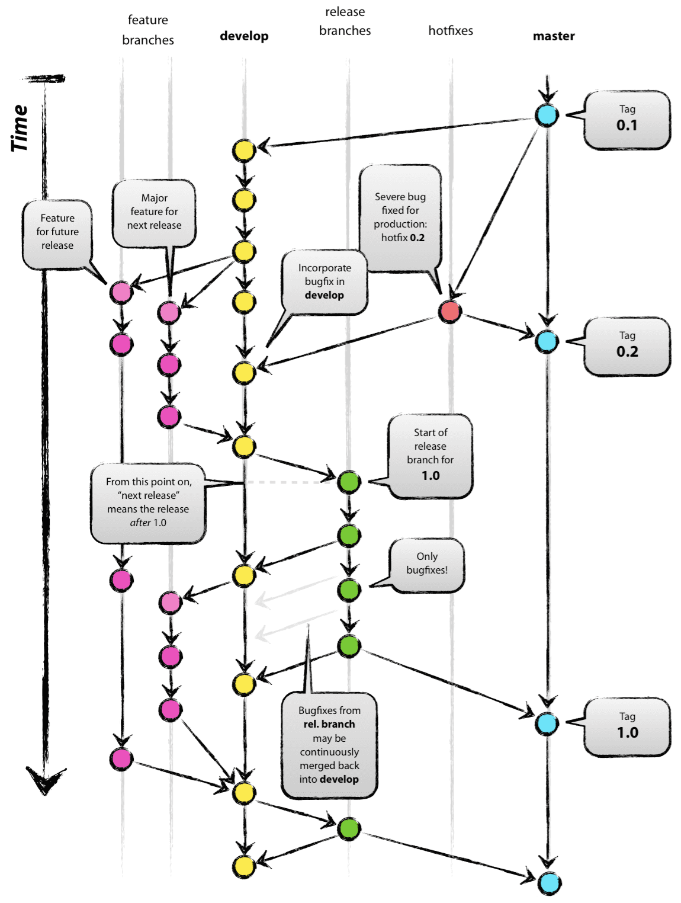
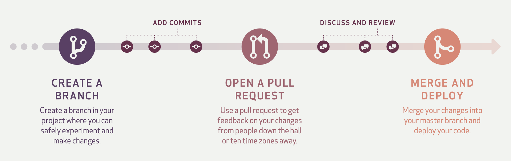

## 브랜치

우리는 왜 브랜치를 사용할까? 브랜치를 별도로 생성하지 않고 메인 브랜치에서만 작업하면 어떤 일이 벌어질까? 메인 브랜치는 출시되고 배포된 코드를 위한 브랜치이다. 이 곳에 기능을 하나씩 개발하며 커밋을 반영하게 될 것이다. 그런데, 하나의 기능을 개발하기 위해 여러개의 커밋을 했다면? 기능이 완성되기 전 까지 메인 브랜치의 소스코드는 **불완전한 상태**로 존재할 것이다.

협업을 하게 된다면 더 큰 문제가 발생할 것이다. 오직 메인 브랜치에서 수 많은 개발자들이 협업한다면, 내가 **작업중인 파일을 누군가 건드릴 수 있게**된다. 또한 여러 기능을 개발하면서 남겨진 커밋 **히스토리가 메인 브랜치에 뒤죽박죽 섞이게** 될 것이다. 커밋 히스토리가 뒤죽박죽 섞였기에, 기획 변경으로 개발중인 기능이 필요 없어졌을 때 혹은 문제가 발생했을 때 원하는 시점으로 **롤백하기도 어려워**진다.

브랜치 기능을 사용하면 다른 브랜치에 영향을 받지 않는 독립적인 환경에서 기능을 개발하거나, 버그를 수정할 수 있다. 마치 프로젝트 폴더를 복사해서 복사한 폴더에서 따로 작업하는 것 처럼 말이다. 즉, **여러 기능을 여러 사람이 병렬적으로 개발**할 수 있게 된다.

기능을 개발할 때 브랜치를 생성하고, 코드를 작성하며 커밋을 남긴다. 이후 기능 개발이 완료된 경우에 메인 브랜치에 머지를 하면 안전하게 기능을 개발할 수 있다. 이런 브랜치를 사용하여 새로운 기능을 개발하다, 기획이 변경되어 기능이 필요 없어졌을 때도 간단하게 브랜치만 삭제해버리면 끝이다. 또한 실험적인 것들을 맘편하게 시도해보고, 안전하게 삭제할 수도 있을 것이다.

## Git 브랜치 전략

그런데, 이런 좋은 브랜치도 규칙 없이 마구잡이로 사용하면 혼란을 불러올 수 있다. 브랜치 관리에 명확한 기준이 없으면 _‘이 브랜치는 어떤 목적으로 생성된거지?’, ‘이 브랜치는 어떤 커밋에서 분기된거지?’, ‘어떤 브랜치에서 내 브랜치를 생성해야하지?’, ‘내 브랜치는 어디에 병합해야지?’, ‘어떤 브랜치가 최신이지?’, ‘어떤 브랜치가 배포된 버전이지?’_ 와 같은 수 많은 의문점이 생길것이고 프로젝트는 엉망이될 것 이다.

Git 브랜치 전략은 프로젝트의 **Git 브랜치를 효과적으로 관리하기 위한 워크플로우**이다. 직접 브랜치 전략을 만들어 사용해도 되겠지만, 세상에는 브랜치를 효과적으로 관리하기 위한 **모범 사례**들이 존재한다. 이 포스팅에서는 그 모범사례 중 유명한 **Git Flow, Github Flow** 에 대해서 소개한다.

## Git Flow

Git Flow는 Vincent Driessen이 그의 블로그에 2010년에 올린 **[A successful Git branching model](https://nvie.com/posts/a-successful-git-branching-model/)** 이라는 글이 인기를 끌며 대중적으로 사용되게된 브랜치 전략이다.

Git Flow는 크게 **Main 브랜치, Develop 브랜치, Supporting 브랜치**로 구분하여 브랜치를 관리한다. 이때, Supporting 브랜치는 또 다시 **Feature 브랜치, Release 브랜치, Hotfix 브랜치**로 나뉜다.

Main 브랜치와, Develop 브랜치는 개발 프로세스 전반에 걸쳐 항상 유지되는 브랜치이다. 반면, Supporting 브랜치는 필요할 때마다 생성되고, 역할을 다하면 삭제된다. Supporting 브랜치 덕분에 팀이 병렬적으로 업무를 할 수 있게된다. 각각을 자세히 알아보자.

### Main 브랜치

Main 브랜치는 **출시 가능한 프로덕션 코드**를 모아두는 브랜치이다. Main 브랜치는 프로젝트 시작 시 생성되며, 개발 프로세스 전반에 걸쳐 유지된다. 배포된 각 버전을 Tag를 이용해 표시해둔다.

### Develop 브랜치

**다음 버전 개발을 위한 코드**를 모아두는 브랜치이다. 개발이 완료되면, Main 브랜치로 머지된다.

### Feature 브랜치

**하나의 기능을 개발하기 위한 브랜치**이다. Develop 브랜치에서 생성하며, 기능이 개발 완료되면 다시 Develop 브랜치로 머지된다. 머지할때 주의점은 Fast-Forward로 머지하지 않고, Merge Commit을 생성하며 머지를 해주어야 한다. 이렇게해야 히스토리가 특정 기능 단위로 묶이게 된다.

네이밍은 `feature/branch-name` 과 같은 형태로 생성한다.

### Release 브랜치

**소프트웨어 배포를 준비하기 위한 브랜치**이다. Develop 브랜치에서 생성하며, 버전 이름 등의 소소한 데이터를 수정하거나 배포전 사소한 버그를 수정하기 위해 사용된다. 배포 준비가 완료되었다면 Main과 Develop 브랜치에 둘다 머지한다. 이때, Main 브랜치에는 태그를 이용하여 버전을 표시한다.

Release 브랜치를 따로 운용함으로써, 배포 업무와 관련없는 팀원들은 병렬적으로 Feature 브랜치에서 이어서 기능을 개발할 수 있게된다.

네이밍은 `release/v1.1` 과 같은 형태로 생성한다.

### Hotfix 브랜치

**이미 배포된 버전에 문제**가 발생했다면, Hotfix 브랜치를 사용하여 문제를 해결한다. Main 브랜치에서 생성하며, 문제 해결이 완료되면 Main과 Develop 브랜치에 둘다 머지한다.

Release 브랜치와 마찬가지로 Hotfix 브랜치를 따로 운용함으로써, 핫픽스 업무와 관련없는 팀은 병렬적으로 기능 개발을 할 수 있다.

네이밍은 `hotfix/v1.0.1` 과 같은 형태로 생성한다.

## Git Flow의 한계: 웹 어플리케이션에는 적합하지 않다

Vincent Driessen은 A successful Git branching model을 작성하고 10년이 지난 2020년에 해당 포스팅 위에 반성의 글(Note of Reflection)을 적는다. 그 내용을 요약하면 아래와 같다.

> _Git-Flow는 등장하고 10년 넘게 표준처럼 자리잡고, 더 나아가 마치 만병통치약처럼 사용되었다. 현재는 **Git으로 관리되는 인기있는 유형의 소프트웨어가 웹 어플리케이션으로 이동**하고 있다. **웹 어플리케이션은 일반적으로 롤백되지 않고, 지속적으로 제공(Continuous Delivery)**되므로 **여러 버전의 소프트웨어를 지원할 필요가 없다**._   
>
> _웹 어플리케이션은 내가(Vincent Driessen) 10년전 블로그 글을 쓸때에는 염두해둔 소프트웨어 유형이 아니다. **팀이 소프트웨어를 지속적으로 제공**한다면, Git Flow 대신 **Github Flow와 같은 더 단순한 워크플로우**를 채택할 것을 제안한다._   
>
> _그러나 명시적으로 버전을 관리해야하는 소프트웨어를 개발한다면, 여전히 Git Flow가 적합할 수 있다._

즉, Git Flow는 명시적으로 버전관리가 필요한 이를 테면, 스마트폰 어플리케이션, 오픈소스 라이브러리/프레임워크 등의 프로젝트에 적합하다. 유명한 글인 우아한형제들 기술 블로그에 **[우린 Git-flow를 사용하고 있어요](https://techblog.woowahan.com/2553/)** 글을 작성한 팀도 안드로이드 앱 개발팀이다.

**웹 어플리케이션은 특성상 사용자는 항상 최신의 단일 버전**만을 사용하게된다. 여러 버전을 병렬적으로 지원할 필요가 없는 것이다. 또한 웹 어플리케이션은 하루에 몇번이고 릴리즈될 수 있다. 이런 특성상 **웹 어플리케이션 개발에 Git Flow는 다소 적합하지 않다.**

사실 나도 Git Flow가 가장 유명하고 자료가 많아 몇번 적용해봤지만, (물론 경험 부족이 가장 큰 원인이겠지만) Git Flow의 브랜치 규칙이 잘 이해가 가지 않았다. 특히 **Release와 Hotfix 브랜치가 왜 존재**하는 것인지, **Main과 Develop 브랜치는 대체 왜 나눠둔 것**인지 이해가지 않았다. 지금보니 내가 웹 어플리케이션만 개발해왔기 때문에 들게된 자연스러운 고민이었다는 생각이 든다.

그렇다면 Vincent Driessen이 언급한 **Github Flow**란 무엇일까?

## Github Flow

앞서 소개한 Git Flow는 대부분의 케이스에서 매우 복잡하다. 기계적으로 규칙을 따르기만 하면 큰 문제 없다고 하지만, 결국 복잡하기 때문에 많은 사람들이 **실수**하고 헤매게된다. Github Flow는 Git Flow와 다르게 굉장히 **간단한 구조**이다.

Github Flow는 이름 그대로 Github 환경에서 사용하기 적합한 브랜치 전략이기도하다. 또한 **자동화**를 적극 활용하기도 한다. 한번 Github Flow에 대해 알아보자.

### Main 브랜치

항상 **Stable**한 상태여야 한다. 이때, Stable하다는 것은 Main의 **모든 커밋은 언제 배포하든 문제 없어야하고, 언제든 브랜치를 새로 만들어도 문제가 없어야** 한다. Main 브랜치의 모든 커밋은 **빌드가 되고, 테스트를 통과**해야한다. 이것이 Github Flow가 강제하는 유일한 사항이다.

### Topic 브랜치

**새로운 기능**을 개발할 때에는 **Topic 브랜치**를 Main 브랜치로부터 생성한다. Git Flow의 Feature 브랜치와 동일한 역할을 한다. 또한 별도로 Hotfix 브랜치를 관리하지 않으며, **버그 수정도 Topic 브랜치**에서 진행한다.

이때, Topic 브랜치의 이름은 기능을 설명하는 명확한 이름으로 네이밍 해야한다. 예를 들면, `user-content-cache-key`, `submodules-init-task`, `redis2-transition` 등이 있다.

Topic 브랜치의 커밋은 기능이 완성되지 않았더라도 **꾸준히 Push** 한다. 노트북 분실, 작업 컴퓨터의 고장등의 위험으로 코드가 유실되는 것을 막아준다. 이것보다 더 중요한 이유는 꾸준히 Push 함으로써 **구성원 모두가 끊임없이 커뮤니케이션** 할 수 있게 해준다.

Github에서는 **PR(Pull Request)**라는 유용한 기능이 존재한다. 개발자는 기능을 개발하는 중 **언제든 상관없이 PR을 개설**할 수 있다. 심지어 코드의 변경이 없더라도 **스크린샷, 아이디어를 공유하고 싶을 때**에도 PR을 개설한다. 개발자들은 개설된 PR에서 **토론**을 하고, 코드의 특정 라인을 선택해 코멘트를 남겨 **코드리뷰**를 주고 받는다.

토론과 리뷰가 끝났으면, 다른 사람들의 **동의(Approve)**를 얻고 Main 브랜치에 자신의 Topic 브랜치를 머지한다. 단, 이때 Topic 브랜치는 **자동화된 CI 빌드**를 통과해야 머지가 가능하다.

### 어떤 프로덕트에 적합할까?

개발팀이 소규모 애자일 팀이고, 제품이 **단일 릴리즈 버전**밖에 존재하지 않는다면 Github Flow가 적절하다. 대부분의 웹 애플리케이션은 여러 버전을 관리하지 않고, 가장 최신 버전 하나만을 사용자가 사용하게 된다.

Github Flow는 하루에 변경사항을 작은 단위로 신속하고 자주 병합/배포 할 수 있는 구조로, **진정한 의미의 CI/CD**를 실천하기 적합한 브랜치 전략이 아닐까한다.

## 마치며

이외에도 Gitlab Flow, Trunk-based Development 와 같은 여러 전략이 있지만, 아직 나에게는 많이 생소하여 다루지는 않았다. 시간이 나면 이런 브랜치 전략도 다뤄보려한다.

## 참고

- [https://www.youtube.com/watch?v=etnFe2tBD5I](https://www.youtube.com/watch?v=etnFe2tBD5I)
- [https://georgestocker.com/2020/03/04/please-stop-recommending-git-flow/](https://georgestocker.com/2020/03/04/please-stop-recommending-git-flow/)
- [https://www.gitkraken.com/learn/git/git-flow](https://www.gitkraken.com/learn/git/git-flow)
- [https://nvie.com/posts/a-successful-git-branching-model/](https://nvie.com/posts/a-successful-git-branching-model/)
- [https://githubflow.github.io/](https://githubflow.github.io/)
