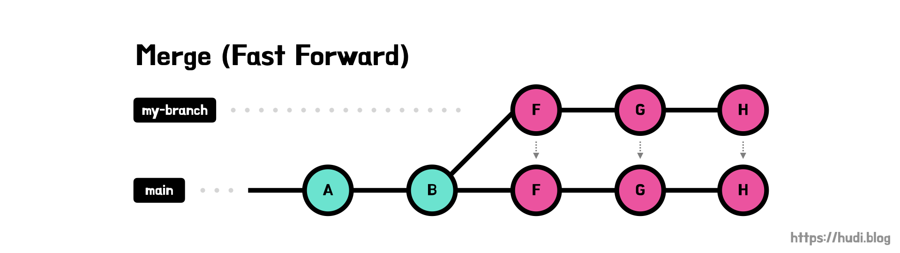
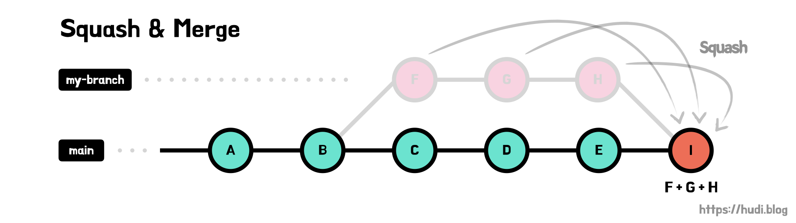
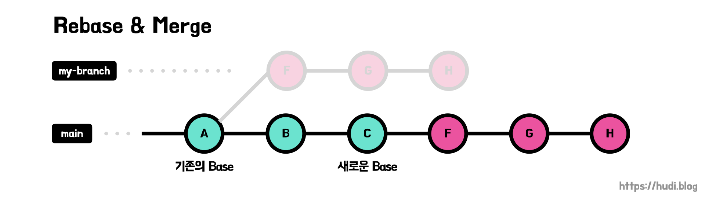

## 학습 배경

우아한테크코스 달록팀에서 브랜치 전략 개선과 배포와 관련된 이야기를 하면서 다양한 병합방법에 대한 이야기가 나왔다. 이야기를 해보면서, 아직 Git의 다양한 병합 방법에 대한 이해도가 낮다는 생각에 공부를 하게 되었다. 막상 공부를 해보니 그리 어려운 내용도 아니었는데, 너무 많이 미뤄뒀던 것 같다.

## Merge

일반적으로 많이 사용되는 병합이며, 커밋 이력을 모두 남길 때 사용한다.

```bash
$ git checkout main
$ git merge my-branch
```

이 방식은 다시 Fast-Forward 방식과 Recursive 방식으로 나뉜다.

### Merge (Fast-Forward)



새로운 브랜치 `my-branch` 가 `main` 브랜치로부터 분기된 이후 `main` 브랜치에 새로운 커밋이 올라오지 않았다면, `my-branch` 가 `main` 와 비교하여 최신의 브랜치라고 할 수 있다. 이런 경우 `my-branch` 의 변경 이력을 그대로 `main` 으로 가져올 수 있는데, 이를 Fast-Forward Merge 라고 한다.

### Merge (Recursive)


`my-branch` 가 `main` 브랜치에서 분기되고, `main` 브랜치에 새로운 커밋이 생겼다면, `my-branch` 를 최신이라고 간주할 수 없다. 따라서 `my-branch` 와 `main` 을 공통 부모로 한 새로운 Merge Commit 을 생성하게된다. 이런 방법을 Recursive Merge라고 한다.

Fast-Forward Merge가 가능한 상태에서 `git merge` 명령에 `--no-ff` 옵션을 주면 강제로 Merge Commit을 생성하게 할 수 있다.

## Squash & Merge



Squash는 여러개의 커밋을 하나의 커밋으로 합치는 것을 의미한다. Squash Merge는 병합할 브랜치의 모든 커밋을 하나의 커밋으로 Squash한 새로운 커밋을 Base 브랜치에 추가하는 방식으로 병합하는 것을 의미한다.

Squash를 하게 되면 모든 커밋 이력이 하나의 커밋으로 합쳐지며 사라진다는 점을 주의해야한다.

```bash
$ git checkout main
$ git merge --squash my-branch
$ git commit -m "squash & merge"
```

## Rebase & Merge



Rebase를 알아보기 전에 Base가 무엇인지 알아보자. `my-branch` 가 `main` 브랜치의 A 커밋에서 분기되었다고 하자. 이때, `my-branch` 의 Base는 A 커밋이다.

그렇다면, Rebase는 무엇일까? 말 그대로 Base를 다시 설정한다는 의미이다. 그럼 Base를 어디로 다시 설정할까? `my-branch` 가 분기된 `main` 브랜치의 최신 커밋이다.

Rebase를 하면 커밋들의 Base가 변경되므로 Commit Hash 또한 변경 될 수 있다. 이로 인해 Force Push를 해야할 경우도 있으니 주의하자.

```bash
$ git checkout my-branch
$ git rebase main
$ git checkout main
$ git merge my-branch
```

명령 순서를 보면 알겠지만, 결과적으로 Fast-Forward Merge를 사용하는 것을 확인할 수 있다.

## 언제 어떤 방식을 사용해야하는가?

> 아래 내용은 NHN Cloud Meetup!의 **[GitHub의 Merge, Squash and Merge, Rebase and Merge 정확히 이해하기](https://meetup.toast.com/posts/122)** 을 참고하여 나의 생각을 덧붙여 작성하였다.

### feature → develop 머지

Squash & Merge가 유용하다. feature 브랜치에서 기능을 개발하기 위한 지저분한 커밋 내역을 하나의 커밋으로 묶어 develop 에 병합하면서, develop에는 기능 단위로 커밋이 추가되도록 정리할 수 있다.

또한 feature 브랜치는 develop 브랜치에 병합 후 제거하므로, Merge Commit 을 남길 필요가 없다.

### develop → main 머지

main 브랜치는 지금까지 작업한 모든 기능을 배포할 때 병합한다. develop 브랜치를 squash & merge 하게 되면 커밋 이력이 모두 사라져, 특정 기능에서 문제가 생겼을 때 롤백할 수 없게된다. main 브랜치 또한 Merge Commit 을 남길 필요 없다. 따라서 Rebase & Merge 가 적합하다.

## 참고

- [https://meetup.toast.com/posts/122](https://meetup.toast.com/posts/122)
- [https://im-developer.tistory.com/182](https://im-developer.tistory.com/182)
