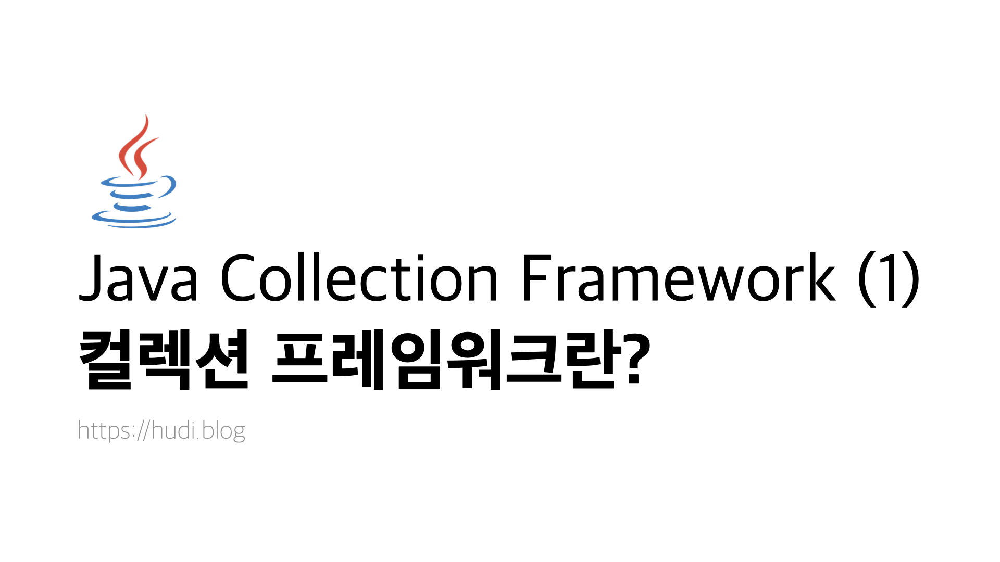
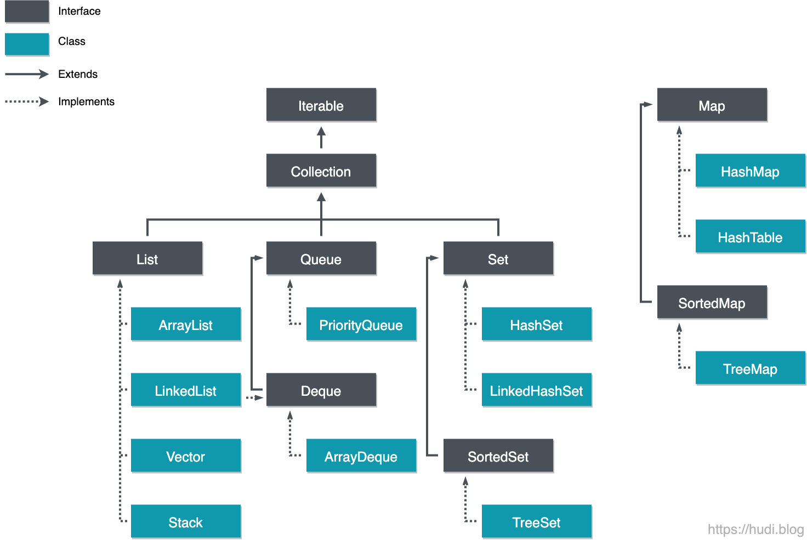

> 본 포스팅에서는 컬렉션 프레임워크의 개요, 종류, 그리고 구현과 상속의 계층적 구조 등에 대해 개괄적으로 짚어본다.

## 1. Collection Framework 의 개요
컬렉션 프레임워크는 자바 프로그래밍에서 빠질 수 없는 필수적인 요소이다. 컬렉션은 다수의 요소를 하나의 그룹으로 묶어 효율적으로 저장하고, 관리할 수 있는 기능을 제공하는 일종의 컨테이너이다. 배열은 크기가 고정되어 있는데에 반해, 컬렉션 프레임워크는 **가변적인 크기를 갖는 (Resizable)** 등의 특징을 갖는다. 또한 **데이터 삽입, 탐색, 정렬 등 편리한 API 를 다수 제공**한다. 이런 이점으로 개발자는 배열보다는 적절한 컬렉션 클래스를 선택해 사용하는 것이 권장된다.

컬렉션 프레임워크는 JDK 1.2 버전부터 `java.util` 패키지에서 지원한다. JDK 1.2 이전에는 Vector, Properties, Stack, Hash Tables, Dictionary 같은 것들이 제공 되었는데, **통일성이 없었고 표준화된 인터페이스가 존재하지 않았다.** 

### 1-1. 컬렉션 프레임워크의 이점
 컬렉션 프레임워크는 아래와 같은 이점으로 프로그램의 유지보수를 쉽게 만들어준다.
- List, Queue, Set, Map 등의 인터페이스를 제공하고, 이를 구현하는 클래스를 제공하여 **일관된 API 를 사용**할 수 있다.
- **가변적인 저장 공간**을 제공한다. 고정적인 저장 공간을 제공하는 배열에 대비되는 특징이다.
- 자료구조, 알고리즘을 구현하기 위한 코드를 직접 작성할 필요 없이, **이미 구현된 컬렉션 클래스를 목적에 맞게 선택하여 사용**하면 된다.
- 제공되는 API 의 코드는 **검증**되었으며, 고도로 **최적화** 되어있다.

### 1-2. 구성요소
컬렉션 프레임워크는 아래의 3가지 요소로 구성된다.
1. **인터페이스 (Interfaces)** : 각 컬렉션을 나타내는 추상 데이터에 대한 인터페이스 (List, Set, Map 등). 클래스는 이 인터페이스를 구현하는 방식으로 작성되었기 때문에 상세 동작은 달라도 일관된 조작법으로 사용할 수 있다.
2. **클래스 (Classes)** : 컬렉션 별 인터페이스의 구현 (Implementation). 위에서 언급했듯, 같은 List 컬렉션이더라도 목적에 따라 ArrayList, LinkedList 등으로 상세 구현이 달라질 수 있다.
3. **알고리즘 (Algorithms)** : 컬렉션이 제공하는 연산, 검색, 정렬, 셔플 (Shuffle) 등에 대한 메소드.

## 2. Collection Framework 의 종류
컬렉션 프레임워크는 아래와 같이 크게 4개로 분류할 수 있다.
- **리스트 (List)** : 인덱스 순서로 요소를 저장한다. 중복된 데이터를 저장할 수 있다.
- **큐 (Queue)** : 데이터가 저장된 순서대로 출력되는 선입선출 (FIFO: First In First Out) 의 구조를 갖는 선형 자료구조이다.
- **집합 (Set)** : 순서가 없으며, 데이터를 중복하여 저장할 수 없다. 집합 연산 (합집합, 교집합, 차집합 등) 을 지원한다.
- **맵 (Map)** : Key-value 쌍으로 데이터를 저장한다. 순서가 존재하지 않으며, Key 가 중복될 수 없다.

## 3. Collection Framework 계층

> 검정색은 인터페이스, 파랑색은 클래스, 실선 화살표는 상속, 점선 화살표는 구현을 의미한다.

컬렉션 프레임워크는 위와 같은 구조로 이루어져있다. 대표적으로 `List` , `Queue` , `Set` , `Map` 인터페이스로 구성되어 있으며, 세부적으로 여러 클래스가 해당 인터페이스를 구현하거나, 다른 인터페이스가 상속받는 구조로 되어있다.

`Queue` 는 인터페이스는 존재하나, 직접 구현된 클래스는 존재하지 않는다. 위 계층도를 살펴보면 `LinkedList` 가 `List` 인터페이스와 `Deque` 인터페이스를 둘다 구현하고 있는 모습을 볼 수 있다. 따라서 `Queue` 를 구현하려면 `LinkedList` 를 사용하여 구현할 필요가 있다. (`PriorityQueue` 는 FIFO 가 아닌, 요소의 우선순위에 따라 출력 순서가 바뀌므로 일반적인 `Queue` 가 아니다)

`Map` 인터페이스는 구조상 특징이 달라 `List` , `Queue` , `Set` 과 달리  `Collection` 를 상속받지 않는 모습을 볼 수 있다. `Collection` 은 `Iterable` 을 상속받고 있다. `Iterable` 인터페이스에 대해서는 다른 포스트에서 다뤄보도록 하겠다.

## 4. 마치며
본 시리즈의 다음 포스트에서는 List 인터페이스와 List 인터페이스를 구현하는 클래스들의 특징과 대표적인 메소드에 대해 알아볼 것 이다.