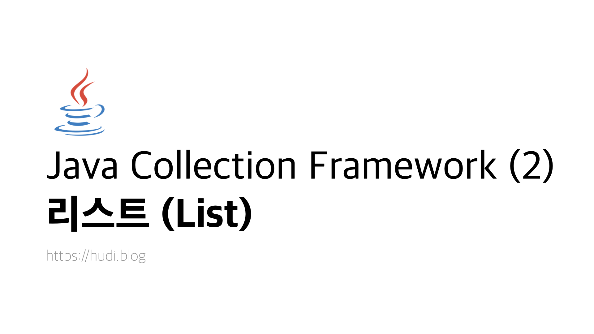
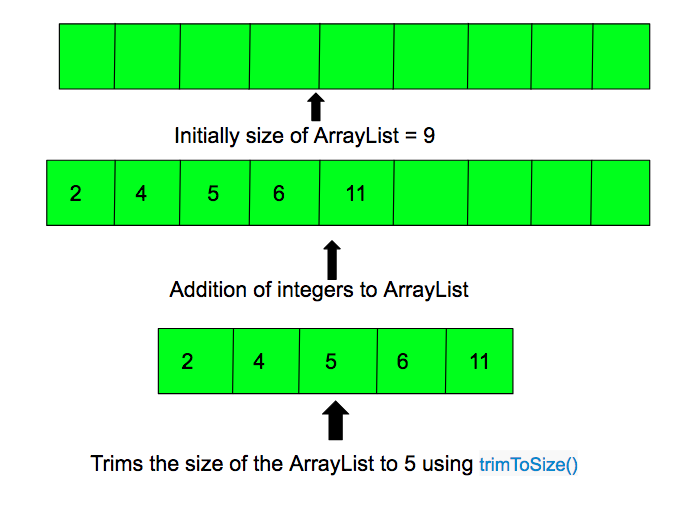
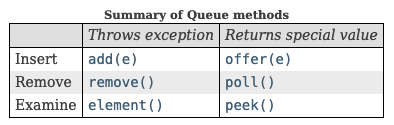

> 본 포스팅에서는 컬렉션 프레임워크 중 List 인터페이스와 그것을 구현한 여러 클래스들의 특징, 메소드 등을 알아본다.

## 1. Collection 인터페이스

들어가기 앞서 `List` , `Queue` , `Set` 이 구현하는 `Collection` 인터페이스의 주요 메소드들에 대해 짚고 넘어가자. Collection 인터페이스의 모든 스펙을 확인하고 싶다면, [**Oracle 문서**](https://docs.oracle.com/javase/8/docs/api/java/util/Collection.html)를 확인하자.

| 메소드                                        | 설명                                                                                                                                                                     |
| --------------------------------------------- | ------------------------------------------------------------------------------------------------------------------------------------------------------------------------ |
| boolean add(Object o)                         | 컬렉션에 객체 `o` 를 추가한다. 추가되어 컬렉션이 변화하였으면 `true` 를, 그렇지 않으면 `false` 를 반환한다.                                                              |
| boolean addAll(Collection c)                  | 컬렉션에 컬렉션 `c` 이 갖고있는 요소를 모두 추가한다. 추가되어 컬렉션이 변화하였으면 `true` 를, 그렇지 않으면 `false` 를 반환한다.                                       |
| void clear()                                  | 컬렉션을 비운다.                                                                                                                                                         |
| boolean contains(Object o)                    | 컬렉션에 객체 `o` 가 포함되어 있는지 여부를 검사한다. 포함되어 있다면 `true` 를, 그렇지 않다면 `false` 를 반환한다.                                                      |
| boolean containsAll(Collection c)             | 컬렉션에 컬렉션 `c` 가 갖고있는 요소 모두가 포함되어 있는지 여부를 검사한다. 포함되어 있다면 `true` 를, 그렇지 않다면 `false` 를 반환한다.                               |
| boolean isEmpty()                             | 컬렉션이 비어있는지 검사한다. 비어있다면 `true` 를, 그렇지 않다면 `false` 를 반환한다.                                                                                   |
| boolean remove(Object o)                      | 컬렉션에서 객체 `o` 를 제거한다. 제거되어 컬렉션이 변화하였으면 `true` 를, 그렇지 않으면 `false` 를 반환한다.                                                            |
| boolean removeAll(Collection c)               | 컬렉션에서 컬렉션 `c` 이 갖고있는 요소를 모두 제거한다. 제거되어 컬렉션이 변화하였으면 `true` 를, 그렇지 않으면 `false` 를 반환한다.                                     |
| boolean removeIf(Predicate<? super E> filter) | 람다식을 통해 요소를 필터링할 수 있다.                                                                                                                                   |
| boolean retainAll(Collection c)               | 컬렉션에서 컬렉션 `c` 이 갖고있는 요소를 제외한 나머지 요소를 모두 제거한다. 제거되어 컬렉션이 변화하였으면 `true` 를, 그렇지 않으면 `false` 를 반환한다.                |
| int size()                                    | 컬렉션이 보유하고 있는 객체의 수를 반환한다.                                                                                                                             |
| Object[] toArray()                            | 컬렉션을 배열로 변환한다.                                                                                                                                                |
| Object[] toArray(Object[] a)                  | 컬렉션을 배열로 변환한다. 파라미터로 넣어준 배열의 크기에 맞춰 배열이 생성되는데, 리스트의 사이즈가 배열의 크기보다 크다면, 리스트 사이즈에 맞춰 배열의 크기가 조절된다. |
| Iterator iterator()                           | 컬렉션의 Iterator 를 반환한다.                                                                                                                                           |
| Stream stream()                               | 컬렉션의 Stream 을 반환한다.                                                                                                                                             |
| Stream<E> parallelStream()                    | 병렬처리가 가능한 Stream 을 반환한다.                                                                                                                                    |

앞으로 살펴볼 `List` , `Queue` , `Set` 인터페이스는 위 `Collection` 인터페이스를 상속하므로, 각각의 사용 방법은 크게 다르지 않을 것 이다.

## 2. 리스트(List) 인터페이스

자바에서의 리스트는 순서가 있고, 중복된 값을 담을 수 있는 컬렉션이다. List 인터페이스를 구현하는 클래스는 `ArrayList` , `LinkedList` , `Vector` , `Stack` 가 있다. 자세한 스펙은 **[Oracle 문서](https://docs.oracle.com/javase/8/docs/api/java/util/List.html)** 를 참조하자.

### 2-1. 메소드

| 메소드                                     | 설명                                                                                                                                                                     |
| ------------------------------------------ | ------------------------------------------------------------------------------------------------------------------------------------------------------------------------ |
| boolean add(Object o)                      | 리스트에 객체 `o` 를 추가한다. 추가되어 컬렉션이 변화하였으면 `true` 를, 그렇지 않으면 `false` 를 반환한다.                                                              |
| void add(int index, Object o)              | 리스트에 객체 `o` 를 `index` 위치에 추가한다.                                                                                                                            |
| boolean addAll(Collection c)               | 리스트에 컬렉션 `c` 이 갖고있는 요소를 모두 추가한다. 추가되어 리스트가 변화하였으면 `true` 를, 그렇지 않으면 `false` 를 반환한다.                                       |
| boolean addAll(int index, Collection c)    | 리스트에 컬렉션 `c` 이 갖고있는 요소를 `index` 위치 부터 모두 추가한다. 추가되어 리스트가 변화하였으면 `true` 를, 그렇지 않으면 `false` 를 반환한다.                     |
| void clear()                               | 리스트를 비운다.                                                                                                                                                         |
| boolean contains(Object o)                 | 리스트에 객체 `o` 가 포함되어 있는지 여부를 검사한다. 포함되어 있다면 `true` 를, 그렇지 않다면 `false` 를 반환한다.                                                      |
| boolean containsAll(Collection c)          | 리스트에 컬렉션 `c` 가 갖고있는 요소 모두가 포함되어 있는지 여부를 검사한다. 포함되어 있다면 `true` 를, 그렇지 않다면 `false` 를 반환한다.                               |
| Object get(int index)                      | `index` 위치에 있는 요소를 반환한다.                                                                                                                                     |
| int indexOf(Object o)                      | 주어진 객체 `o` 중 가장 앞 요소의 위치(index) 를 반환한다. 존재하지 않는다면 -1을 반환한다.                                                                              |
| int lastIndexOf(Object o)                  | 주어진 객체 `o` 중 가장 뒤 요소의 위치(index) 를 반환한다. 존재하지 않는다면 -1을 반환한다.                                                                              |
| boolean isEmpty()                          | 리스트가 비어있는지 검사한다. 비어있다면 `true` 를, 그렇지 않다면 `false` 를 반환한다.                                                                                   |
| boolean remove(Object o)                   | 리스트에서 객체 `o` 를 제거한다. 제거되어 컬렉션이 변화하였으면 `true` 를, 그렇지 않으면 `false` 를 반환한다.                                                            |
| Object remove(int index)                   | 리스트에서 객체 `o` 를 제거한다. 제거되어 컬렉션이 변화하였으면 `true` 를, 그렇지 않으면 `false` 를 반환한다.                                                            |
| boolean removeAll(Collection c)            | 리스트에서 컬렉션 `c` 이 갖고있는 요소를 모두 제거한다. 제거되어 컬렉션이 변화하였으면 `true` 를, 그렇지 않으면 `false` 를 반환한다.                                     |
| void replaceAll(UnaryOperator<E> operator) | 람다식을 이용해 각 요소를 변경할 수 있다.                                                                                                                                |
| boolean retainAll(Collection c)            | 컬렉션에서 컬렉션 `c` 이 갖고있는 요소를 제외한 나머지 요소를 모두 제거한다. 제거되어 컬렉션이 변화하였으면 `true` 를, 그렇지 않으면 `false` 를 반환한다.                |
| Object set(int index, Object o)            | `index` 위치에 있는 요소를 주어진 객체 `o` 로 교체한다.                                                                                                                  |
| int size()                                 | 컬렉션이 보유하고 있는 객체의 수를 반환한다.                                                                                                                             |
| void sort(Comparator<? super E> c)         | 요소를 오름차순으로 정렬한다. `Collections.sort(c)` 의 형태로 사용한다.                                                                                                  |
| Object[] toArray()                         | 컬렉션을 배열로 변환한다.                                                                                                                                                |
| Object[] toArray(Object[] a)               | 컬렉션을 배열로 변환한다. 파라미터로 넣어준 배열의 크기에 맞춰 배열이 생성되는데, 리스트의 사이즈가 배열의 크기보다 크다면, 리스트 사이즈에 맞춰 배열의 크기가 조절된다. |
| Iterator iterator()                        | 컬렉션의 Iterator 를 반환한다.                                                                                                                                           |
| ListIterator<E> listIterator()             | ListIterator 를 반환한다.                                                                                                                                                |
| ListIterator<E> listIterator(int index)    | `index` 이후로 순환하는 ListIterator 를 반환한다.                                                                                                                        |
| Spliterator<E> spliterator()               | Spliterator 를 반환한다.                                                                                                                                                 |
| Stream stream()                            | 컬렉션의 Stream 을 반환한다.                                                                                                                                             |
| Stream<E> parallelStream()                 | 병렬처리가 가능한 Stream 을 반환한다.                                                                                                                                    |

> List 인터페이스를 구현한 클래스의 메소드 설명에서는 위 메소드들은 제외한다.

## 3. ArrayList 클래스

배열과 같이 연속된 메모리 공간을 사용하는 리스트이다. 배열과 다르게 저장공간의 크기는 가변적이다. 자세한 스펙은 **[Oracle 문서](https://docs.oracle.com/javase/8/docs/api/java/util/ArrayList.html)** 를 참조하자.

### 3-1. 메소드

ArrayList 는 List 의 구현으로서, 동적으로 요소를 추가하거나 제거할 수 있다. 리스트의 크기도 동적으로 조절된다. 데이터는 마치 배열을 사용하는 것 처럼 인덱스(Index) 로 접근할 수 있다.

| 메소드                                      | 설명                                                                                       |
| ------------------------------------------- | ------------------------------------------------------------------------------------------ |
| Object clone()                              | 리스트의 얕은 복사본을 반환한다.<br>                                                       |
| void ensureCapacity(int minCapacity)        | 리스트의 최소 용량을 확보한다.                                                             |
| void forEach(Consumer<? super E> action)    | 람다식을 사용하여 리스트 내부 요소를 순회할 수 있다.                                       |
| List<E> subList(int fromIndex, int toIndex) | 기존 리스트에서 `fromIndex` 부터 `toIndex - 1` 의 범위의 요소를 갖는 새 리스트를 반환한다. |
| void trimToSize()                           | 현재 리스트 크기에 맞춰 용량을 자른다.                                                     |

### 3-2. 부연 설명

`ensureCapacity` 메소드에 대해 좀 더 자세히 설명하고 넘어가도록 하겠다. 꽉 찬 상태의 ArrayList 는 새 요소를 여러번 추가할때, 내부적으로 크기 또한 여러번 재조정된다. 이 과정은 ArrayList 보다 크기가 더 큰 ArrayList 를 생성하고, 새 ArrayList로 데이터를 복사하는 작업이 수행된다. ensureCapacity 는 위 과정을 최적화 할 때 사용한다. `size()` 메소드의 반환값과는 관련없다.

추가로 `trimToSize` 메소드를 짚어보자면, 이 또한 용량 (capacity) 와 관련된 메소드이다. `trimToSize` 는 현재 리스트의 크기 (size) 에 맞춰 용량을 자른다. 이를 그림으로 나타내면 아래와 같다.



## 4. LinkedList 클래스

LinkedList 클래스는 양방향 연결 리스트 (Doubly Linked List) 로 구현되어있다. 각 노드는 이전 노드와 다음 노드값을 가지고 있다. Linked List 는 데이터 추가, 삽입의 속도는 빠르나, 데이터 검색은 오래걸리는 단점을 가지고 있다. 일반적으로 알려진 Linked List 의 특징 그대로 구현되었다고 생각하면 된다. 자세한 스펙은 **[Oracle 문서](https://docs.oracle.com/javase/8/docs/api/java/util/LinkedList.html)** 를 참조하자.

> LinkedList 자료구조에 대한 내용은 이전에 작성한 [**링크드 리스트 \(Linked List\)**](https://hudi.blog/ds-linked-list/) 포스트를 참고하자.

### 4-1. 메소드

아래 표를 살펴보면 알겠지만, 동일한 기능으로 동작하는 메소드가 서로 다른 이름으로 여러번 구현된 경우가 존재한다. LinkedList 는 List 인터페이스를 구현하며, JDK 1.2 에서 추가되었지만 이후 Queue 인터페이스 (JDK 1.5) 와 Deque (JDK 1.6) 을 구현하게 된 것이 그 이유이다.

| 메소드                                  | 설명                                                                                                                        |
| --------------------------------------- | --------------------------------------------------------------------------------------------------------------------------- |
| void addFirst(Object o)                 | 리스트 맨 앞에 객체 `o` 를 추가한다.                                                                                        |
| void addLast(Object o)                  | 리스트 마지막에 객체 `o` 를 추가한다.<br>                                                                                   |
| Iterator<E> descendingIterator()        | 반대 순서의 Iterator 를 반환한다.                                                                                           |
| Object getFirst()                       | 리스트의 첫번째 객체를 반환한다. 리스트가 비어있으면 `NoSuchElementException` 예외가 발생한다.                              |
| Object getLast()                        | 리스트의 마지막 객체를 반환한다. 리스트가 비어있으면 `NoSuchElementException` 예외가 발생한다.                              |
| Object element()                        | 리스트의 첫번째 객체 `o` 를 반환한다. getFirst() 와 동일한 기능을 수행한다.                                                 |
| boolean offer(Object o)                 | 리스트의 마지막에 객체 `o` 를 추가한다. 용량이 초과되어 추가하지 못할 경우 `false` 를 반환한다.                             |
| boolean offerFirst(Object o)            | 리스트의 맨 앞에 객체 `o` 를 추가한다. 용량이 초과되어 추가하지 못할 경우 `false` 를 반환한다.                              |
| boolean offerLast(Object o)             | 리스트의 마지막에 객체 `o` 를 추가한다. 용량이 초과되어 추가하지 못할 경우 `false` 를 반환한다.                             |
| Object peek()                           | 리스트의 첫번째 객체를 반환한다. 단, 리스트가 비어있을 경우 `null` 을 반환한다.                                             |
| Object peekFirst()                      | 리스트의 첫번째 객체를 반환한다. 단, 리스트가 비어있을 경우 `null` 을 반환한다.                                             |
| Object peekLast()                       | 리스트의 마지막 객체를 반환한다. 단, 리스트가 비어있을 경우 `null` 을 반환한다.<br>                                         |
| Object poll()                           | 리스트의 첫번째 객체를 반환하고 삭제한다. 단, 리스트가 비어있을 경우 `null` 을 반환한다.<br>                                |
| Object pollFirst()                      | 리스트의 첫번째 객체를 반환하고 삭제한다. 단, 리스트가 비어있을 경우 `null` 을 반환한다.                                    |
| Object pollLast()                       | 리스트의 마지막 객체를 반환하고 삭제한다. 단, 리스트가 비어있을 경우 `null` 을 반환한다.                                    |
| Object pop()                            | 리스트의 첫번째 객체를 반환하고 삭제한다. 리스트가 비어있으면 `NoSuchElementException` 예외가 발생한다.                     |
| void push(Object o)                     | 리스트 맨 앞에 객체 `o` 를 추가한다.                                                                                        |
| Object remove()                         | 리스트의 첫번째 객체를 반환하고 삭제한다. 리스트가 비어있으면 `NoSuchElementException` 예외가 발생한다.                     |
| Object removeFirst()                    | 리스트의 첫번째 객체를 반환하고 삭제한다. 리스트가 비어있으면 `NoSuchElementException` 예외가 발생한다.                     |
| boolean removeFirstOccurrence(Object o) | 리스트를 주어진 객체 `o` 와 일치하는 객체 중 가장 앞에 있는 객체를 리스트에서 삭제하고, 삭제에 성공했다면 true 를 반환한다. |
| Object removeLast()                     | 리스트의 마지막 객체를 반환하고 삭제한다. 리스트가 비어있으면 `NoSuchElementException` 예외가 발생한다.                     |
| boolean removeLastOccurrence(Object o)  | 리스트를 주어진 객체 `o` 와 일치하는 객체 중 가장 뒤에 있는 객체를 리스트에서 삭제하고, 삭제에 성공했다면 true 를 반환한다. |

### 4-2. 부연 설명



`LinkedList` 는 여러 인터페이스를 구현하면서, 중복된 기능을 수행하는 서로 다른 이름의 메소드가 존재하게 되었다. 이 중 같은 동작을 수행하지만, 예외상황 발생시 Exception 을 던지는 메소드가 있는 반면 특정 값을 반환하는 메소드도 존재한다. 이는 위 표로 간단히 정리할 수 있다.

## 5. Vector

기본적으로 ArrayList 와 거의 비슷한 기능을 수행하나, Thread-Safe 한 특징을 가지고 있다. 멀티 쓰레드 환경에서 동기화를 지원하여 오류로부터 안전하다. 대신 그렇기 때문에 ArrayList 보다 동작이 느리다.

Vector 는 컬렉션 프레임워크가 자바에 추가되기전부터 존재한 레거시 클래스이다. 하위 호환을 위하여 Deprecated 되지 않았을 뿐, 사용하는 것이 권장되지 않는 클래스이므로 자세한 설명은 생략한다. 또한, 멀티 스레드 프로그래밍을 하더라도 아래와 같이 `ArrayList` 를 사용하면 되므로 결국 어떤 상황에서도 사용하지 않는 것이 좋다.

```java
ArrayList<T> arrayList = new ArrayList<>(Collections.synchronizedList());
```

이와 관련된 내용은 추후 개별 포스트에서 다뤄보도록 하겠다.

## 6. Stack

후입 선출 (LIFO: Last In First Out) 의 형태로 데이터가 추가되고 제거되는 성질을 가지고 있다.

> Stack 자료구조에 대해서는 이전에 작성한 [**스택 (Stack), 큐 (Queue)**](https://hudi.blog/ds-stack-queue/) 포스트를 참고하자.

하지만 Stack 은 위에서 서술한 Vector 클래스를 상속하여 구현되었다. 따라서 Vector 와 마찬가지로 사용하는것이 권장되지 않는다.
