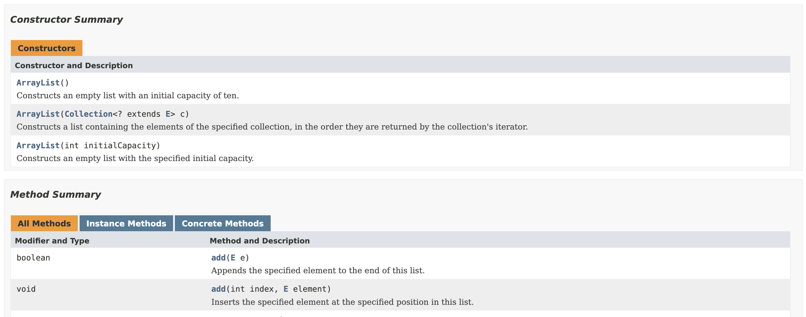

> 이펙티브 자바 3판의 아이템 1의 내용을 공부하며 작성한 글이다.

정적 팩터리 메서드는 클래스에 정적 메서드를 정의하여, 생성자 대신 객체를 생성할 수 있게 만드는 기법이다.

## 장점1. 이름을 가진 생성자

> 이름을 가질 수 있다.

### 생성자를 통한 객체의 생성

생성자는 기본적으로 이름을 가질 수 없다. 만약 ISBN 또는 제목 둘 중 하나를 인자로 전달받아 책 객체를 생성하는 아래와 같은 클래스가 있다고 가정하자.

```java
class Book {
    private String title;
    private long isbn;

    Book(long isbn) {
        if (isbn == 9788966262281L) {
            this.isbn = isbn;
            this.title = "Effective Java 3/E";
        } else if (isbn == 9788998139766L) {
            this.isbn = isbn;
            this.title = "객체지향의 사실과 오해";
        }
    }

    Book(String title) {
        if (title.equals("Effective Java 3/E")) {
            this.title = title;
            this.isbn = 8966262287L;
        } else if (title.equals("객체지향의 사실과 오해")) {
            this.title = "객체지향의 사실과 오해";
            this.isbn = 9788998139766L;
        }
    }
}
```

생성자를 오버로딩 하여, 인수로 전달받는 타입에 따라 구현이 다르다. 이 클래스를 사용하려면 아래와 같이 코드를 작성해야 할 것 이다.

```java
Book book1 = new Book(9788966262281L); // 이펙티브 자바 3판
Book book2 = new Book("객체지향의 사실과 오해");
```

이렇게 코드를 작성하면, 다른 개발자가 생성자 인자에 ISBN 또는 책 제목을 전달해야한다는 사실을 직관적으로 이해할 수 있을까? 심지어 ISBN 은 명확히는 ISBN10과 ISBN13 체계로 나뉜다. 위 구현은 ISBN13 기준으로 작성되었지만, 추후 ISBN10 까지 지원하는 클래스로 확장한다면 개발자는 더 혼란에 빠질 것 이다.

### 정적 팩터리 메서드를 사용한 객체 생성

정적 팩터리 메서드를 사용하여 객체를 생성하는 이름이 있는 메서드를 사용하면, 개발자는 더 직관적으로 객체를 생성할 수 있을 것 이다. 이를 코드로 나타내면 아래와 같을 것 이다.

```java
class Book {
    private String title;
    private long isbn;

    private Book(String title, long isbn) {
        this.title = title;
        this.isbn = isbn;
    }

    static Book createByIsbn(long isbn) {
        if (isbn == 9788966262281L) {
            return new Book("Effective Java 3/E", isbn);
        } else if (isbn == 9788998139766L) {
            return new Book("객체지향의 사실과 오해", isbn);
        }

        throw new IllegalArgumentException("일치하는 책이 없습니다.");
    }

    static Book createByTitle(String title) {
        if (title.equals("Effective Java 3/E")) {
            return new Book(title, 8966262287L);
        } else if (title.equals("객체지향의 사실과 오해")) {
            return new Book(title, 9788998139766L);
        }

        throw new IllegalArgumentException("일치하는 책이 없습니다.");
    }
}
```

생성자에 `private` 접근 제어자를 두어 `new` 키워드를 이용하여 직접 객체를 생성하는 것을 막고, 정적 메서드를 통해 `Book` 객체를 생성한 뒤 반환한다. 이렇게 바뀐 `Book` 클래스는 아래와 같이 사용할 수 있을 것 이다.

```java
Book book1 = Book.createByIsbn(9788966262281L); // 이펙티브 자바 3판
Book book2 = Book.createByTitle("객체지향의 사실과 오해");
```

생성자를 오버로딩한 것 보다 코드가 직관적으로 바뀐 것을 알 수 있다.

생성자와 생성자에 넘기는 인자만으로는 생성될 객체의 특성을 제대로 설명할 수 없는 한계점이 존재한다. 생성자 대신 정적 팩터리 메서드를 사용하게 되면 생성될 객체 특성에 대해 쉽게 묘사할 수 있다는 장점이 존재한다. 이는 오버로딩된 각각의 생성자가 어떤 역할을 하는지 몰라 실수를 하게 되는 일을 막을 수 있게 된다.

## 장점2. 인스턴스 통제 클래스

> 호출될 때 마다 인스턴스를 새로 생성하지 않아도 된다.

`new` 키워드를 사용하면, 객체는 무조건 새로 생성된다. 만약, 자주 생성될 것 같은 인스턴스는 클래스 내부에 미리 생성해 놓은 다음 반환한다면 코드를 최적화할 수 있을 것 이다. `java.lang.Interger` 클래스의 `valueOf` 의 구현을 한번 살펴보자.

```java
public static Integer valueOf(int i) {
    if (i >= IntegerCache.low && i <= IntegerCache.high)
        return IntegerCache.cache[i + (-IntegerCache.low)];
    return new Integer(i);
}
```

전달된 `i` 가 캐싱된 숫자의 범위내에 있다면, 객체를 새로 생성하지 않고 '미리 생성된' 객체를 반환한다. 그렇지 않을 경우에만 `new` 키워드를 사용하여 객체를 생성하는 것을 확인할 수 있다.

이렇게 인스턴스의 생성에 관여하여, 생성되는 인스턴스의 수를 통제할 수 있는 클래스를 인스턴스 통제 (instance-controlled) 클래스라고 한다. 인스턴스 통제를 하면, 클래스를 싱글턴(Singleton) 또는 인스턴스화 불가 (Noninstantiable) 클래스로 만들 수 있다. 또한 불변 값 클래스에서 동일한 값을 가지고 있는 인스턴스를 단 하나 뿐임을 보장할 수 있다. (a == b 일 때만, a.equals(b). 즉, a 와 b 가 같은 메모리 주소를 갖을 때만 둘의 '값'도 같을 수 있다.)

여기서 싱글턴이란, 인스턴스를 오직 하나만 생성할 수 있는 클래스를 말하며, 인스턴스화 불가 클래스란 생성자의 접근제어자를 `private` 으로 설정하여, 외부에서 `new` 키워드로 새로운 인스턴스를 생성할 수 없게 할 수 있다.

> 책에서는 인스턴스 제어 클래스에 대해 **'언제 어느 인스턴스를 살아 있게 할지를 철저히 통제할 수 있다'** 라고 설명되어 있는데, 나는 이를 인스턴스의 수를 통제하는 것 이라고 직관적으로 이해했다.

## 장점3. 하위 타입 객체 반환 가능

> 반환 타입의 하위 타입 객체를 반환할 수 있는 능력이 있다.

생성자를 사용하면 생성되는 객체의 클래스가 하나로 고정된다. 하지만 정적 팩터리 메서드를 사용하면, 반환할 객체의 클래스를 자유롭게 선택할 수 있는 유연성을 갖을 수 있게 된다. 아래 예제는 정적 팩터리 메서드에 가격을 넣어주고, 가격에 따라 다른 성능의 노트북을 반환하는 클래스이다.

```java
class Laptop {
    public static Laptop lowQualityLaptop() {
        return new LowQualityLaptop();
    }

    public static Laptop normalLaptop() {
        return new NormalLaptop();
    }

    public static Laptop highEndLaptop() {
        return new HighEndLaptop();
    }
}

class LowQualityLaptop extends Laptop {
    // ...
}

class NormalLaptop extends Laptop {
    // ...
}

class HighEndLaptop extends Laptop {
    // ...
}
```

이런 유연성을 응용하면 구현 클래스를 공개하지 않고, 객체를 반환할 수도 있다. 이런 아이디어는 인터페이스를 정적 팩터리 메서드의 반환 타입으로 사용하는 인터페이스 기반 프레임워크를 만드는 핵심이다. 책에서는 `java.util.Collections` 로 예시를 들었지만, 좀 더 직관적인 이해를 위해 위 노트북 클래스를 응용해 간단한 코드를 작성해보자.

```java
interface Laptop {
    void turnOn();
}

class LowQualityLaptop implements Laptop {
    public void turnOn() {
        System.out.println("지지직... 느리게 켜진다.");
    }
}

class NormalLaptop implements Laptop {
    public void turnOn() {
        System.out.println("무난한 속도로 켜진다.");
    }
}

class HighEndLaptop implements Laptop {
    public void turnOn() {
        System.out.println("전원 버튼을 누르자마자 부팅이 완료된다.");
    }
}

class Laptops {
    public static Laptop lowQualityLaptop() {
        return new LowQualityLaptop();
    }

    public static Laptop normalLaptop() {
        return new NormalLaptop();
    }

    public static Laptop highEndLaptop() {
        return new HighEndLaptop();
    }
}
```

사용자는 Laptop 의 하위 타입인 `LowQualityLaptop`, `NormalLaptop`, `HighEndLaptop` 의 구현체를 직접 알 필요 없이, `Laptop` 이라는 인터페이스를 사용하면 된다. 여기서 `Laptops` 를 `Laptop` 의 동반 클래스(Companion Class) 라고 한다.

하지만, 자바 8버전 부터는 인터페이스가 정적 메서드를 가질 수 있게 되어 동반 클래스는 더이상 필요없어졌다. 인터페이스가 정적 메서드를 갖는 형태로 코드를 작성하면 아래와 같을 것 이다.

```java
interface Laptop {
    // 인터페이스가 정적 메서드를 직접 갖는다.
    static Laptop lowQualityLaptop() {
        return new LowQualityLaptop();
    }

    static Laptop normalLaptop() {
        return new NormalLaptop();
    }

    static Laptop highEndLaptop() {
        return new HighEndLaptop();
    }

    void turnOn();
}

class LowQualityLaptop implements Laptop {
    public void turnOn() {
        System.out.println("지지직... 느리게 켜진다.");
    }
}

class NormalLaptop implements Laptop {
    public void turnOn() {
        System.out.println("무난한 속도로 켜진다.");
    }
}

class HighEndLaptop implements Laptop {
    public void turnOn() {
        System.out.println("전원 버튼을 누르자마자 부팅이 완료된다.");
    }
}
```

중요한 것은 이렇게 구체적인 구현체를 사용자에게 공개하지 않고, 반환 타입을 인터페이스로 두게된다면 API 의 개념적인 무게가 가벼워진다. 개발자는 API 를 사용하기 위해 많은 개념을 익히지 않아도 된다. 인터페이스에 명세된 대로 동작한 객체를 얻을 것임을 알기 때문이다.

## 장점4. 인자에 따라 다른 클래스 객체 반환

> 입력 매개변수에 따라 매번 다른 클래스의 객체를 반환할 수 있다.

장점3과 비슷한 내용인 것 같다.

만약 위에서 작성한 `Laptop` 클래스에 가격에 따라 노트북 인스턴스를 다르게 반환하는 기능을 추가하고 싶다면 어떻게 하면 좋을까? 매개변수에 따라 다른 클래스의 인스턴스를 생성해서 반환해주면 될 것 이다. 이를 코드로 작성하면 아래와 같다.

```java
class Laptop {
    static Laptop createByPrice(int price) {
        if (price < 500000) {
            return new LowQualityLaptop();
        }

        if (price < 1500000) {
            return new NormalLaptop();
        }

        return new HighEndLaptop();
    }

    // ...
}
```

실제로 `java.util.EnumSet` 의 정적 팩토리 메서드는 아래와 같이 구현되어 있다.

```java
public static <E extends Enum<E>> EnumSet<E> noneOf(Class<E> elementType) {
    Enum<?>[] universe = getUniverse(elementType);
    if (universe == null)
        throw new ClassCastException(elementType + " not an enum");

    if (universe.length <= 64)
        return new RegularEnumSet<>(elementType, universe);
    else
        return new JumboEnumSet<>(elementType, universe);
}
```

6번째 줄 부터 살펴보면, 원소의 수가 64개 이하라면 `RegularEnumSet` 클래스의 인스턴스를, 65개 이상이라면 `JumboEnumSet` 클래스의 인스턴스를 반환하는 것을 확인할 수 있다.

## 장점5. 정적 팩터리 메서드를 작성하는 시점에는 반환할 객체의 클래스가 존재하지 않아도 된다.

> 책에서는 JDBC (Java Database Connectivity) 와 서비스 제공자 프레임워크 (Service Provider Framework) 를 사용하여 설명하는데, 관련된 지식이 없어 전혀 이해하지 못했다. 이해못한 내용에 대해 그냥 책을 그대로 작성하는 것은 의미가 없는 짓 이기 때문에 추후 보충 포스팅을 작성하도록 하겠다.

## 단점1. private 생성자일 경우 상속 불가능

> 상속을 하려면 public 이나 protected 생성자가 필요하니 정적 팩터리 메서드만 제공하면 하위 클래스를 만들 수 없다.

인스턴스 통제 클래스를 구현하기 위해서는 사용자가 `new` 키워드를 사용하여 임의로 객체를 생성함을 막아야한다. 이를 위해 생성자의 접근 제어자를 `private` 로 설정해야하는데, 생성자가 `private` 인 클래스는 상속을 할 수 없다. 즉, 부모 클래스가 될 수 없다.

하지만, 이 제약은 상속보다 컴포지션을 사용하도록 유도하고, 불변타입으로 만들기 위해서는 이 제약을 지켜야 한다고 한다. 따라서 이 단점은 장점으로도 작용할 수 도 있다고 하는데 자세한 내용은 이펙티브 자바 3판 아이템 18과 17 에 설명되어 있다. 이 내용은 해당 아이템을 공부할 때 더 자세히 공부해보도록 하겠다.

## 단점2. API 문서에서의 불편함

> 정적 팩터리 메서드는 프로그래머가 찾기 어렵다.

자바독 (JavaDoc) 이란 Java 클래스를 문서화 하는 도구이다. 자바독에서 클래스의 생성자는 생성자는 잘 표시해주지만, 정적 팩터리 메서드는 일반 메서드이기 때문에 개발자가 직접 문서를 찾아야한다.




`ArrayList` 클래스는 클래스가 정의되어 있어 개발자가 찾기 쉬우나, `Collections` 클래스는 정적 팩터리 메서드만을 제공하기 때문에 사용자가 직접 객체를 생성하기 위한 방법을 찾아야한다. 클래스 개발자도 이를 위해 신경써서 API 문서를 작성해야 한다.

## 정적 팩터리 메서드 네이밍

단점2를 보완하기 위해 널리 알려진 규약을 통해 정적 팩터리 메서드를 명명하는 것이 좋다. 이펙티브 자바에서 소개하는 정적 팩터리 메서드 네이밍 컨벤션은 아래와 같다.

#### from

매개변수를 하나 받아서 해당 타입의 인스턴스를 반환하는 형 변환 메서드

```java
Date d = Date.from(instant);
```

#### of

여러 매개변수를 받아 적합한 타입의 인스턴스를 반환하는 집계 메서드

```java
Set<Rank> faceCards = EnumSet.of(JACK, QUEEN, KING);
```

#### valueOf

from 과 of 의 더 자세한 버전

```java
BigInteger prime = BigInteger.valueOf(Integer.MAX_VALUE);
```

#### instance 혹은 getInstance

(매개변수를 받는다면) 매개변수로 명시한 인스턴스를 반환하지만, 같은 인스턴스임을 보장하지는 않는다.

```java
StackWalker luke = StackWalker.getInstance(options);
```

#### create 혹은 newInstance

instance 혹은 getInstance 와 비슷하지만, 매번 새로운 인스턴스를 생성하여 반환함을 보장한다.

```java
Object newArray = Array.newInstance(classObject, arrayLen);
```

#### get*Type*

getInstance 와 같으나, 현재 클래스가 아닌 다른 클래스의 인스턴스를 생성할 때 사용한다. **_Type_** 은 팩터리 메서드가 반환할 객체의 타입을 적는다.

```java
FileStore fs = Files.getFileStore(path);
```

#### new*Type*

createInstance 와 같으나, 현재 클래스가 아닌 다른 클래스의 인스턴스를 생성할 때 사용한다. **_Type_** 은 팩터리 메서드가 반환할 객체의 타입을 적는다.

```java
BufferedReader br = Files.newBufferedReader(path);
```

#### _type_

get*Type* 과 new*Type* 의 간결한 버전

```java
List<Complaint> litany = Collections.list(legacyLitany);
```
