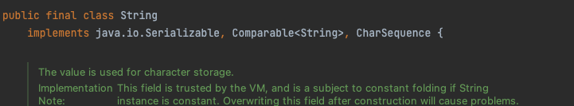

> 이전에는 남들이 본다는 생각에 완벽하고, 예쁜 글을 작성하기 위해 많은 시간을 사용했다. 그러다보니 글의 내용 보다는 문장의 수식어구에 집중하게 되어 주객전도된 느낌을 받았다.
>
> 적어도 우아한테크코스 기간 중 에는 글을 예쁘게 쓰기보다 **새롭게 배운 내용에 더 집중**해서 **꾸준히 작성**하는것을 목표로 하려고한다.

## final 이 뭐지?

final 의 사전상 의미는 '마지막의', '최종적인' 정도로 말할 수 있다. 그렇다면 대체 무엇이 마지막이고, 최종적인 것 일까?

final 키워드는 크게 **변수, 메서드, 클래스** 에 사용할 수 있다. 변수에 final 을 사용하면, 해당 변수는 더이상 **'재할당'** 할 수 없게 된다. 메서드에 사용하면, 해당 메서드는 **'오버라이드'** 될 수 없다. 마지막으로 클래스에 사용되면, 해당 클래스는 **'상속'** 할 수 없게된다. 즉, 부모 클래스가 될 수 없다는 의미이다.

final 키워드를 사용하면, **‘어디에선가 재할당되지 않았을까?’**, **'값이 예측하지 못한 곳에서 변하는 상황을 막기 위해 검증 로직을 추가해야하나?'** 라는 불안감에서 벗어나 심리적 안정감을 얻을 수 있다. 이를 검증하는 데에 에너지를 쏟지 않아도 되고, 한번에 한가지만 집중할 수 있게 된다.

### 변수에 final 를 사용하면

해당 변수는 첫 초기화 이후, 재할당이 불가능해진다.

```java
final int number = 1;
number = 2; // Cannot assign a value to final variable 'number'
```

위 같이 final 로 설정된 `number` 변수는 재할당 시도 시 컴파일 에러가 발생한다.

final 키워드를 사용한 변수에 초기값을 설정하는 방법은 **두 가지**가 있다. 초기화 할 값이 단순한 값이라면 그냥 **'클래스의 필드'**에 선언한다. 이런 경우라면 보통 아래와 같이 **상수**의 형태로 사용하게 될 것이다.

```java
class Car {
    private static final int MOVE_STEP = 1;
    // ...
}
```

상수의 경우 보통 접근제어자 (private 또는 public) 와 static 키워드를 함께 사용한 `private(public) static final` 형태로 변수를 선언한다. static 을 사용하면 **컴파일 타임에 메모리 할당을 단 한번** 하기 때문에 효율성 측면에서 사용하는 것이 좋다.

두번째 방법으로는 final 이 사용된 변수를 **'생성자에서 초기화'** 할 수도 있다. 아래와 같이 변수에 값을 할당하기 전에 별도의 로직이 실행되어야 하는 등 복잡할 때 사용하면 된다.

```java
class Car {
    private final int position;

    Car() {
        this.position = 0;
    }
}
```

아래와 같이 인자 자체에 final 키워드를 사용하여, **메소드 내부에서 인자를 변경할 수 없도록** 해줄수도 있다.

```java
void someMethod(final int number) {
    number = 3;
    // Cannot assign a value to final variable 'number'
}
```

### 메소드에 final 를 사용하면

자식 클래스에서 final 키워드가 사용된 부모의 메소드는 재정의가 불가능하다. 즉, 오버라이딩 할 수 없다. 아래처럼 오버라이딩을 시도하면 컴파일 에러가 발생할 것이다.

```java
class ParentClass {
    final void finalMethod() {
        // ...
    }
}

class ChildClass extends ParentClass {
    void finalMethod() {
        // 'finalMethod()' cannot override 'finalMethod()' in
        // 'ParentClass'; overridden method is final
    }
}
```

메소드에 final 키워드를 사용하는 경우는 코어 부분에서 변경을 원치 않는 메소드를 명시할 때 라고 한다.

### 클래스에 final 를 사용하면

클래스에 final 키워드를 사용하면, 상속할 수 없는 클래스가 된다. 즉, 부모 클래스가 될 수 없다는 의미이다. 아래 코드와 같이 상속을 시도하면 컴파일 에러가 발생할 것이다.

```java
final class FinalClass {
    // ...
}

class ChildClass extends FinalClass {
    // Cannot inherit from final 'null'
}
```

대표적으로 `java.lang` 패키지의 `String` 클래스가 final 키워드를 사용한다.



## final 이 불변을 의미할까?

앞선 예시들을 살펴보니 final 을 사용하면, 절대 할당된 값이 변경되지 않을 것 같다. 하지만, 안타깝게도 final 을 사용하는 것이 **완벽한 불변성을 의미하지는 않는다**. final 은 해당 변수의 **재할당만을 막아줄 뿐, 참조하고 있는 객체 내부의 상태가 변하지 않았음을 보장해주지는 않는다**.

아래 코드를 한번 살펴보자.

```java
final List<Integer> numbers = new ArrayList<>(Arrays.asList(1, 2, 3));
System.out.println(numbers); // [1, 2, 3]

numbers.add(4);
System.out.println(numbers); // [1, 2, 3, 4]
```

분명 `numbers` 는 final 가 사용되었는데, 내부의 값이 변경되는 것을 확인해볼 수 있다. 이렇듯 final 키워드는 불변성을 지키고자 할 때 사용이 되지만, final 단독으로는 완벽히 불변성을 지킬 수는 없다는 것을 알 수 있다.

이후 포스트에서는 불변성을 지키는 여러 방법에 대해 포스트해볼 예정이다.
