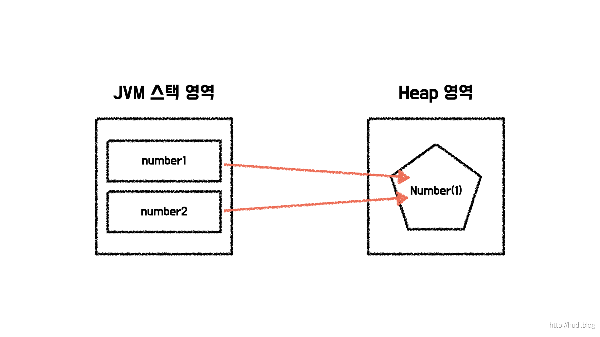
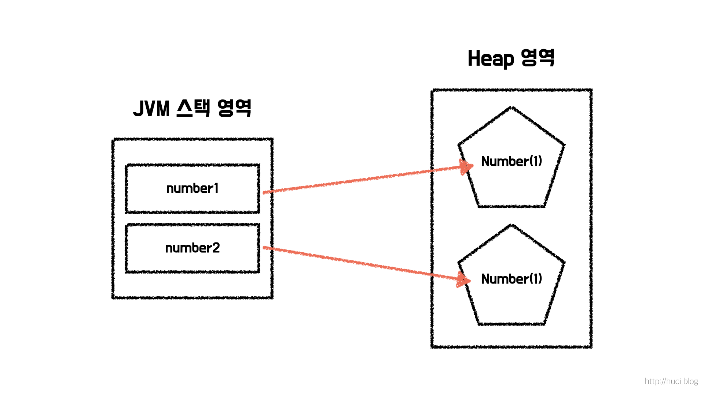

## 동일성과 동등성

동등성이라는 개념은 자바에서 VO (Value Object) 를 공부하며 처음 접하게 되었다. 그 이후 동일성이라는 개념을 접하게 되었는데, 언뜻 보면 비슷해 보이는 단어에 대해 이야기를 해보려 한다.

이를 알아보기 위해 먼저 단순히 `int` 타입 변수를 필드로 가지고 있는 `Number` 라는 클래스를 아래와 같이 정의한다.

```java
class Number {
    private int number;

    Number(int number) {
        this.number = number;
    }
}
```

## 동일성 (Identity)



동일성은 비교 대상의 두 객체의 메모리 주소가 같음을 의미하는 것 이다. 자바에서 동일성은 비교연산자 `==` 로 확인할 수 있다. 아래 코드를 살펴보자.

```java
Number number1 = new Number(1);
Number number2 = number1;

System.out.println(number1 == number2); // true
```

`number2` 는 `Number` 의 인스턴스를 새로 생성하지 않고, `number1` 을 대입받는다. 즉 `number1` 와 `number2` 는 같은 메모리 주소에 위치한 같은 객체를 바라보고 있다. 객체는 각자의 고유한 식별자를 가지고 있는데, 이 식별자가 같다면 동일하다고 판단한다.

## 동등성 (Equality)



동등성은 비교 대상의 두 객체가 논리적으로 동일한 값을 나타내고 있는지를 검사한다. 자바에서 동등성을 비교하기 위해 `equals` 와 `hashCode` 를 오버라이드 해야한다. 참고로 인텔리제이를 사용한다면, 손쉽게 아래와 같이 `equals` 와 `hashCode` 를 재정의 할 수 있다.

```java
class Number {
    //...

    @Override
    public boolean equals(Object o) {
        if (this == o) {
            return true;
        }
        if (o == null || getClass() != o.getClass()) {
            return false;
        }
        Number number1 = (Number) o;
        return number == number1.number;
    }

    @Override
    public int hashCode() {
        return Objects.hash(number);
    }
}
```

동등성에서 두 객체의 메모리 주소는 중요하지 않다. 즉, 동일함은 동등함을 보장하지만, 반대로 동등함은 동일함을 보장하지 않는다. 아래 코드를 살펴보자.

```java
Number number1 = new Number(1);
Number number2 = new Number(1);

System.out.println(number1.equals(number2)); // true
```

변수 `number1` 와 `number2` 는 각각 다른 메모리 주소를 가리키고 있다. 하지만, 논리적으로는 가리키고 있는 별개의 두 객체가 같은 값을 의미하고 있으므로 `equals` 메소드는 `true` 를 반환한다.

```java
System.out.println(number1 == number2); // false
```

이 두개의 객체를 `==` 으로 비교하면 아래와 같이 `false` 가 나올 것 이다. 같은 객체가 아니기 때문, 즉 별개의 객체로 식별 (Identity) 되기 때문이다.

```java
Number number3 = new Number(2);
System.out.println(number1.equals(number3)); // false
```

위와 같이 `number1` 과 논리적으로 동일하지 않은 값을 나타내는 `number3` 와 동등성 비교를 할때에는 `false` 를 반환하는 것을 볼 수 있다.
