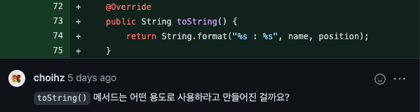

> 이펙티브 자바 3판의 아이템 12, 'toString을 항상 재정의하라' 의 많은 내용을 참고하였다.

## 학습 동기



우아한테크코스 레벨1 자동차 경주 미션을 진행하며, `toString` 메소드에 관하여 [리뷰](https://github.com/woowacourse/java-racingcar/pull/322#discussion_r804932775)를 받게 되었다. 정확히는 내가 직접 받은 리뷰는 아니고, 페어인 토닉이 받은 리뷰이다. 하지만 어차피 내 코드와 토닉의 코드가 똑같기 때문에 내가 직접 리뷰를 받았다고 생각하고, `toString` 의 올바른 사용 방법에 대해 알아보게 되었다.

페어 프로그래밍을 하며 자동차의 위치를 나타내기 위해 `toString` 을 사용하자는 의견을 내가 제안했던 것으로 기억한다. 미션의 요구사항에 따르면 자동차는 아래와 같이 자신의 이름과 `-` 문자를 사용하여 위치를 출력해야한다.

```
hudi : ---
tonic : --
pobi : ----
```

알아보니 이는 올바른 `toString` 사용 방법이 아니었다.

## toString 메소드가 뭘까?

toString 의 일반 규약은 **'간결하면서 사람이 읽기 쉬운 형태의 유익한 정보'** 를 반환하는 것이다. 그런데, 기본 `toString` 메소드는 사람이 읽기 쉬운 형태의 정보를 반환할까? 아래의 코드를 살펴보자.

```java
class Car {
    final String name;
    final int position;

    Car(String name, int position) {
        this.name = name;
        this.position = position;
    }
}

Car car = new Car("hudi", 0);
System.out.println(car.toString()); // toString() 을 생략해도 된다.
```

위 코드의 출력은 아래와 같다.

```
Main$1Car@2c7b84de
```

기대와 달리 전혀 간결하지도, 읽기 쉽지도, 유익하지도 않다. `java.lang` 패키지의 `Object` 클래스의 `toString` 메소드의 구현을 살펴보면 아래와 같다.

```java
public String toString() {
    return getClass().getName() + "@" + Integer.toHexString(hashCode());
}
```

우리는 여기서 기본 `toString` 메소드는 `클래스이름@16진수로_표시된_해시코드` 형태의 문자열을 반환하는 것을 알 수 있다.

## toString 을 항상 재정의 하라

이펙티브 자바 3판 아이템 12 에서는 `toString` 메소드를 항상 재정의 하라고 말한다. 이유가 무엇일까?

toString 이 잘 구현된 클래스는 사용하기 편하고, 디버깅이 쉽다. 객체를 출력하기만 하면, 객체가 가지고 있는 모든 정보를 확인할 수 있다. 우리가 직접 호출하지 않아도, 로깅을 하거나 에러메세지를 출력할 때에도 유용하게 사용할 수 있다.

toString 은 객체가 가진 주요 정보를 모두 반환하는 것이 좋다. 이상적으로는 스스로를 완벽히 설명하는 문자열이어야 한다. 위에서 만든 `Car` 클래스의 `toString` 은 아래와 같이 오버라이딩 할 수 있겠다.

```java
class Car {
    final String name;
    final int position;

    Car(String name, int position) {
        this.name = name;
        this.position = position;
    }

    @Override
    public String toString() {
        return String.format("자동차 (이름 = %s, 위치 = %s)", name, position);
    }
}
```

이렇게 재정의된 `toString` 메소드는 직접 호출하지 않더라도 문자열 출력시, 문자열 결합 연산자 등을 사용할 때 자동으로 호출된다.

단, 정적 유틸리티 클래스의 경우 toString 을 제공할 필요가 없다. 또한 대부분의 Enum 타입은 이미자바가 완벽한 toString 을 제공하므로 재정의할 필요 없다.

## toString 은 언제 사용될까?

그렇다면, `toString` 은 언제 사용해야 유익할까?

Stackoverflow 의 [Is it ok to add toString() to ease debugging?](https://stackoverflow.com/questions/44132918/is-it-ok-to-add-tostring-to-ease-debugging) 를 읽어보면, `toString` 은 디버깅을 위해 설계된 메소드라고 한다. 어떤 문제가 발생한 클래스가 `toString` 이 잘 구현된 클래스일 경우 스스로를 완벽히 설명하는 문자열이 로깅될 것이고 그렇지 않을 때 보다 훨씬 더 원인을 발견하기 쉬워질 것이다.

그렇다면, 로깅과 디버깅의 용도 외로 프로덕션 코드에는 `toString` 을 사용하면 안되는 것 일까? Stackoverflow 의 [Java toString for debugging or actual logical use](https://stackoverflow.com/questions/19911290/java-tostring-for-debugging-or-actual-logical-use) 와 [Is toString() only useful for debugging?
](https://stackoverflow.com/questions/563676/is-tostring-only-useful-for-debugging) 를 읽어보면, 의견이 조금 갈릴수도 있으나 특이한 케이스를 제외하면 `toString` 은 디버그만을 위해 사용되는 것이 올바르다고 생각된다.

사용자에게 보여지는 프로덕션을 위한 메소드는 별도로 정의하거나, DTO 등을 사용하는 것이 적합하다는 생각이 든다.
