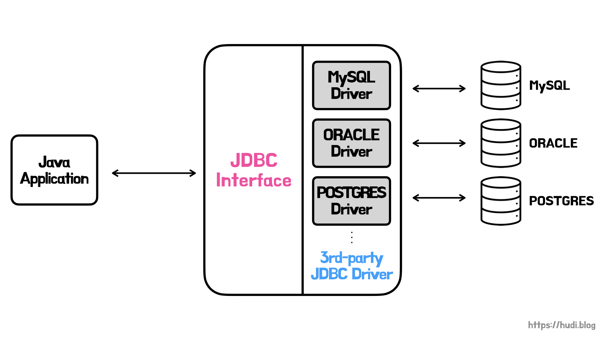

## stage0 - **DataSource 다루기**

> 자바에서 제공하는 JDBC 드라이버를 직접 다뤄본다. 자바에서 데이터베이스에 어떻게 연결하는지, 왜 DataSource를 사용하는지 알아본다.

### JDBC Driver

자바 애플리케이션과 데이터베이스는 서로 다른 시스템이다. 이 시스템을 상호 연결하기 위해서는 중간에 어댑터가 필요하다. 자바에서는 이 역할을 JDBC Driver가 맡아서 수행한다.



시장에는 수많은 벤더들의 DBMS가 존재한다. 각 벤더는 자신들의 DBMS를 사용할 수 있도록 JDBC Driver를 제공한다. JDBC Driver는 자바 애플리케이션의 요청을 각 DBMS가 이해할 수 있는 프로토콜로 변환해준다. 이 덕분에 자바 애플리케이션 개발자는 JDBC Interface를 사용하여 DBMS 종류에 상관없이 일관된 방식으로 데이터베이스를 사용할 수 있다.

### DriverManager

`DriverManager` 는 자바 애플리케이션에서 사용할 수 있는 JDBC Driver 집합을 관리하는 클래스이다. 이 클래스를 통해 데이터베이스 커넥션을 얻어올 수 있다.

JDBC API 4.0 이전 버전에서는 `Class.forName()` 를 사용하여 직접 사용할 JDBC Driver를 로드했어야 했다. 만약 MySQL을 사용하면 아래와 같이 코드를 작성해야했다.

```java
Class.forName("com.mysql.cj.jdbc.Driver");
Connection connection = DriverManager.getConnection(URL, USER, PASSWORD);
```

JDBC API 4.0 버전부터는 `DriverManager.getConnection()` 메소드가 JDBC Driver를 자동 로드하도록 개선되었다. 따라서 `Class.forName()` 을 생략해도 괜찮다 ([참고](https://docs.oracle.com/javadb/10.8.3.0/ref/rrefjdbc4_0summary.html)).

```java
Connection connection = DriverManager.getConnection(URL, USER, PASSWORD);
```

하지만 `DriverManager` 는 커넥션 풀, 분산 트랜잭션을 지원하지 않아 잘 사용되지 않는다고 한다.

### DataSource

Data Source는 이름 그대로 데이터를 저장하는 근원을 의미한다. 그 근원은 파일과 같이 간단한 구조부터 데이터베이스까지 많은 것을 포함한다. 우리는 데이터베이스에 대해 알아보고 있으므로, 데이터베이스 관점에서의 `DataSource` 에 대해서 이야기하자.

`DataSource` 인터페이스는 데이터베이스의 커넥션을 얻기 위해 사용된다. 각 벤더는 자신의 DBMS에 맞게 `DataSource` 구현체를 만든다. DataSource 는 단일 커넥션, 커넥션 풀링, 분산 트랜잭션을 지원한다.

```java
final JdbcDataSource dataSource = new JdbcDataSource();
dataSource.setURL(H2_URL);
dataSource.setUser(USER);
dataSource.setPassword(PASSWORD);
```

`JdbcDataSource` 는 H2에서 제공하는 `DataSource` 구현체이다. 위와 같이 `setURL()`, `setUser()`, `setPassword()` 를 사용하여 `DataSource` 를 설정할 수 있다. 커넥션은 아래와 같이 가져온다.

```java
Connection connection = dataSource.getConnection();
```

## stage1 - 커넥션 풀링

커넥션 풀링은 미리 다수의 커넥션 객체를 생성해둔 뒤 해당 커넥션을 재사용하는 방식을 의미한다. 커넥션의 생성 비용이 높기 때문에 커넥션 풀링을 통해 애플리케이션의 성능을 최적화할 수 있다.

### JdbcConnectionPool

```java
JdbcDataSource jdbcDataSource = new JdbcDataSource();
jdbcDataSource.setURL(H2_URL);
jdbcDataSource.setUser(USER);
jdbcDataSource.setPassword(PASSWORD);

JdbcConnectionPool jdbcConnectionPool = JdbcConnectionPool.create(jdbcDataSource);
```

`JdbcConnectionPool` 은 H2 에서 제공하는 `DataSource` 구현체이다. 위와 같이 생성할 수 있다.

```java
Connection connection = jdbcConnectionPool.getConnection();
```

커넥션 풀에서 `Connection` 을 위와 같이 획득할 수 있다.

### HikariCP

스프링 부트 2.0부터는 HikariCP를 기본 데이터 소스로 채택하고 있다. [공식문서](https://github.com/brettwooldridge/HikariCP#essentials)를 참고해보자면, `dataSourceClassName` 혹은 `jdbcUrl` , `username` , `password` 이 3가지 설정이 필수 설정이라고 한다.

```java
HikariConfig hikariConfig = new HikariConfig();
hikariConfig.setJdbcUrl(H2_URL);
hikariConfig.setUsername(USER);
hikariConfig.setPassword(PASSWORD);
```

위와 같이 `HikariConfig` 를 통해 HikariCP를 설정할 수 있다. 최대 풀 사이즈도 설정해보자.

```java
hikariConfig.setMaximumPoolSize(5);
```

아래와 같이 `DataSource` 의 구현체인 `HikariDataSource` 를 획득할 수 있다.

```java
HikariDataSource hikariDataSource = new HikariDataSource(hikariConfig);
```

`HikariDataSource` 에서는 `Properties` 를 아래와 같이 가져와 Property 설정도 가능하다.

```java
final var dataSource = new HikariDataSource(hikariConfig);
final var properties = dataSource.getDataSourceProperties();

properties.setProperty("cachePrepStmts", "true");
properties.setProperty("prepStmtCacheSize", "250");
properties.setProperty("prepStmtCacheSqlLimit", "2048");
```

위 설정은 HikariCP에서 추천하는 MySQL 관련 설정이다 ([참고](https://github.com/brettwooldridge/HikariCP/wiki/MySQL-Configuration)).

## stage2 - **HikariCP 설정하기**

HikariCP는 `application.yml` (또는 `application.properties`) 를 통해 설정할 수 있다.

```yaml
spring:
  datasource:
    hikari:
      pool-name: hudi
      jdbc-url: jdbc:h2:./test;DB_CLOSE_DELAY=-1
      username: sa
      password:
      maximum-pool-size: 15
      minimum-idle: 5
      connection-timeout: 5000
```

하지만, 데이터베이스 레플리케이션 등 복수개의 `DataSource` 가 필요할때 혹은 세부적인 설정이 필요할 때에는 직접 빈을 생성하여 주입한다.

```java
@Configuration
public class DataSourceConfig {

    public static final int MAXIMUM_POOL_SIZE = 5;
    private static final String H2_URL = "jdbc:h2:./test;DB_CLOSE_DELAY=-1";
    private static final String USER = "sa";
    private static final String PASSWORD = "";

    @Bean
    public DataSource hikariDataSource() {
        final var hikariConfig = new HikariConfig();
        hikariConfig.setPoolName("hudi");
        hikariConfig.setJdbcUrl(H2_URL);
        hikariConfig.setUsername(USER);
        hikariConfig.setPassword(PASSWORD);
        hikariConfig.setMaximumPoolSize(MAXIMUM_POOL_SIZE);
        hikariConfig.setConnectionTestQuery("VALUES 1");
        hikariConfig.addDataSourceProperty("cachePrepStmts", "true");
        hikariConfig.addDataSourceProperty("prepStmtCacheSize", "250");
        hikariConfig.addDataSourceProperty("prepStmtCacheSqlLimit", "2048");

        return new HikariDataSource(hikariConfig);
    }
}
```

## 참고

- [https://www.geeksforgeeks.org/jdbc-drivers/](https://www.geeksforgeeks.org/jdbc-drivers/)
- [https://docs.oracle.com/javadb/10.8.3.0/ref/rrefjdbc4_0summary.html](https://docs.oracle.com/javadb/10.8.3.0/ref/rrefjdbc4_0summary.html)
- [https://www.ibm.com/docs/ko/i/7.3?topic=connections-java-drivermanager-class](https://www.ibm.com/docs/ko/i/7.3?topic=connections-java-drivermanager-class)
