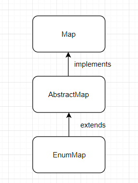
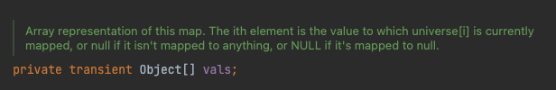

## 학습 동기

이번주부터 시작된 우테코 레벨1 블랙잭 미션을 진행하며, Enum 타입을 키로 갖는 Map 을 사용하게 되었다. 이전 로또 미션에서 Enum 타입을 키로 갖는 Map 은 HashMap 대신 EnumMap 을 사용하는 것이 성능상의 이점을 얻을 수 있다고 알게되었는데, 막상 다른 것들을 적용하다보니 로또 미션에는 적용하지 못했다. 이번 기회에는 EnumMap 을 사용해보았는데, 이때 배운것들을 기록해보고자 한다.

## EnumMap 이란



키(Key) 를 Enum 타입만으로 사용하는 Map 인터페이스의 구현체이다. Map 인터페이스를 구현하므로, 일반적인 Map 의 메소드를 전부 사용할 수 있다. 또한 Enum 을 키로 사용하는 맵이 있다면, 성능상 이점을 위해 HashMap 대신 EnumMap 을 사용하라는 이야기가 있다. EnumMap 은 어떤 특징을 갖고 있기에 다른 Map 보다 더 좋은 성능을 낼 수 있을까?

## EnumMap 은 왜 빠를까?

> Enum 과 해시 테이블에 대한 내용은 [[Java] 열거 타입 (Enum)](https://hudi.blog/java-enum/), [[DS] 해시테이블 (Hash Table)](https://hudi.blog/ds-hash-table/) 포스트를 참고하자.

Enum 은 상수의 선언 순서대로 일정한 순번 값을 갖는다. 또한 Enum 객체의 `ordinal()` 메소드를 실행하면, 해당 객체의 순번을 가져올 수 있다.



이런 특징으로 인해 위 사진과 같이 EnumMap 은 내부적으로 배열에 값을 저장할 수 있다. 또한 겹치지 않는 일정한 순번을 가지고 있으니, 해싱을 할 필요도, **해시 충돌 (Hash Collision)** 을 처리할 필요도 없다.

또한 HashMap 의 경우 일정 개수 이상의 자료가 저장되면 **리사이징(Resizing) 작업**을 하게 되는데, EnumMap 의 경우 전달된 **Enum 타입의 상수 개수만큼만 저장공간을 확보하면 되므로** 리사이징이 필요없다.

상술한 이유 덕분에 **EnumMap 은 빠른 동작 속**도를 가질 수 있게 되었다.

## EnumMap 생성하기

```java
EnumMap<Week, String> enumMap = new EnumMap<>(Week.class);
```

EnumMap 은 일반 Map 과 다르게, 생성자에 Enum 타입을 직접 전달해야한다.

## HashMap 대비 얼마나 빠를까?

EnumMap 이 HashMap 대비 무의미한 수준의 성능 차이를 갖고 있다면, 구태여 사용할 필요는 없을 것 이다. 성능차이를 직접 확인 해보기위해 Enum 타입을 키로 갖고, Integer 타입을 값으로 갖는 EnumMap 과 HashMap 을 만들고, 각각에 `put` 연산 약 21억번, `get` 연산 약 21억번을 실행한 시간 차이를 확인해보자.

```java
@Test
void enumMapTest() {
    EnumMap<Week, Integer> enumMap = new EnumMap<>(Week.class);

    long startTime = System.nanoTime();
    for (int i = 0; i < Integer.MAX_VALUE; i++) {
        enumMap.put(Week.MONDAY, i);
    }

    for (int i = 0; i < Integer.MAX_VALUE; i++) {
        enumMap.get(Week.MONDAY);
    }
    long endTime = System.nanoTime();

    System.out.println("EnumMap 소요시간 (초) : " + (double) (endTime - startTime) / 1_000_000_000);
}

@Test
void hashMapTest() {
    HashMap<Week, Integer> hashMap = new HashMap<>();

    long startTime = System.nanoTime();
    for (int i = 0; i < Integer.MAX_VALUE; i++) {
        hashMap.put(Week.MONDAY, i);
    }

    for (int i = 0; i < Integer.MAX_VALUE; i++) {
        hashMap.get(Week.MONDAY);
    }
    long endTime = System.nanoTime();

    System.out.println("HashMap 소요시간 (초) : " + (double) (endTime - startTime) / 1_000_000_000);
}
```

(컴퓨팅 환경에 따라 차이가 있겠지만) jUnit 을 사용하여 위와 같이 코드를 실행한 결과는 아래와 같았다.

```
EnumMap 소요시간 (초) : 6.964324458
HashMap 소요시간 (초) : 16.0586595
```

EnumMap 이 2배 ~ 3배 가량 빠른 속도를 가지고 있는 것을 알 수 있었다. 따라서 Enum 을 키로 갖는 Map 을 사용할 일이 있다면, 무조건 EnumMap 을 사용하는 것이 성능상으로 이점이란 것을 알 수 있다.

## 정렬에서의 차이점

위에서 Enum 타입의 각 열거 객체는 선언 순서대로 고유의 순번을 갖는다고 알고 있다. HashMap 은 키의 순서가 보장되지 않는 것으로 알려져있다. 하지만 EnumMap 은 방금 이야기한 특징으로 인해 열거 객체의 순번기준으로 정렬된다. 아래 코드는 요일 정보를 가지고 있는 Enum 클래스이다.

```java
public enum Week {
    MONDAY,
    TUESDAY,
    WEDNESDAY,
    THURSDAY,
    FRIDAY,
    SATURDAY,
    SUNDAY;
}
```

위 클래스를 이용하여 아래의 코드를 실행해보자.

```java
EnumMap<Week, String> enumMap = new EnumMap<>(Week.class);
HashMap<Week, String> hashMap = new HashMap<>();

enumMap.put(Week.WEDNESDAY, "수요일");
hashMap.put(Week.WEDNESDAY, "수요일");

enumMap.put(Week.MONDAY, "월요일");
hashMap.put(Week.MONDAY, "월요일");

enumMap.put(Week.SUNDAY, "일요일");
hashMap.put(Week.SUNDAY, "일요일");

enumMap.put(Week.FRIDAY, "금요일");
hashMap.put(Week.FRIDAY, "금요일");

enumMap.put(Week.TUESDAY, "화요일");
hashMap.put(Week.TUESDAY, "화요일");

System.out.println("EnumMap : " + enumMap);
System.out.println("HashMap : " + hashMap);
```

실행결과는 아래와 같다.

```
EnumMap : {MONDAY=월요일, TUESDAY=화요일, WEDNESDAY=수요일, FRIDAY=금요일, SUNDAY=일요일}
HashMap : {WEDNESDAY=수요일, FRIDAY=금요일, TUESDAY=화요일, MONDAY=월요일, SUNDAY=일요일}
```

EnumMap 은 Enum 클래스에 선언된 순서대로 정렬되는 것을 확인할 수 있지만, HashMap 은 입력 순서도, Enum 선언 순서도 아닌 기준으로 정렬되었다.
