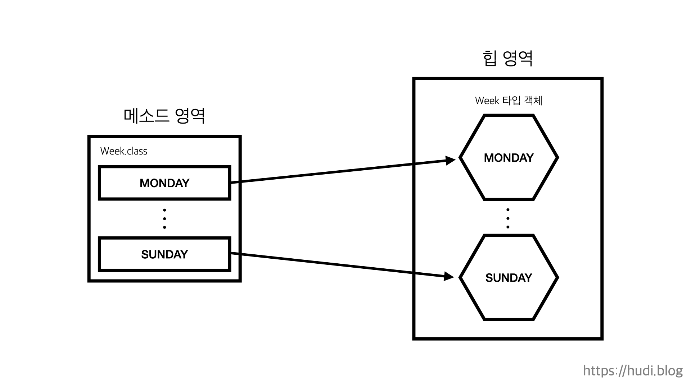
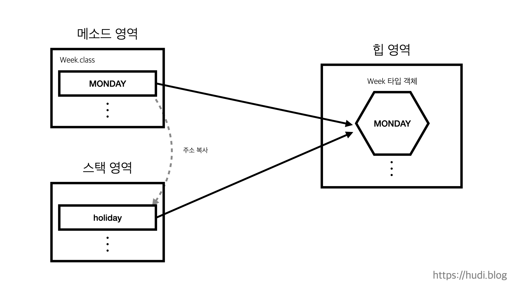

## 학습 동기

우아한테크코스 레벨1 로또 미션의 필수 요구 사항 중 하나가 Java Enum 을 활용하여 개발하는 것 이었다. 'Enum 은 그냥 비슷한 상수를 한 파일에서 관리하게 해주는 문법 아닌가?' 정도로 막연하게 생각하고 사용했었는데, 이 기회에 제대로 Enum 에 대해 알아보려 한다.

## 열거 타입

열거타입이란 한정된 값만을 갖는 데이터 타입을 의미한다. 자바에서 서로 연관있는 상수를 편리하게 관리하기 위해 사용한다. 요일, 순위, 성적 등을 나타내기 위해 사용한다.

### 열거 타입의 선언

일반 클래스와 똑같이 `.java` 확장자를 갖으나 `class` 키워드 대신 `enum` 키워드로 아래와 같이 정의한다.

```java
public enum Week {
    MONDAY,
    TUESDAY,
    WEDNESDAY,
    THURSDAY,
    FRIDAY,
    SATURDAY,
    SUNDAY
}
```

위는 7개의 요일을 열거 타입으로 상수화 해놓은 예시이다. `MONDAY` 부터 `SUNDAY` 까지를 **'열거 상수'** 라고 한다.

### 열거 타입 변수

열거 타입도 데이터 타입의 일종으로 변수를 선언하고 대입할 수 있다.

```java
Week today = Week.MONDAY;
```

열거 타입은 `null` 을 저장할 수 있다. 열거 타입 또한 참조 타입이기 때문이다.

```java
Week holiday = null;
```

참조 타입은 객체를 참조하는 변수이다. 즉, 열거 상수는 **'열거 객체'** 로 생성됨을 알 수 있다.

## JVM 메모리에 올라간 열거 타입

자바에서의 열거 타입은 일종의 클래스이고, 상수 하나당 인스턴스를 하나씩 만들어 `public static final` 필드로 공개한다. 또한 열거 타입의 인스턴스는 클라이언트가 직접 생성할 수 없고, 인스턴스는 런타임에 단 한번만 생성된다. 이런 특징으로 싱글턴 (Singleton)을 보장할 때 사용되기도 한다.

JVM 의 메모리 영역을 크게 구분하면, **메소드 영역, 힙 영역, 스택 영역** 세가지로 나뉜다. 이때, 메소드 영역에는 클래스와 클래스 변수 (Static Variable) 이 저장된다. 따라서 열거 타입 클래스도 이 메소드 영역에 올라가게 된다.또한, 힙 영역에는 객체 인스턴스가 올라간다.

이를 통해 열거 타입이 JVM 메모리에 올라간 것을 아래 그림 처럼 표현할 수 있다.



그렇다면 아래처럼 열거타입 변수가 열거 객체를 참조하고 있다면 어떻게 될까?

```java
Week today = Week.MONDAY;
```



스택 영역은 메소드가 호출될 때 그 메소드와 관련된 로컬 변수와 매개변수가 저장되는 곳 이다. 메소드 영역에서 주소값 만 복사해서 결국 같은 열거 객체를 가리키는 것을 확인할 수 있다. 따라서 아래 코드는 `true` 이다.

```java
System.out.println(today == Week.MONDAY);
```

## 열거 타입 메소드

열거 타입은 컴파일 타임에 `Enum` 이라는 클래스를 상속한다. 즉, 열거 타입에서 사용할 수 있는 메소드는 `Enum` 의 메소드이다. 제공되는 기본 메소드를 살펴보자.

### name

열거 객체가 가지고 있는 문자열을 반환하는데, 이때 문자열은 열거 객체를 선언할 때 명시한 상수 이름이다.

```java
Week today = Week.MONDAY;
System.out.println(today.name()); // MONDAY
```

### ordinal

해당 열거 객체가 열거 타입에서 몇 번째 순번인지 반환한다. 이때, 순번이란 열거 타입을 정의할 때 명시된 순서로, 0부터 시작한다. `Week` 의 순번은 아래와 같다.

```java
public enum Week {
    MONDAY, // 0
    TUESDAY, // 1
    WEDNESDAY, // 2
    THURSDAY, // 3
    FRIDAY, // 4
    SATURDAY, // 5
    SUNDAY // 6
}
```

즉 아래의 결과를 확인할 수 있다.

```java
System.out.println(Week.MONDAY.ordinal()); // 0
System.out.println(Week.SUNDAY.ordinal()); // 6
```

### compareTo

두 열거 객체간의 순번을 비교하여 상대적 순번 차이를 반환하는 메소드이다. 상대 열거 객체보다 순번이 빠르다면 음수가, 느리다면 양수가 반환된다.

```java
System.out.println(Week.MONDAY.compareTo(Week.SUNDAY)); // -6
System.out.println(Week.SATURDAY.compareTo(Week.WEDNESDAY)); // 3
```

### valueOf

열거 객체의 상수명과 동일한 문자열을 입력받아, 일치하는 열거 객체를 반환한다. `name` 메소드와 방향이 반대라고 생각하면 된다. 외부에서 문자열을 입력받아 열거 객체로 변환할 때 유용하게 사용된다.

```java
Week yesterday = Week.valueOf("WEDNESDAY");
System.out.println(yesterday); // WEDNESDAY
```

### values

열거 타입에 선언된 모든 열거 객체를 순번 순서대로 배열로 만든다. 열거 타입의 모든 열거 객체를 순회할 떄 유용하게 사용된다.

```java
Week[] days = Week.values();
for (Week day : days) {
    System.out.println(day);
}

/*
    MONDAY
    TUESDAY
    WEDNESDAY
    THURSDAY
    FRIDAY
    SATURDAY
    SUNDAY
*/
```

## 열거 타입 필드

열거 타입의 열거 객체도 인스턴스이므로 인스턴스 필드를 가질 수 있다. 이를 통해 상수와 연관된 추가적인 데이터를 상수 자체에 포함하여 관리할 수 있다.

일반적인 인스턴스 필드를 사용하는 것 처럼, 인스턴스 필드를 명시하고 생성자를 정의하면 된다. 이때, 각 열거 객체의 필드는 상수 이름 옆에 괄호 `()` 를 사용하여 적어준다.

요일의 한국어 이름과 한자를 추가해주자.

```java
public enum Week {
    MONDAY("월요일", "月"),
    TUESDAY("화요일", "火"),
    WEDNESDAY("수요일", "水"),
    THURSDAY("목요일", "木"),
    FRIDAY("금요일", "金"),
    SATURDAY("토요일", "土"),
    SUNDAY("일요일", "日");

    public String korean;
    public String chinese;

    Week(String korean, String chinese) {
        this.korean = korean;
        this.chinese = chinese;
    }
}
```

`Week` 열거 타입에 `korean`, `chinese` 두개의 `public` 필드를 추가해주었다. 아래와 같이 사용이 가능할 것 이다.

```java
Week[] days = Week.values();
for (Week day : days) {
    System.out.println(day.korean + " (" + day.chinese + ")");
}

/*
    월요일 (月)
    화요일 (火)
    수요일 (水)
    목요일 (木)
    금요일 (金)
    토요일 (土)
    일요일 (日)
*/
```

그런데 현재 모든 필드가 `public` 으로 열려있어 캡슐화가 되어 있지 않은 상태이다. 이렇게 된다면 아래와 같이 인스턴스 필드를 직접 수정할 수 있을 것 이다.

```java
Week.SATURDAY.korean = "변경된다";
System.out.println(Week.SATURDAY.korean);
```

다행이도 열거 타입도 일반 클래스와 마찬가지로 메소드를 지원한다. 필드를 `private` 으로 닫고, 게터(Getter) 만을 제공해보자.

```java
public enum Week {
    // ...

    public String getKorean() {
        return korean;
    }

    public String getChinese() {
        return chinese;
    }
}
```

위와 같이 메소드를 정의하면, 아래와 같이 각 열거 객체에서 메소드를 호출할 수 있게 된다.

```java
System.out.println(Week.SATURDAY.getKorean()); // 토요일
```
