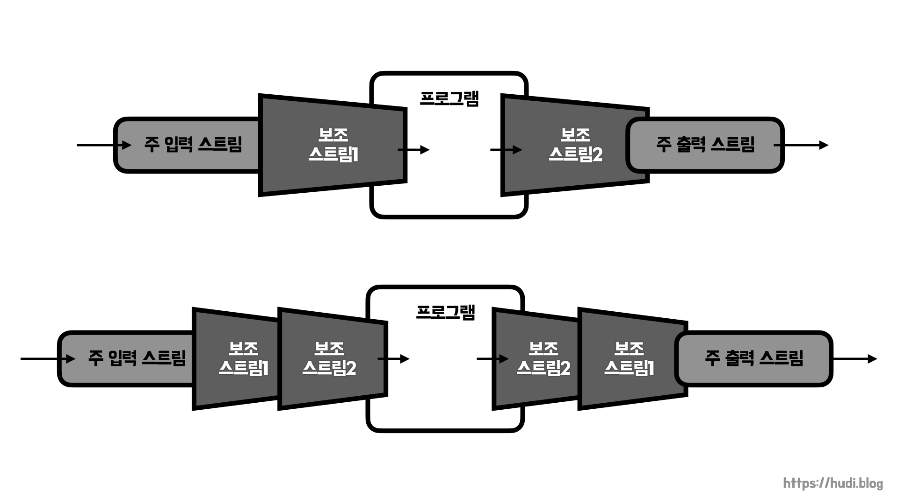
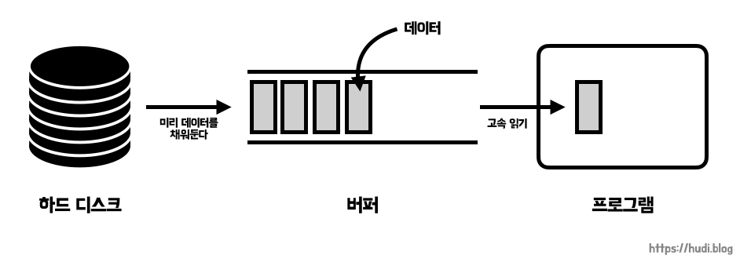
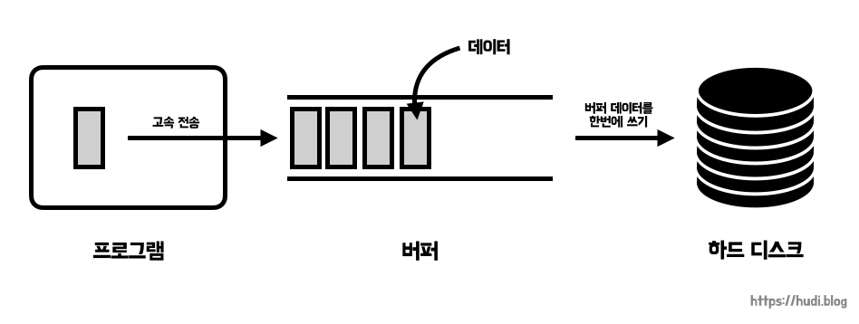

## 학습 배경

**[Java에서 스트림을 사용한 입출력 (InputStream, OuputStream)](https://hudi.blog/java-inputstream-outputstream/)** 포스팅에 이어서 작성하는 포스팅이다. 우아한테크코스 레벨4 HTTP 서버 만들기 미션에서는 `InputStream` , `OutputStream` 을 단독으로 사용하는 것이 아니라 `BufferedInputStream` 등을 사용했다. `BufferedInputStream` 을 사용하니 바이트 단위, 글자 단위로 데이터를 받지 않고, 줄 단위로도 데이터를 받을 수 있었다. 내부적으로 버퍼링을 해두기 때문이라고 한다. 이런 내용들을 더 깊게 이해하기 위해서 학습을 하게 되었다.

이번 포스팅에서는 미션에서 사용한 문자 변환(`InputStreamReader` , `OutputStreamWriter`)와 성능 향상(`BufferedXXX`) 스트림에 대해서 다룬다.

## 필터 스트림

필터 스트림은 보조 스트림으로도 불린다. 필터 스트림은 다른 스트림과 연결되어 여러가지 편의 기능을 제공해준다. 필터 스트림은 위 그림처럼 **주 입력 스트림과, 주 출력 스트림에 연결**될 수 있고, 또한 아래 그림처럼 **필터 스트림끼리 연결되어 스트림 체인**을 구성할수도 었다.



## 필터 스트림 연결하기

```java
InputStream inputStream = new FileInputStream(filePath); // InputStream

InputStreamReader inputStreamReader = new InputStreamReader(inputStream);
// InputStream에 InputStreamReader 필터 스트림 연결

BufferedReader bufferedReader = new BufferedReader(inputStreamReader);
// InputStreamReader에 BufferedReader 필터 스트림 연결
```

위와 같이 입력 스트림에 여러 필터 스트림을 연결하여 스트림 체인을 구성할 수 있다. 후술하겠지만, `InputStreamReader` 는 바이트 기반 스트림인 `InputStream` 을 글자 기반 스트림인 `Reader` 로 변환해주는 필터 스트림이다. `BufferdReader` 는 `Reader` 스트림을 버퍼링을 통해 성능을 개선하기 위한 필터 스트림이다.

## InputStreamReader

`InputStreamReader` 클래스는 바이트 입력 스트림인 `InputStream` 에 연결되어 문자 입력 스트림인 `Reader` 스트림으로 변경해주는 필터 스트림이다. 아래와 같이 사용할 수 있다. `Reader` 로 변환되었으므로, `Reader` 타입으로 받을 수 있다.

```java
InputStream inputStream = new FileInputStream(filePath);
Reader reader = new InputStreamReader(inputStream);
```

## OutputStreamWriter

`OutputStreamWriter` 클래스는 이름처럼 `OutputStream` 을 `Writer` 로 변환하는 필터 스트림이다.

```java
FileOutputStream fileOutputStream = new FileOutputStream(filePath);
Writer writer = new OutputStreamWriter(fileOutputStream);
```

## BufferedInputStream, BufferedReader

### 버퍼란

프로그램의 실행 성능은 컴퓨터를 구성하는 요소 중 가장 처리 속도가 느린 부품의 속도를 따른다. CPU, 메모리가 아무리 성능이 좋다 한들 하드디스크의 속도가 가장 느리므로 프로그램 처리 속도는 하드디스크의 영향을 많이 받게된다.

연산 장치와 보조 기억 장치의 속도 차이를 개선하기 위해 버퍼를 사용할 수 있다. **버퍼는 데이터를 보내지 않고 임시로 모아두다가, 일정 크기가 되었을 때 한번에 내보내기 위해** 사용한다.



### 생성하기 및 성능

```java
InputStream inputStream = new FileInputStream(filePath);
BufferedInputStream bufferedInputStream = new BufferedInputStream(inputStream);

Reader reader = new InputStreamReader(inputStream);
BufferedReader bufferedReader = new BufferedReader(reader);
```

책 ‘이것이 자바다’ 에 따르면, 약 78배 빠르게 동작하는 것을 확인할 수 있다.

### BufferedReader의 readLine() 메소드

`BufferedReader` 는 `readLine()` 이라는 특별한 메소드를 제공한다. 이 메소드를 사용하면 캐리지 리턴(`\r`) 라인피드 (`\n`) 으로 구분된 행 단위의 문자열을 한꺼번에 가져올 수 있다. 그리고 더이상 읽을 수 있는 데이터가 없다면 `null` 을 반환한다. 아래와 같이 사용하면 된다.

```java
// ...
BufferedReader bufferedReader = new BufferedReader(reader);

while (true) {
    String line = bufferedReader.readLine();
    if (Objects.isNull(line)) {
        break;
    }
    System.out.println(line);
}

/*
    1번째 줄
    2번째 줄
    3번째 줄
    4번째 줄
    5번째 줄
*/
```

## BufferedOutputStream, BufferedWriter



`BufferedOutputStream` 과 `BufferedWriter` 는 프로그램이 쓰고자 하는 데이터를 버퍼에 미리 저장해두었다가, 한번에 하드 디스크 등에 데이터를 쓰는 방식으로 성능 향상을 하기 위한 필터 스트림이다. 아래와 같이 사용한다.

```java
// BufferedOutputStream
OutputStream outputStream = new FileOutputStream("파일명");
BufferedOutputStream bufferedOutputStream = new BufferedOutputStream(outputStream);

bufferedOutputStream.write("Hello, World!".getBytes());

// BufferedWriter
Writer writer = new FileWriter("파일명");
BufferedWriter bufferedWriter = new BufferedWriter(writer);

bufferedWriter.write("Hello, World!");
```

예시 코드에서는 짧은 텍스트만을 전송했지만, 이미지나 영상과 같은 고용량 데이터를 쓰기할때 더 유용할 것 같다.

## 필터 스트림의 close()

필터 스트림을 공부해보면서, 필터 스트림이 닫히면 기본 스트림은 어떻게 되는지 궁금했다. 결론을 말하자면 필터 스트림이 닫히면 연결된 기본 스트림도 닫히게 된다.

```java
// ...

InputStream inputStream = new FileInputStream(path);
Reader reader = new InputStreamReader(inputStream);
BufferedReader bufferedReader = new BufferedReader(reader);

bufferedReader.close();

inputStream.read();
// java.io.IOException: Stream Closed
```

위처럼 `bufferedReader` 라는 필터 스트림을 닫았는데, `inputStream` 이라는 기본 스트림을 사용하려고 하면 **Stream Closed** 라는 예외가 발생한다.

## 참고

- 이것이 자바다, 신용권
