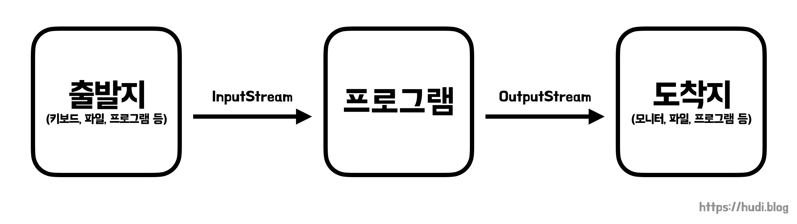

## 학습 배경

우아한테크코스 레벨4 과정의 첫번째 미션은 HTTP 서버를 TCP 소켓으로 직접 구현해보는 것이다. 자바에서 소켓을 사용할 때 데이터를 InputStream과 OutputStream을 사용하여 주고 받는다. 하지만 지금까지 스트림을 사용해 본적도 없고, 사실 스트림에 대한 개념도 제대로 잡혀있지 않았다. 이번 기회에 스트림에 대한 개념과 자바에서 스트림을 사용하는 방법을 알아보고자 한다.

## 스트림(Stream)

> Java 8에서 등장한 함수형 프로그래밍 방식의 반복자에 대한 이야기가 아님을 주의하자.

컴퓨터 공학 전반에서 이야기되는 **스트림(Stream)**은 데이터가 출발지에서 도착지로 단일 방향으로 흘러가는 개념을 의미한다. 데이터는 키보드에서 프로그램으로, 프로그램에서 모니터로, 프로그램에서 파일로 혹은 소켓과 소켓으로 흐를 수 있다.



프로세스가 데이터의 도착지라면 **입력 스트림(InputStream)**, 프로세스가 데이터의 출발지라면 **출력 스트림(OutputStream)** 이라고 불린다. 기준은 항상 프로그램이다.

## 자바의 스트림

### 바이트 기반 스트림과 문자 기반 스트림

자바의 `java.io` 패키지에서는 다양한 입출력 스트림 클래스를 제공한다. 이 패키지에서 제공하는 스트림은 크게 바이트 기반 스트림과 문자 기반 스트림으로 나누어볼 수 있다.

바이트 기반 스트림은 문자, 그림, 영상 등 다양한 형태의 데이터를 주고 받을 수 있지만, 문자 기반 스트림은 오직 문자만 주고 받을 수 있도록 설계 되었다. 상황에 따라 적절하게 사용하면 될 것 같다.

## 바이트 기반 스트림

### 최상위 바이트 기반 스트림 클래스, InputStream과 OutputStream

`InputStream` 은 바이트 기반 입력 스트림 최상위 추상 클래스이고, `OutputStream` 은 바이트 기반 출력 스트림 최상위 추상 클래스이다. 이들의 하위 클래스는 `XXXInputStream` , `XXXOutputStream` 이라는 네이밍을 가진다. 이를테면, `FileInputStream` 이 있다.

### InputStream 주요 메소드

`InputStream` 의 주요 메소드를 몇가지 알아보자.

#### read()

입력 스트림으로부터 1바이트를 읽고, 4바이트 int 타입으로 리턴한다. 따라서 int 타입의 4바이트 중 마지막 1바이트에만 데이터가 저장된다. 더이상 읽어올 데이터가 없다면, -1을 리턴한다.

현재 `sample.txt` 에는 `hello, world!` 라는 데이터가 저장 되어있다.

```java
String filePath = getClass().getClassLoader().getResource("sample.txt").getPath();
InputStream inputStream = new FileInputStream(filePath);

while(true) {
    int read = inputStream.read();
    if (read < 0) {
        break;
    }
    System.out.print((char) read);
}

inputStream.close();
// Stream은 사용이 끝난 이후 닫아 자원을 해제해야한다.
```

> `getClass().getClassLoader().getResource("sample.txt").getPath()` 는 `resources` 디렉토리의 파일 경로를 얻어오기 위한 코드이다.

> 스트림은 꼭 사용이 끝나면 `close()` 메소드로 스트림을 닫아 자원을 해제해야한다. 이는 `try with resources` 문법으로 간략하게 실행할수도 있다.

#### read(byte[] b)

파라미터로 전달한 바이트 배열에 스트림으로부터 읽어들인 데이터를 저장한다.

```java
String filePath = getClass().getClassLoader().getResource("sample.txt").getPath();
InputStream inputStream = new FileInputStream(filePath);

byte[] arr = new byte[20];

int read = inputStream.read(arr);
System.out.println("read = " + read); // 14

String str = new String(arr);
System.out.println("str = " + str); // hello, world!
```

반환 값은 읽어들인 데이터의 바이트 수 이다. `hello, world!` 와 개행까지 포함하여 14 바이트를 읽어온 것을 확인할 수 있다. `arr` 을 `String` 타입으로 변경하여 출력하면 제대로 글자가 출력되는 것을 볼 수 있다.

참고로 `arr` 의 사이즈를 20에서 10으로 줄이면, `hello, wor` 까지만 읽어온다.

#### read(byte[] b, int off, int len)

```java
// ...
InputStream inputStream = new FileInputStream(filePath);

byte[] arr = new byte[10];

inputStream.read(arr, 3, 5);

for (byte b : arr) {
    System.out.print(b + ", ");
}
// 0, 0, 0, 104, 101, 108, 108, 111, 0, 0,
```

주어진 `arr` 배열의 인덱스 3부터, 5개의 데이터를 저장한다.

### OutputStream 주요 메소드

#### write(int b)

```java
FileOutputStream outputStream = new FileOutputStream("파일경로");

byte[] bytes = "Hello, World!".getBytes();
for (byte b : bytes) {
    outputStream.write(b);
}

outputStream.close();
```

출력 스트림으로 단일 바이트를 출력한다. 위 예제는 `FileOutputStream` 을 사용하여 파일로 스트림을 출력하는 예제이다.

파라미터가 `int` 임에 주의하자. `int` 는 4바이트이다. `write()` 메소드에 `int` 형 데이를 전달하면 마지막 1 바이트만 전송된다는 점을 기억하자.

#### write(byte[] b)

파라미터로 전달된 바이트 배열을 출력 스트림으로 전송한다.

```java
FileOutputStream outputStream = new FileOutputStream("파일경로");

byte[] bytes = "Hello, World!".getBytes();
outputStream.write(bytes);
```

#### write(byte[] b, int off, int len)

주어진 바이트 배열에서 `off` 번째부터 `len` 개의 데이터를 전송한다.

```java
FileOutputStream outputStream = new FileOutputStream("/Users/hudi/Desktop/sample.txt");

byte[] bytes = "Hello, World!".getBytes();
outputStream.write(bytes, 3, 5); // lo, w
```

## 문자 기반 스트림

### 최상위 문자 기반 스트림 클래스, Reader와 Writer

`Reader` 는 문자 기반 입력 스트림 최상위 추상 클래스이고, `Writer` 는 문자 기반 출력 스트림 최상위 추상 클래스이다. 이들의 하위 클래스는 `XXXReader` , `XXXWriter` 이라는 네이밍을 가진다. 이를테면, `FileReader` 가 있다.

### Reader 주요 메소드

#### read()

`read()` 메소드는 입력 대상으로 부터 2바이트의 데이터를 읽고, 4바이트인 `int` 형으로 반환한다. `InputStream` 처럼 더이상 읽을 데이터가 없다면 -1을 반환한다.

```java
Reader reader = new FileReader(filePath);

while (true) {
    int read = reader.read();
    if (read < 0) {
        break;
    }
    System.out.print((char) read);
}
```

#### read(char[] cbuf)

파라미터로 전달된 `char` 배열에 읽어온 데이터를 저장한다.

```java
Reader reader = new FileReader(filePath);

char[] chars = new char[5];
reader.read(chars);

System.out.println(chars);
// Hello

reader.close();
```

### Writer 주요 메소드

Writer의 주요 메소드로는 `write(int c)` , `write(char[] cbuf)` , `write(char[] c, int off, int len)` 등이 있다. 앞서 설명한 여러 스트림 클래스의 사용법과 동일하므로 코드는 생략한다.

#### write(String str), write(String str, int off, int len)

편의를 위해 `char` 의 배열이 아니라 `String` 타입도 전달할 수 있도록 설계되었다.

```java
Writer writer = new FileWriter("파일명");
writer.write("Hello, World!");
```

`write(String str, int off, int len)` 은 앞서 설명한 여러 메소드와 사용법이 동일하니 코드는 생략한다.

## 마치며

포스팅에서 사용한 스트림 말고도 `Console` 이나, 여러 구현체들이 존재하는데 원래의 공부 목적에서 많이 벗어날 것 같아서 아직은 공부하지 않았다. 나중에 그 지식들이 필요해지면 공부해볼 예정이다.

다음 포스트에서는 `BufferedInputStream` 과 같은 스트림의 성능 향상을 위한 보조 스트림에 대해서 공부해본 내용을 정리해보고자 한다.

## 참고

- 이것이 자바다, 신용권
