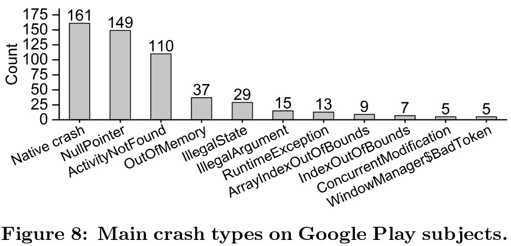

## 학습 동기

우테코 미션을 진행 중 스트림을 사용하면서 반환 타입이 Optional 인 메소드를 자주 마주쳤는데, 제대로 알지 못한 상태로 사용한 것 같다. 이번 기회에 Optional 에 대해 자세히 알아보려 한다.

## 쉽지 않았던 null 처리

null 이라는 개념은 Tony Hoare 이라는 컴퓨터 과학자에 의해 1965년에 처음으로 고안되었다. 당시 그는 존재하지 않는 값을 표현하기 위해 null 이란 개념을 도입하였는데, 추후 그는 이를 10억 달러 짜리 크나 큰 실수라고 이야기 했다고 한다. 현대의 개발자는 골치아픈 NPE (NullPointerException) 에 대응하기 위해 많은 null 체크 로직을 작성한다고 한다.



실제로 플레이스토어에 등록된 상위 1000개 앱의 충돌 원인의 2위가 NullPointer 임을 알 수 있다. 1위 원인이 Native Crash 에도 NullPointer 가 존재할 것이기 때문에 위 통계보다 실제 NullPointer 는 더 많이 발생한다고 한다.

나는 아직 자바를 많이 다뤄보지 않아서 아직 NPE 로 인해 골치아픈 일을 겪어 본적은 없다. 하지만 실제로 현업에서는 NPE 는 악명이 높은 녀석이라고 한다. 컴파일 타임에 잡을 수도 없는 null 에 대한 위험을 대비하기 위해 Optional 을 공부해본다.

## null 체크 (if vs Optional)

아래와 같이 글, 작성 유저, 유저의 이름을 각각 나타내는 `Article`, `User`, `Name` 이라는 세가지 클래스가 있다.

```java
class Article {
    private String title;
    private String content;
    private User user;

    // 생성자 및 Getter 메소드 생략
}

class User {
    private Name name;

    // 생성자 및 Getter 메소드 생략
}

class Name {
    private String firstName;
    private String middleName;
    private String lastName;

    // 생성자 및 Getter 메소드 생략
}
```

우리는 `Article` 을 파라미터로 받아 해당 글 작성자의 미들네임을 가져오는 메소드를 작성해야한다. 미들네임이 없을 경우 빈 문자열을 반환해야한다. 이때 우리는 런타임 중 발생하는 NPE를 방어하기 위해 `Article`, `User`, `Name` 그리고 `Name` 의 `middleName` 이 null 인지를 선행으로 검사해야한다.

### Optional 없이 작성해보기

이를 전통적인 if 문으로 체크한다면 아래와 같은 코드로 작성할 수 있을 것 이다.

```java
public String getUserMiddleName(Article article) {
    if (article != null) {
        User user = article.getUser();
        if (user != null) {
            Name name = user.getName();
            if (name != null) {
                String middleName = name.getMiddleName();
                if (middleName != null) {
                    return middleName;
                }
            }
        }
    }

    return "";
}
```

쉽지 않다. 읽기도, 유지보수하기도 힘든 코드가 나와버렸다. 이를 조금 개선해보자면 Ealry Return 을 사용해볼 수는 있겠다.

```java
public String getUserMiddleName(Article article) {
    if (article == null) {
        return "";
    }

    User user = article.getUser();
    if (user == null) {
        return "";
    }

    Name name = user.getName();
    if (name == null) {
        return "";
    }

    String middleName = name.getMiddleName();
    if (middleName == null) {
        return "";
    }

    return middleName;
}
```

Ealry Return 을 사용하니, 여러개의 반환문이 생겼다. 무엇보다 요구사항은 '글 작성자의 미들네임을 가져오는 메소드의 구현' 이었는데, 아직 요구사항과 관련없는 null 체크 로직이 대부분이다. 따라서 크게 개선되었다고 보기는 어려울 것 같다.

### Optional 을 사용해 개선하기

위 코드를 Optional 을 사용하여 개선해보자.

```java
public String getUserMiddleNameWithOptional(Article article) {
    String middleName = Optional.ofNullable(article)
            .map(Article::getUser)
            .map(User::getName)
            .map(Name::getMiddleName)
            .orElse("");

    return middleName;
}
```

읽기도 편하면서, 비즈니스 로직을 한눈에 파악하기 쉬워졌다. 무엇보다 null 체크를 하기 위한 무의미한 if 문들이 깔끔하게 사라졌다.

## Optional 이란?

Optional 이란 **null 이 될수도 있는 객체를 포장하는 Wrapper 클래스**로, 예상치 못한 NPE 가 발생하지 않도록 도와준다. NPE 방어를 위해 사용되는 복잡한 null 체크 로직은 가독성과 유지보수성이 낮은 반면, Optional 을 사용하면 NPE 를 위 예제와 같이 간단하게 회피할 수 있다. 쉽게 말하자면 **'존재할 수도 하지 않을 수도 있는 객체' 를 표현하기 위한 클래스**라고 생각하면 좋다.

위 예제 코드를 보면 알겠지만, Optional 은 Stream 에서 흔히 사용되는 `map()` 이나 `filter()` 같은 메소드를 제공한다. 따라서 Optional 은 최대 1개의 원소를 갖는 특별한 Stream 이라고 생각할 수도 있다. 여기에 더해 '값이 존재하면 반환하고, 없으면 ~를 반환', '값이 존재하면 OO를 실행, 없으면 XX를 실행' 등의 로직을 깔끔하게 작성할 수 있는 메소드를 여럿 제공한다. 그리고 이런 메소드들은 반환타입이 Optional 이므로 메소드 체이닝을 사용하여 작성이 가능하다.

> Optional 은 스칼라, 하스켈같은 함수형 프로그래밍 언어로부터 온 아이디어이다. 개념적으로는 '모나드' 라고 하는 듯 한데 관련하여 공부가 더 필요할 것 같다.

## Optional의 메소드

### 생성 메소드

Optional 은 생성을 위한 3가지 정적 팩토리 메소드를 아래와 같이 제공한다.

- **empty()**

  아무 값도 들어있지 않은 빈 Optional 을 반환한다.

  ```java
  Optional.empty();
  ```

- of(T value)

  null 이 아닌 값을 Optional 로 포장해서 반환한다. null 인 값을 전달하면 NPE 를 던진다. 따라서 절대 null 이 되지 않는 값을 전달할 필요가 있다.

  ```java
  String text = "Hello, Optional";
  Optional<String> optional = Optional.of(text);

  text = null;
  Optional<String> optionalWithNPE = Optional.of(text);
  // java.lang.NullPointerException
  ```

- **ofNullable(T value)**

  null 이 될수도 있는 값을 전달하면 Optional 로 포장해서 반환한다. `of()` 와 다르게 null 을 전달해도 NPE 를 던지지 않는다.

  ```java
  String text = "Hello, Optional";
  Optional<String> optional = Optional.ofNullable(text);

  text = null;
  Optional<String> optionalWithoutNPE = Optional.ofNullable(text);
  ```

### 중간 처리 메소드

- **filter(Predicate<? super T> predicate)**

  Predicate 를 전달하여, 가지고 있는 값이 조건에 맞지 않는다면 Optional 을 비워버린다.

  ```java
  int adultAge = 25;
  int kidAge = 10;

  Optional<Integer> optional = Optional.ofNullable(adultAge)
          .filter(number -> number > 20);
  // Optional[25]

  Optional<Integer> emptyOptional = Optional.ofNullable(kidAge)
          .filter(number -> number > 20);
  // Optional.empty
  ```

  `optional` 은 그대로 25라는 값을 가지고 있지만, `emptyOptional` 은 빈 것을 확인할 수 있다.

- **map(Function<? super T, ? extends U> mapper)**

  Function 을 전달하여, 가지고 있는 값을 매핑한다. Optional 이 값을 갖고 있지 않다면 아무일도 하지 않는다. 위 예제 코드에서 사용된 메소드이다.

  ```java
  Optional.ofNullable(article)
      .map(Article::getUser)
      .map(User::getName)
      .map(Name::getMiddleName);
  // Optional[John]
  ```

- **flatMap(Function<? super T, ? extends Optional<? extends U>> mapper)**

  Nested 된 Optional 을 평평(Flat) 하게 만들어준다.

  ```java
  Optional<Optional<String>> optional = Optional.of(Optional.of("hello"));

  Optional<Optional<String>> nested = optional.map(it -> it);
  Optional<String> flat = optional.flatMap(it -> it);
  ```

- **stream()**

  자바 9부터 지원되는 메소드이다. Optional 이 비어있지 않다면, 해당 값을 가진 Stream 을 생성하고, 비어있다면 빈 Stream 을 생성한다.

  ```java
  User user = new User(name);
  Stream<User> stream = Optional.of(user).stream();
  ```

> 사실 아직 flatMap() 과 stream() 은 용도를 제대로 알지 못한다. 조금 더 경험이 쌓여야 용도를 이해할 수 있을 것 같다.

### 종단 처리 메소드

- **get()**

  Optional 에 값이 있다면 해당 값을 반환하고, 그렇지 않으면 NoSuchElementException 을 던진다.

  ```java
  Name name = new Name("Jack", "John", "Smith");
  User user = new User(name);
  Article article = new Article("안녕하세요.", "반갑습니다.", user);

  String middleName = Optional.ofNullable(article)
          .map(Article::getUser)
          .map(User::getName)
          .map(Name::getMiddleName)
          .get();
  // John
  ```

- **orElse(T other)**

  Optional 에 값이 존재하면 해당 값을 반환하고, 없다면 파라미터로 전달된 값을 반환한다.

  ```java
  Name name = new Name("Jack", "John", "Smith");
  String middleName = Optional.ofNullable(name)
          .map(Name::getMiddleName)
          .orElse("empty");
  // John

  Name nameWithoutMiddleName = new Name("Jack", null, "Smith");
  String emptyMiddleName = Optional.ofNullable(nameWithoutMiddleName)
          .map(Name::getMiddleName)
          .orElse("empty");
  // empty
  ```

- **orElseGet(Supplier<? extends T> supplier)**

  Optional 에 값이 존재하면 해당 값을 반환하고, 없다면 파라미터로 전달된 Supplier 의 반환값을 반환한다.

  ```java
  Name name = new Name("Jack", "John", "Smith");
  String middleName = Optional.ofNullable(name)
          .map(Name::getMiddleName)
          .orElseGet(() -> "empty");
  // John

  Name nameWithoutMiddleName = new Name("Jack", null, "Smith");
  String emptyMiddleName = Optional.ofNullable(nameWithoutMiddleName)
          .map(Name::getMiddleName)
          .orElseGet(() -> "empty");
  // empty
  ```

- **orElseThrow(Supplier<? extends X> exceptionSupplier)**

  Optional 에 값이 존재하면 해당 값을 반환하고, 없다면 파라미터로 전달된 Supplier 가 반환하는 예외를 던진다. 파라미터에 아무것도 없다면, NoSuchElementException 를 던진다.

  ```java
  Name name = new Name("Jack", null, "Smith");
  String middleName = Optional.ofNullable(name)
          .map(Name::getMiddleName)
          .orElseThrow();
  // java.util.NoSuchElementException: No value present
  ```

  ```java
  Name name = new Name("Jack", null, "Smith");
  String middleName = Optional.ofNullable(name)
          .map(Name::getMiddleName)
          .orElseThrow(() -> new NoSuchElementException("미들네임이 존재하지 않습니다!"));
  // java.util.NoSuchElementException: 미들네임이 존재하지 않습니다!
  ```

- **or(Supplier<? extends Optional<? extends T>> supplier)**

  자바 9부터 지원되는 메소드이다. `orElse`, `orElseGet` 과 비슷한 역할을 하지만 Optional 을 반환한다는 차이점이 있다.

  아래 예제는 유저가 이름이 없을 경우 데이터베이스에서 인기 있는 이름을 가져오고, 그것마저 없을 경우 "Jack John Smith" 라는 이름을 반환하는 코드이다.

  ```java
  User user = new User(name);
  Name name = Optional.of(user)
          .map(it -> it.getName())
          .or(() -> Optional.of(getPopularNameFromDatabase()))
          .orElse(new Name("Jack", "John", "Smith"));

  System.out.println(name);
  ```

- **ifPresent(Consumer<? super T> consumer)**

  Optional 에 값이 존재하면 파라미터로 전달된 Consumer 를 호출하고, 그렇지 않으면 아무것도 하지 않는다.

  ```java
  Name name = new Name("Jack", "John", "Smith");
  Optional.ofNullable(name)
          .map(Name::getMiddleName)
          .ifPresent(middleName -> System.out.println("미들네임은 " + middleName));
  // 미들네임은 John
  ```

- **ifPresentOrElse(Consumer<? super T> action, Runnable emptyAction)**

  자바 9부터 지원되는 메소드이다.

  Optional 에 값이 존재하면 첫번째 파라미터로 전달된 Consumer 를 호출하고, 그렇지 않으면 두번째 파라미터로 전달된 Runnable 을 실행한다.

  ```java
  Name name = new Name("Jack", null, "Smith");
  Optional.ofNullable(name)
          .map(Name::getMiddleName)
          .ifPresentOrElse(
                  middleName -> System.out.println("미들네임은 " + middleName),
                  () -> System.out.println("미들네임이 존재하지 않습니다.")
          );
  // 미들네임이 존재하지 않습니다.
  ```

- **isPresent()**

  Optional 에 값이 존재하면 true, 그렇지 않으면 false 를 반환한다.

  ```java
  Name name = new Name("Jack", null, "Smith");
  Optional.ofNullable(name)
          .map(Name::getMiddleName)
          .isPresent();
  // false
  ```

- **isEmpty()**

  자바 11부터 제공되는 메소드이다.

  ```java
  Name name = new Name("Jack", null, "Smith");
  Optional.ofNullable(name)
          .map(Name::getMiddleName)
          .isEmpty();
  // true
  ```

## 참고

- https://www.daleseo.com/java8-optional-before/
- https://goodgid.github.io/Java-Optional-Class-Method/
- https://madplay.github.io/post/what-is-null-in-java
