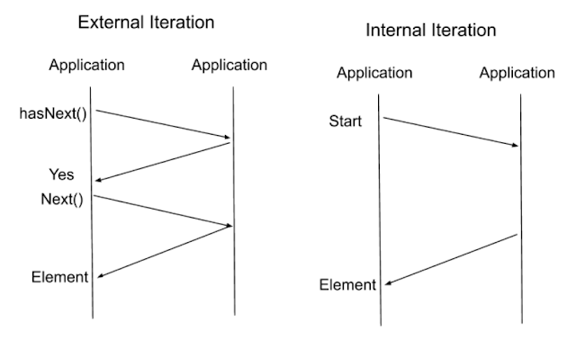
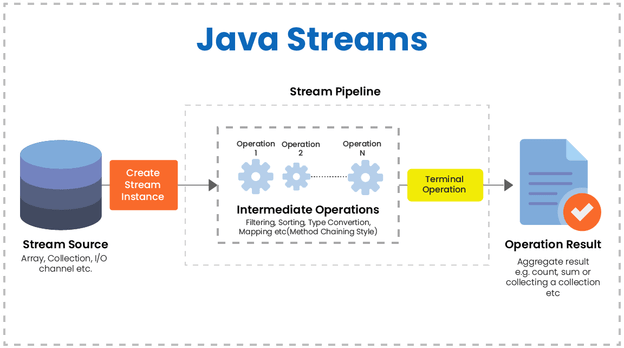

## 학습 동기

우테코 미션을 진행하면서, 반복적인 작업의 처리를 위해 자바의 스트림을 자주 사용하였다. 지금껏 스트림을 사용하면서 스트림의 구조나 개념등을 전혀 알지 못한 채 사용해왔다.

사실 자바스크립트에서 리스트 메소드 (map, filter, reduce 등) 을 일상적으로 사용했고, lodash, underscore 같은 라이브러리를 사용하면서 메소드 체이닝을 통한 Iterable 한 데이터 처리에는 다소 익숙해서 큰 고민없이 사용했던 것 같다.

하지만 이렇게 사용하는 것도 점점 한계가 있는 것 같아 **사용법이 아닌 개념 위주**로 자바 스트림을 공부해보고자 한다. 스트림의 여러 사용법에 대해서는 미션을 진행하면서 알게된 것들 위주로 별개로 포스팅 해보도록 한다.

## Stream 이란

JDK 8 버전부터 제공된 컬렉션 혹은 배열에 저장된 요소를 하나씩 참조하여 람다 표현식으로 처리할 수 있는 반복자이다. 스트림이 존재하기 이전에는 `Iterator` 인터페이스를 사용했다고 한다. (자바스크립트의 제너레이터와 비슷한 것 같다)

### Iterator 를 사용한 반복 처리

```java
List<Integer> numbers = List.of(1, 2, 3, 4, 5, 6);
Iterator iterator = numbers.iterator();

while (iterator.hasNext()) {
    System.out.println(iterator.next());
}
```

### Stream 을 사용한 반복 처리

```java
List<Integer> numbers = List.of(1, 2, 3, 4, 5, 6);
Stream<Integer> stream = numbers.stream();

stream.forEach(number -> System.out.println(number));
```

## 외부 반복자와 내부 반복자



스트림은 **내부 반복자 (Internal Iterator)** 를 사용하여 병렬처리에 적합하다. **외부 반복자 (External Iterator)** 는 개발자가 직접 컬렉션에서 요소를 반복해서 가져오는 코드 패턴을 의미한다. 그에 반해 내부 반복자는 컬렉션 내부에서 직접 요소를 반복시키고 개발자는 개별 요소를 처리 방법만 코드로 제공하면 된다. 즉, 개발자는 요소 처리 코드에만 집중할 수 있다.

위에서 예시로 든 `Iterator` 의 `hasNext` 를 사용한 반복 구조는 외부 반복자라고 할 수 있다.

## Stream 의 특징

#### 람다 표현식

스트림은 **람다식으로 요소 처리 코드**를 제공한다. 스트림이 제공하는 대부분의 요소 처리 메소드는 함수형 인터페이스를 사용하므로, 람다식으로 요소 처리 코드를 제공할 수 있다.

#### 생성, 중간처리, 최종처리

후술하겠지만, 스트림의 처리는 **생성, 중간처리, 최종처리** 3단계로 구분된다.

#### 재사용 불가능

스트림은 생성되고, 중간처리를 거쳐 최종처리까지 완료되면 닫히게된다. 이미 닫힌 스트림은 재사용할 수 없으며, 재사용을 시도할 경우 예외가 발생한다. **즉 스트림은 일회용이다.**

#### 원본 데이터를 변경하지 않는다

스트림은 원본 객체의 값을 사용하기만 할 뿐 변경하지 않는다. 스트림은 최종 처리를 통해 원본과 무관한 새로운 객체를 생성한다.

## Stream 과 파이프라인



스트림을 사용하기 위해서는 제일 먼저 스트림을 생성해야할 것 이다. 그 다음 **필터링, 매핑, 정렬, 그룹핑 등의 처리 등의 중간 처리**를 통해 데이터를 가공할 수 있다. 마지막으로 가공된 데이터로부터 **합계, 평균, 최대값, 최소값, 카운팅 등 최종 처리**를 통해 집계할 수 있을 것 이다.

이렇듯 스트림은 생성, 중간처리, 최종처리 3단계로 구분된다. 스트림은 데이터를 처리하기 위해 **파이프라인으로 처리**한다. 여기서 파이프라인이란 여러개의 스트림이 수도관 같이 연결되어 있는 구조를 의미한다. 이를 파이프 패턴이라고도 하는데, 파이프 패턴은 [마이크로소프트 문서](https://docs.microsoft.com/ko-kr/azure/architecture/patterns/pipes-and-filters)에 자세히 설명되어 있다.

중간 스트림은 중간 처리된 스트림을 반환한다. 중간 처리된 스트림을 통해 또 다시 중간 처리 메소드를 사용하여 중간 처리된 스트림을 반환받을 수 있다. 스트림은 이런 구조로 이루어져있기 때문에 보통 **메소드 체이닝**의 형태로 사용한다.

또한 스트림은 최종 스트림의 처리가 실행될 때 까지 그 전의 모든 중간 스트림의 처리는 **지연 (Lazy)** 되는 특징이 있다.

## Stream 사용해보기

스트림을 사용해서 여러 학생 중 3학년인 학생만을 필터링 하여 그들의 성적 평균을 집계해보자. 먼저 아래의 `Student` 클래스를 정의한다.

```java
class Student {
    private final int grade;
    private final int score;

    Student(final int grade, final int score) {
        this.grade = grade;
        this.score = score;
    }

    public int getGrade() {
        return grade;
    }

    public int getScore() {
        return score;
    }
}
```

학년을 저장하는 `grade` 필드와 성적을 저장하는 `score` 필드를 저장한다. 그 다음 아래와 같이 학생 컬렉션을 준비하자.

```java
List<Student> students = List.of(
    new Student(2, 100),
    new Student(3, 50),
    new Student(1, 56),
    new Student(2, 90),
    new Student(3, 90),
    new Student(2, 100),
    new Student(1, 30)
);
```

3학년 학생의 평균 성적은 70점으로 계산되어야 할 것 이다. 이제 스트림을 통해 이를 계산해보자.

```java
double averageScore = students.stream() // Stream 생성
    .filter(student -> student.getGrade() == 3) // 필터링 (중간처리)
    .mapToInt(student -> student.getScore()) // 매핑 (중간처리)
    .average() // 평균 집계 (최종처리)
    .getAsDouble();

System.out.println("평균 성적: " + averageScore); // 70.0
```

`평균 성적: 70.0` 이 출력될 것이다.
