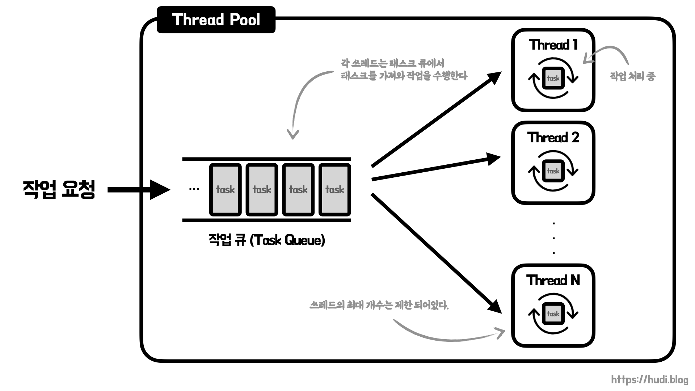
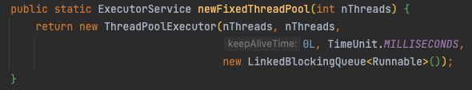

## 프로세스와 쓰레드

쓰레드는 **프로세스 내의 작업 흐름**이다. 프로세스는 **최소 1개의 쓰레드**를 가지고 있으며, N개의 쓰레드를 생성하여 동시에 작업이 처리 되도록 구성할 수 있다. 이렇게 프로세스 하나에 여러개의 쓰레드를 띄워 작업을 병렬로 처리하는 방법을 **멀티 쓰레딩**이라고 한다. 멀티 쓰레딩 환경에서는 각각의 쓰레드가 프로세스의 코드, 데이터, 힙 영역을 서로 공유하므로 **메모리가 절약**된다. 또한, 쓰레드를 생성하는 것은 프로세스를 보다 **생성 비용이 저렴**하다.

그런데, 쓰레드도 무한정 생성할 수 있는 것은 아니다. 쓰레드가 많으면 많아질수록 **경쟁 조건(Race Condition)이 많이 발생하고, 이를 해결하기 위한 작업으로 애플리케이션 성능이 저하**될 수 있다. 또한 프로세스보다 생성 비용이 적지만, **여전히 쓰레드도 생성 비용이 존재**한다.

## 컴퓨터 과학에서의 풀(Pool)

쓰레드 풀에 대해 알아보기 이전에, **풀(Pool)**이라는 것이 대체 무엇일까? 쓰레드 풀, 커넥션 풀, 객체 풀 등등 … 우리는 참 많은 풀들을 마주한다.

컴퓨터 과학에서의 풀은 자원을 사용하는 시점에 메모리에 올리고, 사용을 완료한 이후 메모리에서 해제하는 대신 **이미 사용할 준비가 된 자원을 메모리 위에 일정량 미리 생성해둔 자원의 집합**이다. 자원이 필요할 경우 새로 자원을 생성하는 대신 **풀에서 꺼내 사용**하고, 사용이 완료된 경우 자원을 해제하는 대신 **풀에 다시 반환**하는 형태로 사용한다.

미리 자원을 생성해두면 어떤 이점을 얻게 될까? 자원을 필요할 때 자원의 생성, 파괴 비용을 절약할 수 있다. 즉, **오버헤드(overhead)를 줄일 수 있다**. 데이터베이스 혹은 소켓 등은 상대방과 연결하기 위해 꽤 오랜 시간이 걸린다. 미리 커넥션을 생성해두고, 이 커넥션을 재사용하는 방식을 사용하면 애플리케이션의 성능을 개선할 수 있을 것이다. 앞으로 이야기할 쓰레드 풀도 같은 맥락에서 멀티 쓰레딩 환경의 애플리케이션에서 성능을 개선할때 사용된다.

## 쓰레드 풀



쓰레드 풀이란 **쓰레드를 미리 생성**하고, 작업 요청이 발생할 때 마다 **미리 생성된 쓰레드로 해당 작업을 처리**하는 방식을 의미한다. 이때, 작업이 끝난 **쓰레드는 종료되지 않으며 다음 작업 요청이 들어올때까지 대기**한다.

그런데, 작업 요청이 들어올 때 마다 쓰레드를 생성하고 작업을 할당하면 안되는 이유가 있을까? 우선 앞서 풀에 대해 설명한 것처럼 미리 일정량의 쓰레드를 생성해두기 때문에 쓰레드를 생성하고, 파괴하는 **오버헤드**가 발생하기 때문이다. 또한, **너무 많은 쓰레드가 제한된 하드웨어 리소스를 공유**하게 되는 문제도 발생한다 ([참고](https://www.codeguru.com/cplusplus/why-too-many-threads-hurts-performance-and-what-to-do-about-it/)).

쓰레드 풀을 사용하면 이런 **쓰레드 폭증으로 인한 애플리케이션 성능 저하를 방지**할 수 있다. 쓰레드를 제한된 개수로 생성한 뒤, 들어오는 작업을 **작업 큐(task queue)**에 채워 넣은뒤 쓰레드 별로 할당하여 작업을 처리한다.

**[톰캣 튜닝 맛보기](https://hudi.blog/tomcat-tuning-exercise/)** 포스팅에서 이야기했듯 톰캣과 같은 WAS는 멀티 쓰레드 환경에서 동작하며, 클라이언트의 요청을 쓰레드에 할당해 병렬 처리한다. 다수의 요청에 대해 동시에 작업을 진행해야 하기 때문이다. 해당 포스팅을 살펴보면 톰캣에서도 내부적으로 쓰레드 풀을 관리하는 것을 알 수 있다. 즉, **쓰레드 풀은 웹 어플리케이션 서버와 같이 병렬 처리가 잦은 프로그램에서 사용하기 적합**하다.

## 쓰레드 풀 생성하기

자바는 `java.util.concurrent` 패키지에서 `Executors` 클래스를 제공한다. `Executors` 클래스의 정적 메소드를 사용하여 `ExecutorService` 라는 인터페이스의 구현체를 생성할 수 있다. 이 구현체가 바로 쓰레드 풀이다.

자바로 직접 쓰레드 풀을 사용해보기 전에 간단히 용어 정리 3가지만 하고 넘어가겠다.

- **초기 쓰레드 수** : 쓰레드 풀이 생성될 당시의 쓰레드 개수를 의미한다.
- **코어 쓰레드 수** : 쓰레드 풀 내의 쓰레드가 제거되어도 남아있을 최소 쓰레드 개수를 의미한다.
- **최대 쓰레드 수** : 쓰레드 풀 내 쓰레드의 최대 개수를 의미한다.

### CachedThreadPool

CachedThreadPool은 초기 쓰레드 수, 코어 쓰레드 수가 0개이며, 최대 쓰레드 수는 `Integer.MAX_VALUE` 를 따른다. CachedThreadPool의 특징은 **작업이 들어올 때 마다 쓰레드를 생성**하며, 생성된 쓰레드가 **60초 동안 아무일도 하지 않으면, 즉 유휴상태라면 해당 쓰레드를 제거**한다.

```java
ExecutorService executorService = Executors.newCachedThreadPool();
// 쓰레드 풀 생성
```

위와 같이 사용한다.

### FixedThreadPool

FixedThreadPool은 초기 쓰레드 수가 0이며, 코어 쓰레드 수와 최대 쓰레드 수는 쓰레드 풀이 생성될 때 지정할 수 있다. **존재하는 쓰레드의 개수보다 작업량이 많으면 쓰레드를 생성**하며, 생성된 쓰레드는 유휴 상태가 오래되었다고 하더라도 **제거하지 않는다**.

```java
ExecutorService executorService = Executors.newFixedThreadPool(200);
// 쓰레드 풀 생성 (쓰레드 수 200개)
```

### ThreadPoolExecutor

입맛대로 쓰레드 풀을 생성할수도 있다. `ThreadPoolExecutor` 를 사용하는 것이다. 사실 위 두가지 방법도 내부적으로는 `ThreadPoolExecutor` 를 사용한다.



```java
ExecutorService myThreadPool = new ThreadPoolExecutor(
        3, // 코어 쓰레드 수
        200, // 최대 쓰레드 수
        120, // 최대 유휴 시간
        TimeUnit.SECONDS, // 최대 유휴 시간 단위
        new SynchronousQueue<>() // 작업 큐
);
```

위와 같이 생성할 수 있다.

## 쓰레드 풀 종료

`ExecutorService` 는 쓰레드 풀 종료를 위한 아래의 3가지 메소드를 제공한다.

```java
threadPool.shutdown(); // (1)
List<Runnable> unprocessedTasks = threadPool.shutdownNow(); // (2)
boolean complete = threadPool.awaitTermination(60, TimeUnit.SECONDS); // (3)
```

### shutdown()

현재 쓰레드가 처리중인 작업과 작업 큐에 대기하고 있는 작업을 모두 끝 마친 뒤 쓰레드 풀을 종료한다.

### shutdownNow()

현재 작업중인 쓰레드를 강제로 작업 중지하고, 작업 큐 대기열에 남아있는 작업을 `List<Runnable>` 로 반환한다.

### awaitTermination()

`shutdown()` 을 먼저 호출하고, 전달된 timeout 시간 내로 모든 작업이 완료되면 true를, 완료하지 못하면 처리중인 쓰레드를 강제 종료하고 false를 반환한다.

## 쓰레드 풀에 작업 처리 요청

### 작업의 단위, Runnable와 Callable

쓰레드 풀에 작업 처리를 요청하기 위해서는 `Runnable` 또는 `Callable` 인터페이스의 구현체를 `ExecutorService` 에 전달해야한다. `Runnable` 은 작업 처리 완료 후 반환값이 없고, `Callable` 은 작업 처리 완료 후 반환값이 있다.

### 작업 처리 요청, execute()와 submit()

`ExecutorService` 는 작업 처리 요청을 위해 `execute()` 와 `submit()` 두가지 메소드를 제공한다.

#### 차이점1. 처리 결과 반환

`execute()` 는 `Runnable` 만을 처리하며, 작업의 처리 결과를 반환받을 수 없다. 반면, `submit()` 은 `Runnable` 과 `Callable` 두가지를 처리하며 작업의 처리 결과를 `Future` 라는 인터페이스로 반환한다.

#### 차이점2. 예외 발생 처리

`execute()` 는 쓰레드에서 작업 처리 도중 예외가 발생하면, 쓰레드 풀에서 해당 예외를 제거하고 새로운 쓰레드를 생성한다. 반면, `submit()` 은 작업 처리 도중 예외가 발생해도 쓰레드를 제거하지 않고, 다음 작업에 재사용한다. `submit()` 이 오버헤드가 더 적으므로 따라서 `submit()` 을 사용하는 것이 일반적으로 권장된다.

## 블로킹 방식의 작업 완료 통보

`ExecutorService` 의 `submit()` 은 실행 즉시 `Future` 객체를 반환한다. 반환된 `Future` 객체의 `get()` 메소드를 사용하여, 쓰레드의 작업 결과를 가져올 수 있다. 마치 자바스크립트의 Promise 같다.

아래와 같은 `Callable` 구현체가 있다고 해보자.

```java
public class SomeCallable implements Callable {

    @Override
    public Integer call() {
        int count = 0;
        for (int i = 0; i < 10; i++) {
            try {
                count += 1;
                Thread.sleep(1000);
            } catch (InterruptedException e) {
                e.printStackTrace();
            }
        }
        return count;
    }
}
```

1을 더할때마다 1초를 기다려, 총 10번 더하고 그 결과값을 반환하는 작업이다. 이 작업의 총 소요 시간은 10초이다.

```java
Future<?> future = executorService.submit(new SomeCallable());
try {
    Object result = future.get(); // (1)
    System.out.println("이 코드는 블로킹되어 10초 이후에 실행됩니다."); // (2)
    System.out.println("result = " + result); // (3)
} catch (Exception e) {
    e.printStackTrace();
}
```

위와 같은 코드로 쓰레드의 작업 결과를 받을 수 있다. 코드에 나와있는 것과 같이 (1) 의 `get()` 메소드에서 블로킹이 걸려 쓰레드가 작업을 완료할때까지 기다린다. 이후 쓰레드가 작업을 완료하고 결과값을 반환하면, 그 다음 코드가 실행된다. 따라서 (2)와 (3)은 10초 이후에 실행된다.

따라서 `Future` 는 주의하여 사용해야하며, 메인 쓰레드의 블로킹을 방지하기 위해 새로운 쓰레드나 쓰레드 풀의 쓰레드에서 호출되어야 한다.

## 참고

- 이것이 자바다, 신용권
- [https://docs.oracle.com/cd/E26502_01/html/E35303/ggedh.html](https://docs.oracle.com/cd/E26502_01/html/E35303/ggedh.html)
