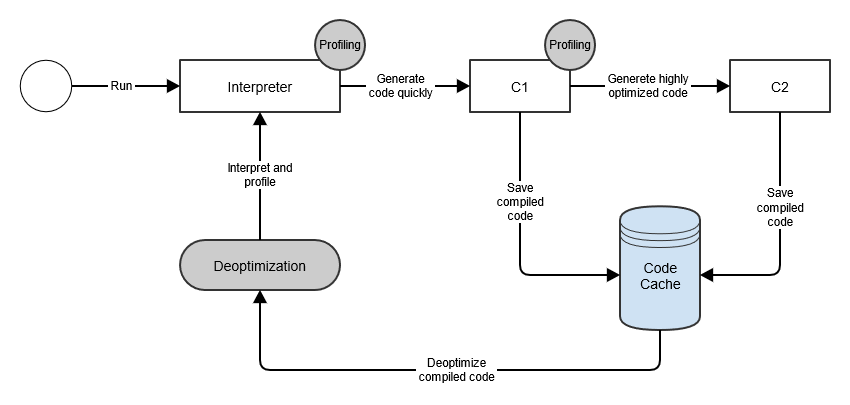

> 최근 같은 팀원 중 한분께서 JVM Warm-up 이슈로 인해 발생한 성능 저하 이슈와 그 해결방법에 대해 공유해주셨다. JVM Warm-up 키워드에 대해서는 언젠가 한번 공부해 보아야겠다고 생각했지만, 계속 미뤄두고 있었다. 이 기회에 JVM Warm-up에 대해 공부해보려한다.

## 배포 직후의 서버의 Latency 이슈


위 사진은 [**카카오 모빌리티 이형구님의 If(kakao) 2022 발표**](https://www.youtube.com/watch?v=CQi3SS2YspY) 내용을 발췌한 것이다. 위 사진은 서버가 롤링 배포 되면서 발생한 지연이 발생한것이 나타난 그래프이다. 우측 상단 TPS 그래프를 보면, **TPS는 일정한데 불구하고 배포 직후 17:15 ~ 17:35 사이에 평상시 대비 큰 지연이 발생한 것**을 볼 수 있다. 이렇듯 자바기반의 웹 애플리케이션을 배포한 직후 Latency가 발생하는 이슈를 흔히 볼 수 있다. 이 포스팅에서는 배포 직후에 발생하는 Latency의 원인이 무엇인지, 그리고 그 원인을 해결하는 방법은 무엇인지에 대해 알아본다.

## 원인1. 클래스 로더

Latency 원인에 대해 이해하기 위해서는 자바 클래스가 로드되는 과정에 대해서 먼저 간단히 알아둬야한다. JVM에서 자바의 클래스를 읽어오기 위해 자바 클래스 로더 (ClassLoader)가 사용된다. 클래스 로더는 클래스 파일을 찾고, 메모리에 로드해 실행 가능한 상태로 만드는 역할을 한다. 클래스 로더는 아래의 과정을 통해 동작한다.

1. **Class Loading**: 클래스 파일을 가져와 JVM 메모리에 적재한다. 이 단계도 크게 JVM 기본 클래스와 Java 코드를 로딩하는 Bootstrap Class Loading, 자바 핵심 라이브러리를 로딩하는 Extenstion Class Loading, 개발자가 직접 작성하여 classpath에 있는 클래스를 로딩하는 Application Class Loading 단계로 나뉜다.
2. **Class Linking**: 클래스가 참조하는 다른 클래스, 메서드, 필드 등을 확인하고 필요하면 메모리 상에서 연결하는 단계이다. 이 단계도 크게 Verification, Prepare, Resolution 단계로 나뉜다.
3. **Class Initialization**: 클래스 변수를 초기화 하거나, static 블록 내의 코드를 실행하는 등의 클래스 초기화 작업을 수행한다.

클래스 로딩은 위와 같이 많은 단계를 거쳐 진행된다. 따라서 클래스 로딩은 상대적으로 무거운 작업으로 간주된다.

그런데 왜 JVM Warm-up을 위해 클래스 로더에 대한 이야기를 꺼낸 것일까? 클래스 로더는 **일반적으로 Lazy Loading 방식으로 동작**하기 때문이다. Lazy Loading 이란 애플리케이션이 시작될 때 로딩되는 것이 아니라, 클래스가 필요한 시점까지 로딩을 지연하는 방식이다. 쉽게 말하면 클래스 로더는 **클래스가 최초로 필요해진 시점에 클래스를 로딩**한다.

이 Lazy Loading이 Latency의 첫번째 이유이다. **배포 직후에는 대부분의 클래스들이 한번도 사용되지 않았으므로 클래스 로더에 의해 메모리에 적재되지 않은 상태**이다. 그런 상태에서 웹 애플리케이션에 요청이 들어오게 되면, 그재서야 클래스 로더가 부랴부랴 클래스를 메모리에 적재한다. 이 과정속에서 Latency가 발생하게 되는 것이다.

## 원인2. JIT (Just In Time) 컴파일

### 자바 컴파일 과정

Java 혹은 Kotlin 소스코드는 중간언어로 컴파일된다. 이 컴파일된 결과는 바이트 코드라고 불리며, **.class** 확장자를 갖는다. 이 바이트 코드는 애플리케이션에서 사용되는 다른 여러 리소스들과 함께 묶여, 실행될 수 있는 **JAR 혹은 WAR 파일로 아카이브**된다. 이런 빌드과정을 거쳐 JAR, WAR 를 실행하게 되면, JVM은 바이트 코드를 한줄 한줄 읽어, 기계어로 번역한 뒤 실행한다. 이 과정을 인터프리트라고 한다.

자바는 왜 소스코드를 곧바로 기계어로 번역하지 않고, 바이트 코드라는 중간 언어를 만들까? 그것은 자바의 핵심 철학인 **‘Write Once, Run Anywhere’** 를 생각해보면 된다. 자바는 플랫폼 독립적인 언어를 지향한다. C, C++, Go, Rust 와 같이 소스코드가 기계어로 직접 컴파일되는 언어들은, 애플리케이션을 실행하는 하드웨어에 따라 따로 컴파일 해주어야한다. x86, x64, ARM와 같은 CPU 아키텍처마다 서로 다른 명령어 세트, 레지스터 구조 등을 가지고 있기 때문이다.

자바는 바이트 코드를 사용함으로써 이런 문제를 해결했다. JVM은 바이트 코드를 기계어로 번역할 때 플랫폼 종속적인 작업을 처리한다. 이것이 자바가 **높은 이식성(Portability)**를 가질 수 있는 이유이다.

하지만, 이런 중간언어를 사용한 방식도 단점이 있다. 바로 실**행 속도가 비교적 느리다**는 점이다. 이건 모든 인터프리팅 방식을 사용하는 언어가 갖는 고질적인 문제이다. 나는 종종 컴파일 언어를 번역서를 읽는 것에, 인터프리터 언어를 원서를 구매해 한줄 한줄 해석해 가면서 읽는 것에 비유한다. 당연히 후자가 더 느릴 것이다. 또, **컴파일 언어는 소스코드를 컴파일 할때 코드 최적화를 수행**한다. 따라서 이미 최적화되어 **준비된 기계어를 읽는 컴파일 언어에 비해 인터프리터 언어는 성능이 부족**할 수 밖에 없다.

### JIT 컴파일러 도입

앞서 살펴본 자바 컴파일 방식의 성능 문제를 해결하고자, JVM은 **JIT 컴파일**을 도입한다. JIT 컴파일러는 애플리케이션 **실행 중 동적으로 바이트 코드를 기계어로 컴파일**한다. 이렇게 컴파일된 코드를 실행하게 되면, 인터프리터가 바이트코드를 실행하는 것 보다 훨씬 빠른 속도로 실행이 가능하다.

그런데 애플리케이션이 실행되고 모든 바이트 코드를 기계어로 번역하면 애플리케이션이 기동 시간이 매우 길어질 것이다. 따라서 애플리케이션 실행 시간과 최적화 사이의 밸런스를 잘 맞춰야한다. 그렇다면 JIT 컴파일러는 코드의 어떤 부분을 기계어로 번역할까?

JIT 컴파일러는 애플리케이션에서 **자주 실행된다고 판단되는 특정 부분만을 기계어로 컴파일**한다. 이 부분을 **핫스팟(Hotspot)**이라고 부른다. JIT 컴파일러는 실행중인 애플리케이션의 동작을 분석하고 코드 실행 횟수, 루프 반복 횟수, 메소드 호출 등의 정보를 측정하고 기록한다. 이를 **프로파일링**이라고 한다. JIT 컴파일러는 프로파일링 결과를 토대로 핫스팟을 식별한다. 핫스팟이 식별되었다면, JIT 컴파일러는 **메소드 단위로 바이트 코드를 기계어로 번역**한다.

JIT 컴파일러는 이렇게 번역된 기계어를 **코드 캐시(Code Cache)**라는 캐시공간에 저장한다. 코드 캐시에 기계어를 저장하면, 핫스팟으로 판단된 코드는 다시 컴파일하지 않고, 코드 캐시에서 꺼내어 사용할 수 있으므로 성능 향상을 이루어낼 수 있다.

> 참고로 오라클에서는 JIT 컴파일을 Hotspot 이라고 부른다.

### JIT 내부 동작

이런 JIT 컴파일러의 내부를 더 자세히 들여다보면, 컴파일 과정이 최적화 수준에 따라 복수개의 단계로 나눠진 것을 확인할 수 있다. 이것을 **Tiered Compilation** 이라고 부른다. 그 전에 JIT 컴파일러를 구성하는 C1 컴파일러와 C2 컴파일러에 대해 먼저 알아보자.

#### C1 컴파일러와 C2 컴파일러



**C1 컴파일러는 가능한 빠른 실행 속도를 위해 코드를 가능한 빠르게 최적화하고 컴파일**한다. 그 중 특정 메서드가 C1 컴파일러의 임계치 설정 이상으로 호출되면, 해당 메서드의 코드는 C1 컴파일러를 통해 제한된 수준으로 최적화된다. 그리고 컴파일된 기계어는 코드 캐시에 저장된다.

이후 메서드가 C2 컴파일러의 임계치 설정보다 많이 호출되면, 코드는 C2 컴파일러에 의해 최적화되고 컴파일된다. **C2 컴파일러는 C1 컴파일러보다 더 높은 수준의 최적화를 수행한다.** 최적화와 컴파일이 끝나면 마찬가지로 코드 캐시에 기계어를 저장한다.

#### JIT Tiered Compilation

JIT Tiered Compilation 은 인터프리터, C1 컴파일러, C2 컴파일러를 통해 5가지 Level로 나뉜다. Level 0은 인터프리터, Level 1 ~ 3은 C1 컴파일러, Level 4는 C2 컴파일러에 의해 수행된다.

- **Level 0 - Interpreted Code**: JVM은 초기에 모든 코드를 인터프리터를 통해 실행한다. 이 단계는 앞서 살펴본것과 같이, 컴파일된 기계어를 실행하는 것보다 성능이 낮다.
- **Level 1 - Simple C1 Compiled Code**: Level 1 은 JIT 컴파일러가 단순하다고 판단한 메서드에 대해 사용된다. 여기서 컴파일된 메서드들은 복잡도가 낮아, C2 컴파일러로 컴파일한다고 하더라도 성능이 향상되지 않는다. 따라서 추가적인 최적화가 필요 없으므로 프로파일링 정보도 수집하지 않는다.
- **Level 2 - Limited C1 Compiled Code**: 제한된 수준으로 프로파일링과 최적화를 진행하는 단계이다. C2 컴파일러 큐가 꽉 찬경우 실행된다.
- **Level 3 - Full C1 Compiled Code**: 최대 수준으로 프로파일링과 최적화를 진행한다. 즉 일반적인 상황에서 수행된다.
- **Level 4 - C2 Compiled Code**: 애플리케이션의 장기적인 성능을 위해 C2 컴파일러가 최적화를 수행한다. Level 4에서 최적화된 코드는 완전히 최적화 되었다고 간주되어, 더이상 프로파일링 정보를 수집하지 않는다.

여기까지 JVM의 JIT 컴파일에 대해 알아보았다. 서버가 배포된 직후에는 JIT 컴파일러는 아무런 코드도 기계어로 컴파일 하지 않았으며, 따라서 코드 캐시에 적재된 기계어도 존재하지 않는다. 따라서 배포 직후 시점의 코드는 인터프리터에서 실행되거나, C1 혹은 C2 컴파일러가 최적화하고 컴파일 하는 과정이 동반되므로 필연적으로 성능 저하가 발생할 수 밖에 없다. 이것이 Latency의 두번째 원인이다.

## JVM Warm-up

지금까지 JVM Warm-up을 이해하기 위해 빌드업을 해왔다. 복잡한 내용들이 많았지만, 실은 **‘JVM은 자주 실행 되는 코드를 컴파일하고 캐시한다’**, **‘클래스는 필요할 때 Lazy Loading 으로 메모리에 적재된다’** 라는 사실 두가지만 기억해두면된다. 이것이 JVM Warm-up의 핵심 아이디어이다.

우리는 운동을 하기 전에 최대의 능률을 끌어올리기 위해 체조나 가벼운 달리기를 하는 등 워밍업을 한다. JVM도 마찬가지로 최대의 성능을 끌어올리기 위해 워밍업이 필요하다. 이를 **JVM Warm-up** 이라고 한다.

앞서 살펴봤듯 배포 직후에 발생하는 Latency의 원인은 **(1) 클래스가 메모리에 적재되지 않았고 (2) 코드가 최적화된 기계어로 컴파일되지 않았기 때문**이다. 그렇다면 해결방법은 무엇일까? 간단하다. 클래스를 메모리에 적재하고, 코드를 최적화하여 컴파일 하면된다. 물론 우리가 직접하지는 않는다. 대신에 **애플리케이션이 기동되는 시점에, 자주 호출될 것으로 예상되는 지점의 코드를 충분히 많이 실행**해두면 된다. 마치 기계를 예열해두는 것 처럼 말이다.

방법은 여러가지가 있겠지만, 스프링 애플리케이션에서는 아래와 같이 `ApplicationRunner` 를 이용해 스프링 애플리케이션이 기동될 때 특정 코드를 실행할 수 있도록 할 수 있다. 아래 코드는 자주 사용될 것으로 예상되는 `findDetailCateogryById` 라는 메서드를 애플리케이션이 실행될 때 한번 호출해 줌으로써 웜업하는 예시이다.

```java
@Component
public class WarmupRunner implements ApplicationRunner {

    private final CategoryController categoryController;

    public WarmupRunner(final CategoryController categoryController) {
        this.categoryController = categoryController;
    }

    @Override
    public void run(final ApplicationArguments args) throws Exception {
        try {
            categoryController.findDetailCategoryById(1L);
        } catch (Exception e) {
            // do nothing
        }
    }
}
```


위와 같이 메소드를 단 한번 호출해 주었음에도 차이가 **약 12배로 극명**하다. 시간 관계상 JIT Compiler에 대한 Warm-up은 진행하지 않았다. **C1 컴파일러의 기본 Threshold는 1,500회이고 C2 컴파일러의 기본 Threshold는 10,000회**이다. 이를 참고하여 필요한 코드를 적절한 횟수로 웜업하면 된다. 각 Threshold를 만족할만큼 웜업하기에 시간이 오래걸릴수도 있으므로, 웜업과 기동시간의 트레이드 오프를 잘 생각하여 웜업을 진행해주면 된다.

## 참고

- [JVM warm up / if(kakao)2022](https://www.youtube.com/watch?v=CQi3SS2YspY)
- [Tiered Compilation in JVM - Baeldung](https://www.baeldung.com/jvm-tiered-compilation)
- [How to Warm Up the JVM - Baeldung](https://www.baeldung.com/java-jvm-warmup)
- Chat GPT
