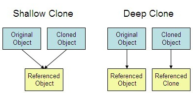
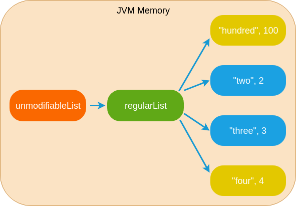
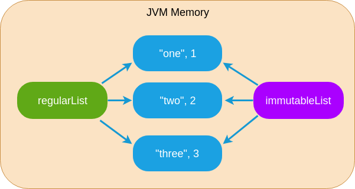

## 학습 동기

우아한테크코스 레벨1 로또 미션을 진행하며, **unmodifiable** 과 **방어적 복사** 라는 키워드를 많이 듣게 되었다. 이 키워드에 대해 공부하기 이전에 자바에서 컬렉션을 복사하는 여러 방법들에 대해 먼저 익숙해져야겠다는 생각에 여러 복사 방법에 대해 찾아보았다.

그리고 특히 비슷해보이는 `unmodifiable` 과 `copyOf` 의 차이점을 공부해본다.

## 컬렉션을 복사하는 여러 방법

들어가기에 앞서 `int` 필드를 하나 가지고 있는 `Number` 라는 클래스를 정의하고 넘어가겠다.

```java
class Number {
    private int number;

    public Number(int number) {
        this.number = number;
    }

    public void setNumber(int number) {
        this.number = number;
    }

    @Override
    public String toString() {
        return "Number{" +
                "number=" + number +
                '}';
    }
}
```

또한 원본 컬렉션은 아래와 같이 준비해둔다.

```java
List<Number> original = new ArrayList<>();
original.add(new Number(1));
original.add(new Number(2));
```

### 주소값만 복사

```java
List<Number> copy1 = original;
```

사실 위 코드는 복사라고 보기에는 다소 어렵다. `copy1` 은 `original` 과 동일한 주소값을 바라본다. 직관적으로 보아도 `original` 의 변경이 `copy1` 에도 바로 영향을 끼칠 것 같다. 이에 대한 내용은 뒤에서 자세히 알아보자.

### 생성자를 통한 복사

```java
List<Number> copy2 = new ArrayList<>(original);
```

생성자에 `original` 을 넣어, `original` 이 가지고 있는 요소를 똑같이 가지고 있는 `copy2` 를 만들 수 있다.

### addAll 을 통한 복사

```java
List<Number> copy3 = new ArrayList<>();
copy3.addAll(original);
```

생성자를 통한 복사와 비슷하다. 비어있는 `copy3` 라는 컬렉션을 만들고, 그 컬렉션에 `original` 의 모든 요소를 추가한다.

### stream 을 통한 복사

```java
List<Number> copy4 = original.stream()
        .collect(Collectors.toList());
```

생성자를 통한 복사와 비슷하다. 자바8 부터 등장한 스트림(Stream) 과 `Collectors` 를 사용하여, `original` 과 같은 요소를 가지고 있는 `copy4` 를 생성한다.

### unmodifiable 을 통한 복사

```java
List<Number> copy5 = Collections.unmodifiableList(original);
```

`unmodifiable` 은 매개변수로 제공된 컬렉션의 읽기 전용인 (Read-Only) 컬렉션을 반환한다. 아래와 같이 unmodifiable 에 수정을 시동하면 예외가 발생하게 된다.

```java
copy5.add(new Number(3));
// UnsupportedOperationException 발생
```

> **unmodifiableList** 뿐 아니라, **unmodifiableSet**, **unmodifiableMap** 도 사용 가능하다.

### copyOf 를 통한 복사

```java
List<Number> copy6 = List.copyOf(original);
```

`copyOf` 도 `unmodifiable` 과 똑같이 읽기 전용 컬렉션을 반환한다. 그렇다면, `copyOf` 는 `unmodifiable` 과 무슨 차이가 있을까? 이는 아래에서 자세히 다룬다.

## 해시코드 살펴보기

원본과 각 복사본의 해시코드를 비교해보며, 변수가 같은 객체를 가리키고 있는지 살펴보자.

```java
System.out.println("원본: " + System.identityHashCode(original));
System.out.println("주소값만 복사: " + System.identityHashCode(copy1));
System.out.println("생성자 복사: " + System.identityHashCode(copy2));
System.out.println("addAll: " + System.identityHashCode(copy3));
System.out.println("stream: " + System.identityHashCode(copy4));
System.out.println("Collections.unmodifiableList: " + System.identityHashCode(copy5));
System.out.println("List.copyOf: " + System.identityHashCode(copy6));
```

위 실행 결과는 아래와 같다.

```
원본: 1334202656
주소값만 복사: 1334202656
생성자 복사: 1885496748
addAll: 482062692
stream: 869947658
Collections.unmodifiableList: 447066754
List.copyOf: 2030693247
```

주소값만 복사한 경우는 당연히 같은 객체를 가리키므로 해시 코드도 동일하다. 나머지는 모두 원본과 해시 코드가 다르기 때문에 다른 객체를 참조하고 있다고 볼 수 있다.

> **System.identityHashCode** 는 **hashCode** 와 다르게 오버라이드가 불가능하다. 따라서 객체의 고유한 해시코 를 리턴하는 것을 보장한다. 그냥 hashCode 는 오버라이드 하여 동등성을 임의로 구현할수도 있기 때문에 다른 객체라도 같은 값을 반환할 수 있다.

## 깊은 복사 (Deep Copy) 인가?

그렇다면, 위에 나열된 방법을 사용하는 것이 깊은 복사를 의미하는 것 일까? 여기서 **깊은 복사 (Deep Copy)** 란, 복사 시 각 컬렉션이 가지고 있는 모든 요소도 복사하여 원본의 요소와 다른 참조를 가지게 끔 하는 것을 의미한다. 반대로 원본의 요소와 복사본의 요소가 같은 참조를 가진다면 **얕은 복사 (Shallow Copy)** 이다.



이를 알아보기 위해 원본 컬렉션의 요소의 필드를 임의로 변경해본다.

```java
original.get(1).setNumber(100);
// 원본 컬렉션 요소 하나를 임의로 변경
```

복사본의 `1` 번째 요소가 그대로 `Number(2)` 를 가지고 있다면, 깊은 복사가 된 것이라고 생각할 수 있을 것 이다.

```java
System.out.println("주소값만 복사: " + copy1.get(1));
System.out.println("생성자 복사: " + copy2.get(1));
System.out.println("addAll: " + copy3.get(1));
System.out.println("stream: " + copy4.get(1));
System.out.println("Collections.unmodifiableList: " + copy5.get(1));
System.out.println("List.copyOf: " + copy6.get(1));
```

위의 실행 결과는 아래와 같다.

```
주소값만 복사: Number{number=100}
생성자 복사: Number{number=100}
addAll: Number{number=100}
stream: Number{number=100}
Collections.unmodifiableList: Number{number=100}
List.copyOf: Number{number=100}
```

아쉽게도 모든 복사본이 영향을 받았다. 따라서 기본 제공되는 API 를 사용하여 컬렉션을 복사한 경우, 외부로부터의 변경에 취약하지 않은 컬렉션을 만들기 위해서는 내부 요소가 불변 객체여야 함을 알 수 있다.

또는 직접 내부 요소까지 복사하는 코드를 직접 작성해야 한다고 한다.

## 원본 컬렉션이 바뀐다면?

위에서 컬렉션의 요소가 변경되는 것은 얕은 복사된 모든 컬렉션에 영향을 끼치는 것을 확인할 수 있었다.

그렇다면, 복사본 컬렉션이 원본 컬렉션과의 참조가 완전히 끊겼다는 것은 확신할 수 있을까? 원본 컬렉션에 요소 하나를 추가하고, 복사본이 이에 영향을 받는지 살펴보자.

```java
original.add(new Number(3));
// 원본에 요소 추가
// 즉, 원본 컬렉션이 변경됨
```

### 주소값만 복사

```java
System.out.println("주소값만 복사: " + copy1);
// 원본: [Number{number=1}, Number{number=2}, Number{number=3}]
```

당연히 같은 객체를 참조하고 있으니, 원본 컬렉션이 변하면 `copy1` 도 변경된다.

### 생성자, addAll, stream

```java
System.out.println("생성자 복사: " + copy2);
System.out.println("addAll: " + copy3);
System.out.println("stream: " + copy4);
/*
  생성자 복사: [Number{number=1}, Number{number=2}]
  addAll: [Number{number=1}, Number{number=2}]
  stream: [Number{number=1}, Number{number=2}]
*/
```

원본의 요소를 하나하나 꺼내서 새로운 컬렉션으로 만드는 방법이므로 `copy2`, `copy3`, `copy4` 는 원본 컬렉션의 변화에 전혀 영향받지 않는다.

(요소는 원본과 같은 참조를 갖지만) 즉, 적어도 복사본 컬렉션 자체는 원본 컬렉션과 관련이 없다는 것을 알 수 있다.

### unmodifiable

```java
System.out.println("Collections.unmodifiableList: " + copy5);
// Collections.unmodifiableList: [Number{number=1}, Number{number=2}, Number{number=3}]
```

어라, `unmodifiable` 로 복사한 컬렉션은 원본 컬렉션의 변화에 영향을 받아 `Number(3)` 가 추가된 모습을 볼 수 있다.

unmodifiable*Collection* 은 원본 객체와의 참조를 끊지 않는다. 단순히 값을 변경할 수 있는 수단을 제공하지 않아 Read-Only 가 된 것이지, 복사본의 불변함을 보장하진 않는다.

**즉, 정확하게 말하면 '복사' 가 아닌 'Wrapping' 이라고 봐야한다.**

### copyOf

```java
System.out.println("List.copyOf: " + copy6);
// List.copyOf: [Number{number=1}, Number{number=2}]
```

변화가 없는 것으로 보아 `unmodifiable` 과 다르게 `copyOf` 의 복사본은 원본 컬렉션과의 참조가 끊긴 것 같다. `copyOf` 는 얕은 복사를 수행하고, 그것을 unmodifiable 로 만들어 반환한다.

**즉, 정확히는** `ImmutableCollection` **을 반환한다.**

## unmodifiable vs copyOf



위 그림을 보면, `unmodifiable` 이 별도의 독립적인 list 를 가지고 있는 것이 아닌, 원본 컬렉션을 그대로 가리키고 있는 것을 확인할 수 있다.



위 그림을 확인하면 `immutableList` 는 원본 컬렉션과 독립적으로 존재하는 것을 확인할 수 있다.

방어적 복사를 수행하기 위해서는 `unmodifiable` 대신 `copyOf` 를 사용해야 완전한 불변함을 보장할 수 있다는 사실을 알 수 있다.
